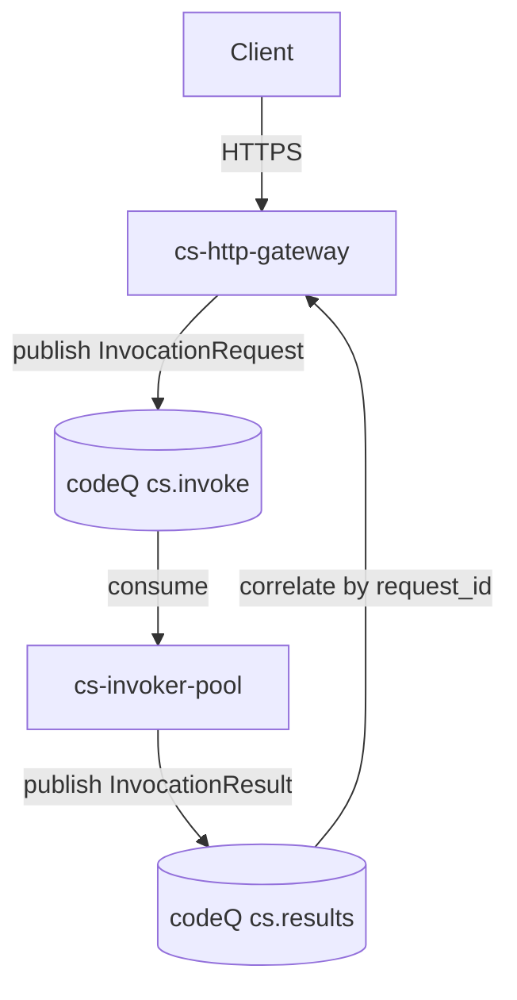
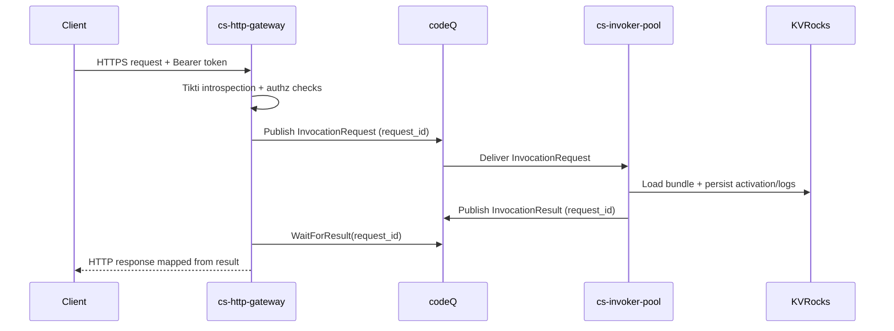
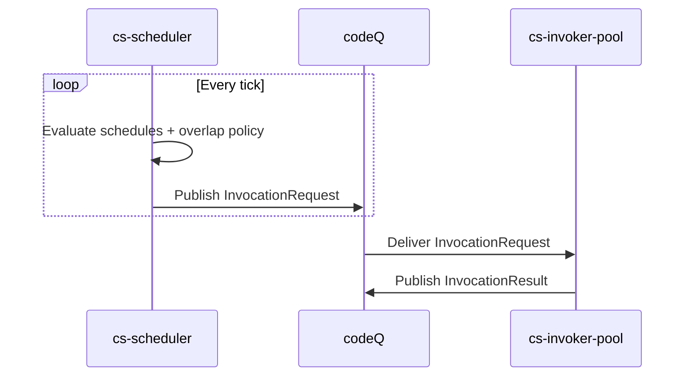
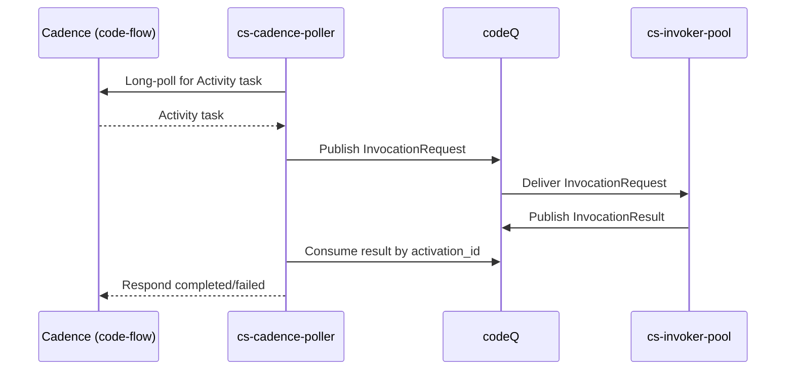

# Architecture

SOUS splits into two planes.

The control plane owns lifecycle state and policy. The data plane owns execution, isolation, and result transport.

This split mirrors large-scale serverless platforms: control-plane APIs must remain reliable and strongly validated; execution must scale independently and be resilient to user-code failures.

## Components

Control plane:

- `cs-control` provides lifecycle APIs, validates bundles/manifests, and persists function state.

Data plane ingress:

- `cs-http-gateway` terminates the HTTP invoke endpoint, authenticates via Tikti, maps HTTP to `InvocationRequest`, and optionally waits for results.
- `cs-scheduler` emits `InvocationRequest` messages at fixed intervals with overlap control.
- `cs-cadence-poller` long-polls Cadence for Activity tasks and maps them to `InvocationRequest`.

Execution:

- `cs-invoker-pool` is the execution fabric. It loads bundles, enforces isolation/capabilities, persists activations/logs, and publishes `InvocationResult`.

## Why codeQ is Between Pollers and Invokers

The platform isolates two loops:

The first loop is long-lived network I/O (HTTP waiting, scheduler ticks, Cadence long-poll). The second loop is sandboxed user-code execution.

codeQ buffers between these loops.

That buffer provides backpressure (queue depth), independent scaling (more pollers or more invokers), and failure isolation (a crashing function does not take down a long-poll loop).

## End-to-End Flow

## HTTP Invoke (Sync)

## Scheduler

## Cadence Activity

