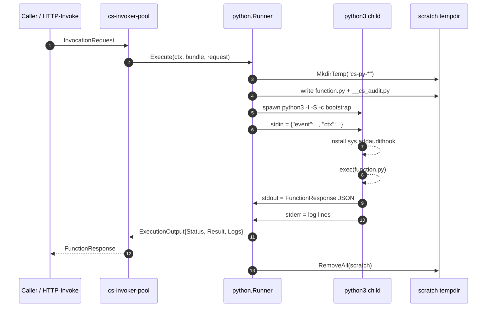

# Creating Functions: Python

The `cs-python` runtime is the Python execution adapter for Sous. It exists so an agent that prefers Python — for its richer standard library, its data-handling idioms, or its enormous corpus of third-party packages — can author a function with the same canonical manifest, the same capability contract, and the same wire response shape that [Runtime cs-js](Runtime-cs-js) describes. The runtime contract is identical at the seams: a function is a bundle of UTF-8 source plus `manifest.json`, the invoker loads the bundle from KVRocks, executes it under a wall-time deadline, and returns a `FunctionResponse`-shaped result to the caller. Only the implementation body is different.

In v0.1 the adapter is implemented as a **subprocess MVP**. For every activation, cs-invoker-pool spawns a fresh `python3` child process, hands it the request payload as a JSON document on standard input, reads the response back as a JSON document on standard output, and captures stderr line-by-line as activation logs. When the wall-time deadline fires, the runner cancels its `context.Context` and `exec.CommandContext` sends SIGKILL to the child. The runner body lives in `internal/runtime/python/runner.go` and the bootstrap that installs the audit hook lives in `internal/runtime/python/host.go`. This subprocess design (rather than embedding CPython through cgo or shipping a WASI build of CPython) offers strong OS-level isolation, predictable resource accounting, and easy upgrade of the Python interpreter — at the cost of a higher cold start than the cs-js goja isolate.

A future adapter will embed CPython directly so the platform can keep a warm pool of pre-initialised interpreters, replace the stdout pipe with an in-process host bridge, and move capability checks behind an FFI boundary that user code cannot inspect or rebind. The migration path is intentionally narrow: the manifest contract, the registry wiring, the wire payload, and every test fixture stay the same; only the implementation of `internal/runtime/python.Runner.Execute` is replaced. The remainder of this page documents the subprocess adapter exactly as it ships today, and flags the deferred features so an agent writing Python today understands what works in v0.1 and what is staged for the embedded follow-up.

The high-level activation flow looks like this:



The diagram is the activation lifecycle as a single picture: a request arrives at cs-invoker-pool, the pool dispatches into the cs-python `Runner`, the runner allocates a scratch dir and spawns the subprocess, the subprocess installs the audit hook and runs `function.py`, stdout and stderr come back over pipes, and the scratch dir is removed on the way out. Every step beyond "spawn python3" is local to the runner — there is no daemon or RPC channel involved.

## Handler contract

A Python function bundle ships two UTF-8 files at the root of the canonical tar: `manifest.json` and `function.py`. The entry file name is fixed by `entryFile = "function.py"` in `internal/runtime/python/runner.go`; the control plane rejects any cs-python manifest at publish time whose `entry` field deviates from this canonical name. The runtime does not load `function.py` as an importable module in v0.1 — there is no `import handler` and no `handle(event, ctx)` symbol to call. Instead, the bootstrap re-executes `function.py` directly as `__main__` with the request JSON wired up on `sys.stdin`. The handler reads stdin, writes its response to stdout, and exits.

A minimal cs-python handler looks like this:

```python
import json, sys

req = json.load(sys.stdin)
event = req["event"]
ctx   = req["ctx"]

print(json.dumps({
    "statusCode": 200,
    "headers": {"x-cs-runtime": "cs-python"},
    "body": "hello " + event["name"],
}))
```

The runtime accepts two shapes on stdout. The preferred shape is a complete `FunctionResponse` envelope — an object with `statusCode`, `headers`, `body`, and an optional `isBase64Encoded` boolean. The fallback shape is a bare JSON value (object, array, scalar): in that case the runner wraps it as `{"statusCode": 200, "headers": {}, "body": "<json>"}` so a function that simply prints a dict still produces a valid envelope. An empty stdout is treated as `{"statusCode": 200, "body": ""}`. Only the **last non-empty line** of stdout is parsed as the envelope, so a handler that prints progress messages earlier in the run and emits the envelope on the final line still produces a valid response. The parser lives in `parseResponse` at `internal/runtime/python/runner.go`.

The handler signature documented in some agent-generated drafts — `def handle(event, ctx) -> dict | str | bytes` — is **not** what the subprocess adapter calls. There is no Python-side dispatch into a named function. The embedded-CPython follow-up may introduce that convention so warm pools can short-circuit interpreter init and call straight into a cached handler symbol, but in v0.1 the contract is the simpler stdin/stdout protocol shown above. Functions that already have a `handle(event, ctx)` helper can call it themselves from the top-level script and feed its return value to `print(json.dumps(...))`; the runtime is indifferent to internal organisation.

A more idiomatic Python author may prefer to keep handler logic inside a function and reserve the top-level body for the stdin/stdout dance:

```python
import json, sys

def handle(event, ctx):
    """Application-level handler. Returns whatever the publisher wants
    serialised back to the caller — a dict (becomes the body), a full
    FunctionResponse envelope, or a bare string."""
    return {"statusCode": 200, "body": f"hello {event['name']}"}

def _main():
    req      = json.load(sys.stdin)
    response = handle(req["event"], req["ctx"])
    print(json.dumps(response))

if __name__ == "__main__":
    _main()
```

This wraps the contract in a `handle(event, ctx)` shape that survives the eventual move to the embedded adapter (where `_main()` becomes the bootstrap-supplied dispatcher), without forcing the v0.1 runner to know anything about the internal layout of `function.py`. The runtime cares only that the **last non-empty line on stdout** parses as JSON; everything else — module structure, helper functions, classes, even an `argparse` call against `sys.argv[1:]` — is internal to the bundle and invisible to the host.

Return-value conventions are forgiving. The parser in `parseResponse` accepts three shapes:

| Shape on stdout | Treated as |
| --- | --- |
| `{"statusCode": <int>, "headers": {...}, "body": "..."}` | Full envelope. `headers` defaults to `{}` if absent; `isBase64Encoded` defaults to `false`. |
| Any other JSON value (object without `statusCode`, array, scalar) | Wrapped as `{"statusCode": 200, "headers": {}, "body": "<json>"}`. |
| Empty / whitespace only | `{"statusCode": 200, "headers": {}, "body": ""}`. |

A `statusCode` of `0` is treated as "not a real envelope" and the value is wrapped as a 200 instead — see the `res.StatusCode != 0` guard in `parseResponse`. This matters for handlers that accidentally print `{"statusCode": 0, ...}`: the runtime never returns a `0` status to the caller.

## The ctx shim

The `ctx` object the Python child receives is a JSON dictionary produced by `marshalRequest` in `internal/runtime/python/runner.go`. Its shape is intentionally a stable subset of the cs-js ctx, so a function ported between runtimes finds the same fields under the same keys:

```json
{
  "activation_id": "uuid",
  "deadline_ms":   1730000003000,
  "tenant":        "t_abc123",
  "namespace":     "payments",
  "function":      "reconcile",
  "ref":           { "alias": "prod", "version": 17 },
  "trigger":       { "type": "http" },
  "principal":     { "sub": "user:123", "roles": ["role:app"] }
}
```

Beyond those identity fields, the v0.1 ctx exposes a single side-effect helper: `cs_log(level, message)`. The audit bootstrap in `internal/runtime/python/host.go` installs this helper into `builtins` so user code can call `cs_log("info", "starting up")` without an explicit import. Internally `cs_log` writes a structured `[level] message` line to stderr; the Go side captures every stderr line as a log entry on `ExecutionOutput.Logs`. Plain `print(..., file=sys.stderr)` and direct `sys.stderr.write(...)` work the same way — the runtime makes no distinction between log lines emitted through the helper and log lines written directly.

The richer `cs.*` host surface present in cs-js — `cs.kv.get`, `cs.kv.set`, `cs.kv.del`, `cs.codeq.publish`, `cs.http.fetch`, `cs.env.get`, `cs.env.list` — is **not** wired into the subprocess adapter in v0.1. The package doc on `internal/runtime/python/runner.go` is explicit about this: "the full capability model (cs.kv.*, cs.codeq.publish, cs.http.fetch, egress allowlist, private-IP block) is intentionally deferred to the embedded-CPython adapter, where in-process host bridges replace the stdout pipe." The `NewRunner` constructor still accepts `rt.KVProvider` and `rt.CodeQProvider` arguments for parity with the cs-js and cs-wasm constructors, but in v0.1 those providers are not threaded into the child. A function that needs key-value access or codeQ publish in this release should use cs-js until the embedded adapter lands, or stage its side effects through an outbound HTTP call to a tenant-owned service.

The JSON-over-stdin protocol the shim uses is deliberately one-shot: the child reads exactly one JSON document from stdin (the wrapped `{"event": ..., "ctx": {...}}` payload), processes it, writes exactly one JSON document to stdout, and exits. There is no multiplexed RPC channel and no sidecar file descriptor in v0.1. The embedded-CPython adapter will introduce a real host bridge (most likely over an inherited Unix socketpair so capability calls can interleave with handler execution), but the subprocess design uses a single request/response payload because the child has no way to call back into the host once it has started; the audit hook can only deny.

The full wire format on the wire is:

```json
{
  "event": <any JSON value the caller sent>,
  "ctx": {
    "activation_id": "uuid",
    "deadline_ms":   1730000003000,
    "tenant":        "t_abc123",
    "namespace":     "payments",
    "function":      "reconcile",
    "ref":           { "alias": "prod", "version": 17 },
    "trigger":       { "type": "http" },
    "principal":     { "sub": "user:123", "roles": ["role:app"] }
  }
}
```

This shape is what `marshalRequest` in `internal/runtime/python/runner.go` produces; the user-visible event payload sits under the `"event"` key so handler code that wants both the caller's payload and the platform metadata can split them with a single dictionary access:

```python
req     = json.load(sys.stdin)
event   = req["event"]   # caller's payload
ctx     = req["ctx"]     # platform metadata
tenant  = ctx["tenant"]
ddl_ms  = ctx["deadline_ms"]
```

The `ctx["deadline_ms"]` field is a Unix-millis absolute timestamp computed by the invoker before the child starts; it is the same value `context.WithTimeout` was given on the Go side, so a Python handler that wants to budget its remaining time can compute `remaining_ms = ctx["deadline_ms"] - int(time.time() * 1000)` and use it to cap its own internal timeouts.

## Manifest extensions

The Python runtime is selected by the `runtime` field in `manifest.json`. The shared manifest schema lives at `spec/cs.function.script.v1.json`; the `runtime` field is an enum, and cs-invoker-pool's registry recognises `cs-python` because `internal/runtime/python/register.go` calls `rt.DefaultRegistry.Register(NewRunner(...))` from a package `init()`. A minimal cs-python manifest looks like this:

```json
{
  "schema": "cs.function.script.v1",
  "runtime": "cs-python",
  "entry": "function.py",
  "handler": "default",
  "limits": { "timeoutMs": 3000, "memoryMb": 64, "maxConcurrency": 1 },
  "capabilities": {
    "kv":    { "prefixes": ["recon:"], "ops": ["get", "set"] },
    "codeq": { "publishTopics": ["jobs.recon.*"] },
    "http":  { "allowHosts": ["api.example.com"], "timeoutMs": 1500 }
  }
}
```

The `entry` field must be `function.py` exactly; the adapter looks for that filename in the extracted bundle and returns `BundleError: bundle missing function.py` if it is absent. The `handler` field is `"default"` for parity with cs-js; it is recorded in the manifest for forward compatibility with the embedded adapter (which will use it to pick the dispatch symbol) but is not consulted at execution time in v0.1.

The `limits` block carries the same three fields as every other runtime — `timeoutMs`, `memoryMb`, `maxConcurrency`. The Python adapter enforces `timeoutMs` directly through `context.WithTimeout`; `memoryMb` is not yet applied as a per-activation `RLIMIT_AS` cap in v0.1 (it inherits the invoker-pool's cgroup limit instead), and `maxConcurrency` is enforced at the scheduler layer the same way it is for cs-js. See [Capacity and Limits](Capacity-and-Limits) for the full table.

The `capabilities` block is recorded in the manifest and validated at publish time, but in v0.1 the gates it documents are **not** enforced by the cs-python adapter — there is no in-process host bridge yet to consult them. Setting `capabilities.kv.prefixes = ["recon:"]` declares the intended access policy for the function, but in v0.1 the function has no `cs.kv.get` to call in the first place. The capability block is preserved across the runtime swap so that publishing a manifest today with the correct capability shape means the same bundle continues to work, with stronger enforcement, once the embedded adapter ships. See [Concepts Capabilities and Isolation](Concepts-Capabilities-and-Isolation).

A side-by-side comparison of manifest fields between cs-js and cs-python clarifies what changes and what stays the same:

| Field | cs-js value | cs-python value | Notes |
| --- | --- | --- | --- |
| `schema` | `"cs.function.script.v1"` | `"cs.function.script.v1"` | Same schema document. |
| `runtime` | `"cs-js"` | `"cs-python"` | Selects the registered adapter. |
| `entry` | `"function.js"` | `"function.py"` | Filename pinned per runtime. |
| `handler` | `"default"` | `"default"` | Reserved; not consulted in v0.1 cs-python. |
| `limits.timeoutMs` | enforced | enforced | Same enforcement (SIGKILL on deadline). |
| `limits.memoryMb` | enforced (isolate) | inherited (cgroup) | Per-activation `RLIMIT_AS` lands with embedded adapter. |
| `limits.maxConcurrency` | enforced | enforced | Scheduler-layer semaphore, runtime-independent. |
| `capabilities.kv` | enforced in-process | declared, not enforced | Gate lands with embedded adapter. |
| `capabilities.codeq` | enforced in-process | declared, not enforced | Gate lands with embedded adapter. |
| `capabilities.http` | enforced in-process | declared, not enforced | Audit hook denies raw sockets; HTTPS via stdlib `urllib` is allowed but ungated. |

The pattern is consistent across the table: every cs-python value is identical to its cs-js counterpart at the schema layer; the only differences are in which runtime enforces which gate in v0.1. Publishing the same manifest shape under both runtimes is supported and recommended — it keeps the published artifact comparable across runtimes and ready for the embedded adapter swap.

## Process isolation

Every activation gets its own `python3` process and its own temporary directory. The runner calls `os.MkdirTemp("", "cs-py-")` to allocate a scratch dir rooted at `os.TempDir()`, extracts the bundle's files into that dir, writes the audit bootstrap (`__cs_audit.py`) next to them, and `defer`s `os.RemoveAll(dir)` to clean up when `Execute` returns. Two concurrent activations cannot see each other's bytes — they live in separate directories and separate processes. Process state never persists across invocations: a global initialised in one activation is gone when the next activation starts, because the second activation runs in a brand-new Python interpreter.

The subprocess is spawned with the `-I` and `-S` interpreter flags. `-I` turns on "isolated mode," which tells CPython to ignore every `PYTHON*` environment variable and to skip the user site-packages directory; `-S` suppresses the implicit `import site`, which would otherwise pull in arbitrary path hooks from the system's `sitecustomize.py`. Together these flags ensure that the child only loads modules from the bundle's scratch dir and from CPython's frozen standard library — operator-installed site-packages are invisible to the child even if `python3` was installed with a noisy site config.

The process environment is scrubbed. The `childEnv` helper in `internal/runtime/python/runner.go` builds an explicit whitelist: `PATH` (so the dynamic linker can resolve libpython and libc), `TMPDIR` (pointed at the activation scratch dir so the child's own temp files do not leak), `LANG=C.UTF-8`, `LC_ALL=C.UTF-8` (deterministic text encoding), `PYTHONDONTWRITEBYTECODE=1` (no `.pyc` writes — there is nowhere to persist them anyway), `PYTHONUNBUFFERED=1` (so stderr log lines arrive in real time and a SIGKILL does not lose the last few prints), and `CS_RUNTIME=cs-python` (a sentinel so user code can introspect which runtime it is executing under, mirroring `globalThis.cs.runtime` in cs-js). Nothing else is forwarded: the invoker-pool's secret env from E6.01 is **never** exposed via process env in v0.1, because surfacing the operator's secret map through `os.environ` would defeat the point of having a secret store at all.

Wall-time enforcement uses Go's `context.WithTimeout`. The runner computes the deadline from `request.DeadlineMS` (or falls back to `manifest.Limits.TimeoutMS` if no deadline is set), wraps the parent context in `context.WithTimeout`, and hands the wrapped context to `exec.CommandContext`. When the deadline fires, the context is cancelled, and `exec.CommandContext` sends SIGKILL to the child. The runner detects this branch by checking `errors.Is(runCtx.Err(), context.DeadlineExceeded)` and returns `Status: "timeout"` with `ResolvedCode: CS_RUNTIME_TIMEOUT`. SIGKILL is unblockable — a runaway `time.sleep(5)` or a `while True: pass` loop dies immediately rather than waiting on a cooperative signal. Memory is bounded by the invoker-pool's cgroup limit; per-activation `RLIMIT_AS` is staged for the embedded adapter.

The `TestRunnerTimeoutEnforced` test in `internal/runtime/python/runner_test.go` pins the wall-time behaviour: a handler that sleeps 5 seconds under a 250 ms manifest budget returns `Status: "timeout"` with `ResolvedCode: CS_RUNTIME_TIMEOUT`, and the total wall clock for the call sits well under three seconds — long before the sleep would naturally complete. Operators reading activation records should treat a `"timeout"` status as the platform working exactly as documented: a budget was set, the budget elapsed, the kernel killed the process, and the operator sees a clean record with no resource leak.

Filesystem isolation deserves a separate note. The scratch dir is the only writable location the child can reach without tripping the audit hook. `os.system`, `subprocess.Popen`, and friends are denied, so the function cannot shell out to a separate writer. The child has no `HOME`, no `XDG_*` paths, and no `TMPDIR` that points outside the scratch dir. A function that wants to spill intermediate state to disk during its run can use `tempfile.NamedTemporaryFile()` and trust that the bytes will be cleaned up when the activation returns. The child has no way to escape its scratch dir into a sibling activation's space because the dir names are random and the kernel mount namespace gives the child its own view of `/tmp` only at the scratch-dir level; everything else under `/tmp` is just-other-files the child has read access to but no semantic reason to touch.

## Error propagation

Failures surface on `ExecutionOutput.Error` with a typed message and on `ExecutionOutput.ResolvedCode` with a stable error code from `internal/errors`. The runner classifies every outcome in `Execute` at `internal/runtime/python/runner.go`:

- A successful activation that emits a parseable `FunctionResponse` produces `Status: "success"`, `Error: nil`, `ResolvedCode: ""`.
- A wall-time deadline produces `Status: "timeout"`, `Error.Type: "Timeout"`, `ResolvedCode: CS_RUNTIME_TIMEOUT`.
- A non-zero exit (any unhandled Python exception, including `SystemExit(non-zero)` and an OOM kill bubbled through the cgroup) produces `Status: "error"`, `Error.Type: "Exception"`, `ResolvedCode: CS_RUNTIME_EXCEPTION`. The `Error.Message` is the **tail** of stderr, capped at `maxErrorBytes` (default 64 KiB). For an unhandled exception the tail contains the Python traceback, so operators see the file, line, and exception class without having to fetch the full activation log separately.
- An audit-hook denial produces `Status: "error"`, `Error.Type: "CapabilityDenied"`, `ResolvedCode: CS_RUNTIME_CAPABILITY_DENIED`. The classifier looks for the substring `CS_RUNTIME_CAPABILITY_DENIED` in the stderr tail (the audit hook raises a `PermissionError` carrying that marker), so the same code surfaces uniformly across runtimes — see [Error Model](Error-Model).
- A missing `python3` binary on the host produces `Status: "error"`, `Error.Type: "RuntimeUnavailable"`, `ResolvedCode: CS_RUNTIME_EXCEPTION`. The runner checks `exec.LookPath(python3)` before spawning anything, so the failure is fast and the operator gets a clear "python3 not on PATH" message rather than a cryptic exec error.
- A bundle that does not contain `function.py` produces `Status: "error"`, `Error.Type: "BundleError"`, `ResolvedCode: CS_VALIDATION_MANIFEST`. A bundle with a malformed `manifest.json` produces the same `ResolvedCode` with `Error.Type: "ManifestError"`.
- Stdout that is not a JSON `FunctionResponse` and not even a bare JSON value produces `Status: "error"`, `Error.Type: "ResponseDecodeError"`, `ResolvedCode: CS_RUNTIME_EXCEPTION`. This is the branch the operator sees when the child crashed before printing anything coherent — for example, a `SyntaxError` at import time.
- Stdout that decodes but fails `api.ValidateResultShape` (negative status code, non-string body, etc.) produces `Status: "error"`, `Error.Type: "ValidationError"`, `ResolvedCode: CS_RUNTIME_EXCEPTION`.

Truncation is independent of error classification. When stdout exceeds `maxResultBytes` (default 256 KiB) or stderr exceeds `maxLogBytes` (default 1 MiB), the runner sets `ExecutionOutput.Truncated = true` and the invoker stamps `X-CS-Truncated: true` on the response. Logs longer than the cap are dropped at the tail; the activation still completes successfully. The result-body cap is re-checked after JSON marshalling, so a payload that fits within the stdout cap but balloons in the canonical encoding still flips the truncation flag.

The full error table for cs-python in v0.1 is:

| Outcome | `Status` | `Error.Type` | `ResolvedCode` |
| --- | --- | --- | --- |
| Successful response | `success` | (none) | `""` |
| Wall-time deadline fired | `timeout` | `Timeout` | `CS_RUNTIME_TIMEOUT` |
| `python3` not on PATH | `error` | `RuntimeUnavailable` | `CS_RUNTIME_EXCEPTION` |
| Bundle missing `function.py` | `error` | `BundleError` | `CS_VALIDATION_MANIFEST` |
| Manifest malformed | `error` | `ManifestError` | `CS_VALIDATION_MANIFEST` |
| Bundle path traversal | `error` | `TempDirError` | `CS_RUNTIME_EXCEPTION` |
| Audit hook denial | `error` | `CapabilityDenied` | `CS_RUNTIME_CAPABILITY_DENIED` |
| Any other non-zero exit | `error` | `Exception` | `CS_RUNTIME_EXCEPTION` |
| stdout not JSON | `error` | `ResponseDecodeError` | `CS_RUNTIME_EXCEPTION` |
| stdout fails shape validation | `error` | `ValidationError` | `CS_RUNTIME_EXCEPTION` |

The classifier in `Execute` is intentionally narrow — it picks `CapabilityDenied` only when the stderr tail contains the `CS_RUNTIME_CAPABILITY_DENIED` marker the audit hook emits, and falls through to the generic `Exception` for everything else. A handler that catches its own exceptions and prints a normal envelope produces `success` even if it logged the exception text to stderr; only an actual non-zero exit code triggers the error path.

## Performance characteristics

The dominant cost of a cs-python activation is the CPython interpreter cold start. Every invocation forks a new `python3` process, the kernel loads `libpython3.so`, CPython runs its startup sequence (parser init, builtins, codec registry), and only then does the bootstrap install the audit hook and `exec()` the user bundle. On a modern Linux host with a warm page cache, this is typically tens of milliseconds; on a cold node or under memory pressure it can climb to hundreds of milliseconds. There is **no warm pool** in v0.1: the runner never reuses a child across activations, and there is no shared scratch dir or daemon process to amortise the cost. The runtime is intentionally simple in this release so the implementation surface stays small while the rest of the platform stabilises.

Steady-state throughput, by contrast, is excellent. Once the interpreter is up, CPython itself is fast, every activation is OS-process-isolated, and the kernel handles fanout naturally — N concurrent activations are N independent processes that the scheduler distributes across cores without any GIL contention between them. For workloads where each activation does a meaningful amount of work (an HTTP call out, a JSON parse plus a transform, a few KV reads), the per-activation overhead disappears into the noise.

When choosing between runtimes for a new function, the rule of thumb is:

- **cs-js** when the function is small, latency-sensitive, and can be expressed in JavaScript. The goja isolate has the lowest cold start of the three runtimes, the richest in-process host surface (`cs.kv`, `cs.codeq`, `cs.http`), and the strongest in-process capability enforcement.
- **cs-python** when the function relies on Python idioms or libraries that have no JavaScript equivalent — pandas-style data shaping, scientific code, or porting an existing Python codebase verbatim. Cold start is higher than cs-js and the in-process host surface is smaller in v0.1, but ergonomic fit can outweigh both costs for data-heavy or analytical workloads.
- **cs-wasm** when the function is performance-critical, the publisher controls the toolchain, or the supply chain matters enough to want a deterministic, sandboxed binary. Cold start sits between cs-js and cs-python (wazero compiles the module on first use, then caches), the capability surface is the same as cs-js, and the wasm sandbox is the strongest isolation of the three. See [Runtime cs-js](Runtime-cs-js) and the cs-wasm page for the comparable contracts.

The decision is not binary: a workload that starts in cs-python because the publisher needed a particular library can migrate to cs-js once the library dependency is gone, without changing the manifest's `capabilities`, `limits`, or trigger configuration. Likewise, a workload that prototypes in cs-js can move to cs-wasm when the publisher is ready to commit to a toolchain. The runtime is one field on the manifest; everything else — naming, versioning, alias promotion, capability declaration, trigger binding — is runtime-independent. This is by design: the platform exists so that the choice of language is not also a choice of operational model.

A second consideration is **observability parity**. The activation record shape is the same across runtimes: `Status`, `Result`, `Error`, `Logs`, `DurationMS`, `Truncated`. The same dashboards, alerting rules, and trace correlation IDs work for a cs-python activation as for a cs-js or cs-wasm activation. Operators do not need a separate "Python pipeline" — the runtime is invisible at the [Observability](Observability) layer.

## Python version and dependencies

The cs-python adapter does not pin a specific Python minor version. It resolves `python3` from the invoker host's `PATH` at every invocation via `exec.LookPath`, which gives the operator the option to swap the binary on a running pod without restarting cs-invoker-pool. In practice the runtime requires CPython 3.8 or newer: the audit hook relies on `sys.addaudithook`, which landed in 3.8, and the bootstrap source in `internal/runtime/python/host.go` uses 3.x-only syntax (set literals with frozenset, f-strings would also work if the bootstrap chose to use them). Operators deploying cs-invoker-pool should treat `python3` on the container image the same way they treat any other runtime dependency: pin it, audit it, and rebuild when the upstream interpreter ships a security release.

Third-party dependencies in v0.1 are stdlib-only by default. The `-I -S` flags scrub `PYTHONPATH` and skip the user site-packages, so a `pip install requests` on the host **does not** make `requests` importable inside the activation. If the function needs more than the standard library, the publisher must vendor the dependency into the bundle: `function.py` plus any pure-Python modules it imports, all shipped under the canonical tar at publish time. The control plane treats the bundle as opaque bytes; whatever Python imports the bundle resolves come exclusively from the extracted scratch dir, plus CPython's frozen stdlib.

Native-extension dependencies (anything that ships a `.so`) are not supported in v0.1. The audit hook denies `ctypes.dlopen` and `ctypes.LoadLibrary`, and even without that gate the scratch dir is removed between activations so a wheel containing a compiled extension would re-fault its loader on every invocation. Pure-Python wheels are the supported path; the embedded-CPython adapter will revisit the dependency story (likely with a per-tenant cached venv) when it lands. See [Managing Functions Packages](Managing-Functions-Packages) for the bundle layout conventions and the recommended vendoring approach.

A typical vendored bundle layout looks like this:

```
function.py
manifest.json
vendor/
  isodate/
    __init__.py
    isodates.py
    ...
  pyjwt/
    __init__.py
    algorithms.py
    ...
```

The publisher prepends `vendor/` to `sys.path` from inside `function.py` before importing the bundled dependencies:

```python
import sys, os
sys.path.insert(0, os.path.join(os.getcwd(), "vendor"))

import isodate, jwt   # noqa: E402
```

The runtime sets the child's working directory to the scratch dir (`cmd.Dir = dir` in `runner.go`), so `os.getcwd()` reliably points at the extracted bundle root. This pattern avoids any reliance on `PYTHONPATH` — which the `-I` flag scrubs from the environment — and keeps the import surface explicit and auditable.

## Capability enforcement

The capability model on the manifest is identical to cs-js: an allowlist of KV prefixes and operations, an allowlist of codeQ publish topics, an allowlist of HTTP egress hosts with a per-call timeout cap. The control plane validates this block at publish time using `spec/cs.function.script.v1.json`. The shape of the enforcement differs from cs-js, however, because v0.1 does not yet have a Python-side host bridge.

In v0.1 the cs-python adapter enforces a **best-effort denylist** through a `sys.addaudithook` installed by the bootstrap in `internal/runtime/python/host.go`. The hook fires for every audit event CPython emits and raises `PermissionError("CS_RUNTIME_CAPABILITY_DENIED: cs-python blocks event %r")` when the event name appears in a small frozenset of dangerous gadgets:

- Process spawn and exec: `os.system`, `subprocess.Popen`, `os.exec*`, `os.fork`, `os.forkpty`, `os.posix_spawn`, `os.posix_spawnp`.
- Raw sockets: `socket.__new__` (covers `socket.socket()` constructors), `socket.bind`, `socket.connect`.
- Dynamic native loading: `ctypes.dlopen`, `ctypes.LoadLibrary`, `ctypes.cdll.LoadLibrary`.
- Arbitrary memory access: `ctypes.addressof`.

A denial maps to `ResolvedCode: CS_RUNTIME_CAPABILITY_DENIED` so the error code is the same shape policy violations take in cs-js. The hook is **defence in depth, not a hermetic sandbox** — the package doc on `runner.go` is explicit: a determined adversary inside the Python interpreter can usually defeat an in-process audit hook through native-module loading or by rebinding `sys.audit`. Operators who need stronger isolation in v0.1 should run cs-invoker-pool under a seccomp profile that denies the same syscalls the audit hook denies in-process, pin the `python3` binary path so a writable shadow cannot replace it, and consider per-activation containers (gVisor, Firecracker, or a similar boundary) for high-risk tenants. The full capability model — `cs.kv.*` prefix and op enforcement, `cs.codeq.publish` topic enforcement, `cs.http.fetch` host allowlist with private-IP block — ships with the embedded-CPython adapter, where capability checks happen on the Go side of an FFI boundary that user code cannot inspect or rebind. See [Security](Security) for the platform threat model.

The boundary between "denied by audit hook" and "permitted but ungated" matters in practice. Raw `socket.socket` calls are denied; `urllib.request.urlopen("https://api.example.com/...")` is permitted because `urllib` does its own socket bookkeeping internally that does not pass through the audit hook on a path that would trip the gate. This is **not** the same as enforcing `capabilities.http.allowHosts`: in v0.1 the cs-python adapter permits any HTTPS call that goes through `urllib`. Operators who need the allowlist enforced before the embedded adapter lands should layer a network policy at the cs-invoker-pool node (Kubernetes NetworkPolicy, host firewall, or per-tenant egress proxy) to constrain reachable hosts. The manifest's `capabilities.http.allowHosts` documents the intended policy and will become a hard gate when the embedded adapter ships; until then it is advisory.

A short audit-hook walkthrough makes the gate easier to reason about:

```python
# Allowed: import os, urllib, json, time, base64, hashlib, ... (stdlib)
import os, json, urllib.request
print(os.getcwd())                                # OK
res = urllib.request.urlopen("https://api.example.com/health", timeout=2)  # OK
data = json.load(res)                             # OK

# Denied: subprocess.Popen triggers sys.audit("subprocess.Popen", ...).
import subprocess
subprocess.Popen(["/bin/echo", "hi"])             # raises PermissionError("CS_RUNTIME_CAPABILITY_DENIED ...")

# Denied: raw socket() triggers sys.audit("socket.__new__", ...).
import socket
s = socket.socket()                               # raises PermissionError(...)

# Denied: ctypes.CDLL triggers sys.audit("ctypes.dlopen", ...).
import ctypes
ctypes.CDLL("libc.so.6")                          # raises PermissionError(...)
```

The audit-hook source is small enough to read in one sitting (`internal/runtime/python/host.go`), and `TestRunnerBannedSubprocessDenied` in `runner_test.go` pins the denial behaviour on every CI run. Operators auditing what cs-python can and cannot do can rely on the test as a living specification: any change that loosens the denylist must update the test, and any change that tightens it must update this page.

## Worked example

The example below shows the shape a real reconciliation handler would take if the embedded adapter were already wired up. In v0.1 the `cs.kv` and `cs.http` calls would need to be replaced with stdlib alternatives, but the structure of the handler — read state, call an external service, write state back, return a summary — is exactly what the runtime is designed for.

```python
import json, sys

req   = json.load(sys.stdin)
event = req["event"]
ctx   = req["ctx"]

# In v0.1 the cs.* host surface is not wired in; this block illustrates
# the shape a function will take once the embedded-CPython adapter
# lands. The bridge functions below are placeholders that document the
# intended capability calls.

def reconcile(account_id):
    cs_log("info", f"reconcile start account={account_id}")

    # Read the last-known balance from KV (capabilities.kv.prefixes
    # must include "recon:" in the manifest).
    last_raw = cs_kv_get(f"recon:{account_id}:last_balance")
    last     = json.loads(last_raw) if last_raw else {"balance": 0, "version": 0}

    # Call the bank statements API (capabilities.http.allowHosts must
    # include "api.example.com" in the manifest).
    res = cs_http_fetch(
        f"https://api.example.com/accounts/{account_id}/statements/latest",
        method="GET",
        headers={"x-cs-parent-activation": ctx["activation_id"]},
        timeoutMs=1500,
    )
    if res["status"] != 200:
        cs_log("warn", f"statement fetch non-200 status={res['status']}")
        return {"statusCode": 502, "body": "upstream unavailable"}

    statement = json.loads(res["body"])
    delta     = statement["closing_balance"] - last["balance"]

    # Write the new balance back to KV (capabilities.kv.ops must
    # include "set").
    cs_kv_set(
        f"recon:{account_id}:last_balance",
        json.dumps({"balance": statement["closing_balance"], "version": last["version"] + 1}),
        ttlSeconds=86400,
    )
    cs_log("info", f"reconcile done account={account_id} delta={delta}")

    return {
        "account_id":  account_id,
        "delta":       delta,
        "new_balance": statement["closing_balance"],
        "version":     last["version"] + 1,
    }

summary = reconcile(event["account_id"])
print(json.dumps({"statusCode": 200, "body": json.dumps(summary)}))
```

The handler reads its event payload, calls a helper that walks the reconciliation flow, and prints a `FunctionResponse` envelope on its final line. The `cs_log` calls produce one log entry each in the activation record; the `cs_kv_*` and `cs_http_fetch` calls are gated by the manifest capability block (once the embedded adapter wires them in); the return value carries the activation summary back to the caller. Until the embedded adapter ships, a v0.1 function that wants this shape today must use `urllib.request` for HTTP egress (which the audit hook permits — only raw `socket.socket` is denied) and stage its persistent state through an external service rather than `cs.kv`.

The v0.1-compatible rewrite of the same handler uses only what ships today:

```python
import json, sys, time, urllib.request, urllib.error

STATE_BASE = "https://state.internal.example.com"
BANK_BASE  = "https://api.example.com"


def _http_get(url, timeout_s, headers=None):
    req = urllib.request.Request(url, method="GET", headers=headers or {})
    try:
        with urllib.request.urlopen(req, timeout=timeout_s) as res:
            return res.status, res.read()
    except urllib.error.HTTPError as e:
        return e.code, e.read()


def _http_put(url, body, timeout_s, headers=None):
    req = urllib.request.Request(url, data=body, method="PUT",
                                 headers=headers or {"content-type": "application/json"})
    try:
        with urllib.request.urlopen(req, timeout=timeout_s) as res:
            return res.status, res.read()
    except urllib.error.HTTPError as e:
        return e.code, e.read()


def reconcile(account_id, activation_id):
    cs_log("info", "reconcile start account=%s" % account_id)
    headers = {"x-cs-parent-activation": activation_id}

    status, raw = _http_get("%s/recon/%s/last_balance" % (STATE_BASE, account_id),
                            timeout_s=1.5, headers=headers)
    last = json.loads(raw) if status == 200 and raw else {"balance": 0, "version": 0}

    status, raw = _http_get("%s/accounts/%s/statements/latest" % (BANK_BASE, account_id),
                            timeout_s=1.5, headers=headers)
    if status != 200:
        cs_log("warn", "statement fetch non-200 status=%d" % status)
        return {"statusCode": 502, "body": "upstream unavailable"}

    statement = json.loads(raw)
    delta     = statement["closing_balance"] - last["balance"]

    new_state = {
        "balance": statement["closing_balance"],
        "version": last["version"] + 1,
    }
    _http_put("%s/recon/%s/last_balance" % (STATE_BASE, account_id),
              body=json.dumps(new_state).encode("utf-8"),
              timeout_s=1.5, headers=headers)

    cs_log("info", "reconcile done account=%s delta=%d" % (account_id, delta))
    return {
        "account_id":  account_id,
        "delta":       delta,
        "new_balance": statement["closing_balance"],
        "version":     last["version"] + 1,
    }


def _main():
    req = json.load(sys.stdin)
    summary = reconcile(req["event"]["account_id"], req["ctx"]["activation_id"])
    print(json.dumps({"statusCode": 200, "body": json.dumps(summary)}))


if __name__ == "__main__":
    _main()
```

Three things are worth noting in this rewrite. First, **state lives in a tenant-owned service** (`state.internal.example.com` here), reached over HTTPS through `urllib`. The cs-python child has no `cs.kv` to call, so a function that needs persistent state stages it through the same egress path it uses for any other API. Second, **the parent activation id is propagated** through the `x-cs-parent-activation` header. Once the embedded adapter ships and `cs.http.fetch` is wired in, that header is injected automatically; in v0.1 the publisher must add it by hand if call-tree observability matters. Third, **the request and response codecs are bytes**: `urllib` returns `bytes` and accepts `bytes`, so the publisher's encode/decode steps are explicit rather than buried in a sugar layer.

The function fits comfortably in the default 256 KiB result cap and the 1 MiB log cap, and the audit hook lets every line of it through because the only side effects are `urllib` HTTPS calls and stderr writes — no raw sockets, no subprocess, no ctypes.

## Limitations and roadmap

The cs-python adapter ships intentionally narrow in v0.1. The known limitations and the work staged to address them are:

- **Cold start.** Forking a fresh CPython on every activation is the dominant cost. The embedded-CPython adapter will keep a warm pool of pre-initialised interpreters and reuse them across activations, bringing cs-python latency closer to cs-js for short handlers. The current adapter exists because shipping the embedded path required a build-time dependency on `libpython` that would block CI for every Go-only contributor; the trade-off keeps the runtime working everywhere `python3` is on PATH today.
- **In-process capability gates.** The `sys.addaudithook` denylist in `internal/runtime/python/host.go` is best-effort. The embedded adapter replaces it with FFI-boundary enforcement where capability decisions live on the Go side and the guest cannot inspect or rebind them.
- **No `cs.*` host surface in Python.** The cs-js host APIs (`cs.kv`, `cs.codeq`, `cs.http`, `cs.env`) are not exposed to Python activations in v0.1. Functions that need persistent state should stage it through an external service; functions that need codeQ publish should pick cs-js for now. The embedded adapter wires Python helpers to the same provider interfaces cs-js already uses, behind the same allowlists.
- **No native extensions.** Pure-Python wheels can be vendored into the bundle; C extensions and any `.so`-loading dependency are denied by the audit hook and would not survive the activation-scoped scratch dir anyway. The embedded adapter will revisit per-tenant venvs and cached extension loading.
- **No per-activation memory cap.** `RLIMIT_AS` is not applied per activation in v0.1; memory is bounded by the invoker-pool's cgroup. Per-activation OOM accounting ships with the embedded adapter.
- **No workflow handlers.** Python is **not** a supported runtime for workflow / DecisionTask handlers in v0.1; the workflow scheduler (E8.01, see commit `c068027`) routes only to cs-js workers today. Workflow support across runtimes is staged but not committed for the cs-python embedded follow-up — the workflow contract requires a different host surface (activity scheduling, history replay) that is independent of the script-runtime work tracked here.
- **No warm pool.** Every activation is a fresh process, full stop. Pooling waits for the embedded adapter.

When the embedded adapter lands, the manifest contract, the registry wiring, the bundle layout, every published function bundle, and every test fixture continue to work without modification; only the implementation of `Runner.Execute` is replaced. The intent of the v0.1 surface is to be a stable contract that lets agents start writing Python today while the production runtime is built underneath them.

The follow-up sequence is staged so that each step is independently shippable:

1. **Embedded interpreter wiring.** Build a CPython-embed adapter under a build tag so contributors without `libpython` headers continue to build. Add a registry entry that prefers the embedded adapter when available and falls back to the subprocess body when the build tag is off.
2. **In-process host bridge.** Replace the stdout pipe with a Go-side bridge object the embedded interpreter calls into. The bridge enforces capability gates on the Go side; the Python guest sees only the helper surface.
3. **`cs.kv` and `cs.codeq` helpers.** Bind the bridge methods into a `cs` module installed in the interpreter's `__builtins__` so user code calls `cs.kv.get("recon:123")` rather than `_http_get(...)`. The manifest's `capabilities.kv.prefixes` and `capabilities.kv.ops` become hard gates at this step.
4. **`cs.http.fetch` helper.** Bind a host bridge that enforces `capabilities.http.allowHosts`, the private-IP block, and the per-call timeout cap. Inject `x-cs-parent-activation` automatically.
5. **`cs.env` helper.** Surface the invoker-pool's secret env (E6.01) to user code through a typed accessor that never routes the secret material through process env.
6. **Warm pool.** Keep a small pool of pre-initialised interpreters per cs-invoker-pool replica. Reset interpreter state between activations rather than tearing the interpreter down.
7. **Per-activation `RLIMIT_AS`.** Apply the manifest's `memoryMb` as an address-space cap on the interpreter before the handler runs.

Each step is small enough to ship behind a feature flag and big enough to be observable as a separate performance and security improvement on the activation record. The order matters: in-process gates have to land before `cs.*` helpers can be exposed safely, and the warm pool only makes sense once the gates are FFI-side rather than interpreter-side. None of these steps requires a manifest change; the cs-python contract documented above is stable from v0.1 onwards.

## Local development parity

The cs-python adapter is the same code path locally and in the cluster: `internal/runtime/python.Runner` is what the local CLI uses to dry-run a bundle, and it is what cs-invoker-pool uses to execute a published activation. The local runner discovers `python3` from PATH the same way the cluster runner does (`exec.LookPath` at every invocation), installs the same `__cs_audit.py` bootstrap, scrubs the same environment, and applies the same wall-time deadline. A function that works locally works in the cluster, modulo the operator-installed Python version and any vendored bundle differences.

Local iteration on a cs-python function looks like:

```bash
# Build the canonical bundle from a source dir.
cs build ./examples/recon --runtime cs-python

# Invoke locally; the local CLI uses the same internal/runtime/python.Runner
# the cluster invoker uses, so the behaviour matches.
cs invoke ./build/recon.tar --event '{"account_id":"123"}'

# Publish to the control plane, promote prod alias, and invoke through HTTP.
cs publish ./build/recon.tar --namespace payments --function recon
cs alias set payments/recon prod 17
curl -X POST https://api.cluster/v1/invoke/payments/recon@prod \
     -H "content-type: application/json" \
     -d '{"account_id":"123"}'
```

The first three steps execute the function locally and the last two execute it in the cluster. The `Status`, `Result`, `Error`, `Logs`, and `DurationMS` fields look the same on both sides; only `DurationMS` typically differs (the cluster pays one extra network hop for the bundle fetch, the local CLI does not). See [CLI](CLI) for the full command surface and [Local Dev, Publish, Promote](Use-Cases-Local-Dev-Publish-Promote) for the recommended workflow.

## Testing the runtime itself

The cs-python adapter is covered by a Go test suite in `internal/runtime/python/runner_test.go`. The suite gates every test that needs a real Python interpreter behind a `skipIfNoPython3` helper so CI machines that do not ship `python3` continue to pass, and pins the behavioural contract documented on this page:

- `TestRunnerEchoFunction` — happy-path round trip; stdin → handler → stdout envelope.
- `TestRunnerTimeoutEnforced` — runaway `time.sleep(5)` under a 250 ms budget returns `timeout` in under three seconds wall clock.
- `TestRunnerNonZeroExitSurfacesError` — `raise RuntimeError("kaboom")` produces `CS_RUNTIME_EXCEPTION` with the traceback in `Error.Message`.
- `TestRunnerBannedSubprocessDenied` — `subprocess.Popen` trips the audit hook and produces `CS_RUNTIME_CAPABILITY_DENIED`.
- `TestRunnerStderrCapturedAsLogs` — two `cs_log` calls surface as two entries on `ExecutionOutput.Logs`.
- `TestRunnerBundleMissingFunctionPy` — a hand-rolled tar without `function.py` produces `BundleError`.
- `TestRunnerName` — adapter advertises `cs-python` as its `Name()`.
- `TestRunnerRegisteredInDefaultRegistry` — the `init()` in `register.go` wires the adapter into `rt.DefaultRegistry`.
- `TestRunnerLooksUpPython3FromPath` — pointing `python3Path` at a non-existent binary produces `RuntimeUnavailable` without panicking.
- `TestParseResponseAcceptsBareValue` — a handler that prints a raw JSON object (no `statusCode`) is wrapped as a 200.

Operators who change anything in `runner.go` or `host.go` should keep this suite green; the parity fixture under `internal/runtime/parity` covers cross-runtime behavioural invariants and applies to cs-python the moment the `parity_test.go` matrix flips it on.

## Observability for cs-python activations

A cs-python activation surfaces the same observability fields as any other runtime, with two cs-python-specific notes worth flagging:

- **Stderr is the log channel.** The cs-python runner promotes every stderr line to a log entry on `ExecutionOutput.Logs`; the entry's text is the line itself with no level field. A function that wants structured logging should emit `cs_log("info", "...")` (which produces `[info] ...`) or print its own JSON lines and rely on a downstream log pipeline to parse them. The 1 MiB cap on `maxLogBytes` applies to the combined stderr stream, not to individual lines.
- **Cold-start latency dominates short activations.** A handler that does nothing useful takes tens of milliseconds wall clock simply because `python3` has to load. Operators alerting on `DurationMS` for cs-python should set wider thresholds than for cs-js — a "slow" cs-python activation typically starts at 200 ms, not 20 ms. The embedded adapter will shift these baselines down by an order of magnitude when it ships.

See [Observability](Observability) and [Capacity and Limits](Capacity-and-Limits) for the dashboards, the suggested SLO bands, and the rationale behind the truncation caps.

## Operational considerations

A few platform-side concerns are worth flagging for operators standing up a cs-python-enabled cs-invoker-pool:

- **Image size.** A `python3` install plus the standard library adds roughly 25–40 MiB to the container image, depending on whether the operator also installs `python3-dev` and `pip`. The runner does not need `pip` at runtime — bundles are vendored — so the image can omit it.
- **CPython security patches.** Operators are responsible for keeping `python3` patched. The cs-python adapter shells out to whatever `python3` is on PATH, so a CVE in CPython is mitigated by rebuilding the container with the patched interpreter; no code change to cs-invoker-pool is required.
- **Audit-hook coverage.** The denylist in `host.go` covers the most common capability-escape gadgets but is not exhaustive. Operators concerned about a specific gadget should add a seccomp profile at the node level that denies the matching syscall; the audit hook and the seccomp profile compose. The list of audit events CPython emits is documented at [docs.python.org](https://docs.python.org/3/library/audit_events.html); the cs-python denylist is a subset, and operators can extend it locally by patching `auditHookSource`.
- **stdout discipline.** A handler that writes verbose progress on stdout still works because only the last non-empty line is parsed as the envelope, but operators monitoring child output may see large stdout streams briefly buffered in the `boundedBuffer`. The 256 KiB cap (default `maxResultBytes`) bounds memory pressure per activation; concurrent activations multiply that bound by the per-replica concurrency limit.
- **stderr flushing.** The bootstrap sets `PYTHONUNBUFFERED=1` so a SIGKILL on timeout does not lose the last few `print()` calls. Operators debugging a timing-sensitive issue can rely on every stderr line being flushed by the time the kill arrives.

These notes are not blockers — the adapter ships and runs without operator intervention — but they form the short list of things to verify when a new cluster comes online and the cs-python runtime is enabled for tenants for the first time.

## See also

- [Runtime cs-js](Runtime-cs-js) — the reference runtime contract this page mirrors.
- [Concepts Capabilities and Isolation](Concepts-Capabilities-and-Isolation) — the platform-wide capability model and how runtimes enforce it.
- [Error Model](Error-Model) — the full table of `CS_*` codes and how each runtime maps failures into them.
- [Capacity and Limits](Capacity-and-Limits) — `timeoutMs`, `memoryMb`, `maxConcurrency`, and truncation defaults.
- [Security](Security) — the threat model and the network egress / private-IP rules every runtime must satisfy.
- [Managing Functions Packages](Managing-Functions-Packages) — bundle layout, vendoring conventions, and the canonical tar contract.
