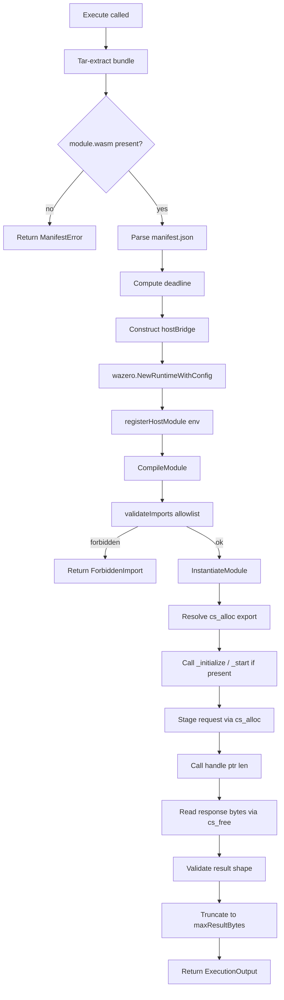
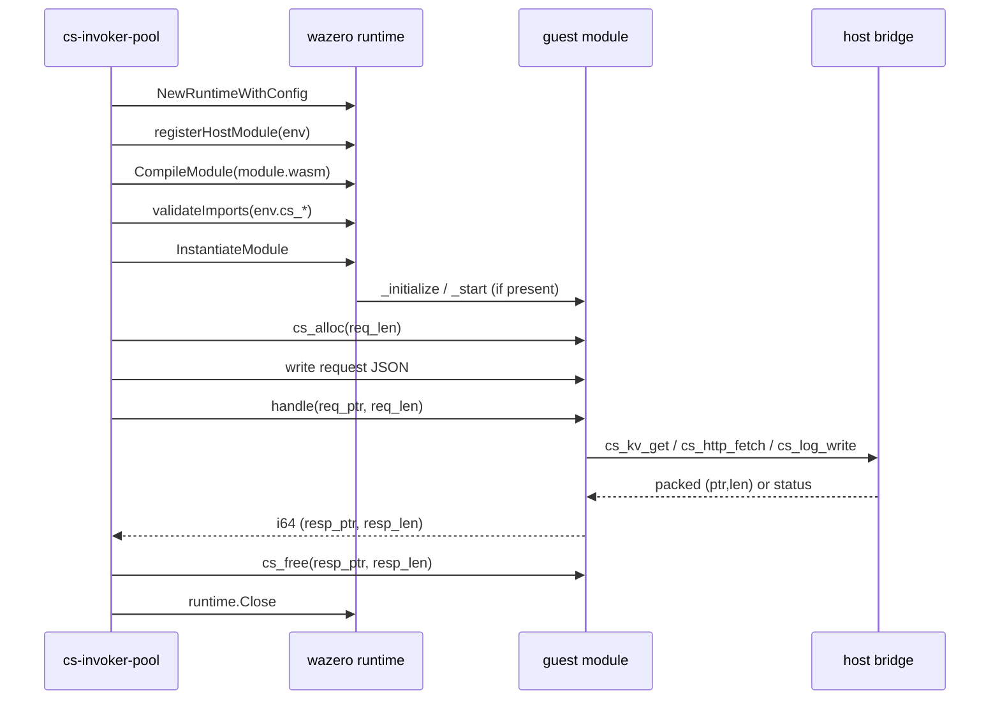

# Creating Functions: WebAssembly (cs-wasm)

`cs-wasm` is the WebAssembly runtime for Sous. It is implemented on top of [wazero](https://github.com/tetratelabs/wazero), a pure-Go WebAssembly runtime that requires no CGo, no external Wasmtime binary, and no system-installed `wasi-libc`. The runtime ships in the same Go process as the invoker and the local CLI; nothing has to be installed on the host to publish or execute a `.wasm` module. The adapter source lives at `internal/runtime/wasm/runner.go`, the host ABI definitions at `internal/runtime/wasm/abi.go`, and the host-import bridge at `internal/runtime/wasm/host.go`.

The guest module runs inside the same OS process as the invoker. wazero compiles the publisher's `module.wasm` into a wazero-internal IR on first load, instantiates it with linear memory bounded by the runtime, and tears the runtime down at the end of every activation. Because wazero is embedded — not forked — `cs-wasm` has no subprocess fan-out, no IPC layer, and no shared-state surface. Wall time is enforced through wazero's `CloseOnContextDone` wiring against a `context.WithDeadline` derived from `manifest.limits.timeoutMs`. Linear memory growth is bounded by the value the manifest declares in `limits.memoryMb`; modules that try to grow past the cap trap.

`cs-wasm` is the only Sous runtime in which the publisher chooses the source language. Anything that targets `wasm32-unknown-unknown` — Rust, AssemblyScript, TinyGo, C/C++ via Emscripten without `-s WASI=1`, Zig — produces a module the runtime can execute. Sous deliberately chose wazero over Wasmtime so the binary stays embeddable and trivially cross-compilable; the tradeoff is that **WASI is not registered**. Guests cannot resolve `wasi_snapshot_preview1` imports, which means they cannot read `stdin`, write `stdout`, open files, spawn processes, or call sockets even by name. The capability surface is the cs.* host module described under [Concepts Capabilities and Isolation](Concepts-Capabilities-and-Isolation); a guest that imports anything else fails to instantiate with `CS_RUNTIME_CAPABILITY_DENIED` before its first instruction runs.

## Guest ABI

The runtime expects a small, declarative export surface. Every contract below is enforced by `internal/runtime/wasm/runner.go`; missing exports either fail the activation (when required) or take a documented default (when optional).

Required exports:

- `memory` — the guest's linear memory, exported by the WebAssembly module. The host reads and writes through it; there is no shared host-side buffer.
- `cs_alloc(size: i32) -> i32` — a guest-side allocator the host calls whenever it needs to hand bytes back to the guest. The host calls `cs_alloc` before staging the request payload and before producing any output buffer from a host import (`cs_kv_get`, `cs_http_fetch`).
- `handle(req_ptr: i32, req_len: i32) -> i64` — the entry point. The host writes the JSON-encoded request into linear memory, then calls `handle` with the offset and length. The function returns an `i64` that packs `(ptr << 32) | len` for a response buffer inside guest memory.

Optional exports:

- `cs_free(ptr: i32, size: i32)` — called by the host after it has consumed the response buffer the guest returned. Modules that do not export `cs_free` simply leak the response buffer for the duration of the activation; that is harmless because the wazero runtime is torn down when `Execute` returns.
- `_initialize` and `_start` — AssemblyScript and TinyGo emit these to wire up language-level runtime state. The host calls them in that order if present, before calling `handle`. Errors from either trap the activation.

The request document the host stages in linear memory has the shape:

```json
{
  "event": <publisher-supplied JSON>,
  "ctx": {
    "activation_id": "uuid",
    "deadline_ms": 1730000003000,
    "tenant": "t_abc123",
    "namespace": "payments",
    "function": "reconcile",
    "ref":     { "alias": "prod", "version": 17 },
    "trigger": { "type": "http" },
    "principal": { "sub": "user:123", "roles": ["role:app"] }
  }
}
```

The `handle` return value follows three rules:

- A return of `0` is equivalent to `{"statusCode":200,"headers":{},"body":""}`. Guests that already produced their entire output via host calls (e.g. by publishing to codeQ and returning nothing) take this path.
- A non-zero return packs `(ptr, len)`. The host reads the bytes and tries to decode them as a [FunctionResponse](Schemas) envelope (`{"statusCode","headers","body","isBase64Encoded"}`). If decoding succeeds and `statusCode` is non-zero, the response is forwarded verbatim.
- If the bytes fail to decode as a FunctionResponse, the host wraps them as a `200 OK` with the raw bytes as `body`. This lets guests in languages without a JSON encoder produce plain-text responses.

When `handle` is absent and only `_start` is exported, the runtime synthesises a `200 OK` with an empty body. This is the documented escape hatch for purely side-effectful modules.

## Memory model

`cs-wasm` operates on linear memory only. There is no shared memory, no `memory.atomic.*` family, and no thread-creation surface; the guest is single-threaded by construction. The host's interaction with guest memory is mediated through a single `api.Memory` handle, and every byte that crosses the boundary is copied: the host does not retain references to guest memory across boundary transitions, which is important because `memory.grow` can invalidate the underlying buffer.

Allocations are guest-side. The host owns no heap inside guest memory. When the host needs to hand bytes to the guest — the initial request, or a value returned from `cs_kv_get`, or an envelope returned from `cs_http_fetch` — it calls the guest's exported `cs_alloc(size)` and writes the bytes into the returned pointer. This keeps the ABI symmetric and the host stateless with respect to guest memory: the guest controls its own allocator (typically the language's default allocator: Rust's `alloc::alloc`, AssemblyScript's `__new`, TinyGo's runtime allocator).

The maximum payload size that can cross the boundary in either direction is `math.MaxUint32` (4 GiB) because the ABI uses i32 pointers and lengths. In practice, the runtime caps result bytes via `maxResultBytes` (default 256 KiB), error bytes via `maxErrorBytes` (default 64 KiB), and log bytes via `maxLogBytes` (default 1 MiB). Linear memory growth is upper-bounded by `manifest.limits.memoryMb`, which the manifest validator constrains to the range 16..4096. A runaway `memory.grow` loop is also bounded by the wall-time deadline, which fires first in practice.

The `ReadMemory` helper in `internal/runtime/wasm/abi.go` always defensively copies the bytes it returns. The rationale is that the wasm spec permits a `memory.grow` call between the host's `Memory.Read` and the host's first use of the returned slice; a growth reallocates the underlying buffer and invalidates the slice. Sous chose correctness over micro-optimisation here: every host-side use of guest data sees a stable Go-owned slice. The cost is one allocation and one `copy` per crossing, which is negligible relative to the JSON marshal/unmarshal pass that surrounds it.

The `WriteToGuest` helper performs the inverse: it calls `cs_alloc` for `len(data)`, writes the bytes via `Memory.Write`, and returns the packed `(ptr, len)` pair. The host-to-guest direction is single-shot — there is no incremental writer — so the guest's allocator must be able to satisfy the largest single request the function will ever receive. For most functions this is the request envelope itself, which the manifest's KV / event size budget already bounds.

The ABI deliberately uses i32 (not i64) for pointers and lengths. wazero supports 32-bit linear memory only (the wasm64 proposal has not stabilised), and an i32 pointer is the natural fit. The 4 GiB upper bound has never been hit in practice; the manifest-declared `memoryMb` cap fires long before.

## Host imports

The guest may import functions only from the wasm module named `env`. Any other module name — `wasi_snapshot_preview1`, `wasi`, `cs`, the empty string — fails the instantiation check in `validateImports`. Within `env`, the allowlist is the six `cs_*` host functions described below. Imported memories, tables, or globals are also rejected.

| Import (in `env`)    | Signature                                                   | Returns                 |
| -------------------- | ----------------------------------------------------------- | ----------------------- |
| `cs_log_write`       | `(level: i32, msg_ptr: i32, msg_len: i32)`                  | `i32 status`            |
| `cs_kv_get`          | `(key_ptr: i32, key_len: i32)`                              | `i64 packed (ptr, len)` |
| `cs_kv_set`          | `(key_ptr, key_len, val_ptr, val_len, ttl_seconds: i32)`    | `i32 status`            |
| `cs_kv_del`          | `(key_ptr: i32, key_len: i32)`                              | `i32 status`            |
| `cs_codeq_publish`   | `(topic_ptr, topic_len, payload_ptr, payload_len: i32)`     | `i32 status`            |
| `cs_http_fetch`      | `(req_ptr: i32, req_len: i32)`                              | `i64 packed (ptr, len)` |

Conventions:

- Pointers and lengths are `i32` values measured in bytes. Strings are UTF-8.
- Input-only calls (the host reads from guest memory) return an `i32` status: `0` for OK, negative values for typed errors.
- Output-bearing calls return an `i64` that packs `(ptr << 32) | len`. A return of `0` means "no payload" — either there was nothing to return, or the call was denied silently. Output-bearing calls invoke `cs_alloc` to acquire the destination buffer before copying.

The status codes are defined in `internal/runtime/wasm/abi.go`:

| Value | Constant               | Meaning                                              |
| ----- | ---------------------- | ---------------------------------------------------- |
|  0    | `StatusOK`             | Operation completed.                                 |
| -1    | `StatusErrInvalidArg`  | Bad pointer, bad length, or malformed JSON envelope. |
| -2    | `StatusErrCapDenied`   | Capability gate refused the call.                    |
| -3    | `StatusErrHostFailure` | Provider error (KV unreachable, HTTP failed).        |
| -4    | `StatusErrNotFound`    | Reserved for future use.                             |

### Logging

`cs_log_write(level, msg_ptr, msg_len)` writes a single line to the activation's log buffer. The level encoding is numeric so the ABI stays language-neutral: `0` is info, `1` is warn, `2` is error, any other value is treated as info. The host prepends the level token (e.g. `[info]`) and persists the line into the activation record. The log buffer is bounded by `maxLogBytes`; once the cap is reached, further writes are silently truncated and `ExecutionOutput.Truncated` is set.

The host does not interpret the message bytes — they are treated as opaque UTF-8 and recorded verbatim. Guests that want structured logging are expected to emit JSON themselves, the same way cs-js guests would call `cs.log.info(JSON.stringify({event:"hit",count:1}))`. The activation log line format matches the cs-js side exactly so downstream log consumers (the activation viewer, audit pipelines) need not branch on the runtime identifier.

### KV access

`cs_kv_get(key_ptr, key_len)` reads the key from guest memory, consults the manifest's KV allowlist, and — on success — writes the JSON-encoded value back into a fresh guest allocation. The return is the packed `(ptr, len)` of that allocation, or `0` when the key is absent or the call was denied. The guest cannot distinguish "absent" from "denied" through the return value alone; the StatusErrCapDenied surface is reserved for set/del. This mirrors the cs-js semantics, where a denied read on `cs.kv.get` returns `undefined`.

`cs_kv_set(key_ptr, key_len, val_ptr, val_len, ttl_seconds)` stores `value` under `key` with an optional TTL. A TTL of `0` means "no expiry". The return is an `i32` status. The host validates the op against `manifest.capabilities.kv.ops` and the key against the prefix allowlist before forwarding to the [KVRocks](Storage-KVRocks) provider.

`cs_kv_del(key_ptr, key_len)` removes `key` if it exists. The return is an `i32` status.

The value bytes the host stores are exactly what the guest wrote — there is no implicit JSON encoding, no UTF-8 validation, no length-prefix wrapping. A guest that wants to round-trip structured data is expected to serialise on write and deserialise on read. Most guests serialise as JSON because the cs-js runtime's `cs.kv` API does the same, and parity fixtures expect JSON bytes on the wire; non-JSON encodings are accepted but cannot be inspected by tooling that assumes JSON.

The TTL is in seconds, not milliseconds, to match the cs-js `ttlSeconds` field. A TTL of `0` or negative is treated as "no expiry" by the provider. The minimum effective TTL is one second; sub-second precision is not exposed.

### codeQ publish

`cs_codeq_publish(topic_ptr, topic_len, payload_ptr, payload_len)` publishes a message to a [codeQ](codeQ-Protocol) topic. The host first checks the topic against `manifest.capabilities.codeq.publishTopics` (with `*` wildcard suffix supported), then tries to decode the payload bytes as JSON. If the bytes are valid JSON the decoded value is forwarded as-is; otherwise the bytes are forwarded as a string, which lets guests written without a native JSON encoder still publish a readable message. The return is an `i32` status.

### HTTP fetch

`cs_http_fetch(req_ptr, req_len)` reads a JSON document with the shape:

```json
{
  "url": "https://api.example.com/foo",
  "method": "POST",
  "headers": { "x-trace": "abc" },
  "body": "...",
  "isBase64Encoded": false,
  "timeoutMs": 1500
}
```

The host parses the URL, checks the hostname against `manifest.capabilities.http.allowHosts`, and refuses RFC1918 / loopback addresses unless the runner was configured with `allowPrivateIPCheck=false` for local-only testing. The effective timeout is `min(req.timeoutMs, manifest.capabilities.http.timeoutMs)`. The response envelope follows the cs-js shape verbatim:

```json
{
  "status": 200,
  "headers": { "content-type": "text/plain" },
  "body": "base64...",
  "isBase64Encoded": true
}
```

The return is the packed `(ptr, len)` of the JSON-encoded envelope inside a fresh guest allocation. A return of `0` indicates either a denied host, a malformed request, or a transport failure; the guest should treat `0` as a generic failure.

## Capability enforcement

The capability model is the same allowlist-first model the cs-js runtime uses, with one tightening at the wasm layer: the import-validation step rejects forbidden host functions before the module is instantiated, not when the function is called. This means a guest that imports `cs_http_fetch` but does not declare `manifest.capabilities.http` will still pass the import check; the denial happens at call time when `httpHostAllowed` returns false. Conversely, a guest that imports `fd_write` from `wasi_snapshot_preview1` fails the validate step with `CS_RUNTIME_CAPABILITY_DENIED`, surfaced as `errForbiddenImport` in `runner.go`.

The bridge enforces:

- KV: `manifest.capabilities.kv.ops` lists the allowed operations (`get`, `set`, `del`); `manifest.capabilities.kv.prefixes` lists the allowed key prefixes. Both checks must pass.
- codeQ: `manifest.capabilities.codeq.publishTopics` lists the allowed topics. A trailing `*` makes the entry a prefix match.
- HTTP: `manifest.capabilities.http.allowHosts` lists the allowed hostnames (case-insensitive exact match). Private/loopback addresses are blocked by default.

Denials never panic into the guest. The bridge returns the documented status code (`StatusErrCapDenied` for input-only calls, `0` for output-bearing calls) and the host records the denial in the activation log. The guest is expected to inspect the return value and decide whether to fail open or fail closed.

The two-stage check matters in practice. Imagine a guest module that imports `cs_http_fetch` but is published with a manifest that does not declare any `http.allowHosts`. The module instantiates successfully — the import resolves because the host module exports `cs_http_fetch` — but the first call to `cs_http_fetch` returns `0` because the empty allowlist matches nothing. This shape lets functions declare optional behaviour: the guest can probe whether HTTP is available at run time without crashing. The same pattern applies to `cs_kv_get`; a guest that imports it but receives `0` on every call learns that the manifest withheld the capability.

The contrast with imports outside `env` is intentional. Those failures are catastrophic — the module never runs — because they almost always indicate a build-time mistake (the publisher accidentally targeted `wasm32-wasi` instead of `wasm32-unknown-unknown`, or the toolchain injected a host import nobody asked for). Failing fast at validate time gives the publisher a precise error code (`CS_RUNTIME_CAPABILITY_DENIED`) with the name of the offending import, so the fix is obvious. A typical `validateImports` failure looks like:

```text
forbidden import: import "fd_write" from module "wasi_snapshot_preview1" is not allowed
```

The activation log will also contain the wazero-formatted underlying error string for diagnostic purposes. See [Error Model](Error-Model) for the full taxonomy and how downstream HTTP responses map.

### KV prefix matching

The KV prefix check is a literal `strings.HasPrefix` against every entry in `manifest.capabilities.kv.prefixes`. There is no wildcard syntax — a prefix is a prefix. A manifest that declares `["ctr:"]` allows `ctr:`, `ctr:hits`, `ctr:foo:bar`, but rejects `counter:hits`. A manifest that declares `["ctr:hits"]` allows only keys that start with that exact byte sequence, which is a stricter and rarer choice.

### codeQ topic matching

The codeQ topic check supports a single trailing `*` wildcard. A manifest that declares `["jobs.*"]` allows any topic that starts with `jobs.`. A manifest that declares `["exact.topic"]` allows only `exact.topic`. There is no glob, regex, or per-segment wildcard syntax; the topic vocabulary is meant to be flat enough that a prefix is sufficient.

### HTTP host matching

The HTTP host check is a case-insensitive exact match against the hostname component of the request URL. A manifest that declares `["api.example.com"]` allows `https://api.example.com/foo` and `https://API.EXAMPLE.COM/foo`, but rejects `https://other.example.com/foo` and `https://example.com/foo`. Subdomain wildcards are not supported in v0.1; that decision is intentional because the cs-js runtime takes the same line and parity is more valuable than expressivity.

The runner also refuses RFC1918 addresses (10/8, 172.16/12, 192.168/16, 127/8) and IPv6 loopback / unique-local prefixes by default. The check resolves the hostname via `net.LookupIP` and inspects every returned address. A guest that tries to fetch `http://10.0.0.5/secrets` is denied even if `10.0.0.5` literally appears in `allowHosts`; the prohibition is on the address class, not the string. Operators running the runner in an isolated test environment can disable this check via `disablePrivateIPCheck()` — that's exclusively for the local-runner code path and is not exposed to publishers.

## Host-side lifecycle

The `Runner.Execute` method in `internal/runtime/wasm/runner.go` follows a strict, request-scoped lifecycle. Every activation goes through the same eleven phases in the same order; there is no per-version caching and no shared state between activations.



Every transition between phases is fail-fast. A failure in phase B (bundle extract) returns immediately with `CS_VALIDATION_MANIFEST`; a failure in phase J (import validation) returns with `CS_RUNTIME_CAPABILITY_DENIED`; a failure in phase O (handler call) returns with either `CS_RUNTIME_EXCEPTION` or `CS_RUNTIME_TIMEOUT` depending on whether the deadline elapsed. The full error taxonomy is documented under [Error Model](Error-Model).

The wazero runtime constructed in phase G is local to the `Execute` call and is closed in a `defer` before the function returns. This is the central simplification of v0.1: there is no compiled-module cache, no shared runtime, no warm pool. Every activation pays the full cold-start cost. Future epics may introduce caching keyed by the bundle SHA, but the public Runner API does not change in that scenario.

## Cold-start

Every activation pays the cost of:

1. Tar-extracting the bundle from KVRocks (`extractBundle`).
2. Parsing `manifest.json` (`apipkg.ParseManifest`).
3. Constructing a wazero runtime (`wazero.NewRuntimeWithConfig`).
4. Registering the `env` host module (`registerHostModule`).
5. Compiling the `.wasm` bytes (`runtime.CompileModule`).
6. Validating imports (`validateImports`).
7. Instantiating the module (`runtime.InstantiateModule`).
8. Running optional `_initialize` / `_start`.
9. Staging the request payload and calling `handle`.
10. Tearing the runtime down on return.

Step 5 — compilation — is the dominant cost. wazero compiles the module ahead of execution; the compiler is single-threaded and proportional to module size. A small Rust handler (~50 KiB of wasm) compiles in single-digit milliseconds on modern hardware; a TinyGo build that drags in the full Go runtime (1–4 MiB) may compile in tens to hundreds of milliseconds. The instantiation step (7) is fast: it walks imports and allocates linear memory.

In the current implementation the wazero runtime is constructed and torn down per activation. There is no shared compiled-module cache. This is a deliberate v0.1 simplification: it keeps `Execute` stateless and lets the invoker reuse a single Runner across activations without worrying about cache coherency under hot reload. A future patch may introduce a `wazero.CompilationCache` keyed by the bundle SHA so subsequent activations of the same version skip step 5; the public ABI does not change in that case.

The compile-time vs run-time tradeoff matters for build pipelines:

- Rust with `--release` and `strip` produces small modules (typically 30–200 KiB) with the lowest cold-start cost.
- AssemblyScript produces small modules (10–100 KiB) but ships its own runtime; the cold-start cost is dominated by AssemblyScript's `__new` allocator setup, which is sub-millisecond.
- TinyGo produces larger modules because it embeds the Go scheduler and GC; cold start is in the 10–100 ms range depending on the package surface. Prefer `tinygo build -no-debug -opt=z` for production.

## Build pipeline

The runtime accepts any binary that conforms to the export surface in [Guest ABI](#guest-abi). The control plane does not care which compiler produced the bytes. See [Managing Functions Packages](Managing-Functions-Packages) for the bundle layout the published `.wasm` must sit inside.

### Rust

Add the wasm32 target once per workstation:

```sh
rustup target add wasm32-unknown-unknown
```

Then build with the release profile:

```sh
cargo build --target wasm32-unknown-unknown --release
```

The output is `target/wasm32-unknown-unknown/release/<crate>.wasm`. Rename or symlink it to `module.wasm` before tarring the bundle. For minimum size, set `lto = true` and `opt-level = "z"` in `Cargo.toml` and run `wasm-strip` (from WABT) over the output.

Rust crate type must be `cdylib` (or `staticlib` plus a custom `wasm-ld` invocation). The default `bin` crate type does not produce a wasm module suitable for cs-wasm — it embeds a `_start` that calls `main`, which in turn expects WASI's `args_get` / `args_sizes_get`, which are not registered. Use `cdylib`, declare `#[no_mangle] pub extern "C"` on every export, and Rust will produce a wasm module whose only required imports are the cs.* surface the manifest declares.

### AssemblyScript

Install the toolchain in the function's package:

```sh
npm install --save-dev assemblyscript
```

Build with the AssemblyScript compiler:

```sh
npx asc src/index.ts -o build/handler.wasm --optimize --runtime stub
```

The `--runtime stub` flag skips AssemblyScript's incremental GC; functions that allocate within a single invocation and discard at end-of-activation do not need the full GC, and the resulting binary is dramatically smaller. Use `--runtime incremental` if the guest needs reference-counted host objects.

### TinyGo

Install TinyGo, then:

```sh
tinygo build -target wasm -no-debug -opt=z -o module.wasm ./...
```

TinyGo's `wasm` target produces a `wasm32-unknown-unknown` binary that imports nothing from WASI — exactly what `cs-wasm` accepts. The `wasi` target imports `fd_write` and a handful of other WASI symbols and **will fail** to instantiate against the cs-wasm runtime. Use `tinygo build -target wasm`, not `tinygo build -target wasi`.

TinyGo guests declare host imports via `//export` directives and `//go:wasmimport` (Go 1.21+):

```go
//go:wasmimport env cs_log_write
func csLogWrite(level int32, msgPtr *byte, msgLen int32) int32

//go:wasmimport env cs_kv_get
func csKVGet(keyPtr *byte, keyLen int32) int64

//export handle
func handle(reqPtr *byte, reqLen int32) int64 {
    // ...
}
```

The cs_alloc / cs_free exports map to TinyGo's `runtime.malloc` and `runtime.free`. TinyGo emits a `_start` that initialises the runtime; the cs-wasm host calls it automatically.

### C / C++

Use Clang directly with the `wasm32` triple:

```sh
clang --target=wasm32 -O3 -nostdlib -Wl,--no-entry -Wl,--export-all -o module.wasm src/handler.c
```

C guests need to implement `cs_alloc` and `cs_free` against `malloc`/`free` from a freestanding allocator (e.g. `walloc` or `dlmalloc` ported to wasm32).

## Manifest

The manifest declares the runtime and the path to the compiled module. The schema is shared with cs-js; the only required difference is `"runtime": "cs-wasm"` and `"entry": "module.wasm"`.

```json
{
  "schema": "cs.function.script.v1",
  "runtime": "cs-wasm",
  "runtimeVersion": "wasm32",
  "entry": "module.wasm",
  "handler": "handle",
  "limits": { "timeoutMs": 3000, "memoryMb": 64, "maxConcurrency": 1 },
  "capabilities": {
    "kv":    { "prefixes": ["ctr:"], "ops": ["get","set"] },
    "codeq": { "publishTopics": ["jobs.*"] },
    "http":  { "allowHosts": ["api.example.com"], "timeoutMs": 1500 }
  }
}
```

Field notes:

- `runtime` must be `cs-wasm`. The control plane dispatches on this field at publish time.
- `runtimeVersion` is informational; `wasm32` for `wasm32-unknown-unknown` builds and `wasi-preview1` for the (currently unsupported) WASI target.
- `entry` is the path inside the tar bundle. The runtime hard-codes the canonical name `module.wasm`; bundles using any other entry name are rejected.
- `handler` is the name of the exported function the host calls. The current runtime calls a fixed export named `handle`, so this field is informational in v0.1.
- `imports` from the cs-js manifest is ignored for cs-wasm. WebAssembly modules ship their dependencies inline at compile time.

## Worked example: Rust handler with KV access

A complete Rust function that reads a KV value, logs it, and returns a JSON response. The function declares the `ctr:` prefix and the `get` op in its manifest.

`Cargo.toml`:

```toml
[package]
name        = "counter-reader"
version     = "0.1.0"
edition     = "2021"

[lib]
crate-type  = ["cdylib"]

[profile.release]
lto         = true
opt-level   = "z"
strip       = true
```

`src/lib.rs`:

```rust
use std::alloc::{alloc, dealloc, Layout};

extern "C" {
    fn cs_log_write(level: i32, msg_ptr: *const u8, msg_len: i32) -> i32;
    fn cs_kv_get(key_ptr: *const u8, key_len: i32) -> i64;
}

#[no_mangle]
pub extern "C" fn cs_alloc(size: i32) -> *mut u8 {
    let layout = Layout::from_size_align(size as usize, 1).unwrap();
    unsafe { alloc(layout) }
}

#[no_mangle]
pub extern "C" fn cs_free(ptr: *mut u8, size: i32) {
    let layout = Layout::from_size_align(size as usize, 1).unwrap();
    unsafe { dealloc(ptr, layout) }
}

fn unpack(packed: i64) -> (i32, i32) {
    let ptr = (packed >> 32) as i32;
    let len = (packed & 0xFFFFFFFF) as i32;
    (ptr, len)
}

fn pack(ptr: i32, len: i32) -> i64 {
    ((ptr as i64) << 32) | ((len as i64) & 0xFFFFFFFF)
}

#[no_mangle]
pub extern "C" fn handle(_req_ptr: *const u8, _req_len: i32) -> i64 {
    let key = b"ctr:hits";
    let msg = b"reading counter";
    unsafe { cs_log_write(0, msg.as_ptr(), msg.len() as i32) };

    let packed = unsafe { cs_kv_get(key.as_ptr(), key.len() as i32) };
    let value = if packed == 0 {
        "0".to_string()
    } else {
        let (ptr, len) = unpack(packed);
        let bytes = unsafe { std::slice::from_raw_parts(ptr as *const u8, len as usize) };
        String::from_utf8_lossy(bytes).into_owned()
    };

    let body = format!(r#"{{"statusCode":200,"body":"hits={}"}}"#, value);
    let bytes = body.into_bytes();
    let len = bytes.len() as i32;
    let buf = cs_alloc(len);
    unsafe { std::ptr::copy_nonoverlapping(bytes.as_ptr(), buf, len as usize) };
    pack(buf as i32, len)
}
```

`manifest.json`:

```json
{
  "schema": "cs.function.script.v1",
  "runtime": "cs-wasm",
  "entry": "module.wasm",
  "handler": "handle",
  "limits": { "timeoutMs": 3000, "memoryMb": 32, "maxConcurrency": 1 },
  "capabilities": {
    "kv": { "prefixes": ["ctr:"], "ops": ["get"] }
  }
}
```

Build and bundle:

```sh
cargo build --target wasm32-unknown-unknown --release
cp target/wasm32-unknown-unknown/release/counter_reader.wasm module.wasm
tar -cf bundle.tar manifest.json module.wasm
```

Publish through `cs publish`, then invoke. The activation log will contain `[info] reading counter` and the response body will be `hits=<value>`. See [CLI](CLI) for the publish/invoke commands.

### AssemblyScript variant

The same handler in AssemblyScript. The boilerplate is shorter because AssemblyScript ships with a native allocator (`__new`) that the runtime can re-export as `cs_alloc`.

`assembly/index.ts`:

```ts
// Host imports
@external("env", "cs_log_write")
declare function cs_log_write(level: i32, msg_ptr: usize, msg_len: i32): i32;

@external("env", "cs_kv_get")
declare function cs_kv_get(key_ptr: usize, key_len: i32): i64;

// Re-export the AssemblyScript allocator as cs_alloc / cs_free.
export function cs_alloc(size: i32): usize {
  return __new(size, idof<ArrayBuffer>());
}

export function cs_free(ptr: usize, _size: i32): void {
  __unpin(changetype<ArrayBuffer>(ptr));
}

function writeString(s: string): i64 {
  const buf = String.UTF8.encode(s);
  const ptr = changetype<usize>(buf);
  const len = buf.byteLength;
  return ((<i64>ptr) << 32) | (<i64>len);
}

export function handle(_req_ptr: usize, _req_len: i32): i64 {
  const key = String.UTF8.encode("ctr:hits");
  const msg = String.UTF8.encode("reading counter");
  cs_log_write(0, changetype<usize>(msg), msg.byteLength);
  const packed = cs_kv_get(changetype<usize>(key), key.byteLength);
  let value = "0";
  if (packed != 0) {
    const ptr = <usize>(packed >>> 32);
    const len = <i32>(packed & 0xFFFFFFFF);
    value = String.UTF8.decodeUnsafe(ptr, len);
  }
  return writeString(`{"statusCode":200,"body":"hits=${value}"}`);
}
```

Build with `npx asc assembly/index.ts -o module.wasm --optimize --runtime stub`. The same `manifest.json` from the Rust example applies unchanged.

## Activation flow



## Limitations

- **No WASI.** The runtime does not register `wasi_snapshot_preview1` or `wasi_unstable`. Guests built with `--target wasi` will not instantiate. Stdout, stderr, the filesystem, sockets, and process control are all unavailable; the only side-effect channel is the cs.* host module.
- **No threads or shared memory.** The `threads` and `shared-memory` proposals are not enabled. `memory.atomic.*` instructions trap. Each activation runs on a single OS thread.
- **No SIMD.** The wazero runtime does not enable the SIMD proposal in v0.1. SIMD-targeted modules will trap on the first vector instruction. This will change when the proposal stabilises in wazero's default feature set.
- **No async at the guest level.** The guest is synchronous from its own perspective: it calls `cs_http_fetch`, the host blocks until the underlying `http.Client.Do` returns, and then the host returns to the guest. Concurrency at the host level (multiple parallel activations across the invoker pool) is opaque to any single guest.
- **No streaming responses.** The response is a single contiguous byte slice. There is no per-byte channel between the guest and the gateway.
- **No imports outside `env`.** Tables, memories, globals, and functions imported from any other module — including `wasi_snapshot_preview1` — fail the validate step.
- **`runtimeVersion: wasi-preview1` is reserved.** The string is accepted in the manifest for forward compatibility but the runtime currently rejects WASI imports. WASI Preview 2 (component model, `wasi-sockets`) will land as `cs-wasm@2` without breaking the v1 manifest contract.

## Troubleshooting

A short field guide for the most common failure modes.

**"bundle missing module.wasm"** — The tar bundle does not contain a file named `module.wasm` at the top level. The runtime hard-codes the entry name; renaming the compiled artifact to `module.wasm` before tarring resolves this.

**"forbidden import: import \"fd_write\" from module \"wasi_snapshot_preview1\" is not allowed"** — The module was built against the WASI target instead of `wasm32-unknown-unknown`. For TinyGo, switch from `-target wasi` to `-target wasm`. For Rust, switch from `--target wasm32-wasi` to `--target wasm32-unknown-unknown`.

**"guest does not export cs_alloc"** — The guest is missing the host-required `cs_alloc` export. Add `#[no_mangle] pub extern "C" fn cs_alloc(...)` in Rust, `export function cs_alloc(...)` in AssemblyScript, or `//export cs_alloc` in TinyGo.

**"guest does not export memory"** — WebAssembly modules export linear memory by default; this error usually means the linker stripped the `memory` export. Pass `-Wl,--export=memory` to `wasm-ld` (Clang) or `--exportRuntime` to `asc` (AssemblyScript).

**"compile: ..."** — wazero rejected the bytes during `CompileModule`. The full wazero error follows the prefix and typically points to an invalid section or an unsupported feature (SIMD, threads). Recompile with the feature disabled.

**Cold-start budget regression** — A module that used to compile in 5 ms now takes 200 ms. The usual cause is a switch from `--release` to `--debug` or `-opt=z` to `-opt=0`. Re-enable release-mode optimisations and verify with `wc -c module.wasm`; a sudden 10x size increase confirms the suspicion.

**KV writes silently disappear** — The guest receives `StatusOK` but the value is gone on the next invocation. Two common causes: `ttl_seconds` was set to a small positive value (the entry expired between calls), or the guest is writing to a key whose prefix is not declared in the manifest. Inspect the activation log for `kv prefix not allowed`; a denied `set` returns `StatusErrCapDenied`, not `StatusOK`.

**HTTP fetch returns 0 for an allowlisted host** — The hostname resolves to an RFC1918 address. This is the private-IP guard at work. For local-runner testing, the CLI exposes a flag to disable the check; in production, route the request through a proxy on a public address.

**Response decoded as a 200 with raw body** — The guest returned bytes that did not match the `FunctionResponse` envelope shape. This is the documented fallback: any non-JSON bytes (or JSON with `statusCode=0`) are wrapped as `200 OK` with the bytes as `body`. To return a specific status, emit a full envelope: `{"statusCode":418,"headers":{},"body":"teapot"}`.

## Cross-language testing

The runtime parity harness defined under `internal/runtime/parity/` exercises the same fixture against every registered runtime — cs-js, cs-python, cs-wasm. Fixtures live at `test/parity/fixtures/`; each fixture declares per-runtime guest code under its `files` map. The harness loads each fixture, builds the canonical tar bundle for every runtime that supplies code, runs the bundle through the runtime's Runner, and asserts the recorded golden shape (status, resolved error code, response, log substrings, response headers). The comparison rules normalise runtime-specific noise — timing jitter, header casing, log slice prefixes — so a fixture that asserts `statusCode + body` does not have to enumerate the entire headers map. See [Development Tools Parity Harness](Development-Tools-Parity-Harness) for the full matrix.

A fixture that does not declare a `cs-wasm` entry under `files` is silently skipped for the wasm runtime, which lets the cs-js corpus continue to land before a wasm equivalent exists. When both entries are present, the harness compares the two outputs against the same `expected` shape — that is the parity invariant from `docs/02-requirements.md`: for the same input, every adapter must produce the same response shape, the same typed error code, and the same observable side effects.

The fixtures currently shipped under `test/parity/fixtures/` cover capability denial, KV round-trip, log emission, simple echo, and timeout. As wasm guest code lands under each fixture's `cs-wasm` map, the harness will start asserting that a Rust or AssemblyScript build of the same scenario produces byte-identical output to the cs-js handler. The expected response shapes are kept in the fixture itself, not in per-runtime golden files, so adding a new runtime to the matrix does not require duplicating expectations.
