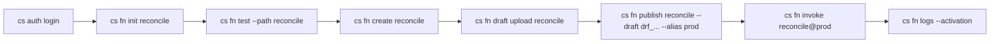

# Developers: CLI

The `cs` command-line tool is the primary developer-facing entry point for SOUS. It is a single static Go binary built from [`cmd/cs-cli/main.go`](https://github.com/osvaldoandrade/sous/blob/main/cmd/cs-cli/main.go) and shipped without external runtime dependencies. Every operation the CLI performs against a running cluster is a direct call to the SOUS control plane over HTTPS; the CLI is a convenience wrapper around the same JSON endpoints documented in [REST API](Developers-REST-API). An operator who prefers `curl` or a generated SDK can substitute either at any time without loss of functionality.

The mental model is intentionally narrow. A single `cs` binary, configured by a per-user JSON file at `$XDG_CONFIG_HOME/code-sous/auth.json` (or `$HOME/.config/code-sous/auth.json` on platforms that lack `XDG_CONFIG_HOME`), authenticates with a [Tikti](IAM-with-Tikti) bearer token and operates against a configured control-plane URL. The config file holds three fields — `api_url`, `tenant`, and `token` — and is written by `cs auth login`. There are no profiles, no per-command credential overrides, and no implicit token refresh; the assumption is that the developer issues short-lived tokens out-of-band from Tikti and re-runs `cs auth login` when one expires. This keeps the CLI's surface small enough to be auditable in a single sitting and predictable enough to script against.

One feature deserves a callout up front because it is the keystone of the SOUS developer experience: `cs fn test` runs the function bundle through the exact same `cs-js` runtime that the cluster's [Invoker Pool](Invoker-Pool) uses to serve production traffic. There is no in-process mock and no host-language shim. The bytes of `function.js` and `manifest.json` are canonicalised into a bundle ([`internal/bundle`](https://github.com/osvaldoandrade/sous/blob/main/internal/bundle)) and handed to [`internal/runtime.NewRunner`](https://github.com/osvaldoandrade/sous/blob/main/internal/runtime), wired against an in-memory KV and a no-op codeQ publisher, with the same time and memory limits the cluster would apply. The activation envelope (`activation_id`, `tenant`, `namespace`, `principal`, `trigger`, `deadline_ms`) is fabricated locally with the trigger type pinned to `api`. This means a function that passes `cs fn test` against a representative event will exhibit the same successful behaviour in production; conversely, runtime regressions surface offline before any code reaches the cluster.

Two ergonomic conventions cut across every subcommand and are worth internalising up front. First, flag parsing is permissive about argument ordering: positional arguments may appear before or after their accompanying flags, so `cs fn init reconcile --template scheduled-job` and `cs fn init --template scheduled-job reconcile` are equivalent. The reordering happens in `reorderFlags` in [`cmd/cs-cli/main.go`](https://github.com/osvaldoandrade/sous/blob/main/cmd/cs-cli/main.go) and applies to every subcommand. Second, function references are spelled as `function@alias-or-version` throughout — `reconcile@prod` selects whatever version the `prod` alias currently resolves to; `reconcile@17` pins version 17. The numeric/string disambiguation happens by attempting `strconv.ParseInt` first; if it fails, the suffix is interpreted as an alias name. The `cs fn invoke`, `cs schedule create --fn`, and `cs cadence worker create --activity` commands all follow this convention, so the spelling is portable.

The remainder of this page is the exhaustive reference. Subcommands are documented in source-of-truth order: `auth`, `fn`, `http`, `schedule`, `cadence`, and `doctor`. Each section opens with prose that explains intent and behaviour, then lists flags, an example, and the relevant exit-code semantics.

## Top-level synopsis

```
cs <auth|fn|http|schedule|cadence|doctor> <subcommand> [flags]
```

When invoked without any arguments the binary prints the synopsis above and exits `1`. Unknown top-level commands and unknown subcommands also exit `1` after writing a one-line `error:` message to standard error. The dispatcher table is fixed at compile time in [`cmd/cs-cli/main.go`](https://github.com/osvaldoandrade/sous/blob/main/cmd/cs-cli/main.go); the CLI does not load plugins or look up subcommand names dynamically.

A typical local-development session walks through the lifecycle from blank directory to live invocation:



The same flow can be driven end-to-end via the [REST API](Developers-REST-API); the CLI's only value-add is convenience, argv-friendly flag parsing, and the offline runtime parity provided by `cs fn test`.

## cs auth

The `auth` group manages the local credential file. There are exactly two subcommands today: `login` writes the file, `whoami` reads it back. The CLI does not implement OAuth flows, device-code prompts, or token refresh — those concerns are owned by [Tikti](IAM-with-Tikti). The expectation is that developers fetch a token from Tikti (browser-based login, machine-account exchange, or short-lived CI credential) and feed it to `cs auth login` either as a flag or via the `CS_TOKEN` environment variable.

### cs auth login

`cs auth login` collects the tenant identifier, a bearer token, and the control-plane URL, validates that the required fields are non-empty, and writes them to `auth.json` with mode `0600`. The token may be passed directly via `--token` or sourced from the `CS_TOKEN` environment variable; the latter is preferred in CI to avoid argv leakage. The `--tikti-url` flag is accepted for forward compatibility with a future browser-based device-code flow, but is currently ignored — tokens are expected to be obtained out-of-band from Tikti and pasted in.

| Flag | Default | Description |
| --- | --- | --- |
| `--tenant <id>` | (required) | Tenant identifier (e.g. `t_abc123`). The value is written verbatim into `auth.json` and used as a path segment for every subsequent control-plane call. |
| `--token <bearer>` | `$CS_TOKEN` | Bearer token issued by Tikti. Required either by flag or via `CS_TOKEN`. |
| `--api-url <url>` | `http://localhost:8080` | Control-plane base URL. Trailing slashes are tolerated. |
| `--tikti-url <url>` | (none) | Reserved for the future device-code flow. Currently accepted and ignored. |

Example:

```
$ cs auth login --tenant t_abc123 --token tok_demo --api-url https://sous.example.com
saved auth config to /home/me/.config/code-sous/auth.json
```

The CLI prints the resolved path so the user can inspect or back up the file. The file format is:

```json
{
  "api_url": "https://sous.example.com",
  "tenant": "t_abc123",
  "token": "tok_demo"
}
```

Exit codes: `0` on success; `1` when `--tenant` is missing or no token can be resolved.

### cs auth whoami

`cs auth whoami` reads `auth.json` and prints a single line summarising the active credentials. The token is truncated to the first eight characters so the output is safe to paste into chat logs and tickets. The command does not contact the control plane; it answers only "which file does the CLI currently read from?" — to confirm that the token is still valid against a live cluster, run [`cs doctor`](#cs-doctor) instead.

Example:

```
$ cs auth whoami
tenant=t_abc123 api_url=https://sous.example.com token_prefix=tok_demo
```

Exit codes: `0` on success; `1` when `auth.json` is missing, unreadable, or fails validation.

## cs fn

The `fn` group is the function lifecycle workhorse. It scaffolds new functions, runs them offline, uploads drafts, publishes immutable versions, pins aliases, invokes against the control plane, and tails activation logs. The wire format for every remote subcommand matches the request shapes defined in [`internal/api/types.go`](https://github.com/osvaldoandrade/sous/blob/main/internal/api/types.go).

### cs fn init

`cs fn init` writes a self-contained scaffold to disk: at minimum a `function.js`, a `manifest.json`, and a `README.md` derived from one of the bundled templates in [`internal/cli/templates/files`](https://github.com/osvaldoandrade/sous/blob/main/internal/cli/templates/files). The directory is created if missing; existing files at the same paths are overwritten. The `{{.Name}}` placeholder in each template is replaced with `filepath.Base(<name>)`, so the manifest's logical function name follows the directory the user chose. Templates are embedded into the binary via `//go:embed`; no network call or registry lookup is involved.

| Flag | Default | Description |
| --- | --- | --- |
| `--template <name>` | `http-handler` | Scaffold template name. Must match one of the names returned by `--list`. Unknown names exit `1` and list the available choices. |
| `--list` | `false` | Print the available templates (one per line, name + first non-empty README line) and exit. |

Example:

```
$ cs fn init reconcile --template scheduled-job
initialized reconcile (template=scheduled-job)
$ ls reconcile
README.md  function.js  manifest.json
```

Listing available templates:

```
$ cs fn init --list
cadence-activity        Cadence activity handler dispatched by `cs-cadence-poller`.
codeq-consumer          codeQ consumer that processes subscribed messages with idempotent state.
http-handler            HTTP handler invoked via `cs http invoke` or `cs fn invoke` with a JSON event.
scheduled-job           Scheduled job invoked by `cs-scheduler` on a fixed interval.
```

The four templates and their default capability stanzas are summarised in [Scaffold templates](#scaffold-templates) below.

Exit codes: `0` on success; `1` for usage errors, unknown templates, or filesystem write failures.

### cs fn test

`cs fn test` is the offline runner. It reads `function.js` and `manifest.json` from the target directory, builds a canonical bundle with [`bundle.BuildCanonical`](https://github.com/osvaldoandrade/sous/blob/main/internal/bundle) (identical to the bundling step performed during draft upload), and executes the bundle through [`runtime.NewRunner`](https://github.com/osvaldoandrade/sous/blob/main/internal/runtime) — the same runner the cluster's Invoker Pool uses. The runner is wired with an in-memory KV (so `cs.kv.*` calls succeed but persist nothing), a no-op codeQ publisher (so `cs.codeq.publish` is observable in logs but emits nothing externally), and a three-second deadline. The activation envelope is synthesised locally: `tenant=t_local`, `namespace=local`, `principal.sub=cli`, `principal.roles=["role:app"]`, and `trigger.type=api`. The exit code reflects the runtime status — `success` exits `0`, anything else exits `3` (runtime error).

| Flag | Default | Description |
| --- | --- | --- |
| `--path <dir>` | `.` | Directory containing `function.js` and `manifest.json`. |
| `--event <file>` | (empty event) | Path to a JSON file whose decoded value is passed as the `event` argument. |

Example:

```
$ cs fn test --path ./reconcile --event ./fixtures/order.json
{
  "status": "success",
  "result": {
    "statusCode": 200,
    "headers": { "content-type": "application/json" },
    "body": "{\"ok\":true,\"event\":{\"id\":\"o_1\"}}",
    "isBase64Encoded": false
  },
  "logs": [
    "[info] {\"template\":\"http-handler\",\"name\":\"reconcile\",\"activation_id\":\"<uuid>\"}"
  ],
  "metrics": { "duration_ms": 4 }
}
```

Exit codes: `0` when the runner reports `status=success`; `1` when the bundle or event file cannot be read or the event JSON is malformed; `3` when the runner reports any non-success status (runtime error, timeout, capability violation).

The offline runner enforces capability declarations exactly the way the cluster does. If a function calls `cs.http.fetch("https://api.evil.com/")` while the manifest's `capabilities.http.allowHosts` only includes `api.example.com`, the runner returns a capability-violation error and `cs fn test` exits `3` — exactly the same outcome the production invoker would produce. Similarly, `cs.kv.set` calls against a key prefix that is not in `capabilities.kv.prefixes` fail with a capability error rather than silently no-op. This parity makes the manifest the single source of truth for what a function can and cannot do, locally and in production. The 256 KiB / 64 KiB / 1 MiB tuple passed to `runtime.NewRunner` corresponds to the per-invocation stdout buffer, per-log-line cap, and bundle size cap respectively; these match the defaults in [Invoker Pool](Invoker-Pool).

### cs fn create

`cs fn create` allocates the function record on the control plane before any bundle exists. It is required only the first time a function name is used in a namespace — subsequent `cs fn draft upload` calls reuse the same record. The request maps directly onto `POST /v1/tenants/{tenant}/namespaces/{namespace}/functions` with a `CreateFunctionRequest` carrying name, runtime, entry, and handler.

| Flag | Default | Description |
| --- | --- | --- |
| `--namespace <ns>` | `default` | Namespace to create the function in. |
| `--runtime <name>` | `cs-js` | Runtime identifier. Currently the only published runtime is `cs-js`. |

Example:

```
$ cs fn create reconcile --namespace payments
{"tenant":"t_abc123","namespace":"payments","name":"reconcile","created_at_ms":1730000000000}
```

The control-plane response is printed verbatim. Exit codes: `0` on success; `1` on usage errors; `2` when the server returns a 4xx or 5xx.

### cs fn draft upload

`cs fn draft upload` packages the local `function.js` and `manifest.json` into base64-encoded blobs and `PUT`s them to the function's draft endpoint. The body matches `UploadDraftRequest`; the server response (a `Draft` record carrying the generated `draft_id` and `expires_at_ms`) is printed verbatim so the operator can copy the `draft_id` into the subsequent `cs fn publish` call. Drafts expire on the server side (default 24h); attempting to publish an expired draft surfaces as a `CS_VALIDATION_FAILED` server error and exits `2`.

| Flag | Default | Description |
| --- | --- | --- |
| `--namespace <ns>` | `default` | Target namespace. |
| `--path <dir>` | `.` | Directory containing `function.js` and `manifest.json`. |

Example:

```
$ cs fn draft upload reconcile --namespace payments --path ./reconcile
{"draft_id":"drf_01H...","expires_at_ms":1730086400000}
```

Exit codes: `0` on success; `1` on usage errors or local read failures; `2` on server errors.

### cs fn publish

`cs fn publish` turns a draft into an immutable, numbered version and optionally pins an alias to that version atomically. The body matches `PublishVersionRequest` and carries the draft id, a `VersionConfig` (timeout, memory, max concurrency), and a `VersionAuthz` block listing the role names allowed to invoke the function via each trigger surface. Role lists are passed as comma-separated strings on the command line and deduplicated server-side. The response includes the assigned `version` number.

| Flag | Default | Description |
| --- | --- | --- |
| `--namespace <ns>` | `default` | Target namespace. |
| `--draft <id>` | (required) | Draft id returned by `cs fn draft upload`. |
| `--alias <name>` | (none) | Optional alias to set to the newly published version. Pass empty to publish without aliasing. |
| `--timeout-ms <int>` | `3000` | Per-invocation timeout in milliseconds. |
| `--memory-mb <int>` | `64` | Per-invocation memory ceiling in MiB. |
| `--invoke-http-roles <csv>` | (empty) | Roles allowed to invoke via the HTTP gateway. |
| `--invoke-schedule-roles <csv>` | (empty) | Roles allowed to invoke via the scheduler. |
| `--invoke-cadence-roles <csv>` | (empty) | Roles allowed to invoke via the Cadence poller. |

Example:

```
$ cs fn publish reconcile \
    --namespace payments \
    --draft drf_01H... \
    --alias prod \
    --timeout-ms 5000 \
    --memory-mb 128 \
    --invoke-http-roles admin,action:cs:function:invoke:http \
    --invoke-schedule-roles admin \
    --invoke-cadence-roles admin
{"version":17,"alias":"prod","created_at_ms":1730000000123}
```

Exit codes: `0` on success; `1` for usage errors and expired-draft validation failures observed locally; `2` for server errors (including server-side `CS_VALIDATION_FAILED` for expired drafts).

The two-step pattern (upload draft, then publish) is intentional: it allows the operator to inspect the bundle digest, scan the draft for secrets, and route the version through review gates before the version becomes immutable and aliasable. For tight feedback loops the same operator may run `cs fn draft upload` followed immediately by `cs fn publish --alias prod`, which composes into a single atomic-from-the-traffic's-perspective promotion: the new version is created and the alias swap happens in one control-plane request, so concurrent invokers observe either the old version (if they resolved the alias before publish) or the new one (if they resolved after) — never an intermediate state. The maximum concurrency value (`MaxConcurrency`) is currently hard-coded to `1` by the CLI; widening it requires a direct `PublishVersionRequest` against the REST endpoint. See [Concepts: Function Lifecycle](Concepts-Function-Lifecycle) for the draft / version / alias state machine and the invariants `cs fn publish` upholds.

### cs fn alias set

`cs fn alias set` pins an alias to an existing version, replacing whatever the alias previously pointed at. Alias swaps are atomic at the control plane: a concurrent invoker that resolves the alias mid-swap observes either the old or the new version, never a torn or empty value. Use this command for blue/green promotion of an already-published version; the combined `cs fn publish --alias` flow is shorthand for "publish version N and atomically point `<alias>` at it in a single request".

| Flag | Default | Description |
| --- | --- | --- |
| `--namespace <ns>` | `default` | Target namespace. |
| `--version <int>` | (required, > 0) | Version number the alias should resolve to. |

Positional arguments: `<function>` followed by `<alias>`.

Example:

```
$ cs fn alias set reconcile prod --namespace payments --version 17
{"alias":"prod","version":17}
```

Exit codes: `0` on success; `1` on usage errors; `2` on server errors (including unknown function, unknown version, or alias-format violations).

### cs fn invoke

`cs fn invoke` issues a synchronous or asynchronous invocation against the control plane's REST surface. The function reference is parsed from a single positional argument shaped as `<function>@<alias-or-version>`: a numeric suffix is treated as a version pin, anything else as an alias. The body matches `InvokeAPIRequest`; the response is the unmodified JSON returned by the control plane, which carries the activation id and (for synchronous mode) the function's result.

| Flag | Default | Description |
| --- | --- | --- |
| `--namespace <ns>` | `default` | Target namespace. |
| `--event <file>` | (empty event `{}`) | Path to a JSON file used as the `event` argument. |
| `--mode <sync\|async>` | `sync` | Invocation mode. `sync` blocks until the function returns; `async` returns once the activation is queued. |

Example (synchronous, alias-pinned):

```
$ cs fn invoke reconcile@prod --namespace payments --event ./fixtures/order.json
{"activation_id":"a7e1c1f0-...","status":"success","result":{"statusCode":200,"body":"{\"ok\":true}"}}
```

Example (version-pinned, async):

```
$ cs fn invoke reconcile@17 --namespace payments --mode async
{"activation_id":"a7e1c1f0-...","mode":"async","accepted":true}
```

Exit codes: `0` on success; `1` on usage errors (malformed ref, missing event file); `2` on server errors.

### cs fn logs

`cs fn logs` tails activation logs by fetching cursor-paginated chunks from `GET /v1/tenants/{tenant}/activations/{id}/logs`. Without `--follow` it prints the page of chunks available at call time and exits. With `--follow` it polls the control plane on a configurable interval until the user issues SIGINT/SIGTERM; the interval doubles up to two seconds when polls return empty and resets as soon as data flows again. The activation id is currently mandatory — the control plane does not yet expose per-function activation listing, and `--function` is accepted as an informational hint to be used once that endpoint exists.

| Flag | Default | Description |
| --- | --- | --- |
| `--activation <id>` | (required for now) | Activation id to tail. |
| `--function <ref>` | (none) | Function reference (`name` or `name@alias`); informational pending per-function listing. |
| `--namespace <ns>` | `default` | Namespace (forward-compatibility with per-function listing). |
| `--follow` | `false` | Tail new chunks instead of exiting after the first page. |
| `--since <duration>` | (none) | Drop activations whose `start_ms` is older than `<duration>` ago. Accepts any Go `time.ParseDuration` value (e.g. `30s`, `5m`, `1h`). |
| `--format <pretty\|json\|compact>` | `pretty` | Output format. |
| `--poll-interval <duration>` | `1s` | Initial polling interval in `--follow` mode. |
| `--limit <n>` | `100` | Maximum chunks per request (1-500). |
| `--api-url <url>` | (auth config) | Override the control-plane URL from `auth.json`. |

Output formats:

- `pretty`: `<rfc3339> <LEVEL> <short-activation-id> <message>`; ANSI colours per level when stdout is a TTY and `NO_COLOR` is unset.
- `json`: one chunk per line as JSON with `sequence`, `activation_id`, `level`, `message`, `raw`. Safe for `jq` pipelines.
- `compact`: `[<level>] <message>`; strips timestamps for log scraping.

Examples:

```
# Print existing logs and exit.
$ cs fn logs --activation a7e1c1f0-...

# Follow a running activation; Ctrl-C exits 0.
$ cs fn logs --activation a7e1c1f0-... --follow

# Emit NDJSON for tooling.
$ cs fn logs --activation a7e1c1f0-... --format json | jq -r '.message'

# Drop activations older than 30s.
$ cs fn logs --activation a7e1c1f0-... --since 30s
```

Errors include a `next step:` hint where applicable; e.g., calling `cs fn logs --function reconcile@prod` without `--activation` exits with a hint pointing the user at `cs fn invoke` to obtain an activation id.

Exit codes: `0` on clean exit (including `Ctrl-C` in `--follow` mode); `1` on usage errors; `2` on server errors during the fetch loop.

## cs http

`cs http invoke` is an authenticated `curl` substitute that signs requests with the configured bearer token and prints the status code plus response body. It is intended for calling the SOUS HTTP gateway path (`/v1/web/{tenant}/{namespace}/{function}/{alias}`) without needing to remember the header wiring, but it accepts any path on the configured control-plane URL.

| Flag | Default | Description |
| --- | --- | --- |
| `-X <method>` | `POST` | HTTP method. |
| `-d <data>` | (empty body) | Request body. Prefix with `@` to read from a file (e.g. `-d @event.json`). |

Positional argument: the request path. Joined to `auth_url` with trailing-slash trimming.

Example:

```
$ cs http invoke /v1/web/t_abc123/payments/reconcile/prod -X POST -d @event.json
status=200
{"ok":true}
```

Exit codes: `0` on `2xx`/`3xx`; `1` on local errors (cannot read `-d @file`); `2` on response status `>= 400`.

## cs schedule

The `schedule` group manages [Scheduler](Scheduler) timers. Two subcommands are wired today: `create` registers a new schedule, `delete` removes one.

### cs schedule create

`cs schedule create` builds a `CreateScheduleRequest` with `overlap_policy=skip`, a function reference parsed from `--fn` in the same `function@alias-or-version` shape used by `cs fn invoke`, and an interval given in seconds. An optional `--payload` file supplies the JSON event delivered with each tick.

| Flag | Default | Description |
| --- | --- | --- |
| `--namespace <ns>` | `default` | Target namespace. |
| `--fn <ref>` | (required) | `function@alias-or-version` reference invoked on each tick. |
| `--every <seconds>` | `30` | Tick interval, in seconds. |
| `--payload <file>` | (none) | JSON file used as the tick event payload. |

Positional argument: schedule name.

Example:

```
$ cs schedule create reconcile_30s --namespace payments --every 30 --fn reconcile@prod --payload ./payload.json
{"schedule":"reconcile_30s","every_seconds":30}
```

Exit codes: `0` on success; `1` on usage errors and payload-read failures; `2` on server errors.

### cs schedule delete

`cs schedule delete` removes the named schedule from the namespace. It is idempotent at the call site (a `DELETE` on a missing schedule still surfaces the server's 4xx; that is intentional so scripts get visibility into accidental double-deletes).

| Flag | Default | Description |
| --- | --- | --- |
| `--namespace <ns>` | `default` | Target namespace. |

Positional argument: schedule name.

Example:

```
$ cs schedule delete reconcile_30s --namespace payments
{}
```

Exit codes: `0` on success; `1` on usage errors; `2` on server errors.

## cs cadence

`cs cadence worker create` registers a [Cadence](Cadence-Integration) `WorkerBinding` that maps an `ActivityType` to a SOUS function reference. The poller dispatches matching activities to the bound function until the binding is deleted or replaced. Worker bindings live per-tasklist and per-domain; the request matches `CreateWorkerBindingRequest`.

| Flag | Default | Description |
| --- | --- | --- |
| `--namespace <ns>` | `default` | Target namespace. |
| `--domain <name>` | (required) | Cadence domain. |
| `--tasklist <name>` | (required) | Cadence tasklist polled by this worker. |
| `--worker-id <id>` | (required) | Stable identifier for this worker process; aids debugging when multiple workers serve the same tasklist. |
| `--activity <map>` | (required) | One mapping shaped as `ActivityType=function@alias-or-version`. |

Positional argument: worker binding name.

Example:

```
$ cs cadence worker create payments-activities \
    --namespace payments \
    --domain payments \
    --tasklist payments-activities \
    --worker-id cs-payments-01 \
    --activity SousInvokeActivity=reconcile@prod
{"name":"payments-activities","domain":"payments","tasklist":"payments-activities"}
```

The CLI pre-fills `pollers.activity=8` and `limits.max_inflight_tasks=256` to match the reference values from [`cmd/cs-cli/main.go`](https://github.com/osvaldoandrade/sous/blob/main/cmd/cs-cli/main.go); operators who need different values currently issue a direct REST call against the worker-bindings endpoint.

Exit codes: `0` on success; `1` on usage errors (malformed activity map or function reference); `2` on server errors.

## cs doctor

`cs doctor` runs an ordered set of probes against the local environment and reports a pass/warn/fail status for each. It is the first thing to run when any other `cs` command fails unexpectedly — the report localises the fault to one of four buckets (auth config, control-plane connectivity, runtime parity, config-directory writability) and prints a remediation hint.

Probes (in order):

1. **auth** — `auth.json` exists, is parseable, and contains `tenant` + `token`.
2. **control-plane** — `GET <api_url>/healthz` returns 2xx within the timeout.
3. **runtime** — the bundled `cs-js` runtime executes the same canary bundle used by `cs fn test`.
4. **config-dir** — the user config directory (`$XDG_CONFIG_HOME/code-sous` or `$HOME/.config/code-sous`) is writable.

| Flag | Default | Description |
| --- | --- | --- |
| `--api-url <url>` | (auth config) | Override the control-plane URL from `auth.json`. |
| `--json` | `false` | Emit a machine-readable report. |
| `--timeout-ms <ms>` | `2000` | HTTP probe timeout in milliseconds. |

Example (healthy stack):

```
$ cs doctor
check          status  detail
auth           pass    tenant=t_abc123 api_url=http://localhost:8080
control-plane  pass    GET http://localhost:8080/healthz -> 200
runtime        pass    cs-js canary executed successfully
config-dir     pass    /home/me/.config/code-sous
```

Example (control plane unreachable):

```
$ cs doctor --api-url http://localhost:65535
check          status  detail
auth           pass    tenant=t_abc123 api_url=http://localhost:8080
control-plane  fail    Get "http://localhost:65535/healthz": dial tcp ... — control plane unreachable at http://localhost:65535 — start `./bin/cs-control` or pass `--api-url`
runtime        pass    cs-js canary executed successfully
config-dir     pass    /home/me/.config/code-sous
error: doctor: control-plane probe failed
next step: control plane unreachable at http://localhost:65535 — start `./bin/cs-control` or pass `--api-url`
$ echo $?
2
```

Example (JSON):

```
$ cs doctor --json
{
  "checks": [
    {"name":"auth","status":"pass","detail":"tenant=t_abc123 api_url=http://localhost:8080"},
    {"name":"control-plane","status":"pass","detail":"GET http://localhost:8080/healthz -> 200"},
    {"name":"runtime","status":"pass","detail":"cs-js canary executed successfully"},
    {"name":"config-dir","status":"pass","detail":"/home/me/.config/code-sous"}
  ]
}
```

Exit codes mirror the most-specific failure: `0` when all checks pass, `1` for an `auth` or `config-dir` failure, `2` for a `control-plane` failure, `3` for a `runtime` failure.

## Scaffold templates

`cs fn init` ships four scaffolds, each embedded under [`internal/cli/templates/files`](https://github.com/osvaldoandrade/sous/blob/main/internal/cli/templates/files). Every scaffold passes `cs fn test` against an empty event out of the box; capability stanzas in `manifest.json` are tuned to the trigger surface and follow the contracts in [Concepts: Capabilities and Isolation](Concepts-Capabilities-and-Isolation).

| Template | Trigger surface | KV prefix | codeQ topics | HTTP allow-hosts | Timeout / memory |
| --- | --- | --- | --- | --- | --- |
| `http-handler` (default) | HTTP gateway (`api`) | `ctr:` | `jobs.*` | `api.example.com` | 3000 ms / 64 MiB |
| `scheduled-job` | `cs-scheduler` (`schedule`) | `job:` | `jobs.scheduled.*` | (none) | 60000 ms / 64 MiB |
| `cadence-activity` | `cs-cadence-poller` (`cadence`) | `act:` | `cadence.activity.*` | `api.example.com` | 30000 ms / 128 MiB |
| `codeq-consumer` | codeQ subscription (`codeq`) | `idem:` | `consumer.*` | (none) | 10000 ms / 64 MiB |

### http-handler

The default scaffold returns a JSON HTTP response envelope (`statusCode`, `headers`, `body`, `isBase64Encoded`) and logs a structured event. It assumes the function is reachable via the HTTP gateway; the manifest grants `kv` access under the `ctr:` prefix, `codeq` publish access on `jobs.*`, and outbound HTTP to `api.example.com` with a 1500 ms timeout. The README walks through the request/response shape and the `ctx` envelope; see [HTTP Invoke Path](HTTP-Invoke-Path) for the gateway contract.

### scheduled-job

The scheduled-job scaffold targets the [Scheduler](Scheduler). It writes an idempotency anchor to `kv` under `job:last`, publishes a `jobs.scheduled.tick` event on codeQ, and returns a minimal success envelope. The README includes the `cs schedule create` invocation that wires it up. The handler is deliberately robust to being run via `cs fn test`, where `ctx.trigger.type` is `"api"`; the template only assumes the schedule trigger semantics, never asserts on them, so the offline test still passes.

### cadence-activity

The cadence-activity scaffold targets the [Cadence Integration](Cadence-Integration) poller. The handler calls `cs.cadence.heartbeat` only when `ctx.trigger.type === "cadence"` so that the same code runs cleanly under `cs fn test`. The manifest grants `kv` access under `act:`, `codeq` publish on `cadence.activity.*`, and outbound HTTP to `api.example.com` with a 5000 ms timeout to accommodate downstream calls within an activity. The README documents the `cs cadence worker create` binding step.

### codeq-consumer

The codeq-consumer scaffold targets a codeQ subscription. It implements idempotency by checking a `cs.kv` key under `idem:` keyed on `event.id` (falling back to `ctx.activation_id`); on first sight it writes the dedup key with a 24h TTL, publishes a `consumer.processed` event, and returns success. Repeat deliveries observe the dedup key and short-circuit with `{deduped: true}`. The README documents the subscription wiring stub.

### Authoring custom templates

Templates are embedded into the binary at build time via `//go:embed all:files`. To author a new scaffold, drop a new directory under [`internal/cli/templates/files`](https://github.com/osvaldoandrade/sous/blob/main/internal/cli/templates/files) containing at least `function.js`, `manifest.json`, and a `README.md` whose first non-empty line will surface as the description in `cs fn init --list`. Any `{{.Name}}` placeholder is substituted with `filepath.Base(<scaffold-target>)` at render time; no other templating directives are supported, by design — the scaffolds are meant to be lightly parameterised stubs, not Helm-style generators. A unit test in [`cmd/cs-cli/templates_test.go`](https://github.com/osvaldoandrade/sous/blob/main/cmd/cs-cli/templates_test.go) iterates every shipped template through the same `cs fn test` runner used at runtime, which catches regressions where a template's manifest or handler drifts out of sync.

## End-to-end example

The following session combines the subcommands above into a single reproducible flow. It assumes a running control plane reachable at `http://localhost:8080` and a Tikti token in `$CS_TOKEN`.

```
# 1. One-time setup — write the auth config.
$ cs auth login --tenant t_abc123 --api-url http://localhost:8080

# 2. Scaffold a new function from the default http-handler template.
$ cs fn init reconcile
$ ls reconcile
README.md  function.js  manifest.json

# 3. Run it offline to confirm the runtime accepts it.
$ cs fn test --path reconcile
{ "status": "success", ... }

# 4. Allocate the function record on the control plane.
$ cs fn create reconcile --namespace payments
{"tenant":"t_abc123","namespace":"payments","name":"reconcile","created_at_ms":...}

# 5. Upload the bundle as a draft.
$ cs fn draft upload reconcile --namespace payments --path ./reconcile
{"draft_id":"drf_01H...","expires_at_ms":...}

# 6. Publish an immutable version pointed at by the `prod` alias.
$ cs fn publish reconcile --namespace payments --draft drf_01H... --alias prod \
    --invoke-http-roles admin
{"version":1,"alias":"prod","created_at_ms":...}

# 7. Invoke it synchronously and capture the activation id.
$ cs fn invoke reconcile@prod --namespace payments
{"activation_id":"a7e1c1f0-...","status":"success","result":...}

# 8. Tail the activation logs.
$ cs fn logs --activation a7e1c1f0-... --format compact
[info] {"template":"http-handler","name":"reconcile","activation_id":"a7e1c1f0-..."}
```

The same eight steps mapped onto raw REST calls are documented in [Use Cases: Local Dev, Publish, Promote](Use-Cases-Local-Dev-Publish-Promote).

## Configuration

### Config file location

| Platform | Path |
| --- | --- |
| Linux (XDG) | `$XDG_CONFIG_HOME/code-sous/auth.json` |
| Linux (fallback) | `$HOME/.config/code-sous/auth.json` |
| macOS | `$HOME/Library/Application Support/code-sous/auth.json` |
| Windows | `%AppData%\code-sous\auth.json` |

The directory is created with mode `0700` and the file with mode `0600` by `cs auth login`. The path is resolved through Go's `os.UserConfigDir`; see [`authPath` in cmd/cs-cli/main.go](https://github.com/osvaldoandrade/sous/blob/main/cmd/cs-cli/main.go) for the canonical implementation.

### File schema

```json
{
  "api_url": "https://sous.example.com",
  "tenant": "t_abc123",
  "token": "tok_..."
}
```

All three fields are required at load time. `loadAuthConfig` rejects a file with any field empty and surfaces an `invalid auth config` error, which causes downstream commands to exit `1` with a `next step:` hint pointing at `cs auth login`.

### Environment variables

| Variable | Effect |
| --- | --- |
| `CS_TOKEN` | Token fallback for `cs auth login` when `--token` is omitted. |
| `XDG_CONFIG_HOME` | Overrides the base directory for `auth.json` on Linux. |
| `HOME` | Used by `os.UserConfigDir` when `XDG_CONFIG_HOME` is unset. |
| `NO_COLOR` | Disables ANSI colour codes in `cs fn logs` pretty output. |

The CLI deliberately does not source the API URL or tenant from environment variables; both come from `auth.json` so that scripts cannot accidentally publish to the wrong cluster by leaking a single shell variable. To target multiple environments, run `cs auth login` once per environment and switch by re-running it; profile selection is on the roadmap but not yet shipped.

## Exit codes

The CLI uses a small, stable exit-code vocabulary defined in [`cmd/cs-cli/errors.go`](https://github.com/osvaldoandrade/sous/blob/main/cmd/cs-cli/errors.go):

| Code | Meaning |
| --- | --- |
| `0` | Success. |
| `1` | Client error: missing/invalid flags, missing or malformed config, validation failures observed locally. |
| `2` | Server error: control plane unreachable or returned 4xx/5xx. |
| `3` | Runtime error: the local `cs-js` runtime returned a non-success status (timeout, capability violation, uncaught error in user code). |

Errors are rendered in a three-line shape so users and agents can extract the actionable hint without parsing free-form prose:

```
<one-line summary>
cause: <wrapped error>
next step: <action the user should take>
```

For example, a control-plane outage reports:

```
error: control plane unreachable at http://localhost:8080
cause: Get "http://localhost:8080/v1/...": dial tcp 127.0.0.1:8080: connect: connection refused
next step: start `./bin/cs-control` or pass `--api-url`; run `cs doctor` for details
```

## Roadmap-only commands

A few commands referenced in long-term planning documents are not yet wired into the CLI binary. They are listed here so readers reaching this page from older notes can map the intent onto today's surface:

- `cs fn list --namespace <ns>` — not implemented. The control plane currently exposes function records via `GET /v1/tenants/{tenant}/namespaces/{namespace}/functions/{name}` per-name lookups; bulk listing is a planned API addition.
- `cs fn activations --function <fn> [--limit N]` — not implemented. `cs fn logs` already requires the activation id to be supplied externally because the per-function activation index is not yet exposed by the control plane.
- `cs fn promote --function <fn> --from <alias1> --to <alias2>` — not implemented. Alias promotion is performed today via `cs fn alias set <function> <alias> --version <n>`, which is atomic at the control plane (see [`cs fn alias set`](#cs-fn-alias-set)). The two-alias `--from/--to` shape is a convenience that will compose two `alias set` requests when added.
- `cs fn check-determinism --path <dir>` — not implemented. The determinism lint described in the E8.03 roadmap will run static analysis against the function bundle for forbidden non-deterministic primitives (`Math.random`, `Date.now`, etc. unless wrapped in the runtime SDK). For now, the parity guarantee provided by `cs fn test` is the closest available check.

When any of the above ship they will be added in source-of-truth order under the relevant `cs fn` subsection.

## Tips for scripting

- Use the JSON output of `cs doctor --json` to gate CI jobs on local environment health rather than parsing the table format.
- Pipe `cs fn logs --format json` through `jq` to extract specific levels (`jq 'select(.level=="error")'`) or to enrich downstream observability tooling.
- The exit-code vocabulary is intentionally narrow so shell scripts can distinguish a flaky network (`2`) from a real local fault (`1` or `3`) and retry only the former.
- Authentication is per-machine, not per-shell. Treat `cs auth login` as a one-time setup per environment; re-run only when the token rotates.
- For ephemeral or build-bot environments, set `XDG_CONFIG_HOME` to a per-job directory and run `cs auth login` non-interactively with `CS_TOKEN` set in the environment to avoid leaking the token through argv.
- The CLI mirrors the [REST API](Developers-REST-API) one-to-one. Anything `cs` does is reproducible with `curl` against the documented endpoints; this is the recommended path for SDKs and language-specific tooling.

## See also

- [REST API](Developers-REST-API) — the canonical wire protocol every `cs` subcommand maps onto.
- [Get Started](Get-Started) — end-to-end walk-through that exercises `auth`, `fn init`, `fn test`, `fn draft upload`, and `fn publish`.
- [Concepts: Function Lifecycle](Concepts-Function-Lifecycle) — semantic backdrop for draft/version/alias.
- [Concepts: Invocations and Activations](Concepts-Invocations-and-Activations) — what `cs fn invoke` and `cs fn logs` operate against.
- [Runtime: cs-js](Runtime-cs-js) — the runtime executed by `cs fn test` and the cluster's Invoker Pool.
- [Scheduler](Scheduler) — backend for `cs schedule create/delete`.
- [Cadence Integration](Cadence-Integration) — backend for `cs cadence worker create`.
- [IAM with Tikti](IAM-with-Tikti) — token issuance and role model surfaced to `cs auth` and `cs fn publish --invoke-*-roles`.
- [Error Model](Error-Model) — wire-level error codes returned by the control plane (mapped to exit `2`).
