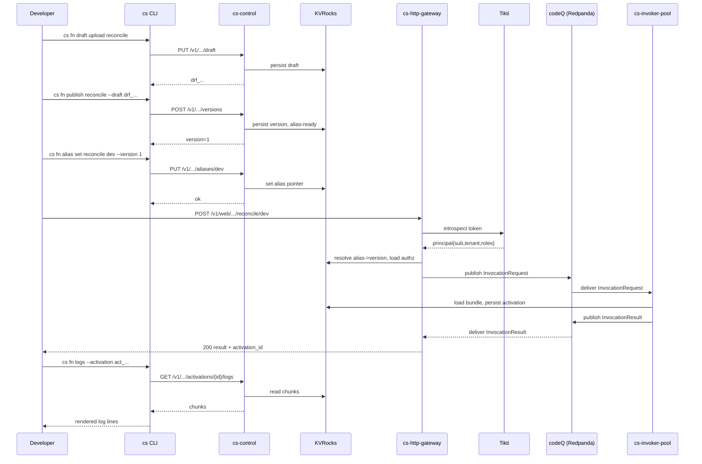

# Developers: Getting Started

In about ten minutes a developer can publish a real function to a local Sous cluster and invoke it over HTTP. This walkthrough assumes the workstation already satisfies [Developers Prerequisites](Developers-Prerequisites) — Go 1.25 or newer, Docker, and a Tikti tenant with a bearer token — and that the developer has the [Developers Using Sous](Developers-Using-Sous) mental model in mind for what an address, a draft, a version, and an alias actually mean.

The path below is the same one used by the maintainers when they smoke-test a new build. Every command is run from the repository root. Output snippets are illustrative; identifiers like draft IDs, activation IDs, and version numbers will differ each run.

## 1. Start the dependency stack

The first step is the same one described under [Developers Prerequisites](Developers-Prerequisites). KVRocks and Redpanda live in `docker-compose.yml` at the repository root; bringing them up in detached mode keeps the developer's terminal free for the four Sous daemons.

```bash
docker compose up -d
docker compose ps
```

The `ps` line should show `kvrocks` listening on `0.0.0.0:6666` and `redpanda` listening on `0.0.0.0:9092`. If either is missing, the daemons started in step 3 will fail their startup probes; resolve the docker side first.

## 2. Build the binaries

`make build` compiles every command under `cmd/` into `bin/`. The Makefile target is reproduced verbatim from `Makefile` and emits six artefacts: the four daemons (`cs-control`, `cs-http-gateway`, `cs-invoker-pool`, `cs-scheduler`), the optional Cadence poller (`cs-cadence-poller`), and the CLI binary, which the Makefile installs as `bin/cs`.

```bash
make build
ls bin
```

A fresh checkout typically completes the build in under a minute. After it succeeds, the developer copies the example config and points the daemons at the local stack:

```bash
cp config.example.yaml config.yaml
```

The example file is already wired for `localhost:6666` (KVRocks) and `localhost:9092` (Redpanda). The only field a developer typically edits before first run is `plugins.authn.tikti.introspection_url`, which must resolve to a Tikti endpoint the daemons can reach. Teams that run Tikti centrally already have a URL; teams that do not yet have Tikti should follow [IAM with Tikti](IAM-with-Tikti) before continuing.

## 3. Run the four daemons

Sous separates the control plane (`cs-control`) from the data-plane ingress (`cs-http-gateway`), the scheduler (`cs-scheduler`), and the execution fabric (`cs-invoker-pool`). Each is a standalone binary with its own port, and during local development each one runs in its own terminal so its stdout is easy to read.

In four terminal panes, run:

```bash
./bin/cs-control --config config.yaml
```

```bash
./bin/cs-http-gateway --config config.yaml
```

```bash
./bin/cs-invoker-pool --config config.yaml
```

```bash
./bin/cs-scheduler --config config.yaml
```

`cs-control` binds `:8080` and exposes the lifecycle REST API documented under [Developers REST API](Developers-REST-API). `cs-http-gateway` binds `:8081` and serves the public invoke surface defined in `cmd/cs-http-gateway/main.go`. `cs-invoker-pool` binds `:8082` for health and metrics, but its functional contract is to consume `InvocationRequest` envelopes from codeQ and publish `InvocationResult` envelopes back. `cs-scheduler` has no HTTP listener of its own; it ticks once a second by default (see `cs_scheduler.tick_ms` in `config.example.yaml`) and emits scheduled invocations through codeQ.

A developer who has no plans to exercise Cadence triggers can skip `cs-cadence-poller`. The remaining four daemons are sufficient for the HTTP and schedule paths covered below.

## 4. Authenticate the CLI

The CLI keeps its credentials in `$XDG_CONFIG_HOME/code-sous/auth.json` (the exact path is computed by `os.UserConfigDir` in `cmd/cs-cli/main.go`). A single login command writes the file:

```bash
./bin/cs auth login \
  --api-url http://localhost:8080 \
  --tenant t_dev123 \
  --token "$CS_TOKEN"
```

The `--api-url` flag points the CLI at the local `cs-control`. The `--tenant` flag must match the `tenant` field returned by Tikti introspection for the supplied token; mismatches surface as `CS_FORBIDDEN` on the first mutating call. A developer who exports `CS_TOKEN` in the shell can omit `--token` and let the CLI pick it up from the environment.

`cs auth whoami` prints the stored tenant, API URL, and a short prefix of the token, which is a quick way to confirm the CLI is reading the config it just wrote.

## 5. Scaffold a function

The CLI ships a small library of templates embedded under `internal/cli/templates/files/`. The default template `http-handler` produces a `function.js` that echoes the inbound event and a `manifest.json` whose role allowlist is wired for the role `role:app`. That is the simplest path to a working HTTP invoke.

```bash
./bin/cs fn init reconcile
ls reconcile
```

The generated directory contains `function.js`, `manifest.json`, and a `README.md`. The developer is free to replace `function.js` with the real handler before publishing.

## 6. Test the function offline

Before publishing, the developer can exercise the same `cs-js` runtime that `cs-invoker-pool` runs in-cluster. `cs fn test --path <dir>` reads `function.js` and `manifest.json` from the supplied directory, builds a canonical bundle, and invokes the runtime against an empty event by default. Passing `--event` swaps in real input.

```bash
echo '{"hello":"world"}' > reconcile/event.json
./bin/cs fn test --path reconcile --event reconcile/event.json
```

The output is the runtime's full `InvocationResult` envelope, including `status`, `result`, `logs`, and any reported errors. The exit code matches the runtime status: `0` for success, non-zero for runtime errors. This is the loop a developer iterates in while developing; no daemons are involved.

## 7. Publish a draft and promote it to a version

Once the function behaves locally, the developer uploads it as a draft and promotes the draft to a published version. The CLI splits this into two calls — `cs fn draft upload` and `cs fn publish` — because the platform treats drafts as TTL-bounded uploads and versions as immutable artifacts (see [Concepts Function Lifecycle](Concepts-Function-Lifecycle)).

```bash
./bin/cs fn draft upload reconcile --path reconcile
```

The response includes a draft identifier of the form `drf_...`. Feed that identifier into `cs fn publish` along with the limits and role allowlists the function needs:

```bash
./bin/cs fn publish reconcile \
  --draft drf_01H... \
  --timeout-ms 3000 \
  --memory-mb 64 \
  --invoke-http-roles role:app
```

The response returns the new version number. The developer then points an alias at the version so trigger configs can refer to it by a stable name:

```bash
./bin/cs fn alias set reconcile dev --version 1
```

After this point, the function is reachable through every trigger family that has a role allowlist matching the principal making the call. The HTTP path is the most direct.

## 8. Invoke the function over HTTP

`cs-http-gateway` serves `POST /v1/web/{tenant}/{namespace}/{function}/{ref}`. With the alias `dev` pointing at version 1, a developer can invoke the function with a single `curl`:

```bash
curl -sS -X POST \
  -H "Authorization: Bearer $CS_TOKEN" \
  -H "Content-Type: application/json" \
  -d @reconcile/event.json \
  http://localhost:8081/v1/web/t_dev123/default/reconcile/dev
```

The gateway responds with the function's `result` payload and a small set of activation headers (request ID, activation ID). The same call shape is documented end-to-end under [HTTP Invoke Path](HTTP-Invoke-Path).

If the response is `403 CS_FORBIDDEN`, the principal does not carry a role in `authz.invoke_http_roles[]`. If the response is `404 CS_NOT_FOUND`, the alias either does not exist or points at a version the gateway cannot resolve. If the response is `429 CS_RATE_LIMITED`, the gateway's per-tenant token bucket is empty; the relevant knobs are `cs_http_gateway.rate_limits` in `config.example.yaml`.

## 9. Read the activation record

Every invocation produces an activation record persisted by `cs-control`. The CLI exposes the record through `cs fn logs --activation <id>`, which is the canonical way to inspect the result, the logs, and any reported error in detail. The `activation_id` is returned in the HTTP invoke response and can also be tailed live with `--follow`.

```bash
./bin/cs fn logs --activation act_01H... --format pretty
```

For a function that is being exercised repeatedly, `--follow` plus a generous `--since` window streams new log chunks as they arrive:

```bash
./bin/cs fn logs --activation act_01H... --follow --since 5m
```

The activation schema, including the fields `cs-invoker-pool` records on success and on failure, is documented under [Concepts Invocations and Activations](Concepts-Invocations-and-Activations).

## End-to-end flow

The whole publish-then-invoke sequence touches every Sous component once. The diagram below shows the path a single invocation takes from the developer's curl to the activation that ends up readable through `cs fn logs`.



## What just happened, end to end

It is worth narrating what the platform did during the steps above, because the same pattern repeats for every future function.

When the developer ran `cs fn draft upload`, the CLI assembled the bundle, base64-encoded the files, and PUT them to `cs-control`. `cs-control` validated the manifest against the schema enumerated in [Schemas](Schemas), computed a canonical SHA-256 over the bundle, persisted the draft under a TTL-bounded key in KVRocks, and returned a draft identifier.

When the developer ran `cs fn publish`, `cs-control` materialised an immutable version record from the draft, attaching the timeout, memory ceiling, and role allowlists from the CLI flags. The version number was assigned monotonically. The draft itself became eligible for garbage collection because nothing else now points at it.

When the developer ran `cs fn alias set`, `cs-control` wrote a small alias record that points the name `dev` at version 1. The HTTP gateway treats this record as authoritative on every invocation.

When the developer issued the `curl`, `cs-http-gateway` parsed the bearer token, called Tikti introspection, built a principal, resolved the alias to version 1, intersected the principal's roles with `authz.invoke_http_roles[]`, and published an `InvocationRequest` to codeQ. `cs-invoker-pool` consumed that envelope, fetched the bundle by SHA-256 from KVRocks, executed it in the `cs-js` runtime, persisted the activation record, and published an `InvocationResult` envelope back. The gateway correlated the result envelope by `request_id` and returned it to the developer's `curl`.

When the developer ran `cs fn logs`, the CLI requested the activation record and its log chunks from `cs-control` and rendered them locally.

## A second pass: invoke through the CLI

The HTTP gateway is the most visible invoke surface, but the CLI exposes an equivalent path through `cs-control`. The control-plane invoke endpoint is `/v1/tenants/{tenant}/namespaces/{namespace}/functions/{name}:invoke`; the CLI command that hits it is `cs fn invoke`.

```bash
./bin/cs fn invoke reconcile@dev --event reconcile/event.json
```

The response shape is the same `InvocationResult` envelope. The principal recorded on the activation is whatever `cs auth login` stored. Compared with the HTTP path, the difference is which role allowlist is checked: `authz.invoke_http_roles[]` for the gateway, `cs:function:invoke:api` for the CLI path.

A developer who can invoke through both surfaces with the same function and observes identical activations has confirmed the platform's "single execution fabric" property: the trigger is metadata on the activation, not a code path inside the runtime.

## A third pass: schedule the function

For completeness, here is what wiring a schedule looks like once the function is published. The schedule fires on an interval and records its own trigger source on the activation:

```bash
./bin/cs schedule create reconcile_every_30s \
  --every 30 \
  --fn reconcile@dev \
  --payload reconcile/event.json
```

The schedule binding is persisted in KVRocks and consumed by `cs-scheduler`, which is already running from step 3. The next tick that matches the interval enqueues an `InvocationRequest` through codeQ.

Activations produced by the scheduler are readable through the same `cs fn logs --activation <id>` command used for HTTP invocations. The trigger source on the activation identifies the schedule by name.

The schedule lifecycle, including overlap policies and catch-up behaviour, is documented under [Scheduler](Scheduler).

## Tearing the stack down

Once the developer is done experimenting, the stack can be stopped cleanly:

```bash
# stop the daemons (Ctrl-C in each terminal)
docker compose down
```

The activations and versions persisted in KVRocks survive across `docker compose stop`/`start`. To wipe state entirely:

```bash
docker compose down -v
```

The `-v` flag removes the anonymous volumes attached to the containers. The next `docker compose up -d` starts from a clean slate.

## Troubleshooting the walkthrough

A small number of failure modes are common during the first walkthrough.

- **`cs auth login` succeeds but `cs fn draft upload` returns `CS_UNAUTHORIZED`.** The token's introspection result probably no longer maps to the tenant. Re-issue the token or call `cs auth whoami` to confirm what the CLI thinks it has stored.
- **The publish call returns `CS_VALIDATION` complaining about `manifest.json`.** The manifest schema is strict; the message identifies the offending field. The reference is in [Schemas](Schemas).
- **The `curl` returns `404 CS_NOT_FOUND`.** Either the alias does not exist or the alias points at a version that is not reachable through HTTP. Confirm the alias with a GET against `/v1/tenants/{tenant}/namespaces/{namespace}/functions/{name}/aliases/{alias}`.
- **The `curl` returns `403 CS_FORBIDDEN`.** The principal's roles do not intersect `authz.invoke_http_roles[]`. Republish with the correct `--invoke-http-roles` flag, or re-issue the token with the missing role.
- **`cs fn logs --follow` exits immediately with no output.** The activation may already be terminal; rerun without `--follow` and pass a wider `--since` window. The CLI flag set is described in [Developers CLI](Developers-CLI).

The platform's full error model, including the meaning of every `CS_*` code, lives under [Error Model](Error-Model).

## Common next steps

A developer who has reached this point has the full developer loop working: scaffold, test, publish, alias, invoke, inspect. The natural next directions are:

- Wire a schedule trigger that fires the same function on an interval — see [Scheduler](Scheduler) and `cs schedule create` in [Developers CLI](Developers-CLI).
- Wire a Cadence Activity binding — see [Cadence Integration](Cadence-Integration) and `cs cadence worker create`.
- Tighten role allowlists, set per-version capability allowlists, and rotate signing keys — see [Concepts Capabilities and Isolation](Concepts-Capabilities-and-Isolation) and [Security](Security).
- Move beyond `function.js` into the other runtimes — see [Runtime cs-js](Runtime-cs-js) for the reference contract.

The full surface of CLI subcommands lives under [Developers CLI](Developers-CLI); the REST endpoints invoked by every CLI call live under [Developers REST API](Developers-REST-API).

## Iterating on a published function

The loop a developer settles into once the platform is running tends to look like this:

1. Edit `function.js` locally.
2. Run `cs fn test --path .` to exercise the runtime offline. The runtime contract is identical to the cluster runtime, so behaviour observed locally matches behaviour observed in production.
3. Upload a fresh draft with `cs fn draft upload`.
4. Publish a new version with `cs fn publish`. The new version number is monotonic; nothing is overwritten.
5. Move the relevant alias with `cs fn alias set`. Traffic that targets the alias picks up the new version on the next invocation.
6. Invoke through the chosen trigger surface and read the resulting activation with `cs fn logs`.

The iteration is small because every step is independently reversible. A bad version can be rolled back by moving the alias; a bad draft can be ignored and replaced by another draft upload; a bad invocation produces an activation that records the failure for post-mortem.

A developer who wants to keep production traffic stable while exploring a new behaviour typically introduces a second alias (`canary`, `experimental`) and points it at the new version. The production alias only moves once the new version is proven through the secondary trigger. This is the canonical canary pattern on Sous, and it does not require any feature flagging in the function itself.
