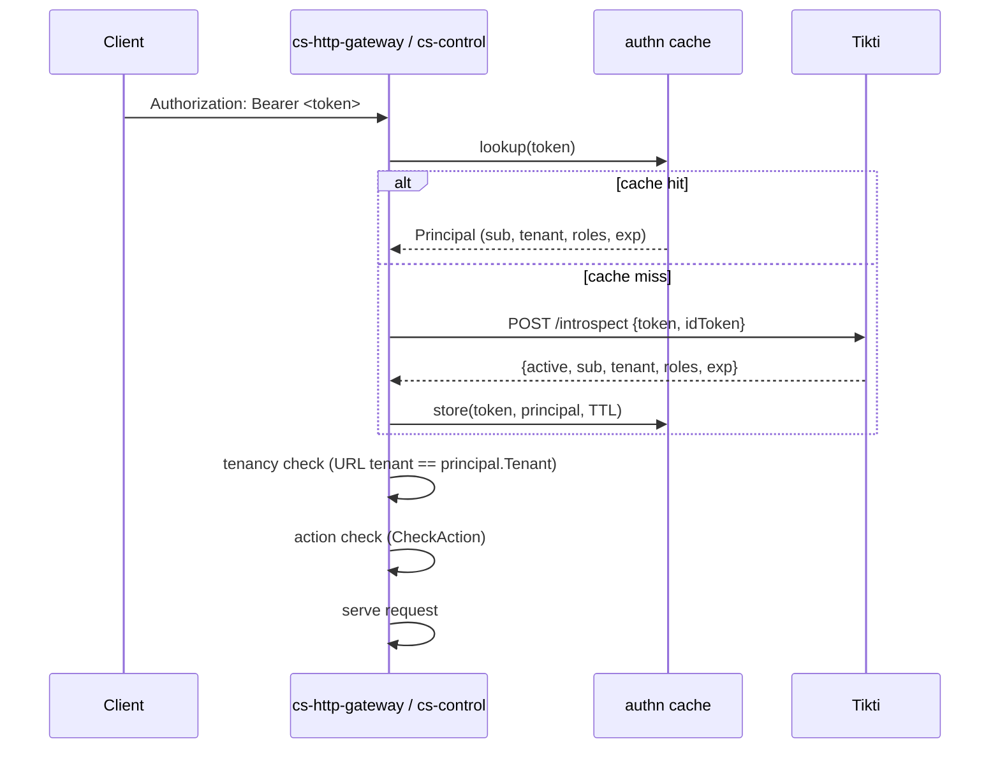

# Enabled Services: Tikti IAM

Tikti is the external identity service that issues and validates tokens for SOUS. Every SOUS API call — the control-plane REST surface, the CLI, and the synchronous HTTP invoke endpoint — must carry an `Authorization: Bearer <token>` header. The control plane (`cs-control`) and the HTTP gateway (`cs-http-gateway`) introspect the token via Tikti's introspection endpoint, receive a principal object describing the caller, and use that principal for tenancy and authorization checks. There is no anonymous path through the platform: an unauthenticated request is rejected before it ever reaches a handler.

SOUS does not own credentials, password storage, or token issuance. It delegates entirely to Tikti for the identity lifecycle: account creation, password reset, multifactor enrollment, session expiry, and rotation are all Tikti concerns. The platform treats a Bearer token as opaque and trusts only what introspection returns at the moment of the call. There is no local user table, no shared signing key, and no offline JWT verification fallback — every request must resolve against Tikti, or against the in-process cache populated by an earlier successful introspection.

The integration is wired through a plugin extension point. The `authz.Provider` interface defined in `internal/authz/authz.go` is the contract any identity driver must satisfy, and the Tikti driver in `internal/plugins/authn/tikti/tikti.go` is the only driver currently bundled. The same shape — introspect a token, return a `(sub, tenant, roles, exp)` principal — lets an operator swap Tikti for any other introspection-style IDP without touching the gateway or control plane. The rest of this page describes the introspection flow, the principal shape, the authorization model that sits on top of it, the configuration surface, and the failure modes the gateway exposes.

## Token introspection flow

On every authenticated request, the gateway and the control plane apply `authz.AuthnMiddleware` (see `internal/authz/authz.go`), which extracts the `Authorization: Bearer <token>` header and calls `Provider.Introspect(ctx, token)`. For the Tikti driver this turns into an HTTP POST to the configured `introspection_url` with a JSON body of the form `{"token":"<token>","idToken":"<token>"}` and a `Content-Type: application/json` header. A successful response carries the principal claims. A non-200 response is normalized to `CS_AUTHN_INVALID_TOKEN`; a 401 in particular is the canonical "Tikti rejected the token" outcome.

To avoid a Tikti round-trip on every call, the driver caches the introspection result in memory. The cache key is the raw token string and the cache value is the resulting `authz.Principal`. The TTL comes from `plugins.authn.tikti.cache_ttl_seconds` in `config.example.yaml`; the default is `60` seconds and the driver applies that default when the configured value is zero or negative (see `NewFromConfig` in `internal/plugins/authn/tikti/tikti.go`). Cached entries expire on read once `time.Now()` passes the entry's `expiresAt`; there is no background sweeper, so a cold token never re-introspects until a request arrives.

The cache is per-process and per-replica. Operators who deploy multiple gateway or control-plane replicas behind a load balancer should expect each replica to maintain its own cache. The cache is also write-through only for successful introspections — invalid, expired, or inactive tokens are never cached, so a revoked token will be rejected as soon as the previous cache entry's TTL elapses. The cache is unbounded in entry count; in practice the bound is the working set of distinct active tokens, which scales with the number of concurrent users rather than with the request rate.



The HTTP client used for introspection has a fixed five-second timeout (`http.Client{Timeout: 5 * time.Second}` in `NewFromConfig`). A Tikti instance that is consistently slower than five seconds will surface as `CS_AUTHN_INVALID_TOKEN` to the caller. Operators tuning this for a high-latency Tikti deployment should bias the cache TTL upward rather than the client timeout; longer TTLs reduce introspection volume and shorten the tail.

A canonical native-contract introspection exchange looks like this. The gateway sends:

```http
POST /introspect HTTP/1.1
Host: tikti.example.com
Content-Type: application/json

{"token":"eyJhbGciOi...","idToken":"eyJhbGciOi..."}
```

Tikti replies:

```json
{
  "active": true,
  "sub": "user:42",
  "tenant": "t_abc123",
  "roles": ["cs:function:read", "action:cs:function:invoke:http"],
  "exp": 1735689600
}
```

The driver normalises this directly into the `authz.Principal` struct and stores it under the token key. A `200 OK` with `active: false`, a `401 Unauthorized`, or any other status all collapse onto the single `CS_AUTHN_INVALID_TOKEN` outcome from the caller's perspective.

## Principal extraction

Tikti returns at minimum the four fields that SOUS reasons about: `sub` (the subject identifier, unique per user or service principal), `tenant` (the tenant identifier the principal belongs to), `roles` (an array of role strings), and `exp` (the token's expiry as a Unix timestamp). The driver normalizes these into the `authz.Principal` struct declared in `internal/authz/authz.go`:

```go
type Principal struct {
    Sub    string   `json:"sub"`
    Tenant string   `json:"tenant"`
    Roles  []string `json:"roles"`
    Exp    int64    `json:"exp"`
}
```

The driver accepts two response shapes. A native introspection contract — `{"active": true, "sub": "...", "tenant": "...", "roles": [...], "exp": ...}` — is the canonical form and is detected by the presence of the `active` field. A Tikti `users[]` lookup contract is also supported for the legacy admin lookup endpoint and is mapped onto the same struct (see `parseIntrospectionResponse` in `internal/plugins/authn/tikti/tikti.go`). When the lookup contract returns a single user, its `localId` becomes `Sub`, `tenantId` becomes `Tenant`, and `role` is expanded into a one- or two-element role list — for example `"ADMIN"` is normalized into `["admin"]` so the control plane's `admin` short-circuit fires correctly.

When the introspection payload omits a field, the driver falls back to claims parsed directly from the token body. The JWT payload (the middle base64url segment) is decoded with padding compensation and inspected for `sub`/`email`, `tid`/`tenantId`, and `exp`. This fallback is what makes the lookup contract usable: that endpoint returns user metadata but never an `exp`, so the driver pulls the expiry from the token itself. An inactive response (`active: false`, or a non-`ACTIVE` user status in the lookup shape) is rejected as `CS_AUTHN_INVALID_TOKEN`; an expired token (when `Principal.Exp > 0` and already past) is rejected as `CS_AUTHN_EXPIRED_TOKEN`.

Once the principal is in hand the middleware attaches it to the request context with `authz.WithPrincipal`. Downstream handlers retrieve it with `authz.PrincipalFromContext`. Tenancy enforcement happens immediately in the request handler: the URL path tenant (e.g., `/v1/web/{tenant}/{namespace}/{function}/{ref}`) is compared against `principal.Tenant`, and any mismatch returns `CS_AUTHZ_RESOURCE_MISMATCH` (HTTP 403). See `s.authorize` in `cmd/cs-control/main.go` for the control-plane comparison and the invoke handler in `cmd/cs-http-gateway/main.go` for the gateway version. The comparison is intentionally strict equality — there are no parent-tenant or hierarchical-tenant semantics.

A principal that arrives with an empty `Tenant` (for example a service-principal token that is not scoped to one tenant) is allowed to address any tenant. This is the escape hatch used by the internal service identities `sp:cs-http-gateway`, `sp:cs-scheduler`, and `sp:cs-cadence-poller`, each of which publishes invocations on behalf of many tenants from a single Tikti credential.

## Authorization model

SOUS does not maintain its own role hierarchy. Roles are issued by Tikti and carried verbatim in the token. The authorization model has two layers built on top of those roles, both implemented in `internal/authz/authz.go`.

The first layer is the per-action check in `CheckAction(principal, action)`. A role of `admin` (or the legacy form `role:admin`) implicitly grants every action; any other role grants an action only when the role string equals the action string or the role string is `"action:" + action`. There are no wildcards and no inheritance — a caller with `cs:function:read` cannot create a function. The control plane invokes this check through `s.authorize(w, r, "<action>")` at the top of every mutating and read handler.

The second layer is the per-version `roles` allowlist enforced at invoke time. Each published version's `Config.Authz.InvokeHTTPRoles` (and the `InvokeScheduleRoles` / `InvokeCadenceRoles` siblings) declares the explicit set of roles allowed to invoke that version through that trigger. The gateway runs `authz.RequireRoleIntersection(meta.Config.Authz.InvokeHTTPRoles, principal)` after loading the version metadata; if the principal's roles and the allowlist share no element the invoke is denied with `CS_AUTHZ_ROLE_MISSING`. An empty allowlist always denies — there are no implicit grants, and a publisher who forgets to set the allowlist effectively quarantines the version.

This dual model means a caller needs both the right control-plane action (for example `cs:function:invoke:http`) to enter the gateway path and a role that intersects the version's allowlist to actually run the function. Publishing a version with no allowlist is the supported way to ship a draft that is wired up but not yet exposed to traffic; flipping the alias still requires `cs:function:alias:set`. Conversely, removing a role from the allowlist on a published version is the supported way to revoke access without rebuilding the bundle.

The `admin` short-circuit deserves a separate note. A token that carries the bare role `admin` (or `role:admin`) passes every `CheckAction` call regardless of the action string. This is appropriate for break-glass operator tokens and for the `sp:` service principals, but it bypasses the action matrix entirely; it does not grant access to the version-level allowlist, which is still consulted on invoke. Operators should treat `admin` as the cluster-wide superuser role and issue it sparingly.

## Resource x action matrix

The action strings the platform checks are stable and grep-able. They are passed as the third argument to `s.authorize` in `cmd/cs-control/`. The current matrix:

| Resource             | Action string                  | Handler                                          |
| -------------------- | ------------------------------ | ------------------------------------------------ |
| Function (create)    | `cs:function:create`           | `POST /v1/functions/{tenant}/{namespace}`        |
| Function (read)      | `cs:function:read`             | `GET /v1/functions/...`, list, SBOM              |
| Function (delete)    | `cs:function:delete`           | `DELETE /v1/functions/...`                       |
| Draft upload         | `cs:function:draft:upload`     | `POST /v1/functions/.../draft`                   |
| Publish              | `cs:function:publish`          | `POST /v1/functions/.../publish`                 |
| Alias set            | `cs:function:alias:set`        | `POST /v1/functions/.../aliases/{alias}`         |
| Invoke (API)         | `cs:function:invoke:api`       | `cs-control` synchronous invoke                  |
| Invoke (HTTP)        | `cs:function:invoke:http`      | `cs-http-gateway` web endpoint                   |
| Activation read      | `cs:activation:read`           | activation status, decision-tree, log tail       |
| Subscription create  | `cs:subscription:create`       | codeQ subscription bindings                      |
| Subscription read    | `cs:subscription:read`         | subscription list / get                          |
| Subscription delete  | `cs:subscription:delete`       | subscription delete                              |
| Schedule create      | `cs:schedule:create`           | scheduler bindings                               |
| Schedule delete      | `cs:schedule:delete`           | scheduler bindings                               |
| Cadence worker write | `cs:cadence:worker:create`     | Cadence WorkerBinding create                     |
| Cadence worker drop  | `cs:cadence:worker:delete`     | Cadence WorkerBinding delete                     |
| Audit                | `cs:audit:read`                | control-plane audit tail                         |
| Egress policy read   | `cs:egress:policy:read`        | tenant egress policy GET                         |
| Egress policy write  | `cs:egress:policy:write`       | tenant egress policy PUT                         |

The function CRUD writes (`create`, `delete`, `draft:upload`, `publish`) are distinct actions rather than a single `function:write` to let operators issue narrower roles — a CI service account that only publishes pre-uploaded drafts can hold `cs:function:publish` without `cs:function:delete`. Reads are always `cs:function:read`. Alias updates use `cs:function:alias:set` and are intentionally separate from publish so a release manager can promote a tested version without holding publish rights.

A role string in Tikti may be either the action verbatim (`cs:function:read`) or the action with an `action:` prefix (`action:cs:function:read`); both forms satisfy `CheckAction`. The prefix form is convenient when a Tikti deployment also issues non-action roles in the same namespace — the `action:` segment disambiguates the two. The CLI `cs publish` accepts both forms in its `--invoke-http-roles` flag and dedupes them on submission (see `cmd/cs-cli/main_test.go` for the canonical test cases).

A worked example: suppose a Tikti deployment issues three roles to a CI bot — `cs:function:draft:upload`, `cs:function:publish`, and `role:reports:nightly`. The bot can upload a draft and publish a version, but it cannot delete a function (no `cs:function:delete`) and it cannot set an alias (no `cs:function:alias:set`). When a new version with `Authz.InvokeHTTPRoles = ["role:reports:nightly"]` is published, the same bot also satisfies the invoke allowlist on that version. A second bot that holds only `cs:function:read` can list and describe functions, but its invoke attempts fail at the gateway with `CS_AUTHZ_DENIED` even before the per-version allowlist is consulted.

## Configuration

The driver is selected via `plugins.authn.driver`. The Tikti-specific block lives under `plugins.authn.tikti`. The current shape from `config.example.yaml`:

```yaml
plugins:
  authn:
    driver: tikti
    tikti:
      introspection_url: http://localhost:8099/introspect
      cache_ttl_seconds: 60
      api_key: ""
```

The fields:

- `introspection_url` — required. The Tikti introspection endpoint that accepts `POST {"token": "..."}` and returns the principal payload. The driver fails fast at startup if this value is empty (see `Config.Validate` in `internal/config/config.go`).
- `cache_ttl_seconds` — optional. The time-to-live for cached principal entries. Default `60` when zero or negative. Setting this to a very large value reduces Tikti load but lengthens the window in which a revoked token remains valid; setting it to zero in the YAML keeps the default rather than disabling the cache.
- `api_key` — optional. When non-empty the driver appends `?key=<api_key>` to the introspection URL. Use this when the Tikti introspection endpoint itself is protected by an API key (typical for the Google-Identity-Toolkit-style lookup endpoint). The value is also overridable via the `CS_TIKTI_API_KEY` environment variable so the secret can stay out of YAML.

A legacy top-level `tikti:` block is still honoured for backward compatibility and is copied into `plugins.authn.tikti` at config load (see the back-fill logic in `internal/config/config.go`). New configurations should write only under `plugins.authn`. The `CS_TIKTI_INTROSPECTION_URL` and `CS_TIKTI_CACHE_TTL_SECONDS` environment variables similarly override both code paths. See [Config Reference](Config-Reference) for the full validation rules and the precedence order between YAML and environment.

The config validator rejects any unknown driver value with `unsupported authn plugin driver: <name>`. The only registered driver in the codebase is `tikti`, so a typo in `plugins.authn.driver` fails the process at startup rather than at first request.

## Plugin interface

The Tikti driver implements the `authz.Provider` interface from `internal/authz/authz.go`:

```go
type Provider interface {
    Name() string
    Introspect(ctx context.Context, token string) (Principal, error)
}
```

The contract is small on purpose. `Name()` returns the driver's registry key (the Tikti driver returns `"tikti"`). `Introspect` accepts a bearer token, returns a `Principal`, and is expected to return a `cserrors.Error` with one of `CS_AUTHN_MISSING_TOKEN`, `CS_AUTHN_INVALID_TOKEN`, or `CS_AUTHN_EXPIRED_TOKEN` on failure so the gateway can map the error to the correct HTTP status. The context carries the request deadline; a well-behaved driver passes it through to any outbound HTTP call so a slow IDP does not pin a request goroutine past the gateway's timeout budget.

A driver registers itself in its package `init()`:

```go
func init() {
    registry.RegisterAuthN("tikti", NewFromConfig)
}
```

The registry (see `internal/plugins/registry/registry.go`) holds a `name -> AuthNFactory` map. At startup `cs-http-gateway` and `cs-control` call `registry.NewAuthN(cfg)`, which resolves the factory for `cfg.Plugins.AuthN.Driver`. A custom driver — for example one that validates JWTs against a JWKS endpoint without an introspection round-trip — is wired by importing its package (so its `init` runs) and pointing `plugins.authn.driver` at its registered name. The gateway code does not depend on the Tikti package directly, so a fork that wants to delete the Tikti driver entirely can do so without touching either binary.

A driver is free to implement its own caching strategy, its own retry budget, and its own internal observability. The middleware treats the provider as a single black box: it calls `Introspect` and either receives a principal or surfaces the returned error to the caller. The only externally observable contract is the error code on failure and the principal shape on success.

The shape of a custom driver looks like this:

```go
package mydriver

import (
    "context"

    "github.com/osvaldoandrade/sous/internal/authz"
    "github.com/osvaldoandrade/sous/internal/config"
    "github.com/osvaldoandrade/sous/internal/plugins/registry"
)

func init() {
    registry.RegisterAuthN("mydriver", New)
}

func New(cfg config.Config) (authz.Provider, error) {
    return &Provider{ /* read cfg.Plugins.AuthN.* */ }, nil
}

type Provider struct{ /* ... */ }

func (p *Provider) Name() string { return "mydriver" }

func (p *Provider) Introspect(ctx context.Context, token string) (authz.Principal, error) {
    // resolve token to (sub, tenant, roles, exp); wrap failures with cserrors.
    return authz.Principal{}, nil
}
```

The factory must be deterministic with respect to the supplied `config.Config` so a process restart with the same YAML yields the same provider. State that must outlive a single request (caches, connection pools) lives on the `Provider` struct itself.

## Dev mode

The repository ships no dev-only or "skip auth" driver. The only authn driver registered in the codebase today is `tikti` (search `internal/plugins/authn/`), and the config validator rejects any other value at startup. Local development is expected to run against a Tikti instance — `config.example.yaml` points at `http://localhost:8099/introspect` and the test suite stands up a fake introspection server in process (see `internal/plugins/authn/tikti/tikti_test.go`). A local developer who does not have a real Tikti instance available typically runs the same in-process fake from a sidecar or replays a recorded introspection response from a small static HTTP server.

If a future fork adds a permissive driver — for example a `dev` driver that returns a hard-coded admin principal — it must never be enabled in production. The driver name appears in startup logs and in the control-plane audit stream, so operators can verify the active driver during a launch review. Treat any non-`tikti` driver in a production config as a misconfiguration and a launch blocker. The [Security Checklist](Security-Checklist) calls this out as a hard pre-launch gate.

## Failure modes

Every failure in the authn path maps to a stable `CS_*` error code. The gateway's HTTP status mapping is fixed in `internal/errors/errors.go` and is the same shape used by the rest of the platform. Cross-reference each code in [Error Model](Error-Model).

| Scenario              | Code                          | HTTP | Notes                                                  |
| --------------------- | ----------------------------- | ---- | ------------------------------------------------------ |
| No Authorization      | `CS_AUTHN_MISSING_TOKEN`      | 401  | Header absent or not `Bearer ...`                      |
| Tikti unreachable     | `CS_AUTHN_INVALID_TOKEN`      | 401  | Wrap of the transport error; client should retry       |
| Tikti returns 401     | `CS_AUTHN_INVALID_TOKEN`      | 401  | Tikti rejected the token                               |
| Tikti returns other   | `CS_AUTHN_INVALID_TOKEN`      | 401  | Unexpected status carried in the error message         |
| Token marked inactive | `CS_AUTHN_INVALID_TOKEN`      | 401  | `active:false` or non-ACTIVE user status               |
| Token expired         | `CS_AUTHN_EXPIRED_TOKEN`      | 401  | Principal `exp` is in the past                         |
| Tenant mismatch       | `CS_AUTHZ_RESOURCE_MISMATCH`  | 403  | URL tenant differs from principal tenant               |
| Action denied         | `CS_AUTHZ_DENIED`             | 403  | Principal roles do not satisfy the required action     |
| Allowlist intersect   | `CS_AUTHZ_ROLE_MISSING`       | 403  | Version `roles` allowlist and principal roles disjoint |

A note on Tikti outages: today an unreachable Tikti results in a 401 to the caller rather than a 503, because the gateway cannot distinguish "transport failure" from "invalid token" without leaking timing details. Operators should monitor Tikti reachability through the Tikti side-car health probes and through the gateway's own request-error rate as described in [Observability](Observability). A spike in `CS_AUTHN_INVALID_TOKEN` that correlates with a Tikti dependency alert is the canonical "Tikti is down" signal.

The cache softens transient Tikti unavailability. A previously-introspected token continues to pass `Introspect` for the remainder of its cached TTL even while Tikti is unreachable, because the cache lookup happens before the HTTP call. This means a short Tikti outage that lasts less than `cache_ttl_seconds` is largely invisible to existing sessions; only first-time-in-the-window tokens see the failure. Operators planning a Tikti maintenance window can stretch this protective effect by temporarily raising the cache TTL across the gateway fleet before the window starts.

## Token lifecycle

SOUS itself does not manage token lifecycle. Tikti is the sole authority for issuance, expiry, refresh, and revocation. The platform observes the `exp` claim on each introspection result and refuses tokens past their expiry, but it never extends a token, refreshes it, or stores long-lived credentials on the caller's behalf. The CLI and SDKs are responsible for keeping a fresh access token; when a token expires the user re-authenticates against Tikti directly.

Service-account tokens used by internal components (the gateway, the scheduler, the Cadence poller) are issued through the same Tikti workflow as human-user tokens. Each component holds a Tikti service principal — for example `sp:cs-http-gateway`, `sp:cs-scheduler`, `sp:cs-cadence-poller` — scoped to the narrow set of actions it needs (publish `InvocationRequest`, read function versions, write activation records). Operators rotate these tokens by issuing a new credential in Tikti, updating the component's secret material via the standard secrets workflow described in [Security](Security), and restarting the component to pick up the new value. The platform does not perform the rotation itself.

Token revocation is propagated through Tikti's introspection result. A revoked token will return `active:false` on the next introspection, which the driver turns into `CS_AUTHN_INVALID_TOKEN`. Because of the in-process cache, a revoked token may still be accepted for up to `cache_ttl_seconds` after revocation. Operators who need shorter propagation tighten `cache_ttl_seconds` at the cost of more Tikti round-trips per request. An emergency revocation that cannot wait for the cache TTL — for example a leaked admin credential — is performed by rolling the gateway and control-plane replicas, which empties their in-memory caches.

See [Security](Security) for the broader threat model and [Security Checklist](Security-Checklist) for the launch-readiness items that apply to Tikti integration. The [Architecture](Architecture) page locates Tikti in the end-to-end request flow, and [Observability](Observability) lists the authn-related metrics and audit events to watch in production.

## Internal service principals

Three components inside the platform talk to the data plane on behalf of users rather than as the user, and each holds its own Tikti service principal. The principals are named with the `sp:` prefix by convention to make them grep-able in audit output and to distinguish them from human-user subjects.

`sp:cs-http-gateway` is the principal the gateway uses when it publishes an `InvocationRequest` onto the codeQ `cs.invoke` topic after authenticating a user-facing request. The principal it forwards on the invocation envelope is the user's principal — `principal.Sub` and `principal.Roles` are stamped into the envelope so the invoker and downstream consumers see the caller's identity — but the publish itself is signed with the gateway's own token. This separation lets operators revoke the gateway's right to publish without disturbing the user identity layer.

`sp:cs-scheduler` is the principal used by the scheduler component when it emits invocations from a scheduled trigger. The trigger record carries the publisher's identity at the time the schedule was created; the scheduler stamps that identity onto each tick's envelope. This means a schedule continues to run under the publisher's roles even after the publisher's interactive session has expired, which is the intended semantic for cron-style triggers.

`sp:cs-cadence-poller` is the principal used by the Cadence poller when it long-polls Cadence and pushes activity tasks onto `cs.invoke`. As with the scheduler, the trigger record carries the binding owner's identity, and the poller stamps it onto each invocation envelope.

All three service principals hold the `admin` short-circuit role in standard deployments because they need to publish on behalf of arbitrary tenants. Operators who prefer narrower scope can replace the `admin` grant with the specific publish-side actions documented in the resource matrix above, at the cost of having to update the principal's role list whenever a new trigger type is introduced.

## Token shape and claims

SOUS does not impose a specific token format. The Tikti driver works with any token whose introspection response satisfies the schema described in the principal-extraction section above, and it works regardless of whether the token itself is a JWT, an opaque reference, or something else. The driver does optimistically attempt to base64-decode the second segment of the token as a JWT payload to recover `sub`, `tid`, and `exp` claims; this fallback path runs only when the introspection response omits the corresponding fields, and it silently no-ops if the token is not a JWT.

When the token is a JWT, the driver applies these fallbacks in order. `Principal.Sub` is taken from the introspection response if present; otherwise from the token's `sub` claim; otherwise from the token's `email` claim. `Principal.Tenant` is taken from the introspection response; otherwise from `tid`; otherwise from `tenantId`. `Principal.Exp` is taken from the introspection response; otherwise from `exp` on the token. The introspection response is always preferred — the JWT fallback exists to support the lookup contract, not to bypass Tikti.

The platform does not verify the JWT signature on the token. Token validity is established exclusively by the introspection round-trip; a forged or tampered token will be rejected by Tikti and surface as `CS_AUTHN_INVALID_TOKEN`. This design choice keeps the gateway free of signing material and removes the JWKS-rotation problem from the SOUS side of the integration. The trade-off is that every cold token costs one Tikti round-trip; the cache amortises this for warm tokens.

## Audit linkage

Every successful authorization decision on a mutating handler emits an audit event through the audit recorder configured in `plugins.audit` (see `auditAfterCommit` in `cmd/cs-control/main.go`). The event carries the principal's `Sub`, the resolved tenant, the action string, and an outcome of `success` or `denied`. A failed authorization decision — `CS_AUTHZ_DENIED`, `CS_AUTHZ_RESOURCE_MISMATCH`, `CS_AUTHZ_ROLE_MISSING` — does not commit any state change, but the gateway still records the rejection in its request log with the request ID so the audit consumer can correlate.

Operators investigating a "who deleted this function" question follow the same loop: look up the function name in the audit stream, find the `cs:function:delete` event, and the `principal.sub` on the event is the Tikti subject ID that issued the delete. From there, Tikti's own audit log resolves the subject to a human user or service principal. The two systems compose: SOUS records what was done and to whom; Tikti records who the doer was.

## Operator playbook

A small set of recurring operator tasks intersect with the Tikti integration.

Rotating a service-principal token. Provision a new credential for the service principal in Tikti, write it to the secret store the component reads from, and roll the component's pods. The gateway reads its outbound credentials from the same secret-provider path described in [Security](Security); the rollout drops the in-memory cache as a side effect so the new credential takes effect immediately.

Tightening the cache TTL ahead of a known revocation event. Update `plugins.authn.tikti.cache_ttl_seconds` in the deployed config to a smaller value and apply the rollout. The smaller TTL takes effect on every replica that is restarted with the new config; replicas still running the old config keep the longer TTL until they rotate. Plan the operator window to overlap the longest stale TTL on any replica.

Investigating a 401 storm. The first signal is usually a spike in `CS_AUTHN_INVALID_TOKEN` from the gateway. Distinguish between "Tikti is down" and "client tokens are bad" by tailing the audit stream for the affected tenants and by probing the Tikti introspection endpoint directly from a gateway host. If the direct probe fails, page the Tikti team. If the direct probe succeeds, sample a failing token from the audit stream and re-introspect it manually; a single bad client typically explains the spike.

Onboarding a new tenant. Tenant onboarding is a Tikti operation: a new tenant identifier and a seed administrator role are created in Tikti, and the operator then issues the platform-side resources (egress policy, namespace conventions) through the control plane using that administrator's token. SOUS does not provision the tenant in Tikti — the dependency is one-way.

Decommissioning a tenant. Remove the tenant from Tikti's directory so no new tokens can be issued, then run a one-shot delete sweep against the control plane using a `admin` token to clean up functions, schedules, and Cadence worker bindings under the tenant. Existing in-flight activations finish under their pre-existing principal cache entries; nothing new can enter the system once Tikti stops issuing tokens for that tenant.

## Testing the integration

The test suite in `internal/plugins/authn/tikti/tikti_test.go` is the canonical reference for how the driver behaves against a real-shaped Tikti response. The tests stand up an in-process `httptest.Server`, point the driver at it, and assert each of the supported response shapes — the native `active`-keyed contract, the `users[]` lookup contract, the `?key=<api_key>` query enrichment, and the JWT-claim fallback for `sub`, `tid`, and `exp`. Operators introducing a new IDP that speaks an HTTP introspection shape should mirror this pattern: write a `httptest.Server` that returns the IDP's exact response payload, register the new driver, and assert that the resulting principal matches the expected shape.

The control-plane test suite in `cmd/cs-control/main_test.go` is the companion reference for the authorization layer: it constructs `authz.Principal` values directly with `principalWith(tenant, roles...)`, attaches them to test requests via `WithPrincipal`, and asserts that `s.authorize` returns the expected `(principal, tenant, namespace, name, ok)` tuple for each handler. The same pattern applies to any new control-plane handler that needs an action check.

End-to-end tests in `test/` use a real (or fake) Tikti instance and exercise the full chain — Bearer header in, principal extraction, action check, version-level allowlist intersection, and successful invocation. These tests are the safety net for cross-cutting changes to the authorization model; touching `CheckAction` or `RequireRoleIntersection` is expected to leave them passing without modification, and a failure there is almost always a regression in the authorization contract rather than a test-data problem.

## Summary

Tikti is the SOUS identity boundary. The platform delegates issuance and validation to Tikti, caches the resulting principal for a short window to amortise introspection cost, enforces tenancy strictly against the URL path, evaluates a small set of stable action strings on the control-plane surface, and applies a per-version role allowlist on each invoke. Every failure on the authn path maps to a `CS_AUTHN_*` or `CS_AUTHZ_*` code that the gateway turns into a 401 or 403, and every successful mutation appears in the control-plane audit stream with the principal's subject ID. The contract is small enough to swap Tikti for any compatible IDP via the `authz.Provider` interface, and tight enough that no request reaches a handler without an explicit grant.

The contract is also stable on purpose. Adding a new control-plane action means choosing a new action string and threading it through one `s.authorize` call; the rest of the integration — token shape, cache, tenancy check, error mapping — does not change. Operators who treat the Tikti integration as a black box can do so safely: the seams between the two systems are narrow and the failure modes are exhaustive.

For a deeper walk-through of how a single request flows from the client through the gateway, into codeQ, and back, see [HTTP Invoke Path](HTTP-Invoke-Path). For the audit and metrics surface that surrounds these checks at runtime, see [Observability](Observability) and [ledgerDB Audit](ledgerDB-Audit).
