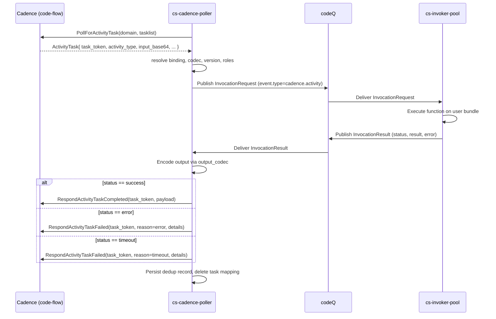

# Event Sources: Cadence Activities

`cs-cadence-poller` is the bridge between Sous and a Cadence cluster (`code-flow`). It long-polls Cadence for ActivityTasks, maps each task into an `InvocationRequest` published on codeQ, awaits the matching `InvocationResult`, and responds to Cadence with `RespondActivityTaskCompleted` or `RespondActivityTaskFailed`. The poller is the only Sous service that initiates network connections to Cadence; the invokers themselves remain Cadence-agnostic, see only a generic invocation, and never speak Cadence's wire protocol.

This split lets a tenant define long-running, retried, multi-step business workflows in Cadence while keeping the actual unit-of-work code in plain Sous functions. The Cadence cluster owns durability, retries, timer scheduling, and the workflow event history; Sous owns the runtime sandbox, capability enforcement, audit, and observability of each activity body. Activity authors write the same `function(event, ctx)` shape they would for an HTTP trigger or a schedule tick — the only marker that the event came from Cadence is `event.type === "cadence.activity"` and the `event.cadence` correlation block.

The poller is a single binary defined at `cmd/cs-cadence-poller/main.go`. It loads `WorkerBinding` records from the persistence layer, spawns poll-loop goroutines per binding, and runs HTTP endpoints for `/healthz`, `/readyz`, and `/metrics` on port 8084. Activity results flow back through `cs.results` on codeQ — the poller consumes them on a dedicated subscriber group, looks up the in-memory `activation_id → taskToken` mapping, and ships the response over the Cadence HTTP client at `internal/cadence/client.go`. The pages that follow walk through the binding model, lifecycle, polling mechanics, payload mapping, response handling, heartbeats, codecs, error scenarios, observability, and a complete worked example.

## WorkerBinding model

A WorkerBinding is the registration record that says "this tenant operates a Cadence worker for `domain=X, tasklist=Y, activity_type=Z`, and each task should be routed to Sous function `tenant/namespace/function/alias`." Bindings are created and deleted via the control-plane endpoints registered in `cmd/cs-control/main.go`:

```
POST   /v1/tenants/{tenant}/namespaces/{namespace}/cadence/workers
DELETE /v1/tenants/{tenant}/namespaces/{namespace}/cadence/workers/{name}
```

The request body (`api.CreateWorkerBindingRequest` in `internal/api/types.go`) carries the following fields:

| Field | Required | Description |
|-------|----------|-------------|
| `name` | yes | Tenant-unique binding name (3–64 chars). Together with tenant and namespace it forms the binding key `tenant:namespace:name`. |
| `domain` | yes | Cadence domain. The poller passes it verbatim to `PollForActivityTask`. Length-bounded at 128 chars by `validateWorkerBindingRequest`. |
| `tasklist` | yes | Cadence tasklist. One binding addresses one tasklist; a tenant that operates several tasklists creates several bindings. |
| `worker_id` | yes | Stable identity the poller reports to Cadence. Used by Cadence for sticky scheduling and operator dashboards. |
| `activity_map` | yes | Map from Cadence ActivityType (string) to a `WorkerBindingRef` (`function`, `alias`, optional pinned `version`). At least one entry is required. |
| `pollers.activity` | no | Number of poll-loop goroutines to spawn per binding. Defaults to 1, capped at 256. |
| `limits.max_inflight_tasks` | no | Per-binding semaphore that caps concurrent in-flight activities. Defaults to `cs_cadence_poller.limits.max_inflight_tasks_default`. |
| `input_codec` | no | Codec used to decode the activity input bytes. Defaults to `json`. See [Codecs (E8.02)](#codecs-e802). |
| `output_codec` | no | Codec used to encode the activity output bytes. Defaults to `json`. See [Codecs (E8.02)](#codecs-e802). |

The control-plane handler `createWorkerBinding` (at `cmd/cs-control/main.go:880`) authorises the caller with action `cs:cadence:worker:create`, validates the payload via `validateWorkerBindingRequest`, fills server-owned fields (`tenant`, `namespace`, `enabled`), persists the record through `store.PutWorkerBinding`, and emits an audit event of kind `cadence.worker.create`. Deletes flow through `deleteWorkerBinding` at the same file and emit `cadence.worker.delete`. Both handlers require Tikti-issued credentials; without the corresponding action the call returns `403 CS_FORBIDDEN`.

The `validateWorkerBindingRequest` function (at `cmd/cs-control/main.go:1017`) is the single point of binding-shape enforcement. It rejects:

- Names outside `[3, 64]` characters with `invalid worker binding name`.
- Empty or oversize `domain`, `tasklist`, `worker_id` (> 128 chars).
- Empty `activity_map` with `activity_map is required`.
- Activity-map entries whose key is blank, whose `function` is blank or over 64 chars, whose alias fails `api.ValidateAlias`, or whose `version` is negative.
- `pollers.activity` outside `[0, 256]`.
- `limits.max_inflight_tasks` outside `[0, 100000]`.

A complete binding payload looks like this:

```json
{
  "name": "payments-activities",
  "domain": "payments",
  "tasklist": "payments-activities",
  "worker_id": "cs-payments-01",
  "pollers": { "activity": 8 },
  "limits": { "max_inflight_tasks": 256 },
  "activity_map": {
    "SousInvokeActivity": { "function": "reconcile", "alias": "prod" },
    "SousSettleActivity": { "function": "settle",   "alias": "prod" }
  },
  "input_codec":  "msgpack",
  "output_codec": "msgpack"
}
```

The optional `kind` field (set to `"workflow"`) flips the binding from the activity surface documented here to the DecisionTask surface documented in [Event-Sources-Cadence-Workflows](Event-Sources-Cadence-Workflows). The default value (empty string) is treated as `"activity"` for backward compatibility, so any binding created before the workflow surface landed continues to behave the same way. The two surfaces share the same record type, the same control-plane endpoints, and the same codec registry — only the poll-loop function is different.

### Authorization on the binding itself

Creating a binding is authorised at the control plane via `cs:cadence:worker:create`. Polling the resulting tasklist is authorised separately at the invocation surface: the poller's own service principal (`sp:cs-cadence-poller`, with roles `role:cadence` and `sp:cs-cadence-poller`) must intersect with the target function version's `authz.invoke_cadence_roles`. The two checks compose so that a tenant who can register a binding cannot trivially route Cadence traffic into a function whose author did not opt in to Cadence triggers. The role check happens inline in `pollLoop` at `cmd/cs-cadence-poller/main.go:240` via `api.IntersectsRoles`, before any `InvocationRequest` is published.

## Lifecycle

A binding moves through three operator-driven states: created, updated, deleted. The poller observes the persistence layer and reconciles its in-memory goroutine pool to match.

1. **Register**. An operator `POST`s a binding to `cs-control`. The record is persisted with `enabled: true`. Within `refresh_seconds` (default 5, configured under `cs_cadence_poller.refresh_seconds` in `internal/config/config.go`) the poller's reconciler — `refreshLoop` at `cmd/cs-cadence-poller/main.go:133` — notices the new key, opens a context, allocates a semaphore sized to `limits.max_inflight_tasks`, and spawns `pollers.activity` goroutines that begin long-polling Cadence. The reconciler holds the poller-wide mutex during the diff to keep the desired and actual sets consistent.
2. **Update**. Edits to an existing binding (codec change, concurrency change, activity-map change) are durably persisted and picked up on the next refresh tick. The reconciler currently does not detect field-level diffs — a binding still in the desired set is left running, and an operator who needs to apply a change must either delete-and-recreate, or rely on the rolling restart implicit in scaling the poller deployment. In-flight tasks already published to codeQ are unaffected because they are tracked by `activation_id`, not by the goroutine that produced them.
3. **Delete**. A `DELETE` against the binding removes the record. On the next refresh tick the reconciler sees the desired set no longer contains the key, calls the binding's cancel function, and stops the poll loops. Any task already published to codeQ continues to its terminal result — the response path uses the stored `activation_id → taskToken` mapping and does not need the binding to still exist.

Disabling a binding without deleting it (setting `enabled: false`) has the same effect on the poller as a delete: the reconciler's first pass filters disabled bindings out of the desired set, so the loops are torn down on the next refresh tick. Re-enabling the binding brings the loops back on the tick after.

The reconciler call chain is:

```
refreshLoop  →  refreshBindings  →  store.ListAllWorkerBindings  →  diff vs p.running  →  start / stop goroutines
```

The store interface (`internal/plugins/persistence/persistence.go`) requires `ListAllWorkerBindings(ctx) ([]api.WorkerBinding, error)`, which returns every binding across all tenants. This is intentional: a single poller deployment serves every tenant in the cluster, so partitioning by tenant would force one deployment per tenant. Scaling is horizontal at the deployment level, not at the binding level.

## Long-poll mechanics

Each binding owns one or more identical goroutines running `pollLoop` at `cmd/cs-cadence-poller/main.go:198`. The loop calls `PollForActivityTask(domain, tasklist, worker_id)` over the HTTP client defined in `internal/cadence/client.go:190`. Cadence's contract for that endpoint is "block until either a task is available or the server-side long-poll deadline expires"; on expiry the response carries `{"task": null}` which the client decodes to a nil pointer, and the loop simply re-polls.

The HTTP client's per-call timeout is 20 seconds (see `NewHTTPClient` in `internal/cadence/client.go:182`). This is the per-RPC budget, not the long-poll budget — operators running against a Cadence cluster with longer poll windows can increase it by configuring the upstream client. The poll loop wraps the call with a soft 100 ms back-off when the poll fails (logged at `WARN`) and a 200 ms back-off when no work is available; both are intentionally short so a degraded Cadence cluster recovers quickly once it returns.

Concurrency is bounded by two mechanisms working together:

1. **Per-binding semaphore.** A buffered channel (`bindingSems` in the poller struct) is sized to `limits.max_inflight_tasks` at goroutine-spawn time. Each poll-loop goroutine attempts to push a token into the channel before issuing a poll. A full channel blocks the loop on a non-blocking select with a 100 ms sleep fallback, throttling the poll rate without burning CPU. The result-consumer goroutine pops a token when it processes the matching `InvocationResult`, freeing a slot for the next poll.
2. **Cadence-side poll quota.** Cadence itself imposes a per-tasklist quota of in-flight polls. Setting `pollers.activity` to a value larger than the Cadence quota wastes goroutines without increasing throughput. The recommended starting point is one poller goroutine per expected concurrent activity, then bias upward based on observed `cs_cadence_polls_total` rate.

The net effect is that the poller never has more than `max_inflight_tasks` activities pending acknowledgement to Cadence, regardless of how many poll-loop goroutines a binding owns.

Cancellation propagates through the context tree rooted at `refreshBindings`. A binding deletion cancels its dedicated context, which causes any in-flight `PollForActivityTask` to return `context.Canceled` from `postJSON` and the loop to exit cleanly. Process shutdown cancels the top-level context which fans out to every binding.

### Per-binding tuning

The two knobs that matter for throughput are `pollers.activity` and `limits.max_inflight_tasks`. They interact:

- **`pollers.activity` controls poll concurrency.** Each goroutine holds one outstanding `PollForActivityTask` at a time. Raising this value lets the poller drain a backlog faster after a transient outage but does not increase steady-state throughput beyond what Cadence is willing to deliver.
- **`limits.max_inflight_tasks` controls in-flight tasks.** This is the upper bound on activities concurrently pending acknowledgement. Setting it too low caps throughput; setting it too high lets a slow function back up codeQ.

A reasonable starting point for a tasklist whose activities average 200 ms is `pollers.activity = 4`, `limits.max_inflight_tasks = 64`. Functions in the 1–10 s range typically want `pollers.activity = 8`, `limits.max_inflight_tasks = 128`. Functions in the minute range are dominated by `StartToCloseTimeout` and benefit more from raising the heartbeat rate than from polling concurrency.

The poller is horizontally scalable: deploying N replicas multiplies the effective `pollers.activity` and `max_inflight_tasks` by N for every binding. The deduplication store is keyed by `task_token` hash, so two replicas racing on the same task converge on one cached result without coordination.

### Dedup at the poll site

Cadence may redeliver an `ActivityTask` whose `task_token` matches one the poller has already started — for example after a poll-acknowledge timeout, or when a Cadence node restarts before observing the worker's ack. The poller short-circuits the duplicate using the idempotency store at `internal/idempotency`:

```
taskHash       = sha256(task.TaskToken)
activationID   = uuidv5(NameSpaceOID, "cadence:"+tenant+":"+taskHash)
reserved, err  = idemStore.Reserve(ctx, taskHash, activationID, taskHash, 24h)
```

If `Reserve` returns `Created=false` and the existing record is `Terminal`, the poller calls `replayCadenceResult` (at `cmd/cs-cadence-poller/main.go:526`) which decodes the cached `cadenceCachedResult` and ships the prior response back to Cadence verbatim. The function is not re-executed. If the record is not terminal (a prior delivery is still in flight) the poller skips the dedup branch and proceeds normally, accepting that two activations may race — Cadence's own retry policy will eventually settle on one.

The dedup TTL is `cadenceIdemTTL = 24h` (declared at the top of `main.go`), which dominates Cadence's longest realistic activity heartbeat / start-to-close window.

## Task to InvocationRequest mapping

When a poll returns a task, the loop performs four checks before publishing the request:

1. **Activity-type resolution**. The `binding.ActivityMap[task.ActivityType]` lookup yields the target `FunctionRef`. A missing entry results in `RespondActivityTaskFailed(taskToken, reason="mapping_not_found", details=...)` and the loop moves on.
2. **Version resolution**. `store.ResolveVersion` materialises the alias or pinned version into a concrete integer. A resolution failure yields `RespondActivityTaskFailed(..., reason="resolve_version_failed", ...)`.
3. **Version load**. `store.GetVersion` loads the version's manifest and bundle. A missing version yields `RespondActivityTaskFailed(..., reason="version_not_found", ...)`.
4. **Role allowlist**. The poller's own service principal must intersect with the version's `authz.invoke_cadence_roles`. A missing role yields `RespondActivityTaskFailed(..., reason="role_missing", ...)`.

Once the four checks pass, the poller constructs an `InvocationRequest`. The activity input bytes (delivered as `task.InputBase64`) are wrapped into the function's `event.input` envelope. The shape is fixed regardless of codec — the bytes always ride as base64 on the JSON wire — but a `codec` and `content_type` hint accompanies them so the runtime can route the decoder correctly:

```json
{
  "type": "cadence.activity",
  "cadence": {
    "domain":       "payments",
    "tasklist":     "payments-activities",
    "workflowId":   "wf-7c14",
    "runId":        "rn-3290",
    "activityId":   "act-2",
    "activityType": "SousInvokeActivity",
    "attempt":      1
  },
  "input": {
    "raw_base64":   "eyJvcmRlcl9pZCI6ICJvcmQtNDIifQ==",
    "codec":        "json",
    "content_type": "application/json"
  }
}
```

The `event.cadence.*` block is the correlation envelope: any log line, audit record, or downstream span the function emits inherits `workflow_id`, `run_id`, and `activity_id` so a Cadence operator can trace a single workflow step end-to-end. The same identifiers appear in `trigger.source` on the `InvocationRequest`, so the invoker stamps them onto its activation record without the function having to forward them explicitly. The construction code is `buildEventInput` at `cmd/cs-cadence-poller/main.go:510`.

The full `InvocationRequest` looks like this on the wire:

```json
{
  "activation_id": "8d6e22ad-b00a-5a4f-9612-7c5e92a9c5e7",
  "request_id":    "req_2b9e...",
  "tenant":        "t_abc123",
  "namespace":     "payments",
  "ref":           { "function": "reconcile", "alias": "prod", "version": 17 },
  "trigger": {
    "type":   "cadence",
    "source": {
      "domain":       "payments",
      "tasklist":     "payments-activities",
      "workflowId":   "wf-7c14",
      "runId":        "rn-3290",
      "activityId":   "act-2",
      "activityType": "SousInvokeActivity",
      "attempt":      1
    }
  },
  "principal":   { "sub": "sp:cs-cadence-poller", "roles": ["role:cadence", "sp:cs-cadence-poller"] },
  "deadline_ms": 1763250120000,
  "event":       { /* as above */ }
}
```

`deadline_ms` is set to `now + config.timeout_ms` so the invoker can enforce a Sous-side timeout independent of Cadence's `StartToCloseTimeout`. The two are intentionally separate — a tenant might prefer to time out faster than Cadence to keep the invocation queue moving, or the reverse.

The poller derives the `activation_id` from a SHA-256 of the Cadence `task_token` via UUIDv5 (`NameSpaceOID`). Stickiness matters because Cadence may redeliver the same task after a poll-acknowledge timeout; reusing the same logical activation lets the dedup store at `idempotency.Store` short-circuit re-execution if a terminal result already exists, and lets observability queries collapse multiple deliveries of the same task into one activation row.

After publishing the request, the poller writes two records:

- `store.PutCadenceTaskMapping(tenant, namespace, taskHash, activationID, 24h)` — a durable mapping that survives poller restarts. The result-consumer path looks this up if the in-memory map is empty after a process crash.
- `p.activation[activationID] = taskInfo{...}` — an in-memory mapping used on the happy path. It carries the task token, task hash, binding key, semaphore handle, and the binding's output codec, so the result handler can encode and respond without re-reading the binding.

## Response handling

When the function finishes, the invoker publishes an `InvocationResult` on `cs.results`. The poller's `consumeResults` goroutine (at `cmd/cs-cadence-poller/main.go:409`) consumes the topic, joins on `activation_id`, releases the semaphore slot, and dispatches on `res.Status`:

- **`success`**. The poller runs the binding's output codec over `res.Result` (the `api.FunctionResponse`) via `encodeActivityPayload`. The encoded bytes are base64-wrapped and sent to `RespondActivityTaskCompleted(taskToken, payload)`. The `raw` codec gets a small special case: instead of marshalling the response object it treats `response.body` as the wire payload, base64-decoding it first when `isBase64Encoded` is true. The mapping is then deleted from the persistence layer.
- **`error`**. The poller serialises the `api.InvocationError` to JSON, base64-wraps it, and calls `RespondActivityTaskFailed(taskToken, reason="error", details=...)`. The error envelope stays JSON regardless of `output_codec` — workflow consumers expect a stable structured error contract across codec choices.
- **`timeout`**. Same as error, with `reason="timeout"`. This is the platform-internal timeout (the function exceeded `config.timeout_ms`), not Cadence's own start-to-close timeout.

The codec encode step can itself fail — for example when the binding selects `raw` but the function returned a structured object. `encodeActivityPayload` returns an error, the poller logs `codec encode failed`, ships `RespondActivityTaskFailed(taskToken, reason="codec_encode_failed", details=<message>)`, deletes the mapping, and continues. The semaphore slot is freed regardless of which branch fired.

Before responding, the poller also writes a dedup record into the idempotency store:

```go
cached, _ := json.Marshal(cadenceCachedResult{Status: res.Status, Result: res.Result, Err: res.Error})
_ = p.idemStore.Commit(ctx, info.TaskHash, info.TaskHash, cached, errMsg)
```

The next time Cadence delivers the same `task_token` (because the original ack was lost in transit, or because the poller process crashed between commit and respond), the dedup short-circuit in `pollLoop` fires and `replayCadenceResult` ships the cached terminal state without invoking the function again.

On poller crash before responding, Cadence's start-to-close timeout fires and the task is reassigned to another poller (or the same one after restart). The dedup store survives the restart for the configured TTL, so a redelivery hits the cached completion via `replayCadenceResult` and the function is not re-executed. This keeps "at-most-once function execution per logical activity" intact across poller restarts, with the caveat that the dedup store is in-memory by default — operators who need durable dedup should plug in a persistent `idempotency.Store` adapter.

### Result codec edge cases

The output codec only governs the success payload. Three behaviours are worth calling out:

- **`json` codec, nil `FunctionResponse`**. The codec marshals the nil pointer to the literal `null`. Workflow code reading the result with a Go SDK will see a zero-value struct, with a JS SDK will see `null`. Functions that want to ship an empty success should return `{}` instead of nothing.
- **`msgpack` codec**. The encoder runs over the same `FunctionResponse` shape, but the wire payload is binary msgpack. Workflow code on the receiving side must use a msgpack decoder; mixing JSON and msgpack on the same tasklist is a configuration error caught at codec-flip time only when the workflow first tries to decode the response.
- **`raw` codec**. The encoder treats `response.body` as the literal wire payload. When `response.isBase64Encoded` is true the body is base64-decoded first; otherwise the body's UTF-8 bytes are shipped as-is. This makes `raw` the right choice for protobuf, Thrift, compressed blobs, or any binary format the poller never needs to introspect.

## Heartbeats

Cadence requires long-running activities to emit periodic heartbeats so the workflow service can reset its heartbeat timeout and detect a wedged worker. In v0.1 the poller heartbeats on the function's behalf rather than exposing a heartbeat API to user code. Heartbeats are gated through the `cs.cadence.heartbeat` topic on codeQ: any service can publish a heartbeat message keyed by `activation_id`, the poller consumes it on `consumeHeartbeats` (at `cmd/cs-cadence-poller/main.go:549`), joins to the task token, and calls `RecordActivityTaskHeartbeat(taskToken, details)`.

Two safeguards apply:

- **Per-activation rate limit**. The poller refuses to forward more than `cs_cadence_poller.heartbeat.max_per_second` heartbeats per activation (default 2). The cap is enforced in-memory via `heartbeatLast` timestamps. Heartbeats dropped on the floor are not surfaced as errors — they are an optional liveness signal, and Cadence's own heartbeat-timeout is the source of truth.
- **Activation tracking**. A heartbeat for an unknown `activation_id` is silently dropped (the activity is already terminal or never existed for this poller). This protects the path against replay attacks from external publishers.

The function itself does not emit heartbeats directly in v0.1. The deferred design adds `ctx.cadence.heartbeat(payload)` to the runtime; until then operators who want longer-than-default heartbeat tolerance should configure Cadence's `HeartbeatTimeoutSeconds` accordingly. The poller's automatic heartbeat behaviour is currently triggered only by externally-published `cs.cadence.heartbeat` messages — a deferred feature adds a per-binding "heartbeat every N seconds" auto-pulse that does not need any user-side cooperation.

A heartbeat message shape:

```json
{
  "activation_id":  "8d6e22ad-b00a-5a4f-9612-7c5e92a9c5e7",
  "details_base64": "eyJwcm9ncmVzcyI6IDAuNDJ9"
}
```

The `details_base64` payload is forwarded verbatim to Cadence's `RecordActivityTaskHeartbeat`. Cadence surfaces it on the workflow side via the activity stub's heartbeat-details API, so a workflow author can branch on progress (resume vs restart) without re-running the activity from scratch.

## Codecs (E8.02)

Each WorkerBinding pins the wire codec used for one tasklist. The poller picks the codec at task-poll time and routes both the input (passed to the function) and the output (sent to `RespondActivityTaskCompleted`) through it. Codecs are registered in `internal/cadence/codec.go` and looked up by name. Three codecs are bundled with v0.1:

| Name      | Content-Type                | Behaviour |
|-----------|-----------------------------|-----------|
| `json`    | `application/json`          | Default. JSON-marshal the function's `FunctionResponse` and base64-wrap it on the Cadence wire. Empty / unset codec names resolve to `json`. |
| `msgpack` | `application/msgpack`       | Msgpack-encode (`github.com/vmihailenco/msgpack/v5`). Interoperates with Java / Go workflow workers that already speak msgpack on a given tasklist. |
| `raw`     | `application/octet-stream`  | Passthrough. `event.input.raw_base64` ships verbatim; the function's `response.body` ships verbatim back. The escape hatch for opaque Thrift / protobuf / compressed payloads. |

Selection is per-direction on the binding:

- `input_codec` annotates the `event.input` envelope so the runtime can decode the bytes Cadence delivered.
- `output_codec` controls how the function's `FunctionResponse` is serialised before `RespondActivityTaskCompleted`.

Both fields are optional. Omitting them (or sending the empty string) preserves the pre-E8.02 behaviour of JSON for both directions, so existing bindings keep working unchanged.

Negotiation happens at binding-create time. `cs-control` validates `input_codec` and `output_codec` against the codec registry (`cadence.IsCodecRegistered`); unknown codec names are rejected with HTTP 400 and `error.code = "CS_VALIDATION_UNSUPPORTED_CODEC"`. The same codec contract applies to workflow bindings — see [Event-Sources-Cadence-Workflows](Event-Sources-Cadence-Workflows) for the DecisionTask-side discussion. The codec registry is process-global and registered on `package init`; an operator who wants to ship a custom codec links a new entry into the binary via `cadence.RegisterCodec(name, c)`.

### Codec registry contract

The `Codec` interface (in `internal/cadence/codec.go`) is intentionally narrow:

```go
type Codec interface {
    Encode(v any) ([]byte, error)
    Decode(data []byte, v any) error
    ContentType() string
}
```

`Encode` produces the wire bytes Sous sends to Cadence; `Decode` populates a Go value from the wire bytes Cadence delivers; `ContentType` reports the MIME type for logging. The `RawBytesCodec` makes `Encode` accept `[]byte`, `*[]byte`, or `string` directly, and `Decode` requires a `*[]byte` target so callers can bypass JSON-style reflection entirely. The codec lives next to the HTTP client so a future codec that needs HTTP headers (e.g., a protobuf codec that wants to set `Accept: application/protobuf`) can extend the client without touching the poller.

### Flipping a tasklist to a binary codec

Codec drift fails in-flight tasks because the response is encoded under the new codec while the workflow side still expects the old one. The safe sequence is:

1. Stop submitting new workflow runs against the tasklist.
2. Wait for `max_inflight_tasks` to drain. The reconciler treats every binding update as a restart event, so the codec flip itself does not affect tasks already published to codeQ.
3. Update the binding's `input_codec` / `output_codec` via `POST` (the binding is upserted, not patched, by the v0.1 control plane).
4. Run a smoke-test activity through the tasklist and confirm a clean round-trip.
5. Resume submissions.

If steps 1–2 are skipped, the in-flight tasks complete under the old codec and the workflow service sees a decode failure on the response. The recovery path is to roll the codec back, let the workflow retry, then re-flip after a clean drain.

## Error scenarios

The poller maps several canonical failure modes to Cadence-facing responses. The table is exhaustive for the v0.1 surface:

| Scenario | Detected at | Cadence response | Operator signal |
|---|---|---|---|
| Cadence unreachable | `pollLoop` poll call | (no ack; Cadence retries) | `cs_cadence_polls_total` plateaus; `cs_cadence_tasks_total` drops; WARN logs `cadence poll failed`. |
| Activity-type not in `activity_map` | `pollLoop` mapping check | `RespondActivityTaskFailed(reason="mapping_not_found")` | `cs_cadence_tasks_total{status="failed"}` increments; correlation log carries `activity_type`. |
| Version alias does not resolve | `pollLoop` resolve check | `RespondActivityTaskFailed(reason="resolve_version_failed")` | `cs_cadence_tasks_total{status="failed"}` increments; log carries function + alias. |
| Resolved version missing | `pollLoop` version-load check | `RespondActivityTaskFailed(reason="version_not_found")` | As above, plus the underlying store error in the log details. |
| Role allowlist mismatch | `pollLoop` role check | `RespondActivityTaskFailed(reason="role_missing")` | Reflects a misconfigured function — the function did not opt in to Cadence triggers. |
| codeQ publish failure | `pollLoop` publish call | `RespondActivityTaskFailed(reason="publish_failed")` | codeQ outage signal; pairs with `cs_invocations_published_errors_total` (if instrumented). |
| Codec decode failure (input) | invoker runtime | `RespondActivityTaskFailed(reason="codec_decode_failed")` (via the error envelope) | Function-side error rate; logs identify the codec and offending bytes by hash. |
| Codec encode failure (output) | `consumeResults` encode step | `RespondActivityTaskFailed(reason="codec_encode_failed")` | WARN log `codec encode failed`; rare on the JSON path, more common with `raw`. |
| Function throw / runtime exception | invoker → result | `RespondActivityTaskFailed(reason="error", details=<json error envelope>)` | `cs_invocations_total{status="error"}` + activation row in `error` state. |
| Sous-side timeout (`config.timeout_ms`) | invoker | `RespondActivityTaskFailed(reason="timeout")` | Pairs with `cs_invocations_total{status="timeout"}`. |
| Cadence start-to-close timeout | Cadence-side | (poller's eventual ack is rejected; dedup serves the cached result on retry) | Higher Cadence retry rate; `cs_cadence_tasks_total{status="failed"}` includes the failed acks. |
| Respond RPC fails (post-completion) | `consumeResults` respond call | (no ack; Cadence retries) | `CSCadenceRespFailed` error; the result handler wraps it via `cserrors.Wrap`. |
| Poller crash mid-flight | (process restart) | (Cadence redelivers; dedup short-circuits if commit landed) | Process restart count; activation row remains in flight until the next delivery. |

Cadence's own `StartToCloseTimeout` is the upper bound for any of the above: if the activity exceeds it before the poller responds, Cadence reassigns the task and the poller's eventual response is rejected. The dedup store still records the prior terminal state, so a retried delivery short-circuits to the cached result rather than re-executing the function.

## Observability

The poller emits the metrics registered in [Operators-Observability](Operators-Observability) under "Cadence poller":

- `cs_cadence_polls_total{tenant,domain,tasklist}` — every long-poll attempt, regardless of whether it returned a task. Use to detect Cadence-side stalls (rate goes to zero) or runaway empty polls (rate spikes while `cs_cadence_tasks_total` stays flat).
- `cs_cadence_tasks_total{tenant,domain,tasklist,status}` — every task acknowledged to Cadence, labelled by terminal status (`completed`, `failed`, `timeout`, `dedup_replay`). The `dedup_replay` label distinguishes cached responses from fresh function executions, which matters for cost accounting.
- `cs_cadence_heartbeat_total{tenant,domain,tasklist}` — every heartbeat the poller forwards to `RecordActivityTaskHeartbeat`.

Structured logs follow the platform shape (`ts_ms`, `level`, `service="cs-cadence-poller"`, `request_id`, `tenant`, `namespace`, `function`, `activation_id`) and additionally carry the Cadence correlation block `workflow_id`, `run_id`, `activity_id`, `task_hash`. A representative log line for a successful response:

```json
{
  "ts_ms": 1763250000123,
  "level": "info",
  "service": "cs-cadence-poller",
  "tenant": "t_abc123",
  "namespace": "payments",
  "function": "reconcile",
  "activation_id": "8d6e22ad-b00a-5a4f-9612-7c5e92a9c5e7",
  "workflow_id": "wf-7c14",
  "run_id": "rn-3290",
  "activity_id": "act-2",
  "event": "cadence.activity.responded",
  "status": "completed"
}
```

Tracing follows the platform contract: the poller propagates `traceparent` from `event.cadence.traceparent` (when the workflow author injected it) into the `trigger.source` block, and the invoker opens a `cs.invoke` span downstream. Workflow-level spans live in Cadence; the bridge between the two is the shared `traceparent` identifier — exporting both to the same backend lets an operator click from a workflow span through to the function activation that ran it.

### Dashboards

A minimal Cadence-bridge dashboard answers four questions per binding:

1. *Is the poller polling?* Plot `rate(cs_cadence_polls_total[1m])`. A flat-zero line on a binding with non-empty `activity_map` is a deployment problem.
2. *Are tasks getting through?* Plot `rate(cs_cadence_tasks_total[1m])` by `status`. The ratio of `completed` over the sum is the activity success rate.
3. *Is the dedup store earning its keep?* Plot `rate(cs_cadence_tasks_total{status="dedup_replay"}[5m])`. A small but non-zero rate is healthy; a spike indicates Cadence is retrying acks that the poller actually delivered.
4. *Are heartbeats keeping up?* Plot `rate(cs_cadence_heartbeat_total[1m])`. Compare against the configured `heartbeat.max_per_second` to see whether the rate-limit is the bottleneck.

The same activation rows show up in [Concepts-Invocations-and-Activations](Concepts-Invocations-and-Activations) queries: filter on `trigger.type = "cadence"` to scope a debugging session to the Cadence bridge.

## Worked example

A Go workflow scheduling a Sous activity, the matching WorkerBinding, and the Sous function it routes to. This walks through the path end-to-end so an operator can replicate the integration on a fresh cluster.

### Cadence workflow (Go)

```go
package payments

import (
    "time"

    "go.uber.org/cadence"
    "go.uber.org/cadence/workflow"
)

func ReconcileWorkflow(ctx workflow.Context, orderID string) (string, error) {
    ao := workflow.ActivityOptions{
        TaskList:               "payments-activities",
        StartToCloseTimeout:    2 * time.Minute,
        HeartbeatTimeout:       30 * time.Second,
        RetryPolicy: &cadence.RetryPolicy{
            InitialInterval:    1 * time.Second,
            BackoffCoefficient: 2.0,
            MaximumInterval:    1 * time.Minute,
            MaximumAttempts:    5,
        },
    }
    ctx = workflow.WithActivityOptions(ctx, ao)

    var out struct {
        Receipt string `json:"receipt"`
    }
    err := workflow.ExecuteActivity(ctx, "SousInvokeActivity",
        map[string]any{"order_id": orderID}).Get(ctx, &out)
    if err != nil {
        return "", err
    }
    return out.Receipt, nil
}
```

The workflow author owns the retry policy, the timeouts, and the activity name. The activity name (`SousInvokeActivity` above) is the key the poller looks up in the WorkerBinding's `activity_map`.

### WorkerBinding registration

```bash
curl -X POST \
  -H "Authorization: Bearer $TIKTI_TOKEN" \
  -H "Content-Type: application/json" \
  -d '{
    "name": "payments-activities",
    "domain": "payments",
    "tasklist": "payments-activities",
    "worker_id": "cs-payments-01",
    "pollers": { "activity": 8 },
    "limits": { "max_inflight_tasks": 256 },
    "activity_map": {
      "SousInvokeActivity": { "function": "reconcile", "alias": "prod" }
    }
  }' \
  https://control.sous.example.com/v1/tenants/t_abc123/namespaces/payments/cadence/workers
```

Successful registration returns `201 Created` with the persisted record. Within `refresh_seconds` the poller picks up the binding and begins polling.

### Sous function (`reconcile@prod`)

```js
export default async function (event, ctx) {
  // event.type === "cadence.activity"
  // event.cadence.{workflowId,runId,activityId} carry correlation
  const raw = Buffer.from(event.input.raw_base64, "base64").toString("utf8");
  const { order_id } = JSON.parse(raw);

  const receipt = await reconcileOrder(order_id);

  // Returning a value through the JSON output codec ships
  // {"receipt": "..."} back to Cadence as the activity result.
  return { receipt };
}
```

The function is plain Sous code: it has no Cadence dependency, no workflow concepts, and the only Cadence-shaped affordance is reading `event.cadence.*` for correlation. A schedule-triggered or HTTP-triggered version of the same logic would consume `event.input.raw_base64` the same way.

### Publishing the function

```bash
cs functions create reconcile --runtime cs-js
cs drafts upload reconcile --file index.js
cs versions publish reconcile --alias prod \
  --config '{ "timeout_ms": 60000, "authz": { "invoke_cadence_roles": ["role:cadence"] } }'
```

The `invoke_cadence_roles` allowlist is what lets the poller's `sp:cs-cadence-poller` principal route tasks into the function. A function without that role on its published version will surface `role_missing` on the Cadence wire.

### End-to-end flow



The diagram captures one delivery. On a Cadence retry of the same `task_token`, the poller's dedup short-circuit takes the place of the "Execute function" branch and replies directly from the cached terminal result, bypassing codeQ and the invoker entirely.

### Verifying the integration

Once the binding is live and the workflow has triggered at least once, the bridge is healthy if all of the following hold:

- `cs_cadence_polls_total` for the binding's `{tenant,domain,tasklist}` triple advances steadily.
- `cs_cadence_tasks_total{status="completed"}` advances every time the workflow scheduled an activity.
- The corresponding activation row in [Concepts-Invocations-and-Activations](Concepts-Invocations-and-Activations) carries `trigger.type = "cadence"` and a matching `workflow_id` / `run_id` in `trigger.source`.
- The Cadence workflow history shows `ActivityTaskCompleted` events whose payload matches the function's return value (under whichever output codec the binding selected).

If any of these are missing, the table in [Error scenarios](#error-scenarios) lists which failure mode to suspect and where to look in the logs.

### Runbook: when activities stop completing

If `cs_cadence_tasks_total{status="completed"}` flatlines on a binding that previously worked, walk the path in this order:

1. **Is the poller polling?** `kubectl logs deploy/cs-cadence-poller | grep "cadence poll failed"`. A sustained stream of poll failures with a connection-refused error means Cadence is unreachable; a stream of HTTP 4xx/5xx means the poller is talking to a Cadence that has rejected its credentials or its tasklist.
2. **Is the binding in the desired set?** `cs cadence workers list --tenant ... --namespace ...` (or query the store directly). A binding that was deleted or disabled stops polling on the next refresh tick.
3. **Are requests reaching codeQ?** Look at the broker's metrics for `cs.invoke` publish rate. If publishes drop to zero while polls continue, the path failed between "task returned" and "broker accepted" — usually a validation rejection logged at WARN.
4. **Are results coming back?** Look at `cs.results` consumption lag for the `cs-cadence-poller-results` group. A persistent lag indicates the result handler is stuck — most often on a respond call to Cadence.
5. **Are responses landing?** Check `RespondActivityTaskCompleted` HTTP status on the poller logs. A 4xx with `task_token_not_found` indicates the task already timed out at Cadence and the response was rejected; dedup will replay the cached result on the next delivery.

The 24-hour dedup TTL provides a deliberate safety net for these failure modes: an activity that fails to ack survives as a cached result for long enough that an operator can roll the poller, restart the workflow, and pick up the cached completion on the redelivery without re-running the function.

## Related pages

- [Event-Sources-Cadence-Workflows](Event-Sources-Cadence-Workflows) — the DecisionTask-side bridge for workflow bindings (`kind: "workflow"`). Shares the WorkerBinding record, the codec registry, and the poller binary.
- [Concepts-Invocations-and-Activations](Concepts-Invocations-and-Activations) — the activation row format that every Cadence-triggered execution writes.
- [Operators-Observability](Operators-Observability) — full metric and log catalogue, including the `cs_cadence_*` series.
- [codeQ-Protocol](codeQ-Protocol) — the broker topics (`cs.invoke`, `cs.results`, `cs.cadence.heartbeat`) the poller publishes to and consumes from.
- [IAM-with-Tikti](IAM-with-Tikti) — the role and action model that gates `cs:cadence:worker:create`, `cs:cadence:worker:delete`, and the `invoke_cadence_roles` allowlist.
