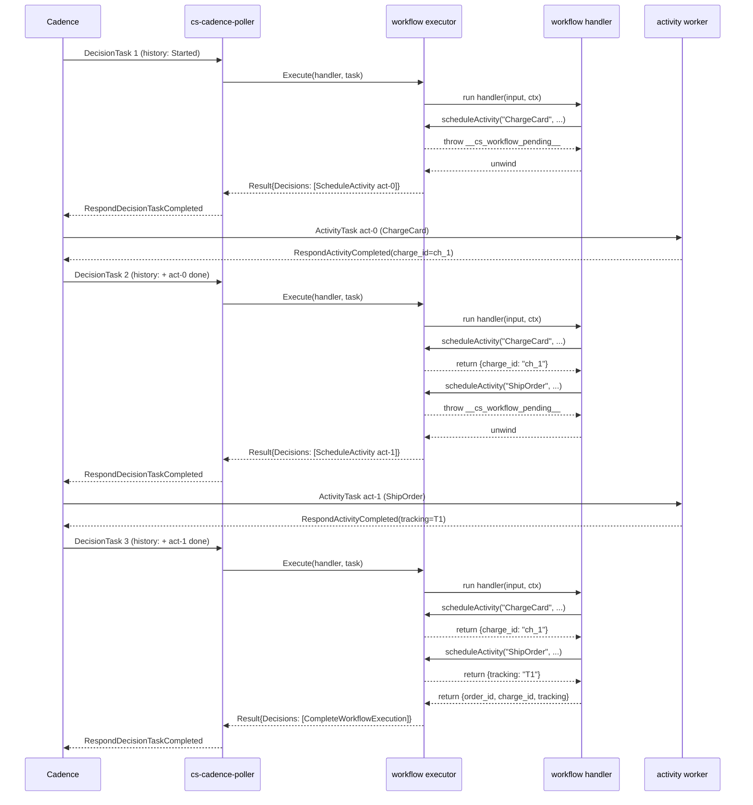

# Event Sources: Cadence Workflows

Beyond Activity execution, Sous v0.1 supports Cadence Workflow execution
via DecisionTask polling (E8.01). A workflow is a Sous function that
orchestrates activities: it reads its event input, calls
`ctx.cadence.scheduleActivity(type, args, opts)` one or more times,
awaits the results, and returns the final outcome. The workflow itself
never reaches into the network, the filesystem, or the system clock;
every observable side effect of a workflow run flows through an activity
on the same WorkerBinding, and every replay of the workflow code
produces the same decisions in the same order. The result is a
durable orchestration primitive that survives poller restarts,
control-plane upgrades, and Cadence-side failures without losing the
work the workflow had already done.

Cadence achieves that durability by replaying the workflow function on
every DecisionTask. Each replay starts from the original workflow
input, the executor consults the workflow history Cadence delivered
with the task, and prior activity results are returned synchronously
to the workflow code — their effects are already recorded in history.
Only new activity-schedule decisions reach the executor's output. The
workflow author writes code that reads as if it ran once from top to
bottom, but underneath the executor (`internal/cadence/workflow/
executor.go`) is reconstructing state from history on every poll. This
model demands that workflow code be deterministic: two replays of the
same history MUST yield the same decisions in the same order, or
Cadence will reject the response as nondeterministic and abort the
workflow run.

The determinism requirement is the topic of the determinism linter,
which scans the bundle's JS sources at publish time and rejects calls
that read the wall clock, system entropy, or unmediated network IO.
The linter is the only line of defence the platform has between a
publish and a nondeterministic-history failure that may not surface
for hours; see [Development Tools: Determinism Linter](Development-Tools-Determinism-Linter)
for the full banned-API table and the `cs-determinism-allow` escape
hatch. This page covers the runtime contract that the linter exists to
protect: how the poller surfaces DecisionTasks, how the executor
replays history, and what the workflow author can and cannot do in the
v0.1 MVP.

## DecisionTask polling

The Cadence poller (`cs-cadence-poller`) now long-polls `code-flow` on
two endpoints rather than one. The pre-E8.01 surface (`PollActivityTask`)
keeps the v0.1 activity contract documented under
[Event Sources: Cadence Activities](Event-Sources-Cadence-Activities);
the new surface (`PollDecisionTask`, defined on the
`internal/cadence.Client` interface in `internal/cadence/client.go`)
returns a DecisionTask carrying a workflow id, a run id, and the full
event history Cadence has recorded for the run so far.

Each WorkerBinding declares which surface it polls through a new `kind`
field (`internal/api/types.go`):

```json
{
  "name": "orders-workflows",
  "kind": "workflow",
  "domain": "orders",
  "tasklist": "orders-workflows",
  "worker_id": "cs-orders-wf-01",
  "pollers": { "activity": 4 },
  "limits": { "max_inflight_tasks": 64 },
  "activity_map": {
    "OrderWorkflow": { "function": "order-wf", "alias": "prod" }
  }
}
```

A binding with `kind: "workflow"` causes the poller to start a
DecisionTask long-poll loop instead of an ActivityTask one. The other
binding fields keep their meaning: `domain` and `tasklist` route the
poll, `worker_id` is the Cadence worker identity, and
`pollers.activity` controls how many goroutines the poller spawns for
this binding (the field name is a v0.1 legacy — the same counter
governs decision pollers). The `activity_map` is reused as the
workflow-type-to-FunctionRef lookup: its keys are the `workflow_type`
values Cadence may deliver, and the values point at the Sous function
that implements each one.

Pre-E8.01 bindings have an empty `kind` field and keep their
ActivityTask semantics. The field is append-only and defaults to
activity for back-compat, so existing tenants are unaffected by the
upgrade. The control plane (`cmd/cs-control/main.go`'s
`createWorkerBinding` handler) accepts the new field unchanged; the
poller picks it up on the next `refresh_seconds` cycle and rotates
the poll loops accordingly.

The DecisionTask itself is a JSON envelope returned over
`POST /v1/poll-decision-task`:

```json
{
  "task_token": "<opaque-bytes>",
  "workflow_type": "OrderWorkflow",
  "workflow_id": "wf-123",
  "run_id": "run-abc",
  "previous_started_event_id": 7,
  "started_event_id": 12,
  "history": [
    { "id": 1, "type": "WorkflowExecutionStarted",
      "attributes": { "input_base64": "eyJvcmRlcl9pZCI6IjEifQ==" } },
    { "id": 5, "type": "ActivityTaskScheduled",
      "attributes": { "activity_id": "act-0", "activity_type": "ChargeCard" } },
    { "id": 6, "type": "ActivityTaskCompleted",
      "attributes": { "scheduled_event_id": 5, "result_base64": "..." } }
  ]
}
```

The `task_token` is opaque bytes Cadence requires the worker to ship
back verbatim on `RespondDecisionTaskCompleted`; the poller hands it
to the executor untouched and re-attaches it to the response. The
history is the ordered list of events that have happened on the run
so far. The executor reads only a handful of well-known types
(`WorkflowExecutionStarted`, `ActivityTaskScheduled`,
`ActivityTaskCompleted`, `ActivityTaskFailed`) — the rest of the
event stream is preserved on the wire but opaque to the v0.1 MVP.

## Workflow function model

A workflow handler looks like a regular Sous function: it lives in
`function.js`, exports a default function, and is published through
the standard `cs publish` flow described in
[Concepts: Function Lifecycle](Concepts-Function-Lifecycle). The
only authoring-time difference is the manifest opt-in:

```json
{
  "schema": "cs.function.script.v1",
  "runtime": "cs-js",
  "entry": "function.js",
  "handler": "default",
  "cadence": { "kind": "workflow" }
}
```

The `cadence.kind: "workflow"` flag tells `cs-control` to route the
bundle through the determinism linter at publish time. Bundles
without the flag (or with `kind: "activity"`) are not linted and may
freely call any of the banned-in-workflows APIs — activities run
forward once per attempt and have no replay constraint.

The handler signature is the same as the activity handler signature
(see [Runtime: cs-js](Runtime-cs-js)), but the meanings of `event` and
`ctx` shift:

```js
export default function(input, ctx) {
  const charged = cs.cadence.scheduleActivity("ChargeCard",
    { order_id: input.order_id, amount: input.amount });
  const shipped = cs.cadence.scheduleActivity("ShipOrder",
    { order_id: input.order_id, charge_id: charged.charge_id });
  return { order_id: input.order_id, shipped_at: shipped.shipped_at };
}
```

The handler receives the workflow input as its first argument: the
executor reads the `input_base64` attribute of the
`WorkflowExecutionStarted` event in history and JSON-decodes it
(`workflowInput` in `internal/cadence/workflow/executor.go`). When the
input was not a JSON object, the executor wraps it as `{ "value": ... }`
so the handler always sees a stable shape. The `ctx` argument mirrors
the activity surface and exposes a small set of well-known fields:

```json
{
  "workflow_id": "wf-123",
  "run_id": "run-abc",
  "workflow_type": "OrderWorkflow"
}
```

Inside the handler the only new host call is `cs.cadence.scheduleActivity`.
The call takes an activity type (a key in the binding's `activity_map`)
and an input value; the input is JSON-encoded and base64-wrapped before
it lands in the ScheduleActivityTask decision. The call's return value
is the decoded activity result on replay — the workflow author writes
the orchestration as if `scheduleActivity` were a synchronous function,
even though under the hood the call may suspend the workflow until a
future DecisionTask delivers the activity's completion.

Both synchronous (`function`) and async (`async function`) handlers are
supported. The executor (`Execute` in `executor.go`) inspects the
returned value: when the handler returns a Promise, the executor reads
the promise state to map pending-vs-fulfilled-vs-rejected onto the
same suspension semantics it uses for sync throws. cs-js authors who
prefer async/await style do not pay a correctness cost — the
suspension marker propagates through `await` unchanged.

A note on the Python runtime: the v0.1 workflow executor is wired
against the goja JS interpreter only. Python workflow support is
deferred — see the cs-python entry in [Reference: Roadmap](Reference-Roadmap)
for the follow-on epic. Authors who want to publish workflows today must use
the cs-js runtime.

## History replay semantics

Every DecisionTask runs the handler from the start. That bears
repeating: the workflow function has no resumable state, no in-memory
locals carried across pauses, and no "continuation" stitched together
by the executor. What it has is a history that records every decision
the previous activations of this workflow already shipped, and a
deterministic mapping from the handler's call sites onto that history.

When the handler calls `scheduleActivity`, the executor consults
history (`WalkActivityOutcomes` in `history.go` derives one
`ActivityOutcome` per scheduled activity, indexed by the
workflow-assigned activity id). Three cases follow:

1. The activity was scheduled and completed in a prior activation.
   The executor pops the next outcome from the history-derived slot
   table, defensively checks that the activity type matches what the
   handler is requesting (a mismatch is a nondeterminism bug; the
   executor throws with a clear message so the determinism story has
   a runtime backstop), and returns the decoded result as a JS value
   to the handler. The handler keeps running.

2. The activity was scheduled but has not yet resolved (a previous
   activation emitted a ScheduleActivityTask decision and the
   corresponding `ActivityTaskCompleted` / `ActivityTaskFailed`
   event is not in history yet). The executor throws the internal
   `__cs_workflow_pending__` marker. The handler stops, the
   executor catches the marker, and the activation returns no new
   decisions — Cadence already knows about the in-flight activity
   and will deliver the next DecisionTask once the activity resolves.

3. The activity is fresh — there is no history slot for it because
   this is the first time the handler has reached this call site.
   The executor allocates the next sequential activity id (`act-<n>`,
   rooted at `len(history-derived-slots)` so retries reuse the same
   id), appends a `ScheduleActivityTask` decision to the activation's
   output, and throws the pending marker. The poller ships the
   decision to Cadence via `RespondDecisionTaskCompleted`; Cadence
   schedules the activity on the binding's tasklist and, when the
   activity worker finishes, schedules a new DecisionTask that
   carries the completion event in history. On that next decision
   the handler runs from the top again, and this call site lands in
   case (1).

The activity-failed case follows the same shape as completion, but
the executor surfaces the failure as a thrown error inside the
handler (`activity <id> failed: <reason>`) rather than as a returned
value. The handler may catch the error and recover (schedule a
compensating activity, return a fallback result); an uncaught failure
propagates back to the executor and is shipped to Cadence as a
workflow-failed response.

A subtle property of this design: the same call site in source code
maps to the same history slot on every replay only because the
handler runs to the same call site in the same order on every
replay. If the workflow code reads a clock or rolls a die between
calls, two replays could schedule activities in a different order
and the slot-to-call-site mapping would fall apart. This is why the
determinism linter exists; see [Determinism requirements](#determinism-requirements)
below.

## The `__cs_workflow_pending__` marker

The marker is the internal sentinel the workflow API uses to suspend
the handler at the first unfulfilled `scheduleActivity` call. It is
defined as the string constant `pendingMarker` in `executor.go`:

```go
const pendingMarker = "__cs_workflow_pending__"
```

When `cs.cadence.scheduleActivity` lands on case (2) or case (3)
above, the host binding panics with a Go error whose message contains
the marker. goja translates the panic into a JS exception that
unwinds the handler; the executor catches the exception at the top
level, recognises the marker via `isPendingException` (a substring
check is intentional — it survives async-rejection wrapping), and
treats the catch as "the workflow suspended on a pending activity".
The executor then returns the activation's accumulated decisions
(an empty list when the suspension is on a pre-existing in-flight
schedule, or a single ScheduleActivityTask decision when the handler
asked to schedule something new) and the poller ships them to Cadence.

The marker is intentionally opaque to user code. Workflow authors
should not catch errors from `scheduleActivity` unless they want to
recover from an activity-failed propagation, and even then they
should let unknown errors re-throw. The cs-js executor wires the
marker through `await` correctly, so an `async` handler can write:

```js
export default async function(input, ctx) {
  try {
    return await cs.cadence.scheduleActivity("Risky", input);
  } catch (e) {
    return await cs.cadence.scheduleActivity("Fallback", input);
  }
}
```

A `catch (e)` block that re-throws or swallows everything (including
the marker) would deadlock the workflow — the executor would never
see a pending signal and the handler would run to its return value,
emitting a `CompleteWorkflowExecution` decision before the activity
ever finished. The rule of thumb: catch specific error messages or
re-throw, never swallow.

The reason the executor uses an exception rather than a true coroutine
or a continuation is portability: goja does not implement V8-style
generators with arbitrary suspension. Throwing the marker lets the
workflow appear single-threaded to the developer while actually being
a series of replays, which is exactly the same trick the Cadence
official SDKs (cadence-go, cadence-java) use under the hood. The
asymmetry is that those SDKs use fibers or explicit await points,
where Sous uses a marker exception — same shape, lighter runtime.

## Codec sharing

Workflow input/output and activity input/output share the codec
configuration on the WorkerBinding. The `input_codec` field controls
how the workflow's input bytes are decoded before they reach the
handler, and how each activity's input bytes are encoded before they
ride on the `ScheduleActivityTask` decision; `output_codec` controls
how the workflow's return value (the
`CompleteWorkflowExecution.result_base64` field) and each activity's
result payload are encoded. The MVP uses JSON for both directions by
default, which matches the v0.1 cs-js handler return contract and
avoids the operational complexity of mixed codecs in a single
workflow run. msgpack and raw codecs are recognised by the same
registry the activity surface uses; flipping a workflow binding to
msgpack therefore also flips the activities it schedules. See
[Event Sources: Cadence Activities](Event-Sources-Cadence-Activities)
for the full codec table and the migration recipe for switching
codecs on a live tasklist.

The workflow handler itself never sees encoded bytes. The executor
JSON-decodes activity results before they re-enter the JS runtime
(`scheduleActivity`'s `json.Unmarshal` step in `executor.go`), and
JSON-encodes the handler's return value before base64-wrapping it
into the `CompleteWorkflowExecution` decision. A workflow author who
wants to push binary payloads through must wrap the bytes as a
base64 string at the JS level and let the consumer of the result
decode them — opaque-bytes-on-the-wire is the activity-side concern.

## Determinism requirements

Workflow code MUST be deterministic across replays. Two activations
of the same workflow against the same history MUST produce the same
sequence of decisions, byte-for-byte, or Cadence will reject the
response and abort the run. The MVP enforces this contract through
two complementary mechanisms.

First, the publish-time determinism linter
(`internal/cadence/determinism/scan.go`) scans every JS source file
in the bundle and rejects publishes that call any of the
canonical nondeterministic globals. The v0.1 banned list is:

| Pattern                    | Why it's banned                                              |
|----------------------------|--------------------------------------------------------------|
| `Date.now()`               | wall-clock read; differs across replays                      |
| `new Date()` (no arguments)| wall-clock read; differs across replays                      |
| `Math.random()`            | system entropy; nondeterministic                             |
| `crypto.getRandomValues()` | system entropy; nondeterministic                             |
| `setTimeout`               | schedules real-time callbacks; not deterministic under replay|
| `setInterval`              | schedules real-time callbacks; not deterministic under replay|
| `setImmediate`             | yields to the host event loop                                |
| `performance.now`          | monotonic clock read                                         |
| `fetch(...)` (bare global) | unmediated network IO                                        |

Filesystem and process APIs (`fs.readFile`, `process.env`,
`child_process.spawn`) are not on the scanner's list because the
cs-js runtime does not expose them in the first place — the isolate
that runs workflow code has no Node.js shim. Future runtimes (cs-wasm,
cs-python) that do expose filesystem APIs will need to extend the
banned list; the determinism package is the seam.

Workflows must not make network calls of any kind. The only path to
external IO from a workflow is to schedule an activity whose handler
makes the call: activities run forward once per attempt and may
freely use `cs.http.fetch`, `cs.kv`, `cs.codeq.publish`, and the
other capability-mediated host APIs. This split is non-negotiable: if
a workflow could fetch directly, two replays of the same history
would observe two different responses, and the workflow's decisions
would diverge.

The linter's remediation messages reference `cs.workflow.now()` and
`cs.workflow.sideEffect(...)` as the recommended replacements for
the banned APIs. Those host bindings are not implemented in the
v0.1 MVP — the executor's `cs` object only exposes
`cs.cadence.scheduleActivity` today. Authors who need a clock read or
an entropy source MUST funnel the call through a dedicated activity
(`GetCurrentTime`, `NewUUID`) whose result is recorded in history and
therefore replay-safe. The deterministic-side-effect helpers are
tracked under the E8 follow-up epic; see
[Reference: Roadmap](Reference-Roadmap).

Second, the executor catches the most common nondeterminism bug at
runtime: a workflow whose code requested activity type `A` on the
first activation but requests activity type `B` for the same slot on
replay. The mismatch is detected when the slot table is consumed
(`scheduleActivity` compares the recorded `ActivityType` to the
requested one) and surfaces as `workflow: nondeterministic activity at
<id>: history had "A", code requested "B"`. This is a backstop, not a
substitute for the linter — many nondeterminism bugs (e.g., a
clock read that biases a branch one way on the original run and the
other on replay) do not manifest as a type mismatch.

See [Development Tools: Determinism Linter](Development-Tools-Determinism-Linter)
for the linter's invocation contract, the `cs-determinism-allow`
escape hatch, and the false-positive surface of the v0.1 text-scan.

## What's not in v0.1

The MVP is deliberately narrow. The following Cadence workflow
primitives are out of scope and tracked under the E8.01 follow-up
epic in [Roadmap](Reference-Roadmap):

- **Child workflows.** A workflow cannot start another workflow
  through `cs.cadence.startChildWorkflow`. Authors who need
  composition should model it as a chain of activities for now.
- **Signals.** External clients cannot send signals to a running
  workflow, and the handler has no `cs.cadence.onSignal` callback.
  Long-running workflows that need external nudges must poll their
  state through an activity.
- **Queries.** External clients cannot query a workflow's intermediate
  state via `QueryWorkflow`. Workflow state is observable only
  through the eventual `CompleteWorkflowExecution` payload.
- **Versioned patches.** There is no `cs.cadence.getVersion(...)`
  helper to evolve workflow code without breaking in-flight runs.
  Workflow upgrades today require draining the tasklist before
  publishing a new version.
- **Parallel `scheduleActivity`.** The MVP suspends the handler at
  the first unfulfilled `scheduleActivity` call: the executor throws
  the pending marker, the handler unwinds, and no further
  `scheduleActivity` calls in the same activation reach the binding.
  Workflows are therefore strictly sequential in v0.1 — a workflow
  that schedules N activities one after another costs N+1
  DecisionTasks (one per fresh schedule plus one for the final
  return). Operators who need fan-out should batch the work inside a
  single activity for now.
- **Timers (`cs.cadence.sleep`).** Workflows cannot wait for a fixed
  duration directly. A sleep that an activity provides is fine;
  modelling cron inside a workflow is not.
- **`continueAsNew`.** Long-running workflows cannot reset their
  history by spawning a fresh run with the same workflow id. v0.1
  workflows are bounded by the history size Cadence is willing to
  carry.
- **Cancellation, side-effect/local-activity, search attributes,
  per-activity retry policies, selectors over multiple pending
  activities.** Each lands under E8 — see the roadmap epic for the
  tracking checklist.

Workflow authors should keep their workflows to a linear sequence of
`scheduleActivity` calls and a single return until the follow-up
ships.

## Errors and retries

Errors flow through two distinct channels: activity failures and
workflow failures. The two cases share a wire format but reach
Cadence through different decisions.

An activity failure is recorded in history as an
`ActivityTaskFailed` event. On the next DecisionTask, the workflow
handler runs again, lands on the corresponding `scheduleActivity`
call site, and the executor — having read the failure event from
history — throws a JS error inside the handler instead of returning
a value. The thrown error's message is `activity <activity-id>
failed: <reason>`, where `<reason>` is the failure category Cadence
recorded (`error`, `timeout`, etc.) and the activity worker's
structured failure envelope is preserved verbatim on the event for
future surfacing. The handler may catch the error and recover,
typically by scheduling a compensating or fallback activity:

```js
export default function(input, ctx) {
  try {
    return cs.cadence.scheduleActivity("ChargeCard", input);
  } catch (e) {
    return cs.cadence.scheduleActivity("ChargeBackup", input);
  }
}
```

When the handler does not catch the error, the executor surfaces it
as a workflow-failed response (the v0.1 MVP returns a non-marker
error from `Execute`; the poller maps that to
`RespondDecisionTaskFailed` in production, see the E8.01 follow-up
issue for the wire path). Cadence then either retries the workflow
according to its retry policy or marks the run as failed for the
caller to observe through the standard history APIs.

The retry policy is configured on the activity, not on the workflow.
Authors set the policy through the Cadence-side workflow start API
(or through the activity's own retry options when the SDK supports
them) — the Sous WorkerBinding does not surface a retry-policy field
in v0.1. This is by design: the binding declares which Sous function
backs each activity type; the activity's resilience profile is part
of the workflow contract Cadence already owns.

Workflow-level retries (the workflow's own retry policy that fires
when the workflow itself fails) are again a Cadence-side concern. A
workflow that throws an uncaught error is replayed only when the
caller asked Cadence to retry the workflow execution; otherwise the
failure is terminal and the workflow run is closed.

A note on idempotency: Cadence delivers DecisionTasks with
at-least-once semantics, the same way it delivers ActivityTasks. The
poller's existing dedup machinery (`internal/idempotency.Store`)
applies to decision responses too — a redelivered DecisionTask with
the same token resolves to the same activation and the executor
replays the same decisions, byte-for-byte. The determinism contract
is what makes this safe: the second activation produces an identical
decision sequence, so Cadence's idempotent decision-merge logic
accepts the redelivery as a no-op.

## Worked example

A two-step workflow: schedule activity `A` (`ChargeCard`), then
schedule activity `B` (`ShipOrder`) with `A`'s output, and return the
combined result.

The workflow handler (`function.js`):

```js
export default function(input, ctx) {
  const charged = cs.cadence.scheduleActivity("ChargeCard", {
    order_id: input.order_id,
    amount: input.amount,
  });
  const shipped = cs.cadence.scheduleActivity("ShipOrder", {
    order_id: input.order_id,
    charge_id: charged.charge_id,
  });
  return {
    order_id: input.order_id,
    charge_id: charged.charge_id,
    tracking: shipped.tracking,
  };
}
```

The handler is sync and reads as a straight line of code. Under the
hood, the executor will run this function three times against three
different histories. The activity handlers themselves live in the
same tenant/namespace as the workflow and are referenced by
WorkerBindings on their own (or the same) tasklist — see
[Event Sources: Cadence Activities](Event-Sources-Cadence-Activities)
for how to publish and bind an activity function.

The workflow binding (`POST /v1/tenants/<tenant>/namespaces/<ns>/cadence/workers`):

```json
{
  "name": "orders-workflows",
  "kind": "workflow",
  "domain": "orders",
  "tasklist": "orders-workflows",
  "worker_id": "cs-orders-wf-01",
  "pollers": { "activity": 2 },
  "limits": { "max_inflight_tasks": 32 },
  "activity_map": {
    "OrderWorkflow": { "function": "order-wf", "alias": "prod" }
  }
}
```

The activity binding for the same tenant (a separate WorkerBinding
on the activities tasklist; declared on its own row because the
`kind` field selects the surface and a single binding cannot poll
both):

```json
{
  "name": "orders-activities",
  "kind": "activity",
  "domain": "orders",
  "tasklist": "orders-activities",
  "worker_id": "cs-orders-act-01",
  "pollers": { "activity": 8 },
  "limits": { "max_inflight_tasks": 128 },
  "activity_map": {
    "ChargeCard": { "function": "charge-card", "alias": "prod" },
    "ShipOrder":  { "function": "ship-order",  "alias": "prod" }
  }
}
```

The workflow's `scheduleActivity` call does not name the tasklist
directly — the executor schedules each activity on the workflow's
own binding's tasklist by default. Operators who want to fan
activities out to a different tasklist than the workflow's own can
override the `Tasklist` field on the ScheduleActivityTaskDecision; the
v0.1 cs-js surface does not expose the override yet (the field is on
the Go-side decision struct in `internal/cadence/client.go` for a
follow-up).

The end-to-end run, in three DecisionTasks:

1. **First DecisionTask.** History has only `WorkflowExecutionStarted`.
   The handler runs, reaches `scheduleActivity("ChargeCard", ...)`,
   the executor allocates `act-0`, appends a ScheduleActivityTask
   decision, and throws the pending marker. The handler unwinds.
   The poller ships the decision; Cadence schedules the
   `ChargeCard` activity on the `orders-activities` tasklist.
2. **Second DecisionTask.** History has the `act-0` schedule and the
   `ActivityTaskCompleted` event for `charge_id: "ch_1"`. The
   handler runs from the top, `scheduleActivity("ChargeCard", ...)`
   returns `{ charge_id: "ch_1" }` synchronously, then
   `scheduleActivity("ShipOrder", ...)` is fresh: the executor
   allocates `act-1`, appends a ScheduleActivityTask decision, and
   throws. The poller ships the new decision.
3. **Third DecisionTask.** History has both schedules and both
   completions. The handler runs from the top, both
   `scheduleActivity` calls return synchronously, the handler
   returns the combined result, and the executor emits a single
   `CompleteWorkflowExecution` decision carrying the JSON-encoded
   return value. The poller ships the completion; Cadence closes
   the run.

### Sequence diagram



Three DecisionTasks, two ActivityTasks, one terminal completion. Every
activation of the handler ran from the same input through the same
call sites in the same order — that is the determinism contract in
practice, and it is what makes the workflow durable across poller
restarts, control-plane upgrades, and Cadence-side replays.
