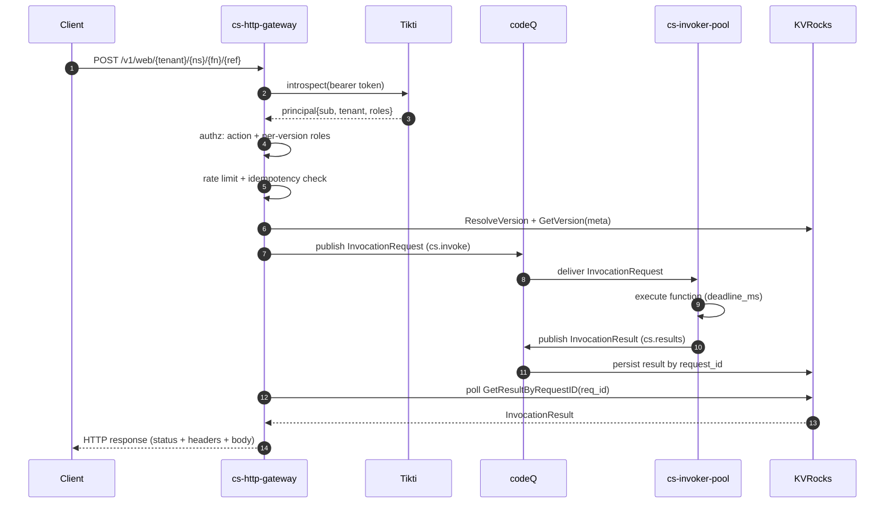

# Event Sources: HTTP

`cs-http-gateway` is the synchronous front door of Sous. It terminates HTTPS, authenticates each request against Tikti, maps the HTTP envelope onto an InvocationRequest, publishes that request onto codeQ, and — in the default synchronous mode — blocks until the matching InvocationResult appears on the result topic before answering the client. The gateway has no direct line to the invokers; everything crosses codeQ. That indirection is deliberate. It means a slow function executing in one tenant cannot stall unrelated requests on the same gateway replica, and it lets the gateway pool and the invoker pool scale on independent axes.

The HTTP path exists primarily for low-latency, user-facing workloads where the caller expects a response within seconds: webhooks from external SaaS systems, browser-originated AJAX traffic terminated at the edge, and machine-to-machine RPC where the caller wants the function's reply on the same socket. The gateway is the only Sous component that converts an inbound HTTP request into a function activation, and it does so without leaking transport details into user code: headers become a flat map, the body becomes a base64 string, the URL is split into path components and query string, and a single envelope is published onto `cs.invoke`. Everything downstream of codeQ treats HTTP-triggered activations the same way it treats scheduler-triggered or Cadence-triggered ones.

The gateway is intentionally a thin proxy. It does not parse function bodies, it does not run user code, and it does not own retry semantics for synchronous calls — those belong to the client. The pieces it does own are the ones that must live close to the HTTP socket: token introspection caching, per-tenant rate limiting, idempotency replay, body and header size enforcement, and the correlation timeout that bounds how long a synchronous request may wait for a result. The rest of this page walks through each of those responsibilities, the URL contract that funnels traffic to them, and the error model the gateway exposes when any of them fails.

## URL shape and routing

The gateway exposes a single family of routes for invoking published functions. The canonical shape is `/v1/web/{tenant}/{namespace}/{function}/{ref}` and a path-catchall variant `/v1/web/{tenant}/{namespace}/{function}/{ref}/*` which captures anything the caller appends after the reference. Both routes are registered on the same handler in `cmd/cs-http-gateway/main.go`:

```go
pr.HandleFunc("/v1/web/{tenant}/{namespace}/{function}/{ref}", s.invokeHTTP)
pr.HandleFunc("/v1/web/{tenant}/{namespace}/{function}/{ref}/*", s.invokeHTTP)
```

The four named segments are the addressing tuple. `tenant` selects the Tikti tenant whose tokens may be used to authenticate and whose quotas the request will draw from. `namespace` is the in-tenant grouping that owns the function definition, mirroring the `tenant/namespace/function` triple used everywhere else in the control plane. `function` selects a specific function within that namespace. `ref` resolves to a concrete version on the invocation path.

The `ref` segment is overloaded by design: it accepts either a numeric version id or an alias name. The gateway parses it once with `strconv.ParseInt`. A successful parse with a positive value is treated as a literal version; anything else (including the common case of a string like `prod` or `stable`) is treated as an alias and resolved against the alias table for the function. The two-line implementation lives in `invokeHTTP`:

```go
if parsed, err := strconv.ParseInt(ref, 10, 64); err == nil && parsed > 0 {
    version = parsed
} else {
    alias = ref
}
resolvedVersion, err := s.store.ResolveVersion(r.Context(), tenant, namespace, function, alias, version)
```

`ResolveVersion` returns the integer version id, and the rest of the handler operates on that. The resolution happens on every request rather than being baked into the URL because alias targets can change at runtime: promoting `prod` from version 17 to version 18 is a single store mutation and the next request observes the new target without any restart on the gateway.

Anything after the resolved `ref` is the path-catchall remainder. The gateway does not consume that suffix itself; it stays in `r.URL.Path` and is surfaced to the function inside the event object so the function can dispatch on it like a sub-route. A request to `/v1/web/t_abc123/payments/reconcile/prod/orders/42` therefore reaches the same handler as a request to `/v1/web/t_abc123/payments/reconcile/prod`, but the function sees the `/orders/42` tail through `rawPath`.

The router itself is `github.com/go-chi/chi/v5`. Aside from the two invoke routes, the gateway registers a small set of operational endpoints: `/healthz` for liveness, `/readyz` for store reachability (it pings the persistence provider), and `/metrics` for Prometheus scraping. None of those go through the authenticated middleware chain, so probes do not need a Tikti token.

The choice to keep the invoke surface to a single URL family is deliberate. Sous does not expose method-specific routes (`GET /functions/{name}`, `POST /functions/{name}/invoke`) because the gateway treats every HTTP method uniformly: the method is data, not part of the route, and the function decides what to do with it. A function that wants to handle only `POST` inspects `requestContext.http.method` and returns a 405 on any other verb. The gateway will not reject `GET`, `PUT`, `DELETE`, or `PATCH` based on the URL — that policy belongs in the function. The same applies to `OPTIONS`: there is no gateway-level preflight handling, so a function that needs CORS owns the preflight in its handler.

## Authentication

Every request to the invoke routes must carry a Tikti bearer token in the `Authorization` header. The middleware is installed by `r.Use(authz.AuthnMiddleware(authnProvider))` in `cmd/cs-http-gateway/main.go` and runs immediately after the rate limiter so an unauthenticated flood is bounded even before the token introspection cache is consulted. The provider is configured through `plugins.authn.driver` in `config.example.yaml`; the default driver is `tikti`, which calls the introspection endpoint at `plugins.authn.tikti.introspection_url` and caches positive results for `cache_ttl_seconds` (default 60). The cache TTL is the dial operators turn to trade off Tikti load against the latency of a recently-revoked token continuing to be honoured by the gateway.

Token introspection produces a principal record with the fields the gateway needs to make policy decisions: `sub` (the subject identifier, unique within the tenant), `tenant` (the tenant id the token was issued against), `roles` (the list of role strings carried by the subject), and the token's expiry. The middleware attaches that principal to the request context, and the handler retrieves it through `authz.PrincipalFromContext`:

```go
principal, ok := authz.PrincipalFromContext(r.Context())
if !ok {
    cserrors.WriteHTTP(w, cserrors.New(cserrors.CSAuthnInvalidToken, "principal missing"), requestID(r))
    return
}
```

A missing or malformed token surfaces as `CS_AUTHN_INVALID_TOKEN` (HTTP 401) — the middleware never lets a request reach the handler without a principal, but the handler asserts the invariant defensively. An expired token is `CS_AUTHN_EXPIRED_TOKEN`; a header that is absent entirely is `CS_AUTHN_MISSING_TOKEN`. All three map to 401 through the prefix-based switch in `internal/errors/errors.go`.

The principal's tenant must equal the tenant segment in the URL. The handler enforces that immediately after extracting the principal:

```go
if principal.Tenant != "" && principal.Tenant != tenant {
    cserrors.WriteHTTP(w, cserrors.New(cserrors.CSAuthzResourceMis, "tenant mismatch"), requestID(r))
    return
}
```

The cross-tenant check is what stops a token issued for tenant A from invoking a function published by tenant B. The deeper Tikti semantics — how tokens are minted, how introspection responses are signed, how service principals are scoped — live in [IAM with Tikti](IAM-with-Tikti).

A subtlety worth calling out: the gateway forwards only `sub` and `roles` from the principal onto the InvocationRequest's `principal` block, not the raw token. The function never sees the bearer token. If a function needs to call another Sous function on the caller's behalf, it requests a fresh service-principal token through the runtime egress shim rather than replaying the inbound one. That keeps the blast radius of a compromised function bounded: even a malicious function cannot escalate to acting as the caller against systems outside Sous, because the token never leaves the gateway.

Token introspection is cached in-process by the authn provider. The cache key is the bearer token string, and the cache value is the principal record together with an expiry derived from the smaller of the token's `exp` claim and the configured `cache_ttl_seconds`. A miss issues a synchronous request to Tikti; a hit returns immediately. The cache is intentionally per-replica — there is no shared introspection cache across gateway pods — because the alternative would couple every authn check to a network round-trip even on warm paths. The tradeoff is that a revoked token may continue to be accepted by warm replicas for up to `cache_ttl_seconds` after revocation; operators tune the TTL according to their security posture.

## Authorization

Authentication answers "who is this caller?". Authorization answers "are they allowed to invoke this specific version?". The gateway performs two distinct authorization checks, in order.

The first check is the action gate. The principal must hold a role that permits the HTTP invoke action:

```go
if !authz.CheckAction(principal, "cs:function:invoke:http") {
    cserrors.WriteHTTP(w, cserrors.New(cserrors.CSAuthzDenied, "action denied"), requestID(r))
    return
}
```

`cs:function:invoke:http` is one of the canonical actions enumerated in the Tikti policy catalogue (see [IAM with Tikti](IAM-with-Tikti) for the complete list). A token that lacks any role mapped to that action cannot use the synchronous HTTP path at all, even if it carries permissions for the REST control plane or the scheduler.

The second check is the per-version role allowlist. Every version record stores an `authz.invoke_http_roles` list in its config. After the handler resolves the version and fetches its metadata, it requires the principal's roles to intersect that list:

```go
if err := authz.RequireRoleIntersection(meta.Config.Authz.InvokeHTTPRoles, principal); err != nil {
    cserrors.WriteHTTP(w, err, requestID(r))
    return
}
```

When the intersection is empty, `RequireRoleIntersection` returns `CS_AUTHZ_DENIED`, which the error mapper turns into HTTP 403. The two-stage design lets a tenant grant `cs:function:invoke:http` broadly to a service tier while still restricting individual sensitive functions (a refund endpoint, an admin RPC) to a narrower role set through the per-version allowlist. An empty allowlist means "deny everyone" — there is no implicit fallthrough.

The allowlist is versioned, not aliased. Promoting `prod` from a permissive version 17 to a stricter version 18 instantly tightens which roles can invoke through `prod`, because the gateway resolves the alias to the version and reads the allowlist off the version metadata. There is no caching of allowlist decisions across requests — the check runs every time — because the store lookups happen anyway to fetch `TimeoutMS`. Operators rotating role assignments observe the new policy on the next request without any restart.

There is no per-namespace or per-tenant fallback allowlist. The version's `invoke_http_roles` is the only source of truth. This is a deliberate flatness: there are no policies to inherit, no precedence rules to debug, and no surprise grants when a tenant-level policy is widened. Every version carries its own allowlist, and the publish step requires the field to be set explicitly; a function published without an allowlist cannot be invoked at all.

## Idempotency

The gateway accepts an optional `Idempotency-Key` request header. When present, it opts the call into a dedup cache that lets clients retry safely without re-executing the function. The middleware that enforces the contract is `idempotencyMiddleware` in `cmd/cs-http-gateway/idempotency_mw.go`; it sits on the authenticated chain immediately after `AuthnMiddleware`.

The wire format of the header is `[A-Za-z0-9_-]{8,128}`, enforced by `idempotencyKeyPattern`. Keys that do not match are rejected with `CS_VALIDATION_FAILED` (HTTP 400) before any function work begins. The constraint is intentional: it is large enough to hold a UUID or a hash, narrow enough that misconfigured clients cannot poison the cache by submitting arbitrary blobs as keys.

The middleware buffers the request body so it can compute a SHA-256 fingerprint of the bytes and still hand a fresh reader to the downstream handler. It then composes a store key from the addressing tuple — `idem:{tenant}:{namespace}:{function}:{ref}:{key}` — and calls `store.Reserve` to claim the slot:

```go
storeKey := buildStoreKey(tenant, namespace, function, ref, key)
fp := idempotency.Fingerprint(body)
activationID := deriveActivationID(tenant, function, ref, key)
reserved, err := store.Reserve(r.Context(), storeKey, activationID, fp, ttl)
```

Three outcomes follow. When the reservation is fresh, the middleware forwards the request to `invokeHTTP`, captures the response with `capturingWriter`, and on success (status < 500) commits the captured payload back to the store so the next attempt can replay it. When the reservation is a duplicate and the previous attempt reached a terminal state, the middleware replays the cached status, headers, and body, and stamps `X-CS-Idempotency-Replay: 1` on the response so observers can tell a fresh activation from a replay. When the key matches an existing record but the body fingerprint differs, the middleware returns `CS_IDEMPOTENCY_CONFLICT` (HTTP 409) without re-executing the function — the client signalled "this is the same request" but presented different bytes, and the gateway refuses to guess which copy is authoritative.

The TTL on a reservation is the function timeout plus a buffer (defaulting to one hour when no function-specific timeout is known). 5xx responses are never committed; the gateway treats them as transient so the next client retry can still attempt a fresh execution. The store interface is `internal/idempotency.Store`, an implementation-agnostic contract with a KVRocks backing in production and an in-memory backing for tests.

The handler-side companion to the middleware is the `activationID` derivation. When an idempotency key is present, the gateway derives a deterministic UUIDv5 from `(tenant, function, ref, key)`; when it is absent, it generates a fresh UUIDv4. That deterministic id is what callers can use to look up an activation later through the REST API even when their retried request is being replayed from cache.

The body fingerprint deserves a closer look. It is computed by `idempotency.Fingerprint`, which hashes the raw request bytes with SHA-256 and encodes the digest. The fingerprint guards against an entire failure mode peculiar to retried writes: a client that retries a `POST /charges` with the same idempotency key but a different amount must not have the second attempt silently turn into a replay of the first. The fingerprint mismatch surfaces that bug to the client immediately as a 409 rather than letting it become a data inconsistency. Clients that need to retry with a modified body should use a new key; the cost of fingerprinting on every call is a single hash over bytes the gateway already holds in memory, so it is essentially free.

The interaction between idempotency and rate limiting is worth pinning down. Both middlewares run on the same chain, but they bill differently. Rate limiting bills every request, replay or not — a replay still costs one token. This is intentional: replays consume the same gateway capacity (TCP, TLS, header parsing, store lookup) as fresh requests, and tenants that mass-retry should observe the same backpressure. Idempotency, by contrast, only suppresses function execution; the gateway still authenticates the caller, checks the role intersection, and counts the request against the rate limit before consulting the dedup cache. There is no shortcut that lets a client trade a long-lived idempotency key for free invocations.

## Rate limiting

The gateway enforces a per-tenant token bucket on every invoke request. The middleware is installed before the authenticated chain so a flood from an unauthenticated source still respects the limit, but the bucket is keyed by the tenant segment of the URL rather than by IP or by token — Sous is multi-tenant and quotas live on the tenant. The implementation is `cmd/cs-http-gateway/ratelimit_mw.go`.

The bucket is a textbook token-bucket: `TenantRPS` tokens replenish per second up to `TenantBurst`. Both knobs come from `internal/limits`, which in turn reads `cs_http_gateway.rate_limits` from `config.example.yaml`:

```yaml
cs_http_gateway:
  rate_limits:
    tenant_rps: 200
    function_rps: 20
```

When the bucket has tokens, the request proceeds. When it is empty, the gateway returns `CS_RATE_LIMITED` with HTTP 429 and a `Retry-After` header expressed in whole seconds, computed from the time until the next token would replenish:

```go
ok, retry := limiter.allow(tenant)
if !ok {
    seconds := int(math.Ceil(retry.Seconds()))
    if seconds < 1 {
        seconds = 1
    }
    w.Header().Set("Retry-After", strconv.Itoa(seconds))
    cserrors.WriteHTTP(w, cserrors.New(cserrors.CSRateLimited, "tenant rate limit exceeded"), ...)
}
```

The limiter holds one bucket per tenant in a `map[string]*bucketEntry`. An opportunistic janitor evicts entries whose `lastSeen` is older than the 10-minute eviction TTL so the map size stays bounded in long-running gateways without contention. Requests that do not carry a tenant in their URL — the health, ready, and metrics endpoints — bypass the limiter entirely.

Rejections are counted in a per-tenant `rejects` map for tests and observability. The 429 status is the gateway's only backpressure signal to the client; the gateway never queues or delays a request internally, so the round-trip cost of a rejected call is bounded by the middleware path.

Per-function quotas are read from the same `rate_limits` block (`function_rps: 20` in the example) but the function-level enforcement happens downstream of the gateway, in the invoker pool's per-tenant inflight cap and per-function admission control. The gateway's job is the tenant-scope token bucket; the deeper accounting lives in [Invoker Pool](Invoker-Pool) and [Capacity and Limits](Capacity-and-Limits). The separation lets the gateway stay extremely cheap on the steady-state path — a single atomic increment per request — while the invoker pool absorbs the more nuanced fairness logic where the data it needs (concurrent activations, queue depth) is already locally available.

The rate limiter survives gateway replica turnover. Each replica owns an independent bucket, which means a tenant's effective RPS is `tenant_rps × replicas`. That is the intended behaviour: scaling out gateway replicas is also how a tenant's headroom scales. A tenant that needs a hard global cap independent of replica count uses a coordinator on the codeQ side (a subscription with a max-concurrency limit) rather than relying on the gateway. The gateway's bucket is a fairness device, not a billing meter.

## HTTP-to-event mapping

Once the request has cleared authentication, authorization, idempotency, and rate limiting, the gateway converts it into the `event` object that the function handler receives. The shape is stable across triggers — the same field names appear when a function is invoked by the scheduler or by Cadence — but the HTTP-specific fields are the ones the gateway populates. The exact construction lives in `invokeHTTP`:

```go
event := map[string]any{
    "version":         "2.0",
    "routeKey":        "$default",
    "rawPath":         r.URL.Path,
    "rawQueryString":  r.URL.RawQuery,
    "headers":         flattenHeaders(r.Header),
    "requestContext":  map[string]any{"http": map[string]any{"method": r.Method, "path": r.URL.Path}},
    "body":            base64.StdEncoding.EncodeToString(body),
    "isBase64Encoded": true,
}
```

`rawPath` is the full request path including the path-catchall remainder, which is how a function inspects whatever the client appended after the function reference. `rawQueryString` is the raw query string as received; the gateway does not parse it, leaving URL decoding policy to the function. `requestContext.http.method` and `requestContext.http.path` redundantly carry the method and path so the function does not need to inspect `rawPath` to dispatch on verb.

The headers map is built by `flattenHeaders`, which lowercases the header name and joins repeated values with a comma. This collapses the multi-value semantics of `http.Header` into a flat string map, which is the shape user code expects and which serializes cleanly into JSON:

```go
func flattenHeaders(header http.Header) map[string]string {
    out := make(map[string]string, len(header))
    for k, values := range header {
        if len(values) > 0 {
            out[strings.ToLower(k)] = strings.Join(values, ",")
        }
    }
    return out
}
```

The body is always base64-encoded. The gateway treats the request body as opaque bytes — it does not attempt to detect UTF-8 or apply a content-type-specific decoding step. The encoded string is published verbatim, and `isBase64Encoded` is set to `true` to signal the encoding to the function. Functions that need raw bytes call `base64.decode` on the body; functions that need a UTF-8 string apply both steps. This is the same shape AWS API Gateway uses for v2 payloads, by design, so functions migrated from other platforms behave predictably.

The body has a size cap that the handler checks before the encoding step:

```go
body, err := readBoundedBody(r, int64(s.cfg.CSHTTPGateway.Limits.MaxBodyBytes))
```

The cap is `cs_http_gateway.limits.max_body_bytes` from `config.example.yaml` (default 6 MiB). Exceeding it produces `CS_BODY_TOO_LARGE` (HTTP 413). Two companion caps guard headers and query strings — `max_header_bytes` (64 KiB default) and `max_query_bytes` (16 KiB default) — and surface as `CS_VALIDATION_FAILED` (HTTP 400) when exceeded.

Two pieces of trigger metadata travel alongside the event but outside of it. The handler builds a `triggerSource` map carrying the URL path and the inbound `traceparent` header, and it propagates the `X-CS-Parent-Activation` header into `parent_activation_id` when the request originated from another Sous activation via the runtime egress shim. That parent chain is what lets the control plane materialize an agent decision tree later; the detail belongs to [Observability](Observability) but the gateway is the producer of those links for HTTP-triggered work.

The `trigger.type` field is always the literal string `"http"` for requests arriving on this path. The invoker uses that value to route the activation through HTTP-specific result formatting; a function invoked by the scheduler sees `trigger.type == "schedule"` instead. The schema for the trigger block, including the enum of accepted types, is `spec/cs.invoke.v1.json`:

```json
"trigger": {
  "type": "object",
  "required": ["type", "source"],
  "properties": {
    "type": { "enum": ["http", "schedule", "cadence", "api"] },
    "source": { "type": "object" }
  }
}
```

The full InvocationRequest envelope that the gateway publishes carries nine top-level fields: `activation_id`, `request_id`, `tenant`, `namespace`, `ref` (with nested `function`/`alias`/`version`), `trigger`, `principal`, `deadline_ms`, and `event`. All nine are required, and the gateway populates all nine on every request. The schema is the contract; the gateway's responsibility is to honour it exactly so downstream consumers — invokers, observability sinks, audit log — can rely on the shape without defensive checks.

## Response wrapping

The gateway expects the function to return a structured response object so the HTTP layer can be reconstructed faithfully. The schema is defined in `spec/cs.results.v1.json` and the response carries four optional fields:

```json
{
  "statusCode": 200,
  "headers": { "content-type": "application/json" },
  "body": "base64 or utf8",
  "isBase64Encoded": true
}
```

The mapping back to the HTTP wire is straightforward. The gateway writes every header from `result.Result.Headers` onto the response, writes the status code, and then writes the body — decoding it from base64 first if `isBase64Encoded` is true:

```go
for k, v := range result.Result.Headers {
    w.Header().Set(k, v)
}
w.WriteHeader(result.Result.StatusCode)
if result.Result.IsBase64Encoded {
    decoded, err := base64.StdEncoding.DecodeString(result.Result.Body)
    if err == nil {
        _, _ = w.Write(decoded)
        return
    }
}
_, _ = w.Write([]byte(result.Result.Body))
```

Three behaviours follow from this contract. First, the function is responsible for setting `content-type`. The gateway does not inject a default; whatever the function declares is what the client receives. The base64 fallback when decoding fails is deliberately silent — a function that claims base64 but writes UTF-8 will see its raw bytes go out anyway rather than a 500, on the principle that turning a working function into a broken one over an encoding mismatch is worse than letting a slightly-malformed response pass through.

Second, CORS is the function's responsibility. The gateway does not synthesize `Access-Control-Allow-Origin` headers, does not intercept preflight `OPTIONS` requests, and does not strip CORS headers from upstream responses. A function that needs to be callable from a browser handles the preflight in its own handler and emits the appropriate `Access-Control-*` headers in its response object; the gateway then writes them onto the wire unchanged.

Third, when the function does not return a structured response — for example, a bare JSON value or a string — the result envelope's `result` field arrives with empty defaults, the status code defaults to 200 if the function did not set one, and the body is whatever the function returned. Functions are encouraged to return the structured shape because it is the only path to setting custom headers, but the gateway tolerates the unstructured case.

A function that fails (the runtime throws, the runtime times out, the bundle cannot be loaded) does not produce a `result` block. Instead, the result envelope carries an `error` block which the gateway maps to `CS_RUNTIME_EXCEPTION`. The full error model is covered below.

The response shape is deliberately minimal. There is no streaming, no chunked transfer for function-controlled progress, and no server-sent events. A function that needs to push intermediate state to a client uses an async pattern — write progress to KVRocks or an external store, return immediately with an activation id, and let the client poll. The synchronous HTTP path is for request-response, not for long-lived bidirectional channels. Functions that need streaming behaviour are a non-goal for the gateway today and are tracked separately on the roadmap.

The headers the function sets are written with `w.Header().Set`, which replaces any existing value rather than appending. This matters for `Set-Cookie`: a function that wants to emit multiple cookies must concatenate them into a single header value or, since `Set-Cookie` is the one header where the HTTP standard explicitly forbids comma-joining, choose a different cookie-bundling strategy. The gateway intentionally does not special-case `Set-Cookie` semantics; the structured response shape treats every header as a flat string map, and the function is responsible for working within that contract.

## Sync vs async modes

The gateway operates in synchronous mode only today. After publishing the InvocationRequest, the handler calls `waitForResultByRequestID` which polls `store.GetResultByRequestID` until the matching result arrives or the context deadline fires:

```go
waitCtx, cancel := context.WithTimeout(r.Context(), time.Duration(meta.Config.TimeoutMS+250)*time.Millisecond)
defer cancel()
result, err := waitForResultByRequestID(waitCtx, s.store, tenant, reqID)
```

Correlation is by `request_id`. The handler generates a fresh `req_<uuid>` identifier per request, threads it into the InvocationRequest, and the invoker stamps the same value on the InvocationResult it publishes to `cs.results`. The wait loop polls every 50 ms; the alternative (subscribing to the result topic from the gateway) would couple the gateway to codeQ's subscription model and complicate horizontal scaling, so the gateway stays read-only against the persistence provider for results.

An asynchronous mode where the gateway returns 202 with an activation id and the result is fetched later through the REST API is on the roadmap but not yet implemented. There is no `?async=true` query parameter or `X-CS-Async` header today; every request blocks until the function completes or the correlation timeout fires. Clients that need fire-and-forget semantics use the scheduler or publish directly onto codeQ through a service principal.

The poll interval is a compromise between two competing pressures. A shorter interval reduces the tail latency of fast functions — a function that completes in 5 ms wants its result observed promptly rather than waiting up to 50 ms for the next tick. A longer interval reduces store load when many requests are in flight against the same gateway replica. The 50 ms choice keeps the worst-case wait under the noise floor of a typical HTTP exchange while keeping the KVRocks GET rate at one per inflight request per 50 ms, which sized against the documented inflight cap stays well below the store's capacity. Operators who observe gateway pods CPU-bound on the result poll can tune this constant; the project does not expose it through configuration yet because the default has held up to every benchmark on the roadmap.

A second subtlety: the gateway uses the request's context as the parent of the wait context. When the client cancels the request (closes the TCP connection, hits its own client-side timeout), the wait context cancels too, and the handler returns to the chi router without writing a response. The InvocationRequest is already in flight on codeQ, so the function will still execute; the result will land in KVRocks with no waiter, and a subsequent activation lookup through the REST API will surface it. Client cancellation does not abort function execution. This is the same shape as AWS Lambda's synchronous invoke: the function is fire-and-forget once the request is published, regardless of what the caller does next.

## Timeouts

Two layers of timeout protect the synchronous path. The inner layer is the function's wall-time cap. Every version carries a `Config.TimeoutMS` value that the handler propagates into the InvocationRequest as `deadline_ms`:

```go
deadline := time.Now().Add(time.Duration(meta.Config.TimeoutMS) * time.Millisecond).UnixMilli()
```

The invoker pool reads `deadline_ms` and kills the activation when wall-clock time exceeds it. The result it publishes carries an `error` block with `CS_RUNTIME_TIMEOUT`, which the gateway forwards to the client.

The outer layer is the gateway's correlation timeout. The `waitForResultByRequestID` call is wrapped in a context with deadline `TimeoutMS + 250ms` — enough headroom for the invoker to publish the timeout result after the function deadline fires. When the gateway's wait context fires first (which usually means the invoker never produced a result, not that the function exceeded its cap), the handler returns `CS_CODEQ_CORRELATION_TIMEOUT`, which maps to HTTP 504 through the error switch in `internal/errors/errors.go`.

The distinction matters operationally. `CS_RUNTIME_TIMEOUT` means the function ran for too long and was terminated by the invoker. `CS_CODEQ_CORRELATION_TIMEOUT` means the gateway never observed any result — the invoker may have crashed, codeQ may have lost the message, the store write may have failed. The first is an application bug; the second is a platform incident. Operators rely on that split when triaging 504 spikes against latency dashboards.

A third timeout sits on the HTTP server itself — `WriteTimeout: 60s` on `httpServer` — which is the absolute upper bound on how long a single HTTP exchange can hold a gateway connection open. Functions whose declared `TimeoutMS` exceeds the server write timeout will see the connection forcibly closed before the result arrives. The defaults are sized so this only bites on misconfigured deployments; the practical recommendation is to keep function timeouts well below the gateway's `WriteTimeout`.

There is also a `ReadTimeout: 15s` on the HTTP server, which bounds how long the gateway is willing to wait for the request body to arrive after headers have been parsed. A client that opens a connection and dribbles bytes will hit `ReadTimeout` first; the connection is closed without any function execution. The 15-second value is large enough to accommodate large uploads on slow links but small enough to make slow-loris attacks expensive: an attacker holding 1000 connections at 14 seconds each does not exceed the file-descriptor budget of a normal gateway pod.

The `IdleTimeout: 60s` controls how long the gateway keeps a keep-alive connection open between requests. The 60-second budget matches typical client libraries' connection pool defaults so clients on long-lived pools do not see frequent reconnect storms. Together with the two earlier timeouts, this forms the gateway's network safety envelope: no individual request lives longer than 60 seconds end-to-end, idle connections do not pile up indefinitely, and slow-body attacks die at the read boundary.

## Errors

The gateway distinguishes three error categories, each with its own HTTP shape and operational meaning.

The first category is gateway-level errors. These are the errors the gateway produces before publishing anything onto codeQ. They include `CS_AUTHN_MISSING_TOKEN` and `CS_AUTHN_INVALID_TOKEN` (401), `CS_AUTHZ_DENIED` (403), `CS_AUTHZ_RESOURCE_MISMATCH` for a cross-tenant token (403), `CS_VALIDATION_FAILED` for an oversized header or malformed idempotency key (400), `CS_BODY_TOO_LARGE` (413), `CS_IDEMPOTENCY_CONFLICT` (409), and `CS_RATE_LIMITED` (429). All of them carry a JSON envelope of the form

```json
{ "error": { "code": "CS_RATE_LIMITED", "message": "tenant rate limit exceeded", "request_id": "..." } }
```

and the mapping from code to status is centralized in `internal/errors/errors.go` so the gateway and other Sous services agree on the contract. The client owns the retry decision: 429 and 503 are retryable, 4xx authentication errors are not.

The second category is invoker-level errors. These are errors the function itself produces. When the function throws, the invoker publishes an InvocationResult whose `result` is nil and whose `error.message` carries the exception text. The gateway translates that into `CS_RUNTIME_EXCEPTION` (HTTP 500) and forwards the message verbatim:

```go
if result.Result == nil {
    if result.Error != nil {
        cserrors.WriteHTTP(w, cserrors.New(cserrors.CSRuntimeException, result.Error.Message), requestID(r))
        return
    }
    cserrors.WriteHTTP(w, cserrors.New(cserrors.CSRuntimeException, "missing function result"), requestID(r))
    return
}
```

Functions that want to return a 4xx or 5xx without the gateway intercepting it should set `statusCode` explicitly in the structured response. A function that returns `{"statusCode": 400, "body": "..."}` produces an HTTP 400 with the function's body; a function that throws produces an HTTP 500 with the platform's error envelope. The split lets functions distinguish business-logic failures (validation, not-found) from infrastructure failures (unhandled exception).

The third category is infrastructure errors. When codeQ rejects the publish — the broker is unavailable, the topic is missing, the producer token is wrong — the handler returns the underlying error which the mapper turns into `CS_CODEQ_PUBLISH_FAILED` (HTTP 503 via the `_UNAVAILABLE` suffix rule for related codes; publish failure surfaces as a 500 by default). When the persistence provider is unreachable, `/readyz` fails and the deployment's readiness probe takes the gateway out of rotation. When the correlation wait expires without seeing a result, the handler returns `CS_CODEQ_CORRELATION_TIMEOUT` (504) as described in the previous section.

The complete error catalogue is documented in [Error Model](Error-Model). The gateway never returns an unstructured error body; every non-2xx response carries the JSON envelope above.

The `request_id` field on the envelope is the gateway's request id, not the activation id. It is the value the gateway logged for the request, threaded through every middleware via `observability.RequestIDFromContext`, and is what operators correlate against gateway log lines when triaging a specific failure. The activation id, which is the identifier the function and the invoker pool use, is separate and is returned to the client only on success (or when the function explicitly puts it in the response body). The split is intentional: a client investigating a 403 needs the gateway request id to talk to platform operators; a client investigating a function bug needs the activation id to inspect the function's logs. Coupling them would muddle both conversations.

Errors emitted before authentication completes (a malformed token, a missing header) still get a request id. The `observability.RequestIDMiddleware` runs first in the chain, so even a request rejected by the rate limiter has a stable id that operators can use to find the corresponding log line.

## Sequence diagram



The diagram emphasizes the asymmetry between the publish path (gateway to codeQ, push) and the result path (gateway to KVRocks, pull). The gateway never subscribes to codeQ. Results are written to KVRocks by the same component that processes the result topic, and the gateway reads them out on a 50 ms tick until the correlation timeout fires. That design keeps the gateway stateless with respect to codeQ subscriptions and means a gateway replica can be killed at any time without losing in-flight work: the invocation has already been published, the invoker will still execute it, and the next replica the client reaches can fetch the result by id if the client retries.

## Observability surface

Every step in the diagram emits a signal the gateway exposes for operators. The Prometheus registry registered at `/metrics` carries counters for inbound requests partitioned by tenant and status class, histograms for end-to-end gateway latency split between authentication time, publish time, and correlation-wait time, and gauges for active inflight requests. The 429 rejection counter described in the rate limiting section is one such gauge, exposed as a per-tenant series so dashboards can attribute backpressure to its source.

Request logs are emitted as structured JSON, one line per request, with the request id, tenant, namespace, function, ref, resolved version, principal sub, HTTP method, response status, and total duration in milliseconds. The same request id appears on any cs-invoker-pool log line for the same activation, on the InvocationResult envelope in KVRocks, and on the gateway's response. That single value is the join key for correlating a 504 to its underlying invoker activity.

The `traceparent` header is propagated end-to-end. The gateway reads it from the request, stores it in `trigger.source.traceparent`, and the invoker reads it back to start a new span as a child of the inbound one. A function that calls another Sous function through the runtime egress shim continues the trace; a function that calls an external service stamps `traceparent` on the outbound HTTP request. The result is a single trace per logical user request, regardless of how many activations are involved.

## Operational notes

The gateway has no warm-up requirement beyond the introspection cache. A freshly-started replica accepts traffic immediately; the first request to each tenant pays one Tikti round-trip for the cold cache, but the bucket map and the readiness probe are warm from process start. Graceful shutdown is cooperative: the gateway sets `Connection: close` on responses after a SIGTERM and lets in-flight requests drain against the chi shutdown context. Requests that started before the signal can finish; requests that arrive after the signal are refused at the load balancer once the readiness probe flips.

Configuration reloads are not hot. Changes to `cs_http_gateway.rate_limits`, `cs_http_gateway.limits`, or the authn driver require a process restart to take effect. The deploy contract assumes rolling replacement of pods is the only way to change behaviour; there is no SIGHUP handler and no admin API to mutate live config. Operators tuning quotas under load do so by editing the config and rolling the deployment, accepting the brief connection-drain window the load balancer handles.

The gateway is stateless. Nothing about its in-process state survives a restart except the contents of the introspection cache and the rate-limiter bucket map, both of which warm up within the first second of traffic. The store provides everything else: version metadata, function bundles, idempotency records, results. A gateway replica can be replaced at any time without coordination, and the platform's correctness does not depend on the identity of which replica handled a given request.

## Worked example: a synchronous POST

Suppose a client posts a JSON payload to `/v1/web/t_abc123/payments/reconcile/prod` with `Content-Type: application/json`, a bearer token, and an idempotency key `req-2026-05-19-batch-7`. The wire trace through the gateway is the following.

The chi recoverer wraps the entire handler so a panic in any middleware or handler returns a 500 rather than crashing the process. `observability.RequestIDMiddleware` reads `X-Request-Id` from the inbound headers or generates a fresh id if it is absent, stamps the same value on the response, and stashes it in the request context. The rate limiter extracts `t_abc123` from the URL, finds (or creates) the tenant's bucket, decrements one token, and forwards the request. `AuthnMiddleware` reads the bearer token, hits the introspection cache, and finds it cold — it issues a synchronous request to Tikti, receives the principal, caches it for 60 seconds, and attaches it to the context. The idempotency middleware reads the key, confirms it matches the pattern, buffers the body, computes the SHA-256 fingerprint, reserves the slot, and finds it fresh — so it wraps the response writer and forwards to `invokeHTTP`.

The handler retrieves the principal, confirms the action grant, resolves `prod` to version 18 through `ResolveVersion`, fetches the version metadata through `GetVersion`, checks that the principal's roles intersect `authz.invoke_http_roles`, validates the query string and header sizes, reads the body up to the 6 MiB cap, derives a deterministic activation id from the idempotency key, generates a fresh `req_<uuid>` request id, computes a deadline `TimeoutMS` milliseconds in the future, builds the event object with the base64-encoded body, builds the InvocationRequest, and publishes it onto `cs.invoke` through `broker.PublishInvocation`.

The handler then creates a wait context with budget `TimeoutMS + 250ms` and calls `waitForResultByRequestID`. The poll loop ticks every 50 ms, calling `store.GetResultByRequestID(ctx, "t_abc123", "req_<uuid>")`. The invoker pool consumes the request from codeQ, runs the function, publishes the result back onto `cs.results`, and the result-topic consumer writes it to KVRocks keyed by `(tenant, request_id)`. The next poll tick observes the record and returns it. The handler reads `result.Result.Headers`, writes each one onto the response, writes `result.Result.StatusCode`, decodes the body if the function set `isBase64Encoded`, and writes the bytes.

Control returns to the idempotency middleware, which observes a sub-500 status, captures the bytes the handler wrote, marshals them into a `cachedResponse`, and commits them to the dedup store. A subsequent retry of the same request with the same key and the same body will replay this cached response without re-invoking the function, stamped with `X-CS-Idempotency-Replay: 1`. The TTL on the record matches the function timeout plus an hour buffer, so a client that retries days later will be back to a fresh execution.

The same flow under a 5xx response from the function diverges at the commit step: the middleware sees `cw.status >= 500` and skips the commit, leaving the reservation in place but un-terminal. A retry with the same key and the same body will execute the function again. The middleware does not delete the reservation on 5xx because doing so would let a slow-rolling failure produce non-idempotent retries — the safer choice is to leave the slot reserved until the TTL expires.

## Body encoding details

The decision to base64 the body on every request, regardless of content type, has consequences worth spelling out. The most obvious is bandwidth overhead: base64 inflates payload size by 33%, so a 1 MiB JSON request travels as 1.33 MiB on the codeQ envelope. The cap on `max_body_bytes` (6 MiB) is denominated in raw bytes before encoding, so a 6 MiB request becomes an 8 MiB envelope on the wire to codeQ. The 8 MiB figure is well within codeQ's per-message budget; the design accepts the inflation cost in exchange for two properties.

The first property is binary safety. A function that receives a PNG upload, a gzip payload, or a Protocol Buffers message gets exact bytes back through `base64.decode`. There is no UTF-8 sanitization, no zero-byte handling, no end-of-string ambiguity to debug. The function controls every byte the client sent.

The second property is JSON safety on codeQ. The InvocationRequest envelope is JSON. A body that contains a literal double-quote, a backslash, or an embedded null byte would require either escaping (which complicates the contract) or a multipart envelope (which complicates everything else). Base64 sidesteps both: the body is always a 7-bit ASCII string, the envelope is always valid JSON, and codeQ does not need to know what the payload represents.

The structured response on the way back uses the same encoding contract. A function returning JSON sets `isBase64Encoded: false` and `body: "<JSON string>"`. A function returning binary sets `isBase64Encoded: true` and `body: "<base64 string>"`. The asymmetry between inbound (always encoded) and outbound (encoded only when binary) reflects the asymmetry of the call sites: the gateway sees raw HTTP bytes and must encode unconditionally, while the function emits typed values into a structured object and can pick the right encoding per response.

## Idempotency record lifecycle

An idempotency record passes through three states. The `Reserve` call creates a record in the un-terminal state with the activation id and the body fingerprint; concurrent calls with the same key observe the record but it has no result yet, so they fall through to executing the function. The middleware's behaviour on un-terminal observation is documented in `idempotency_mw.go`: it forwards to the handler rather than returning a 409, so two simultaneous identical requests both produce activations. This is a deliberate weakening of the dedup contract — true mutual exclusion at the gateway requires a distributed lock with attendant complexity — and the function's own logic must handle the case of two concurrent invocations with the same input.

The `Commit` call moves the record to the terminal state, attaching the cached response. From this point forward, any further request with the same key and the same body produces a replay; any further request with the same key and a different body produces a 409.

The record expires by TTL. After the TTL elapses (function timeout plus one hour by default), the record is removed and the key becomes reusable. A client that wants stronger durability — say, an idempotency record that survives a week — overrides the TTL through the production-deployment configuration of `idempotency.Store`.

A subtle point: the activation id derived from the idempotency key is stable even after the record expires. The gateway's `deriveActivationID` is a pure function of `(tenant, function, ref, key)`; it does not consult the store. A client that retries the same key after the dedup window expires will see a fresh activation, but the activation id will match the previous one. This means activation log lookups by id may be ambiguous when keys are reused across long windows. Clients that need uniqueness across all time use a globally-unique key generator (UUIDv4, a timestamp-prefixed hash) rather than a deterministic one.

## Configuration reference

The configuration surface that the gateway reads is documented inline in `config.example.yaml`. The fields that matter on the HTTP path are:

```yaml
cs_http_gateway:
  http:
    addr: :8081
  limits:
    max_body_bytes: 6291456     # 6 MiB request body cap
    max_header_bytes: 65536     # 64 KiB header budget
    max_query_bytes: 16384      # 16 KiB query string cap
  rate_limits:
    tenant_rps: 200             # steady-state replenishment per tenant
    function_rps: 20            # invoker-pool admission rate (informational)
```

`plugins.authn.tikti.cache_ttl_seconds` controls the introspection cache TTL described in the authentication section. `plugins.persistence.kvrocks.addr` is the store the gateway reads version metadata and results from. `plugins.messaging.codeq.base_url` is the broker the gateway publishes invocations to. The full reference, including the legacy compatibility fields and the alternative drivers for each plugin, lives in [Config Reference](Config-Reference).

A tenant that wants tighter caps than the gateway defaults uses the per-version `Config.TimeoutMS` to constrain wall time, and the per-version `authz.invoke_http_roles` to constrain who can invoke. The gateway-wide limits (`max_body_bytes`, `max_header_bytes`, `tenant_rps`) are deployment-level dials, not per-tenant overrides; multi-tenant deployments that need per-tenant policy use the invoker pool's per-tenant inflight cap as the second axis of differentiation.

## Agent-to-agent invocation

The gateway is the entry point for one Sous function calling another. When function A executes and needs to invoke function B over HTTP, the cs-js (or cs-python, cs-wasm) runtime egress shim issues an outbound HTTPS request to the same `/v1/web/{tenant}/{namespace}/{function}/{ref}` URL. The egress shim stamps two headers on that outbound request that are special to the platform: `Authorization: Bearer <service-principal-token>` and `X-CS-Parent-Activation: <activation_id-of-A>`.

The bearer token is minted by the runtime against the tenant's service principal; the function never sees the platform's signing key, only the resulting short-lived token. The gateway introspects the token through the same Tikti path as any other request, observes the service-principal role, and applies the per-version allowlist on function B as normal. There is no special pathway for inter-function calls; they go through every middleware identically. This keeps the security boundary uniform — the gateway is the only place where authentication and authorization checks live for HTTP-triggered invocations.

The `X-CS-Parent-Activation` header is the lineage link. The handler reads it through `observability.ParentActivationHeader` (whose value is the string `X-CS-Parent-Activation`) and copies it into `triggerSource.parent_activation_id`:

```go
if parent := strings.TrimSpace(r.Header.Get(observability.ParentActivationHeader)); parent != "" {
    triggerSource["parent_activation_id"] = parent
}
```

That field, persisted on the InvocationRequest and ultimately on the activation record, is what the control plane uses to materialize an agent decision tree: function A's activation is the parent, function B's activation is the child, and any further calls from B form deeper levels. Operators tracing a slow user-visible request through a fanout of agent calls follow the parent chain, not the trace span tree alone, because the parent chain is durable and queryable through the REST API while spans live in the trace backend with whatever retention policy the operator chose.

Functions that call themselves recursively — a fixed-point iteration, a tail-call agent loop — produce a chain of activations rather than reusing the same activation id. The gateway publishes a fresh InvocationRequest on every call, including recursive ones, because the activation id is the identity of one execution and a recursive call is one execution away from its caller. Functions that need true tail-call optimization use the scheduler to enqueue the next iteration on `cs.invoke` directly rather than going through the synchronous HTTP path.

## Request lifecycle inside the gateway

A request's path through the gateway is shaped by the order in which middleware is registered on the chi router in `cmd/cs-http-gateway/main.go`. The order matters because each middleware can reject a request without invoking the next, so the sequence determines which checks run first on a malformed or unauthorized call.

`middleware.Recoverer` wraps everything. A panic in any handler or middleware is caught here and converted into a 500 with a generic error envelope. Without it, a single bad request could crash the gateway pod. `observability.RequestIDMiddleware` runs next so every subsequent log line has a stable id. `rateLimitMiddleware` is third so a flood of unauthenticated traffic is bounded before it touches the introspection cache. Health and metrics endpoints branch off here — they are registered before the authenticated group and skip the rest of the chain.

The authenticated group, registered as `r.Group(func(pr chi.Router) {...})`, adds `AuthnMiddleware` and `idempotencyMiddleware` before mounting `invokeHTTP`. The order — authentication before idempotency — matters because the idempotency middleware consumes the request body. If authentication ran later, a 401 response would still pay the cost of reading the body to compute a fingerprint. Putting authentication first short-circuits the request before any body work happens.

The handler itself does the resolution, validation, publish, and wait. It is not registered as middleware because it produces a response rather than forwarding; chi terminates the middleware chain at the handler. The `capturingWriter` in the idempotency middleware sits between chi and the handler so the response bytes are observable to the dedup commit step.

There is no early-exit mechanism for handlers that want to skip later middleware. A handler that publishes asynchronously and wants to return 202 immediately without waiting would still have its response captured by the idempotency middleware, and a retry with the same key would replay the 202. This is the right behaviour for fire-and-forget idempotency: the client sees the same activation id on every retry of the same key. But it means handlers cannot opt out of the dedup commit by setting a special status; the contract is "every sub-500 response is cached for replay".

## Failure modes and recovery

Three failure modes recur frequently enough in operational practice to deserve explicit treatment.

The first is "gateway accepted, invoker never ran". The InvocationRequest was published to codeQ, but no consumer picked it up before the correlation timeout fired. The client sees a 504 with `CS_CODEQ_CORRELATION_TIMEOUT`. The fix sequence is to check `/metrics` on the invoker pool for inflight saturation, the codeQ admin UI for consumer lag on `cs.invoke`, and the invoker pool's logs for crash-loop signals. The most common cause is a backed-up `cs.invoke` topic during traffic spikes when the invoker pool has not yet auto-scaled. The recovery is automatic: the invoker eventually drains the queue and the activation completes; the result will be stored in KVRocks and can be retrieved through the REST API by activation id even though the synchronous client has long since given up.

The second is "function ran, gateway timed out". The function exceeded its `TimeoutMS` and the invoker killed it; meanwhile the gateway also exceeded its `TimeoutMS + 250ms` wait window. The client sees a 504, but the activation record carries `CS_RUNTIME_TIMEOUT` rather than `CS_CODEQ_CORRELATION_TIMEOUT`. Operators distinguish the two cases by looking at the activation record, not by looking at the gateway's response. The fix is application-level: either reduce the function's work or increase `TimeoutMS` on the version.

The third is "function ran, gateway connection died". The client closed the TCP socket before the function completed (mobile network drop, browser tab close, intermediate proxy timeout). The activation runs to completion, the result is stored, and the client never sees it. Future REST API calls for the activation id retrieve the result. Clients that need at-most-once semantics under client disconnection rely on idempotency keys; clients that only need at-least-once accept that the function may have side-effected without their knowledge. There is no gateway-level mitigation: a function that side-effects on a connection it cannot acknowledge is the application's risk to manage.

## Testing the gateway locally

The gateway is exercised end-to-end by the integration tests under `cmd/cs-http-gateway/*_test.go`. Each test spins up the chi router with an in-memory persistence store, an in-memory broker, and a fake authn provider, then issues HTTP requests directly against the router using `httptest`. The tests cover the happy path, the four authentication failure modes, the role-allowlist mismatch, the body-too-large rejection, the rate-limiter trip, the idempotency replay, the idempotency conflict, and the correlation timeout.

Running the gateway against real dependencies is a matter of starting KVRocks and codeQ locally (the project ships a `docker-compose.yml` at the repository root) and running `go run ./cmd/cs-http-gateway --config config.example.yaml`. The example config points at `localhost` for every plugin, which works against the compose stack. Issuing a request without a token returns the expected 401:

```
curl -i http://localhost:8081/v1/web/t_abc123/payments/reconcile/prod
HTTP/1.1 401 Unauthorized
Content-Type: application/json
X-Request-Id: ...

{"error":{"code":"CS_AUTHN_MISSING_TOKEN","message":"...","request_id":"..."}}
```

The `/healthz` endpoint can be hit without a token and returns 200 immediately. The `/readyz` endpoint pings the persistence provider; against an unreachable KVRocks it returns 503 with `CS_KVROCKS_UNAVAILABLE`. Operators use `/readyz` to gate load-balancer routing on the store's liveness; a gateway pod that cannot read from KVRocks cannot resolve versions and should not receive traffic.

## Comparison with other event sources

Sous exposes three event sources for synchronous and asynchronous function invocations: HTTP through cs-http-gateway, schedule through cs-scheduler, and Cadence activity polling through cs-cadence-poller. The differences between them are worth pinning down, since each one populates the same `InvocationRequest` envelope but with different trigger semantics and different result expectations.

The HTTP path is the only one where the client blocks on a result. Both the scheduler and the Cadence poller are fire-and-forget from the trigger's perspective: the scheduler enqueues the invocation at its scheduled time and moves on; the Cadence poller dispatches the activity and the Cadence workflow engine waits for its completion. Only HTTP needs the correlation wait and the corresponding `CS_CODEQ_CORRELATION_TIMEOUT` failure mode. The schemas converge — every trigger produces an `InvocationRequest` with `trigger.type` and `trigger.source` — but the gateway's middleware stack is unique.

The HTTP path is also the only one where the client provides authentication credentials per request. Scheduler and Cadence use service principals stamped on the schedule or worker binding, not per-invocation tokens. The token-introspection cache TTL discussion in the authentication section applies only to HTTP. A schedule that fires at 03:00 UTC carries no bearer token; the service principal is read from the persisted schedule record and the corresponding role is what the per-version `invoke_schedule_roles` allowlist is checked against.

The HTTP path supports idempotency through the `Idempotency-Key` header. The scheduler does not — every scheduled tick is its own activation with a fresh activation id, because the scheduler's job is to ensure exactly-once timing, not exactly-once side effects. The Cadence poller derives idempotency from the workflow id and run id, which is a stronger contract than the gateway's because Cadence owns retry semantics. Functions that need cross-trigger idempotency implement it in their own logic, keying off a request-supplied value that survives the trigger boundary.

For end-to-end scenarios that exercise this path under different shapes — webhook receivers, browser RPC, agent-to-agent calls — see [Use Cases: HTTP Invoke (Sync)](Use-Cases-HTTP-Invoke-Sync). For the codeQ-side contract that the publish step relies on, see [codeQ Protocol](codeQ-Protocol). For the underlying storage of results and idempotency reservations, see [Storage: KVRocks](Storage-KVRocks).
