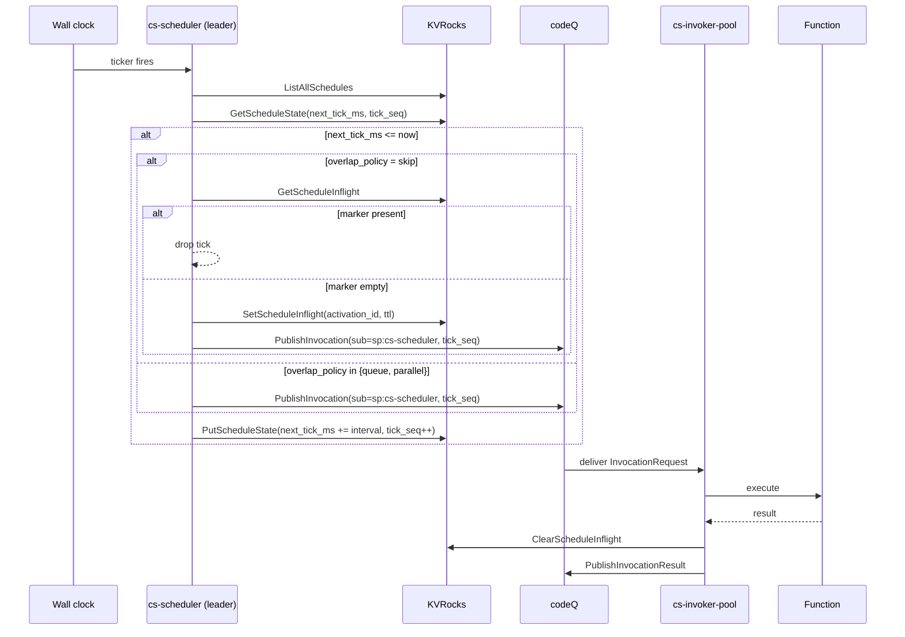

# Event Sources: Schedule

`cs-scheduler` is the periodic-trigger service for the Sous platform. It emits InvocationRequest messages on a fixed interval per registered schedule, turning wall-clock time into one of the four first-class event sources alongside HTTP, Cadence, and codeQ subscriptions. Each tick that fires resolves a function reference, builds a system-signed invocation envelope, and publishes it on the same codeQ topic that the gateway and poller use, so the downstream activation pipeline never has to know whether a request originated from a user, a Cadence worker, or the wall clock.

The scheduler is intentionally simple in v0.1. The execution model is `tick every N milliseconds` rather than calendar-aware cron expressions, because predictable intervals match agent-automation reconciliation loops better than calendar-based scheduling. Reconcilers, drift detectors, and steady-state probes all want "every 30 seconds, forever"; they do not want timezone-aware skips, DST shifts, or month-boundary surprises. The interval contract therefore became the default in the v0.1 cut, with a backward-compatible cron path added in epic E4.01 for the small set of customers that need calendar alignment (see `cmd/cs-control/main.go:951` for the validator that gates the two kinds).

The scheduler runs as a small, leader-elected daemon. Only one replica fires ticks at a time, so duplicate emissions are avoided during HA rollouts. Each schedule maintains an inflight marker in KVRocks to enforce the overlap policy, plus a tick-state record that holds the next-fire timestamp and a monotonic tick sequence. Crash recovery, leader handoff, and ordinary rolling deploys all converge on the same invariant: at most one InvocationRequest per schedule per tick, regardless of how many scheduler processes are momentarily alive.

## Schedule model

A schedule is a tenant-scoped record of shape `(tenant, namespace, name, every_seconds, overlap_policy, ref, payload, enabled)`, with a small set of optional cron extensions. The Go definition lives in `internal/api/types.go` (`ScheduleRecord`, line 285).

Field by field:

- `tenant` and `namespace` partition the schedule. Names are unique inside a `(tenant, namespace)` pair. Tenants cannot create schedules in other tenants; cs-control derives the tenant from the bearer principal, not from the request body.
- `name` is the operator-chosen handle. It must be 3 to 64 characters and forms the trailing segment of the KVRocks keys (see "Inflight markers" below).
- `every_seconds` is the tick interval for interval schedules. The validator constrains it to `[1, 86400]` so the scheduler never has to deal with sub-second loops or schedules longer than a day (`cmd/cs-control/main.go:977`).
- `overlap_policy` is one of `skip`, `queue`, or `parallel`. Defaults to `skip` when omitted. See "Overlap policies" below for the semantics.
- `ref` is a `ScheduleRef` of shape `(function, alias?, version?)`. The reference resolves to a concrete numeric version at fire time, not at schedule-create time, so a promotion of an alias takes effect on the next tick without rewriting the schedule.
- `payload` is a static JSON value (`any` in Go) that becomes the function's `event` body on every fire. It is opaque to the scheduler — the runtime sees it byte-for-byte.
- `enabled` lets operators pause a schedule without deleting it. Disabled schedules are listed by the scheduler loop but skipped before any tick math runs.

Optional cron extensions, added in E4.01 and append-at-bottom so prior records round-trip unchanged:

- `kind` is `"interval"` (default) or `"cron"`.
- `cron` is a 5-field expression (minute, hour, day-of-month, month, day-of-week) parsed by `internal/scheduler/cron.go`.
- `tz` is an IANA timezone (e.g. `America/Sao_Paulo`). Defaults to `UTC`.
- `jitter_ms` adds a deterministic per-schedule offset in `[0, jitter_ms)` derived from `fnv64a(tenant|namespace|name)`. Capped at one hour.

A worked interval schedule:

```json
{
  "name": "reconcile-every-30s",
  "every_seconds": 30,
  "overlap_policy": "skip",
  "ref": { "function": "reconcile", "alias": "prod" },
  "payload": { "mode": "drift-check" }
}
```

A worked cron schedule:

```json
{
  "name": "nightly-report",
  "kind": "cron",
  "cron": "0 3 * * *",
  "tz": "America/Sao_Paulo",
  "overlap_policy": "skip",
  "ref": { "function": "nightly-report", "alias": "prod" },
  "jitter_ms": 30000
}
```

The `ref` resolves to an alias or version at fire time. If a schedule targets `reconcile@prod` and the `prod` alias moves from version 17 to version 18, the next tick fires version 18; in-flight invocations of version 17 are unaffected. If a schedule pins an explicit `version: 17`, the scheduler emits version 17 forever (until the schedule is updated). This late-binding is intentional: operators promote aliases and the schedule follows.

The `payload` is static. There is no template interpolation, no `{{now}}` substitution, no per-tick computed body. Functions that need per-tick state read it from KVRocks or compute it from the activation envelope's `trigger.source.tick_seq`. A function that wants the current wall-clock time reads it inside the function body; the scheduler does not inject it. This keeps schedules pure data — two schedules with identical specs produce byte-identical event bodies on every fire, which makes recorded-and-replayed testing tractable.

### Validation rules

cs-control rejects malformed create requests with `CS_VALIDATION_FAILED` (HTTP 400). The validator is `validateScheduleRequest` in `cmd/cs-control/main.go:951`. The rules in summary:

- `name` length is `[3, 64]` after trimming surrounding whitespace.
- `kind` is `"interval"`, `"cron"`, or empty. Empty defaults to `cron` if `cron` is set, otherwise `interval`.
- For `kind=interval`, `every_seconds` is in `[1, 86400]`. The 86400 ceiling is a guardrail; operators wanting daily ticks should use `kind=cron` with `@daily`, which honors timezone and DST.
- For `kind=cron`, the expression must parse via `internal/scheduler/cron.go:Parse` and the timezone (default `UTC`) must load via `time.LoadLocation`.
- `cron` and `every_seconds` are mutually exclusive. Supplying both returns `CS_VALIDATION_FAILED`.
- `jitter_ms` is in `[0, 3_600_000]`. The 1-hour cap prevents pathological spread that would make a "5-minute" schedule fire at randomly-chosen places inside any given hour.
- `overlap_policy` is `skip`, `queue`, or `parallel`. Empty defaults to `skip`.
- `ref.function` is non-empty, length `[1, 64]`. Exactly one of `ref.alias` and `ref.version` may be set (alias and version are mutually exclusive at the reference level).

## Tick generation

The scheduler maintains a single wall-clock loop driven by a Go `time.Ticker`. At each tick boundary it evaluates which schedules are due (`next_tick_ms <= now`) and either fires or applies the overlap policy. The loop is in `cmd/cs-scheduler/main.go:69` (`run`) and the per-tick fan-out is in `cmd/cs-scheduler/main.go:136` (`tick`).

The loop period is `cs_scheduler.tick_ms` from the config, clamped to a minimum of 100ms. This is the scheduler's own evaluation cadence, not the schedule's interval — a schedule with `every_seconds: 30` does not require the loop to run every 30 seconds. The loop runs frequently (typically every second or two) and per-tick math advances each schedule's `next_tick_ms` independently.

For each enabled schedule on each loop iteration:

1. Read `ScheduleState` from `cs:schedule:{tenant}:{namespace}:{name}:state`. If `next_tick_ms == 0` (a brand-new schedule), seed it to `now`.
2. While `next_tick_ms <= now` and published count is below the catch-up cap, call `publishScheduleTick`, increment `tick_seq`, and advance `next_tick_ms` by either `every_seconds*1000` (interval) or `cron.NextAfter(prev, tz)` (cron).
3. If the catch-up cap is exhausted but the schedule is still behind, jump `next_tick_ms` forward from `now` so the next loop resumes at a fresh tick boundary rather than spinning.
4. Persist the updated state.

The catch-up cap (`cs_scheduler.max_catchup_ticks`, default 60) bounds the per-loop fan-out so a schedule that fell ten minutes behind during a leader handoff cannot suddenly publish 600 invocations in one loop iteration. See "Drift" below for the recovery semantics.

The monotonic `tick_seq` counter is embedded in every emitted InvocationRequest as `trigger.source.tick_seq`. It is sequential per schedule (not per scheduler process), survives leader handoff (because it lives in KVRocks), and gives downstream consumers a stable per-schedule sequence for deduplication, alerting, and replay.

### Invocation envelope

Each tick produces a single `InvocationRequest` message published through the messaging plugin (`broker.PublishInvocation`). The envelope, constructed at `cmd/cs-scheduler/main.go:272`, sets the following fields:

- `activation_id` — fresh UUID per fire. Becomes the activation's primary key in KVRocks and in ledgerDB.
- `request_id` — `req_<UUID>` for correlation across logs.
- `tenant`, `namespace` — copied from the schedule record.
- `ref` — the resolved FunctionRef with the alias preserved and `version` populated to the concrete integer resolved at fire time.
- `trigger.type` — the literal string `"schedule"`.
- `trigger.source` — a map containing `schedule_name` and `tick_seq`.
- `principal` — the system principal `sp:cs-scheduler` (see "Identity at fire time").
- `deadline_ms` — `now + version.config.timeout_ms` as a Unix-ms timestamp. The invoker enforces this as the activation deadline.
- `event` — the schedule's static `payload`, unmodified.

The envelope is identical in shape to envelopes produced by cs-http-gateway and cs-cadence-poller; only the `trigger.type` and the principal differ. Downstream code (cs-invoker-pool, the runtimes, ledgerDB writers) consumes all three sources through one code path.

## Overlap policies

A schedule's `overlap_policy` controls what happens when a tick arrives while a prior invocation of the same schedule is still running. Three values are supported, validated at create time by `cmd/cs-control/main.go:999`.

### skip

`skip` is the conservative default. Before firing a tick, the scheduler reads the schedule's inflight marker (`cs:schedule:{tenant}:{namespace}:{name}:inflight`). If the marker is non-empty, the tick is silently dropped — the prior activation has not yet reported a result, so the scheduler refuses to start another. The invoker clears the marker on terminal completion (success or failure), at which point the next tick fires normally.

`skip` is the right policy for reconcilers and idempotent long-running probes. If a drift-check function occasionally takes 90 seconds and the schedule runs every 30 seconds, `skip` ensures the system never runs two concurrent drift-checks; the second tick is dropped, the third is dropped, and the fourth fires once the first completes. The tradeoff is that a slow function effectively lowers its own tick rate.

### queue

`queue` lets the scheduler publish every tick unconditionally and pushes the concurrency enforcement to the invoker. The function's published version sets `max_concurrency: 1`, so the invoker serializes execution: the second tick's InvocationRequest sits in the codeQ topic until the first activation finishes, then runs in order.

`queue` is appropriate when each tick must execute eventually (so dropping is not acceptable), but the function's side effects require strict serialization. The tradeoff is unbounded queue growth if the function is permanently slower than the tick rate; cs-invoker-pool's queue-depth metrics are the operator's early warning.

### parallel

`parallel` publishes every tick with no overlap protection. The invoker runs activations up to `max_concurrency` concurrently. New ticks arriving while N activations are running simply start the N+1-th if capacity allows, or queue otherwise.

`parallel` is appropriate for stateless workloads where concurrent execution is safe and desirable — a fan-out heartbeat, a per-tick health probe, a cache-warmer that does not mind running twice. The tradeoff is the loss of overlap protection: badly-behaved functions can saturate their own invoker capacity.

The scheduler itself only consults the inflight marker for `skip`. For `queue` and `parallel` it publishes every due tick and delegates concurrency to cs-invoker-pool. The relevant branch is in `publishScheduleTick` at `cmd/cs-scheduler/main.go:246`.

## Inflight markers

The inflight marker is the scheduler's overlap-protection primitive for `skip` policy. It is a single KVRocks key per schedule:

```
cs:schedule:{tenant}:{namespace}:{name}:inflight
```

The key layout is defined in `internal/kv/keys.go:103` (`ScheduleInflightKey`). The value is the `activation_id` of the in-flight invocation, useful for cross-referencing in audit logs and runbooks.

The lifecycle is straightforward:

1. At fire time (for `skip` schedules only), the scheduler writes the marker with `SetScheduleInflight` and a TTL of `timeout_ms + 5000ms` — the function's configured timeout plus a five-second grace.
2. The invocation runs through cs-invoker-pool. On terminal completion (success, failure, or timeout), the invoker calls `ClearScheduleInflight` and the marker is deleted.
3. If the invoker crashes or the activation is lost, the TTL eventually expires and the next tick fires regardless. The TTL prevents a single bad activation from permanently silencing a schedule.

The TTL is the safety net for catastrophic failures — a crashed invoker, a lost message, a partition that loses the result publish. Under normal operation the marker is cleared explicitly long before the TTL fires; the TTL exists so a crashed invoker eventually allows the next tick.

State (next-tick time, tick sequence) lives in a separate key, `cs:schedule:...:state`, with no TTL — that key persists for the schedule's lifetime. The two keys are independent: deleting the inflight marker does not lose tick state, and resetting tick state does not affect the inflight marker.

### KVRocks key layout

The complete per-schedule key set is defined in `internal/kv/keys.go`:

| Key | Type | TTL | Purpose |
| --- | --- | --- | --- |
| `cs:schedule:{tenant}:{namespace}:{name}:meta` | string (JSON-encoded `ScheduleRecord`) | none | Schedule definition. Written on create, read on every loop iteration. |
| `cs:schedule:{tenant}:{namespace}:index` | set of names | none | Per-namespace name index. Maintained on create and delete. |
| `cs:schedule:{tenant}:{namespace}:{name}:state` | string (JSON-encoded `ScheduleState`) | none | `next_tick_ms` and `tick_seq`. Written on every tick advance. |
| `cs:schedule:{tenant}:{namespace}:{name}:inflight` | string (`activation_id`) | `timeout_ms + 5s` | Overlap-protection marker for `skip` policy. Set at fire, cleared on terminal completion. |

Listing all schedules across tenants for the scheduler loop walks the indexes via a scan over `cs:schedule:*:*:index` (`internal/kv/store.go:669`). The scheduler does not maintain a global index — the namespace-scoped indexes are aggregated at scan time. Tenants typically host a handful of namespaces and a handful to a few hundred schedules per namespace, so the scan is cheap relative to the per-tick fan-out.

Schedule deletion uses a pipelined `DEL` of four keys plus an `SREM` on the namespace index (`internal/kv/store.go:718`). The pipeline is best-effort atomic: a partial failure leaves orphan keys that the scheduler ignores (the index removal removes the schedule from `ListAllSchedules` immediately).

## Leader election

The scheduler runs HA by running multiple replicas and electing exactly one leader. Only the leader fires ticks; the others sit idle on the leader-acquisition loop and take over if the leader's lease expires.

The mechanism is a lease in KVRocks, implemented in `cmd/cs-scheduler/main.go:102` (`leaderLoop`). The lease key is `cs:scheduler:leader:lease`, the lease value is a per-process UUID, and the TTL is 5 seconds. Every 2 seconds each replica runs:

1. `TryAcquireLease(leaseKey, leaseVal, 5s)` — atomic `SET NX EX` against KVRocks. If it succeeds, this replica is the leader.
2. If the acquire failed because the key already exists, read the current value with `GetLeaseValue`. If it matches this replica's UUID, the replica is the existing leader and renews with `ExtendLease(5s)`. If it does not match, another replica is leader; this replica yields.

The 2-second renewal cadence against a 5-second TTL gives two missed-renewal grace periods before the lease expires, so a single GC pause or KVRocks blip does not trigger a leader handoff. A replica that loses the lease (network partition, KVRocks unavailable) sets `isLeader=false` and stops firing ticks immediately; ticks resume when the lease can be re-acquired.

The `isLeader` flag is an atomic bool checked at the top of each loop iteration in `run` (`cmd/cs-scheduler/main.go:77`). When false, the loop spins without firing — ticks are not buffered locally during periods of non-leadership.

Leader election is opt-in via `cs_scheduler.leader_election.enabled`. Single-replica deployments can leave it disabled and the constructor sets `isLeader=true` at startup so the scheduler fires unconditionally. Production deployments enable it.

### Configuration

The scheduler's behavior is controlled by the `cs_scheduler` block in the platform config (`internal/config/config.go:191`):

```yaml
cs_scheduler:
  tick_ms: 1000             # evaluation cadence in ms; clamped to 100 minimum
  max_catchup_ticks: 60     # per-schedule per-loop fire cap during catch-up
  leader_election:
    enabled: true           # require a KVRocks lease to fire
    lease_name: cs-scheduler-leader
```

`tick_ms` sets how often the loop wakes up and walks the schedule list. Smaller values reduce the worst-case latency between a schedule becoming due and the tick firing, at the cost of more KVRocks reads per second. The default of 1000ms gives sub-second worst-case latency for second-granular schedules.

`max_catchup_ticks` is the per-schedule per-loop fan-out cap. See "Drift" above for the recovery semantics.

`leader_election.enabled=false` is appropriate for dev environments and single-replica deployments. Production multi-replica deployments must enable it; running multiple leaders silently produces duplicate emissions.

## Drift

The scheduler does not back-fill ticks across periods of non-leadership. If the scheduler is paused (process restart, leader handoff, KVRocks unavailable), ticks that should have fired during the pause are not retroactively emitted. The next tick fires at the next wall-clock boundary computed from the persisted `next_tick_ms`.

The behavior is governed by the catch-up cap. When the scheduler resumes after a pause:

1. It reads `next_tick_ms` from KVRocks. If the schedule fell behind, this value is in the past.
2. The tick loop repeats `publishScheduleTick` and advances `next_tick_ms` by the interval, up to `max_catchup_ticks` times.
3. If the schedule is still behind after the cap (catastrophic pause, days behind), the scheduler jumps `next_tick_ms` forward from `now` and resumes at the next aligned boundary — the intermediate ticks are abandoned.

The cap defaults to 60 and is configurable. The intent is to recover gracefully from short pauses (a 90-second rolling deploy will catch up three skipped 30-second ticks) without flooding the broker after a long pause (a multi-day outage will not publish 8,640 invocations the moment the scheduler returns).

There is no operator-facing "replay missed ticks" knob. Functions that need at-most-N-skips behavior can read `tick_seq` from the trigger source and detect gaps; functions that need exactly-once-per-wall-clock-tick semantics should use Cadence workflows instead, which provide proper durable timers.

For cron schedules the catch-up semantics walk the cron evaluator: each catch-up iteration computes the next firing time strictly after the previous via `Schedule.NextAfter(prev, tz)`. A pause that spans a daylight-saving transition therefore advances through the transition correctly — the walker never emits ticks at impossible local times, never double-fires duplicated hours, and never wedges in a parse-error loop because parse failures fall back to a 60-second retry (`cmd/cs-scheduler/main.go:209`).

Operators who need to nudge a schedule forward — for example, after fixing a function bug and wanting the next fire immediately — can delete and recreate the schedule, which resets `next_tick_ms` to `now`. There is no `POST /schedules/{name}:trigger` synchronous-fire endpoint in v0.1.

## Schedule CRUD

The control plane exposes a small REST surface for schedule management. The routes are wired in `cmd/cs-control/main.go:120-121`.

| Action | Method | Path | Required principal action |
| --- | --- | --- | --- |
| Create | POST | `/v1/tenants/{tenant}/namespaces/{namespace}/schedules` | `cs:schedule:create` |
| Delete | DELETE | `/v1/tenants/{tenant}/namespaces/{namespace}/schedules/{name}` | `cs:schedule:delete` |

Create takes a `CreateScheduleRequest` body and returns the persisted `ScheduleRecord`. Delete is idempotent and clears the meta record, the per-tenant index, and the tick-state and inflight keys in a single pipeline (`internal/kv/store.go:718`).

There is no update endpoint in v0.1. To change a schedule's interval, payload, or reference, operators delete and recreate. The next-tick clock resets on recreate. There is also no list-or-get endpoint exposed publicly; cs-scheduler reads `ListAllSchedules` directly from KVRocks (control-plane internal call), and operators inspect via `cs-cli` or kvrocks-cli. A pagination-friendly list endpoint is on the roadmap.

The CLI maps onto the REST surface:

```
cs schedule create <name> --every 30 --fn reconcile@prod [--payload payload.json] [--namespace default]
cs schedule delete <name> [--namespace default]
```

The CLI parses `--fn` as `function@aliasOrVersion` and produces a `ScheduleRef` with either `alias` or `version` populated depending on whether the suffix parses as an integer (`cmd/cs-cli/main.go:527`). The default overlap policy is `skip`; setting `queue` or `parallel` requires editing the JSON body directly because the CLI flag set does not yet expose `--overlap`.

Cross-link: see [Developers: REST API](Developers-REST-API) for envelope conventions, error codes, and authentication headers.

## Identity at fire time

Every InvocationRequest the scheduler emits carries a system principal that identifies the scheduler itself, not any human operator. The principal is constructed in `publishScheduleTick`:

```go
principal := api.Principal{
    Sub:   "sp:cs-scheduler",
    Roles: []string{"role:worker", "sp:cs-scheduler"},
}
```

The `sp:` prefix denotes a service principal — a non-human identity managed by Sous, not by Tikti's user database. `sp:cs-scheduler` is the only subject any scheduler-originated activation will ever carry, regardless of the original operator who created the schedule. This is deliberate: the schedule outlives the operator's session, and the function should authorize based on "the scheduler is invoking me" rather than "alice@example.com is invoking me from three months ago".

The function's published version controls who may invoke it on the schedule path via `authz.invoke_schedule_roles`, a per-version allowlist. Before publishing the InvocationRequest, the scheduler calls `IntersectsRoles(meta.Config.Authz.InvokeScheduleRoles, principal)` (`cmd/cs-scheduler/main.go:264`). If the principal's roles do not intersect the allowlist, the tick is dropped silently — the schedule is technically valid but the function has revoked schedule-invoke permission.

Common allowlist values:

- `["role:worker"]` — accepts any service principal that carries `role:worker`. The scheduler always does. This is the typical "any system can run me on schedule" setting.
- `["sp:cs-scheduler"]` — accepts only the scheduler service principal. Use when a function should be scheduler-invokable but not invokable by other service principals (e.g. not by Cadence activities).
- `[]` (empty) — no principal can invoke. Effectively disables the schedule path; create-time validation in cs-control normally rejects this for scheduled functions.

The schedule's IAM check is the function's lever, not the operator's. An operator who creates a schedule has `cs:schedule:create` against the namespace; the schedule's actual fire-time authorization is governed by the function version's allowlist, which the function owner set at publish time. This separation lets a function owner refuse to run on schedule even if the namespace operator wires one up.

Cross-link: see [Enabled Services: Tikti IAM](Enabled-Services-Tikti-IAM) for principal model, role conventions, and the `cs:schedule:*` action taxonomy.

## Observability

The scheduler emits metrics, structured logs, and ledgerDB audit events.

Metrics (Prometheus, exposed on `:8083/metrics`):

- `cs_scheduler_ticks_total{tenant,namespace,schedule}` — counter, incremented on every successful tick fire. The primary "the scheduler is alive" signal.
- `cs_scheduler_publish_errors_total` — counter, incremented on every publish failure (broker unavailable, version resolution failed, IAM rejection). Alerts on a non-zero rate.

Both names are referenced verbatim by the bundled Grafana dashboard in `deploy/observability/control-plane.json`.

Structured logs (JSON, single line per event, written via `observability.Logger`):

- `info` at startup with the resolved tick period and leader-election mode.
- `warn` on per-schedule transient failures: cron parse errors, state-write errors, broker publish errors. These do not crash the loop; the next tick retries.
- `error` on fatal startup failures (config load, persistence registry, broker registry).

ledgerDB audit events are emitted by cs-control (not cs-scheduler) on `schedule.create` and `schedule.delete`. The scheduler itself is read-only against the schedule meta records and does not emit audit events for ticks — the InvocationRequest envelope is the audit trail for fires.

The HTTP control surface on `:8083` exposes:

- `GET /healthz` — process liveness, always returns 200.
- `GET /readyz` — readiness, calls `store.Ping` and returns 503 if KVRocks is unreachable.
- `GET /metrics` — Prometheus scrape endpoint.

Cross-link: see [Operators: Observability](Operators-Observability) for the full metric catalog, dashboard layout, and SLO definitions.

### Troubleshooting

Symptoms an operator may see, and where to look:

- **A schedule never fires.** Check `cs_scheduler_ticks_total` for the schedule's labels. If the counter is zero, either the schedule is `enabled: false`, the leader-election lease is held by no one (no leader), or `ListAllSchedules` is failing — check the scheduler's structured logs at warn level. If the counter is incrementing but no activations land, the IAM allowlist (`authz.invoke_schedule_roles`) is rejecting the principal; check ledgerDB for `schedule.create` events to verify the schedule exists and inspect the published version's `authz` block.
- **A schedule fires twice per tick.** Leader-election is not enabled or two replicas hold leases concurrently. Verify `cs_scheduler.leader_election.enabled=true` in the config and check `cs:scheduler:leader:lease` in KVRocks — only one replica's UUID should be present.
- **`skip` schedule appears to be permanently silent.** Inspect `cs:schedule:{tenant}:{namespace}:{name}:inflight`. If the value is non-empty and the TTL is short, the prior activation is genuinely running. If the TTL is long or the marker is stuck, the invoker likely crashed without clearing it; wait for TTL expiry or delete the key manually.
- **Cron schedule fires at unexpected times after DST.** Verify the `tz` field on the schedule meta record matches operator expectations. Confirm the Go runtime has access to zoneinfo (containerized deployments must include `tzdata`); a missing zoneinfo falls back to a 60-second retry loop and logs at warn.
- **Tick burst after a deploy.** Expected behavior if the catch-up cap had not been reached. To prevent it on hot-paths, lower `max_catchup_ticks` so the scheduler abandons more aged ticks; to allow more catch-up, raise it.

## Roadmap

The interval-first model is the v0.1 default and remains the recommended path for reconciler-shaped workloads. Cron expressions arrived in E4.01 (`8ecacd5`) as a backward-compatible opt-in; they exist for the calendar-aligned cases (nightly reports, end-of-month aggregations) that intervals cannot express cleanly.

Items deferred past v0.1:

- Per-second cron granularity. Current cron resolution is per-minute; sub-minute work must use intervals.
- Update endpoint and CLI verb. Operators currently delete-and-recreate.
- List and Get REST endpoints exposed to tenants. Internal calls work today; the external surface is on the roadmap.
- Schedule-level pause/resume distinct from delete. The `enabled` field exists on the record but is not surfaced via REST.
- Cross-schedule rate limiting. A tenant that creates 10,000 one-second schedules can saturate the broker today; capacity guardrails are tracked separately.
- Calendar-aware "skip on holidays" semantics. Out of scope for v0.1; expressible via function-level guards.

Cross-link: see [Reference: Roadmap](Reference-Roadmap) for the full delivery sequence.

## Worked operator scenarios

### Creating an interval schedule that calls an aliased function

An operator wants `reconcile@prod` to run every 30 seconds with skip-on-overlap semantics. The CLI invocation:

```
cs schedule create reconcile-30s --every 30 --fn reconcile@prod --namespace payments
```

cs-cli loads the auth config, builds a `CreateScheduleRequest`, POSTs to `/v1/tenants/{tenant}/namespaces/payments/schedules`, and prints the persisted record. cs-control validates the request, persists the meta record and namespace index, and emits a `schedule.create` ledgerDB event. The scheduler's next loop iteration picks up the schedule via `ListAllSchedules`, seeds `next_tick_ms` to the current wall clock, and the first tick fires within `tick_ms` milliseconds.

The function's published `prod` version must include `sp:cs-scheduler` or `role:worker` in `authz.invoke_schedule_roles`. The publish CLI surfaces this via `--invoke-schedule-roles`:

```
cs fn publish reconcile --alias prod --invoke-schedule-roles role:worker --runtime cs-js ...
```

If the allowlist is empty, the scheduler will fire the tick but `IntersectsRoles` returns false and the tick is dropped — the schedule is technically running, but no activations are emitted. This is intentional defensive behavior: a function owner has the final say.

### Promoting an alias under a running schedule

The schedule from the prior example points at `reconcile@prod`. The team publishes `reconcile` version 18 and promotes the `prod` alias from version 17 to 18:

```
cs fn publish reconcile --runtime cs-js ...     # creates version 18
cs fn alias-set reconcile --alias prod --version 18
```

The schedule record is unchanged. On the very next tick the scheduler calls `ResolveVersion(tenant, namespace, "reconcile", "prod", 0)`, which now returns 18, and emits an InvocationRequest targeting version 18. Activations of version 17 already running under the prior alias resolution complete normally; new activations target 18.

If `prod` is rolled back to 17, the next tick re-resolves to 17. The schedule is immune to alias churn — it always invokes whatever `prod` currently points to.

### Switching a schedule from interval to cron

There is no in-place update. The operator deletes and recreates:

```
cs schedule delete reconcile-30s --namespace payments
# then write reconcile.json with the cron body
curl -X POST -H "Authorization: Bearer $TOKEN" \
  -d @reconcile.json \
  "$API/v1/tenants/$TENANT/namespaces/payments/schedules"
```

with `reconcile.json`:

```json
{
  "name": "reconcile-business-hours",
  "kind": "cron",
  "cron": "*/5 9-17 * * 1-5",
  "tz": "America/Sao_Paulo",
  "overlap_policy": "skip",
  "ref": { "function": "reconcile", "alias": "prod" }
}
```

Delete is idempotent and clears state + inflight, so the new schedule starts with `tick_seq=0` and `next_tick_ms=0` (which the loop seeds to `now`). The first tick fires at the next cron-aligned wall-clock boundary in `America/Sao_Paulo`.

### Cron expression cookbook

A handful of patterns that come up repeatedly:

- `*/5 * * * *` — every five minutes on the multiples of five.
- `0 */15 * * *` — at minute 0 every fifteen minutes. Equivalent to `*/15 * * * *` only when phase is irrelevant; the former pins to `:00, :15, :30, :45`.
- `0 9-17 * * 1-5` — hourly during business hours, Monday through Friday, evaluated in the schedule's timezone.
- `0 3 1 * *` — 03:00 local on the first day of every month. Useful for end-of-billing-cycle aggregations.
- `@daily` — equivalent to `0 0 * * *`. Use cron macros when expressing daily/hourly intent so future readers can read the intent at a glance.
- `0 0 * * 0` — Sunday midnight. Day-of-week 0 and 7 both denote Sunday.

Per-second cron is not supported. Sub-minute work must use interval schedules.

## Comparison with other event sources

The scheduler sits alongside three other event sources. Each emits envelopes through the same codeQ topic and downstream activation pipeline; the differences are in trigger semantics, identity, and ordering guarantees.

| Aspect | Schedule | HTTP | Cadence | codeQ subscription |
| --- | --- | --- | --- | --- |
| Origin | Wall-clock tick | External HTTP request | Cadence ActivityTask poll | Broker message arrival |
| `trigger.type` | `schedule` | `http` | `cadence` | `codeq` |
| Principal | `sp:cs-scheduler` | Caller's Tikti principal | `sp:cs-cadence-poller` | `sp:cs-control` |
| Authorization | `authz.invoke_schedule_roles` | `authz.invoke_http_roles` | `authz.invoke_cadence_roles` | `authz.invoke_subscription_roles` |
| Ordering | Per-schedule `tick_seq` monotone | None across requests | Per-tasklist FIFO | Per-topic FIFO (codeQ ordering) |
| Overlap protection | `skip\|queue\|parallel` | None (concurrency-limited by version) | Cadence-side `max_concurrency` | None |
| Payload | Static per-schedule JSON | HTTP request mapped to event shape | Cadence ActivityTask input | Message body |
| Retries on failure | None — next tick is independent | Caller retries | Cadence retries via its policy | DLQ after exhaustion (see E4.03) |

The mental model: schedules are the "platform-internal cron" of Sous. They produce a stream of activations independent of any external caller, with system identity and per-schedule sequencing. If a function only fires on a schedule and never accepts HTTP traffic, its published version can leave `authz.invoke_http_roles` empty.

## End-to-end flow


