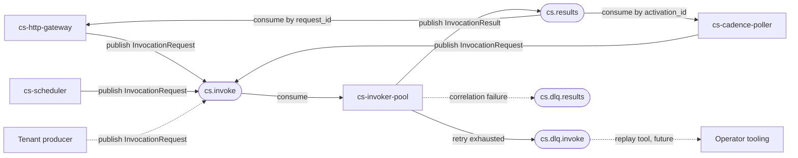

# Event Sources: codeQ Topics

codeQ is the Kafka-compatible message bus that decouples Sous's ingress services (`cs-http-gateway`, `cs-scheduler`, `cs-cadence-poller`, and any tenant-owned producer) from the execution fabric (`cs-invoker-pool`). Every interaction between an ingress component and the invoker pool travels as a structured envelope across one of four named topics. No service in Sous calls another over a synchronous RPC for the purpose of triggering a function; the only synchronous edge a request sees is the HTTP gateway pinning a goroutine to await a result on `cs.results`, and even that is implemented as a consumer rather than a callback. That single design choice is what makes the system horizontally scalable and crash-safe.

The protocol comprises four topics, a canonical envelope format, and a few hard rules about correlation and idempotency. The envelope is JSON, the schemas live under `spec/`, and the wire types are produced by `internal/codeq` (see `internal/codeq/codeq.go`). Concretely, codeQ in v0.1 is implemented atop Redpanda — a Kafka-protocol-compatible broker — using the `github.com/segmentio/kafka-go` client. The `messaging.Provider` interface (`internal/plugins/messaging/messaging.go`) is the platform's seam: alternative drivers (an in-process bus for tests, an HTTP-proxied transport for hosted deployments, or a different Kafka-protocol broker entirely) plug in by registering a factory with `internal/plugins/registry`.

The choice of a topic-and-consumer-group model gives Sous backpressure, independent scaling, and the ability to replay history when investigating an incident. Backpressure flows naturally: if invokers fall behind, the broker buffers `cs.invoke` and consumer lag rises until publishers slow or fan out. Independent scaling means `cs-http-gateway` and `cs-invoker-pool` resize on different axes — gateway replicas match request concurrency, invoker replicas match execution concurrency. Replay means an operator who needs to understand why a tenant's reconcile job failed can rewind a consumer-group offset to a known timestamp and re-run the trace, without re-issuing the original HTTP call.

## 1. Topics

Sous defines four well-known topics. Their names are configurable under `plugins.messaging.codeq.topics` in `config.example.yaml`; the defaults — and the names used everywhere in this document — are:

- `cs.invoke` — `InvocationRequest` messages produced by ingress services and consumed by `cs-invoker-pool`. This is the load-bearing topic of the platform; every function activation begins as an envelope on `cs.invoke`.
- `cs.results` — `InvocationResult` messages produced by `cs-invoker-pool` after each activation completes. Consumed by `cs-http-gateway` (for synchronous HTTP responses), `cs-cadence-poller` (to report back to `code-flow`), and any other service that needs to await a result.
- `cs.dlq.invoke` — `InvocationRequest` envelopes that exhausted their retry budget (see E4.03 and `internal/api/retry.go`). Messages here are wrapped in a typed `DLQEnvelope` that carries the original payload plus a per-attempt history.
- `cs.dlq.results` — `InvocationResult` envelopes that could not be correlated or delivered to a waiting consumer. Reserved for result-side failures.

### Producers and consumers



### Partitioning

Every envelope is keyed by tenant when published. The producer path in `internal/codeq.Kafka.publishWithID` writes each message with `Key: []byte(tenant)`, which is what Kafka and Redpanda hash into the partition assignment. This has two consequences worth understanding before sizing a cluster.

- Tenant-local ordering is preserved. All envelopes for a single tenant land on the same partition, so a consumer that owns that partition observes them in publish order. Cross-tenant ordering is not preserved and is not promised — different tenants can interleave freely.
- The platform tolerates skew but does not balance it. A single high-traffic tenant pins one partition, so capacity planning should be done at the partition level rather than the topic level. Operators who anticipate a long-tail of small tenants and a few large ones should provision enough partitions per topic that no large tenant exceeds a single partition's throughput.

Per-tenant DLQ topics (the `cs.dlq.tenant.<tenant>` convention recognized by `RetryPolicy.DLQTopic`) inherit the same keying.

### Retention

Retention is set on the broker, not in Sous configuration. The repository's `docker-compose.yml` does not pin a retention value, so the local stack inherits the Redpanda default (currently seven days, broker-wide). Production deployments should tune retention per topic — `cs.invoke` and `cs.results` can run with hours rather than days because the activation record in KVRocks is the durable record of execution, while `cs.dlq.invoke` and `cs.dlq.results` benefit from longer retention so an operator has time to investigate before replay material disappears. See [Observability](Observability) for guidance on alerting before retention bites a backlog.

### Consumer-group semantics

The four topics are consumed via Kafka consumer groups. Each `cs-invoker-pool` replica derives its group as `cs-invoker-pool-<hostname>` (see `cmd/cs-invoker-pool/main.go`); all worker goroutines within that replica share the group, so the broker balances partitions of `cs.invoke` across the replica's workers. The HTTP gateway's `WaitForResult` is the deliberate exception: it joins a unique per-request group (`cs-http-gateway-wait-<uuid>` from `internal/codeq/codeq.go`), so its read of `cs.results` does not affect anyone else's offsets and ends when the goroutine exits.

Subscription bindings (see `cmd/cs-control/subscriptions.go`) follow the same model: each binding has a stable `group_id` derived as `cs-sub-<tenant>-<namespace>-<name>`, and cs-control replicas joining the same group cooperate on a single offset cursor. This is the standard Kafka partition-balance contract; it is what makes binding fan-out safe under replica scaling.

## 2. Envelope format

Every message on every codeQ topic is wrapped in the same envelope. The wire shape is defined by the `Envelope` struct in `internal/codeq/codeq.go`:

```json
{
  "schema": "cs.envelope.v1",
  "id": "msg_a1b2c3...",
  "ts_ms": 1730000000000,
  "tenant": "t_abc123",
  "type": "InvocationRequest",
  "body": { }
}
```

The fields have load-bearing semantics:

- `schema` — a version discriminator. v0.1 emits the literal string `cs.envelope.v1`; consumers MUST reject envelopes whose schema they do not recognize. See "Schema evolution" below.
- `id` — the unique-per-logical-message identifier used for consumer-side deduplication. Producers SHOULD use `DeterministicMessageID(tenant, activation_id, seq)` from `internal/codeq/dedup.go` to derive an id that collapses on retry. Legacy random ids (`msg_` + UUID) remain valid and the consumer simply marks them seen.
- `ts_ms` — publish timestamp in Unix milliseconds. Used for observability (lag computation) and as a tiebreaker in incident reconstruction. Not used for ordering.
- `tenant` — the owning tenant, lifted out of the payload for fast routing and for keying. The body MUST agree with this field.
- `type` — the discriminator that tells the consumer how to decode `body`. Values in v0.1 are `InvocationRequest`, `InvocationResult`, and `DLQInvocation`.
- `body` — the inner payload, encoded as raw JSON. The shape is determined by `type`. The body is itself versioned via the `$id` in the corresponding JSON Schema document under `spec/`.

The envelope is what allows the topic-and-payload contract to evolve independently. A new payload type can ride the same envelope; a new envelope schema can carry the same payloads. See `spec/cs.invoke.v1.json` and `spec/cs.results.v1.json` for the canonical body schemas.

## 3. InvocationRequest schema

The `InvocationRequest` body is described by `spec/cs.invoke.v1.json` (`$id: cs.invoke.v1`). It is the unit of work the invoker pool consumes. Every field below is part of the schema; required fields are flagged in the JSON Schema document.

Required fields:

- `activation_id` — a UUID v4 minted at ingress. This is the platform-wide identifier of the activation; logs, metrics, and persisted activation records all key on it. The invoker pool uses it for activation-level deduplication.
- `request_id` — an opaque caller-correlation token, 8 to 64 characters. Synchronous callers (the HTTP gateway, the Cadence poller) wait on this id when joining `cs.results`. The id is not platform-globally unique — it is unique per ingress request.
- `tenant` — the owning tenant identifier, mirrored from the envelope. Validated at ingress and re-validated at the invoker.
- `namespace` — the namespace within the tenant. Functions are addressed as `(tenant, namespace, function)`.
- `ref` — a function reference with required field `function` and optional `alias` and `version`. When `version` is missing, the invoker resolves the alias to a concrete version at activation time.
- `trigger` — an object with required `type` (one of `http`, `schedule`, `cadence`, `api`) and `source` (a free-form object whose shape depends on `type`). Subscription triggers (`type: subscription`) ride on the same envelope and are documented in [HTTP Invoke Path](HTTP-Invoke-Path) and [Scheduler](Scheduler).
- `principal` — the authenticated subject, with required `sub` and `roles` fields. Set by ingress after authentication; the invoker uses it for downstream authorization checks and audit attribution.
- `deadline_ms` — a wall-clock deadline (Unix milliseconds) past which the invoker MUST short-circuit. Producers MUST set this; the invoker computes the remaining budget at dispatch time.
- `event` — the user-visible payload. The shape is opaque to the platform.

Optional fields:

- `trigger.source.attempt` — a 1-indexed retry counter, normalized by the invoker on re-publish.
- `trigger.source.retry_policy` — the per-trigger retry-and-DLQ policy (see "Retry and DLQ" below).
- `trigger.source.parent_activation_id` — a back-pointer set by the gateway when an invocation was initiated by another activation; used for child-activation lineage.
- `trigger.source.traceparent` — W3C trace context injected at ingress.

For the full machine-readable schema and a side-by-side reference of all platform schemas, see [Schemas](Schemas).

## 4. InvocationResult schema

The `InvocationResult` body is described by `spec/cs.results.v1.json` (`$id: cs.results.v1`). It is what the invoker publishes after every activation, regardless of outcome.

Required fields:

- `activation_id` — the same UUID that arrived on the `InvocationRequest`. Producers MUST echo it verbatim.
- `request_id` — the same correlation token that arrived on the `InvocationRequest`. Producers MUST echo it verbatim.
- `status` — one of `success`, `error`, or `timeout`. A `timeout` is reported when the deadline elapsed during user code; a generic invoker failure (codec error, sandbox crash) reports `error`.
- `duration_ms` — wall-clock duration of user code, from dispatch to handler return. Excludes queue time.

Optional fields:

- `result` — an HTTP-like response object for the sync-HTTP path: `statusCode` (100–599), `headers` (string-keyed string map), `body` (string, possibly base64-encoded), and `isBase64Encoded`. Functions that do not target HTTP responses leave this empty.
- `error` — a structured error object with `type` (error class name), `message` (free-form text), and `stack` (truncated to 8,192 bytes by the invoker).

The invoker publishes exactly one result per activation. A consumer that observes two `InvocationResult` envelopes with the same `activation_id` SHOULD treat the second as a redelivery and rely on consumer-side dedup (see "Idempotency" below). The invoker enforces single-publish; the dedup contract protects against at-least-once redeliveries.

For the full schema, see [Schemas](Schemas).

## 5. Correlation

Sous uses two correlation ids, generated at ingress, that serve different audiences.

Pollers — `cs-http-gateway` for sync HTTP, `cs-cadence-poller` for activity completion — await results by joining on `request_id`. The id is short-lived and request-scoped: the ingress service sets it, embeds it in the `InvocationRequest`, and then waits on `cs.results` for an `InvocationResult` carrying the same value. `WaitForResult` in `internal/codeq/codeq.go` is the canonical implementation. The id does not survive past the synchronous return; it is not persisted on the activation record.

Activations — the persisted record of execution — are joined by `activation_id`. The id is generated at ingress as a UUID v4 and threaded through every subsequent record: the `InvocationRequest`, the `InvocationResult`, the per-activation log stream, the metrics labels, and the trace span. Operators investigating an incident search by `activation_id`; tenants viewing their dashboards search by `activation_id`; auditors reconstructing a control-plane mutation search by `activation_id`. It is the long-lived correlation handle.

Both ids are generated at ingress. The gateway mints them; the scheduler mints them; the Cadence poller mints them. The invoker never mints either id — it only echoes them — and that property is what makes activations safe to deduplicate.

## 6. Idempotency

codeQ is an at-least-once transport. A producer that retries after a transient broker error, or a consumer that crashes after handling but before committing its offset, will cause the same logical message to be delivered twice. Sous closes this gap with a two-layer scheme.

The first layer is a deterministic envelope id. Producers that have a stable `(tenant, activation_id, seq)` tuple — which every ingress service has by construction — derive their envelope id via `DeterministicMessageID(tenant, activation_id, seq)` from `internal/codeq/dedup.go`. The seq is `0` for `InvocationRequest` and `1` for `InvocationResult`. A retried publish yields the same id; the broker sees an indistinguishable duplicate.

The second layer is consumer-side dedup. Every `Kafka` consumer maintains a `SeenSet` keyed by `envelope.id`. The first delivery records the id; any subsequent delivery within the TTL window (one hour by default; see `dedupTTLDefault` in `internal/codeq/codeq.go`) is acknowledged but not dispatched to the handler. Producers that want to bypass dedup for tests can do so by injecting a nil `SeenSet` via `WithDedup`.

The dedup `SeenSet` defaults to the in-memory `NewMemorySeenSet` (suitable for single-node dev and unit tests); production deployments back it with a KVRocks-resident store so dedup state survives invoker restarts and load-balances across replicas (see [Storage: KVRocks](Storage-KVRocks)). The HTTP gateway carries the same idea further with its own request-level idempotency store (`internal/idempotency`), which collapses retried HTTP calls before they ever reach the topic.

Function authors should still treat their own side effects as at-least-once. The platform guarantees one activation per logical `(tenant, activation_id)` pair, but it cannot reason about external mutations. HTTP writes, database upserts, and queue publishes inside user code should carry their own idempotency tokens.

## 7. Retry and DLQ (E4.03)

Asynchronous triggers — schedule, subscription, cadence — participate in a retry-and-DLQ protocol implemented in `cmd/cs-invoker-pool/retry.go` and described by `internal/api.RetryPolicy`. HTTP triggers are excluded because synchronous clients own their own retry behaviour.

The policy is carried in `trigger.source.retry_policy` on the `InvocationRequest`. Each retry is a re-execution of the same envelope: the same `activation_id`, the same `request_id`, and an incremented `trigger.source.attempt`. The invoker sleeps `min(max_ms, base_ms * 2^(attempt-1)) ± jitter_pct%` between attempts and only retries when the failure code matches `retryable_errors`. The platform defaults — `max_attempts: 1` (retry disabled), `base_ms: 500`, `max_ms: 30000`, `jitter_pct: 20` — live in `config.example.yaml` under `cs_invoker_pool.retry`.

When the retry budget is exhausted, the invoker publishes a `DLQEnvelope` (see `internal/api/retry.go`) to the configured DLQ topic. The default is `cs.dlq.invoke`; tenants who prefer demultiplexed DLQs can set `retry_policy.dlq_topic` to `cs.dlq.tenant.<tenant>`. The envelope schema is `cs.dlq.invoke.v1` and carries:

```json
{
  "schema": "cs.dlq.invoke.v1",
  "original_payload": { "activation_id": "...", "request_id": "...", "...": "..." },
  "last_error_code": "Timeout",
  "last_error_message": "exceeded 300ms",
  "attempt_count": 4,
  "first_seen_at_ms": 1730000000000,
  "last_seen_at_ms":  1730000017000,
  "attempts": [
    { "attempt": 1, "started_at_ms": 1730000000000, "duration_ms": 300, "error_code": "Timeout" },
    { "attempt": 4, "started_at_ms": 1730000017000, "duration_ms": 300, "error_code": "Timeout" }
  ]
}
```

The DLQ topic is producer-only from `cs-invoker-pool` in v0.1. Operators consume the DLQ either via standard Kafka tooling (`rpk topic consume cs.dlq.invoke`) or via a dedicated investigation script. A first-class replay worker is explicit future scope; the `cs dlq replay` CLI surface is reserved.

## 8. Producing as a third party

A tenant's own service can produce `InvocationRequest` envelopes directly to `cs.invoke`, bypassing the HTTP gateway, for internal event-driven pipelines. The envelope shape is exactly the same as the platform produces. The minimum the producer must set: a fresh `activation_id` (UUID v4), a `request_id` they will not await (unless they also subscribe to `cs.results`), the correct `tenant` and `namespace`, a valid `ref`, a `trigger` whose `type` is `api`, a `principal` describing the actor on whose behalf the work is being done, and a `deadline_ms`.

The security implication is deliberate and worth being explicit about: codeQ is not authenticated per-message. The broker authenticates the connection (mTLS or SASL, configured at the Redpanda layer), but the platform does not re-verify the `principal` on every envelope. Whatever credential a tenant gives to a producer effectively delegates the right to invoke any function in that tenant's namespaces. Tenants must therefore treat producer credentials as carefully as they treat publish-time credentials, and operators must scope the broker ACLs to the tenant's topic-key prefix. See [Security](Security) and [IAM with Tikti](IAM-with-Tikti).

Producing as a third party is the right fit for internal pipelines that already run inside the trusted boundary — a control-plane reconciler that fires a function on every config-map change, for instance, or a Cadence workflow that delegates a step to a Sous function. It is the wrong fit for untrusted edge traffic; that traffic should always traverse the HTTP gateway so authentication, rate-limiting, and the per-tenant invoke budget all apply.

## 9. Schema evolution

The `schema` field on every envelope and the `$id` on every JSON Schema document together enable forward-compatible additions. Adding an optional field to `cs.invoke.v1` does not bump the version: producers emit the new field, consumers that do not understand it ignore it, and `additionalProperties: false` in the schema is relaxed only at validation boundaries that the platform controls (the invoker is the strict validator; pass-through paths are tolerant).

Removing a field, renaming a field, or changing a field's type requires a new major version. The protocol then operates in a migration window: producers emit the new schema string on a new topic version (`cs.invoke.v2`, or a new envelope `schema` value), consumers support both schema strings during the window, and the old version is retired once the lag-monitoring evidence shows no live producers remain.

Message schemas themselves are immutable once published. A consumer that observes a `cs.invoke.v1` envelope must continue to handle it correctly as long as that version is supported. The DLQ envelope follows the same rule: `cs.dlq.invoke.v1` is frozen; a future enrichment of the per-attempt record would ship as `cs.dlq.invoke.v2`.

See [Migrations](Migrations) for the platform-wide migration policy and the `cs-migrate` job that rewrites stored records when KVRocks-side layouts evolve in parallel.

## 10. Observability

The four topics emit the standard Kafka consumer-group metrics that operators tune the platform from. Consumer lag — `cs_invoker_queue_lag_ms{topic="cs.invoke"}` — is the canonical signal: a rising number means invokers are not keeping up with ingress, and the response is either to scale `cs-invoker-pool` or to throttle the producers. The metric is computed from the difference between the broker high-water mark and the consumer-group committed offset.

DLQ depth is the second signal worth alerting on. A non-zero count on `cs.dlq.invoke` (or any tenant-scoped DLQ) means at least one activation exhausted its retry budget and now requires operator attention. Depth that grows monotonically means a systemic issue — a stuck dependency, a misconfigured function, or a runtime regression — rather than the occasional transient failure.

The platform exports per-topic publish counters and per-consumer-group offsets; the precise list of metric names, labels, and recommended alert thresholds is documented in [Observability](Observability). Trace context (`trigger.source.traceparent`) survives the codeQ hop unchanged, so a distributed trace started at the gateway stitches naturally to the invoker span.

For the daily operator workflow — inspecting a stuck consumer, replaying from a known offset, scoping DLQ noise to a single tenant — see the codeQ section of [Runbooks](Runbooks).
