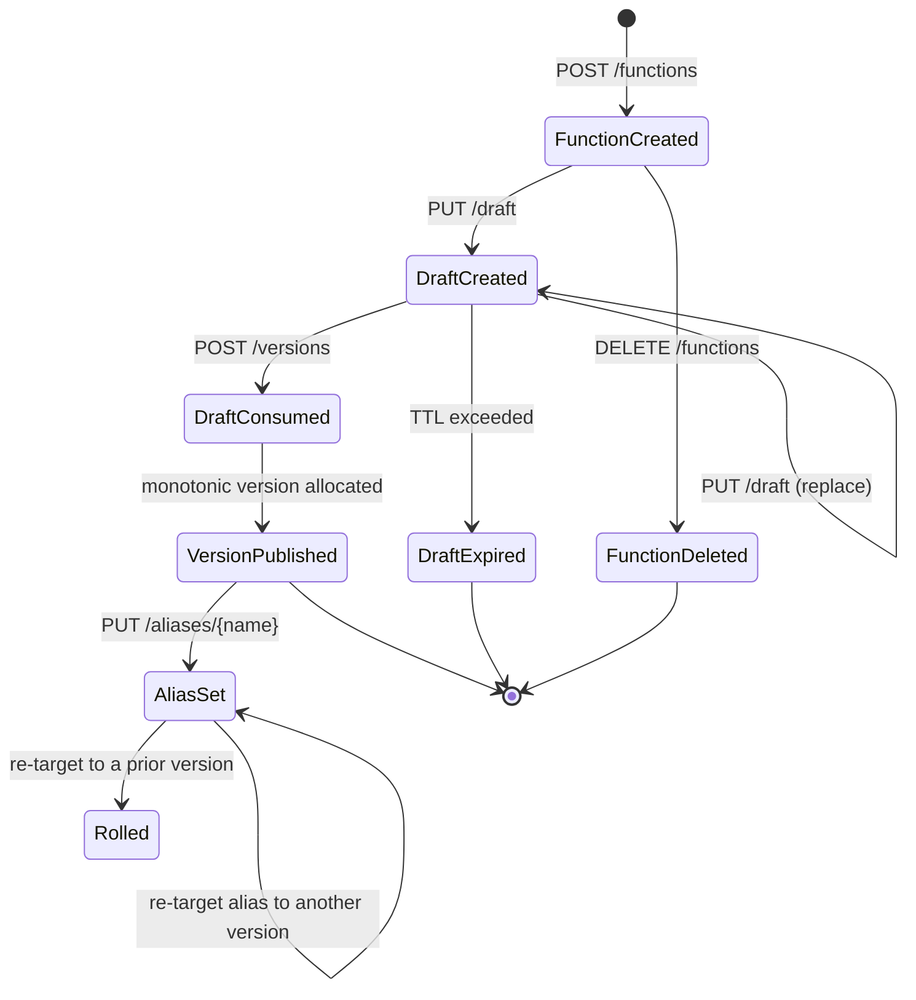

# Managing Functions: Versioning and Aliases

This document defines how Sous models the lifecycle of a published
function. The model is one of immutable versions plus mutable aliases.
Promotion, rollback, and canary patterns are all expressed as alias
moves; the underlying bytes never change once published.

## The immutable-version, mutable-alias model

Sous distinguishes two kinds of entities in the lifecycle.

A version is a permanent, content-addressed snapshot. Once
`cs-control` allocates a monotonic version number and writes the
`VersionRecord`, the bytes under that record never change. The
canonical sha256 of the bundle is fixed; the manifest is fixed; the
signing record (if any) is fixed. Re-publishing the same bytes
allocates a new version number, not an in-place update. See
`internal/api/types.go` for the `VersionRecord` shape and
`cmd/cs-control/lifecycle.go` for the publish path.

An alias is a mutable named pointer at a version. The alias name is a
short, lowercase token (regex `^[a-z][a-z0-9_-]{1,31}$`,
`internal/api/types.go`); the platform reserves no aliases, so tenants
choose names that match their deploy story (`prod`, `staging`,
`canary`, `green`). The alias write is a single-key mutation against
KVRocks: readers observe either the pre or the post version, never a
torn state.

A draft sits before either: it is the staging slot that holds the
upload until the publisher decides to commit. Drafts have TTLs and
are independent of one another. See
[Managing Functions: Packages](Managing-Functions-Packages) for the
publish hot path that turns a draft into a version.

The split exists so promotion never mutates the artifact under
production traffic. Rolling out a new version is `PUT /aliases/prod`
with a new version number; rolling back is `PUT /aliases/prod` with
the previous one. The bytes that ran yesterday are still addressable
by their version number tomorrow.

## Lifecycle FSM

The terminal states are `DraftExpired`, `FunctionDeleted`, and an
implicit "still live" terminal for versions and aliases. Versions
have no transition out of `VersionPublished` in v0.1; there is no
"un-publish". A version becomes unreachable when every alias that
ever pointed at it has moved on, but the bytes remain in KVRocks
until the operator explicitly garbage-collects them.

## Draft semantics

A draft is the only mutable artifact a publisher writes directly.
Drafts hold the uploaded files plus the canonical sha256 the
publisher believes those files produce. The control plane recomputes
the sha at publish time and rejects any mismatch.

### TTL

`cs_control.limits.draft_ttl_seconds` in `config.example.yaml` sets
the lifetime. The default is 86 400 seconds (24 hours). A draft whose
`ExpiresAtMS` has passed cannot be published; the `draftExpired`
helper in `cmd/cs-control/lifecycle.go` rejects the publish with
`CS_VALIDATION_FAILED` ("draft expired"). KVRocks also expires the
underlying key on the same horizon, so an expired draft eventually
disappears from listings.

The TTL exists because drafts are unsigned, unhashed-against-history
upload buffers. Letting them live forever would amplify the attack
surface (a stolen draft token could be redeemed weeks later) and would
let dead bytes accumulate at the control-plane data layer. A 24-hour
window is long enough for a developer to iterate, a CI pipeline to
publish on a delay, or a multi-stage rollout to consume drafts in
order.

### Conflict resolution and concurrent writes

Concurrent uploads against the same `(tenant, namespace, function)`
do not race. Each upload allocates a fresh `draft_id`
(`drf_<random>`) and writes its own record. The publisher chooses
which `draft_id` to redeem; the others expire on their TTLs. There is
no "the latest draft wins" rule, because the platform does not order
drafts. Two parallel CI jobs that both publish complete cleanly with
two distinct version numbers; the alias move that picks a winner is
explicit.

### Authorisation

A draft write requires the `cs:function:draft:upload` action. A
publish requires `cs:function:publish`. An alias write requires
`cs:function:alias:set`. The action map is consulted by the
`authorize` helper in `cmd/cs-control/main.go` and resolved against
the principal returned by [IAM with Tikti](IAM-with-Tikti).

Tenants typically grant `draft:upload` and `publish` to a CI service
account and reserve `alias:set` for a smaller human-controlled role,
so a compromised CI cannot promote arbitrary bytes to production
without a separate human approval.

## Version semantics

A version is an immutable record of a successful publish. The
`VersionRecord` (see `internal/api/types.go`) holds:

- `Version` — a monotonic integer allocated by
  `kv.Store.PublishVersion` in a single transaction. Allocation is
  per `(tenant, namespace, function)`; two functions never share a
  numbering sequence.
- `SHA256` — the canonical bundle hash, the content-address of the
  bytes that this version names. See
  [Managing Functions: Packages](Managing-Functions-Packages).
- `Config` — the publish-time configuration applied to the version
  (timeout overrides, retry policy, sampling). Frozen on the record.
- `PublishedAtMS` — the server-side timestamp at publish.
- `Signature` — the publish-time signature record, when one was
  supplied. See
  [Managing Functions: Signing and SBOM](Managing-Functions-Signing-and-SBOM).

The `VersionRecord` and the bundle bytes are written in the same
transaction by `kv.Store.PublishVersion`. A reader can never see a
version metadata record whose bundle blob is missing, and never a
bundle blob without a metadata record.

### Immutability

There is no `PATCH /versions/{v}` and no `DELETE /versions/{v}` in
v0.1. The only way to influence an already-published version is to
point its aliases elsewhere. This is deliberate: the audit ledger
([ledgerDB Audit](ledgerDB-Audit)) records every alias move, and a
post-incident investigation can replay exactly which bytes served
which window of time.

The CycloneDX SBOM is written next to the version in the same
publish transaction (see `cmd/cs-control/sbom.go` and
[Managing Functions: Signing and SBOM](Managing-Functions-Signing-and-SBOM)).
The SBOM is part of the version's permanent record; it is not
regenerated on subsequent reads.

### Content hash and re-publish

Sous does not deduplicate by sha. Publishing the same bytes twice
allocates two distinct version numbers, both pointing at the same
canonical bundle. This is intentional: the version number is the
operator-visible handle that ledger entries refer to, and collapsing
identical bytes into one version would erase the audit distinction
between two separate publish events.

The invoker bundle cache does key by sha, so two identical-bytes
versions share a single in-memory cache slot at runtime. The on-disk
KVRocks footprint counts the bytes once and the metadata twice.

### Signed manifest

When `plugins.signing.required` is true, a publish without a valid
`X-CS-Signature` header fails with `CS_SIGNATURE_MISSING`. When the
flag is false, a publish without a signature succeeds and the
`VersionRecord.Signature` field is left nil. The invoker treats
`Signature == nil` as "this is a legacy or operator-opted-out
version" and skips re-verification. See
`cmd/cs-invoker-pool/signature.go` and
[Managing Functions: Signing and SBOM](Managing-Functions-Signing-and-SBOM).

## Alias semantics

An alias is a single KVRocks key — `cs:tenant:.../alias/<name>` —
whose value is the version number it currently points at, plus the
millis timestamp of the last update.

The `AliasRecord` shape lives in `internal/api/types.go`:

- `Alias` — the alias name (e.g. `prod`).
- `Version` — the version number this alias currently resolves to.
- `UpdatedAtMS` — the server-side time of the last `setAlias` call.

### Mutable pointer

`setAlias` (`cmd/cs-control/main.go`) accepts a `version` in the
request body, verifies that the version exists, and writes the
`AliasRecord` in a single KVRocks `SET`. Readers observe one of two
states; there is no torn-write window. The HTTP invocation path
(see [HTTP Invoke Path](HTTP-Invoke-Path)) resolves the alias to a
version on every request, so an alias move takes effect on the next
request without any cache invalidation step.

The alias write does not delete the prior target. The previous
version remains addressable by its integer version number and by any
other alias that still points at it.

### Atomic update

A multi-alias rollout (e.g. promoting both `prod` and `staging` at
once) is two distinct `PUT /aliases/...` calls. The platform does not
expose a multi-key transaction surface; an operator who needs
simultaneous moves should script them and accept that there is a
microsecond-scale window where the two aliases disagree.

### Snapshot for audit

Every `setAlias` call writes a structured audit entry via
`auditAfterCommit`. The audit record carries the principal, the
target alias, the new version number, and the request ID; see
[ledgerDB Audit](ledgerDB-Audit) for the schema. The same mechanism
captures `function.draft.upload` and `function.publish`, so a
complete reconstruction of "who put which bytes behind which alias
when" is always one audit query away. Prior versions are recovered
by walking the alias-write history rather than read from a
denormalised "previous_version" field on each event.

## Promotion patterns

Sous does not impose a promotion topology — alias names are tenant
chosen, and the platform simply moves pointers. Three patterns are
common.

### Straight staging-to-prod

The simplest topology has two aliases:

- `staging` — pointed at the most recently published version.
- `prod` — pointed at the version the team has approved for live
  traffic.

A publish updates `staging` (the publisher passes `alias: "staging"`
to the publish body, which causes `cs-control` to set the alias as
part of the publish transaction). A manual promotion is a separate
`PUT /aliases/prod` call that names the version `staging` currently
resolves to. Traffic flips on the next invocation.

### Canary by alias mirroring

A canary alias is a second pointer at the same version family. A
team that wants 0 % → 5 % → 100 % rollout can:

1. Publish v(N+1) and let `staging` follow it.
2. Set `canary` to v(N+1) but route only a small fraction of traffic
   through `canary` from the gateway side (out-of-band traffic
   shifting in the calling client, the [HTTP Invoke Path](HTTP-Invoke-Path)
   front door, or an external load balancer).
3. After observation, set `prod` to v(N+1).

In v0.1 the platform itself does not split traffic between aliases.
Splitting lives at the caller — the gateway, an external router, or
a client library. The control plane's contribution is that both
aliases are atomic single-key writes; the canary alias can be moved
independently of `prod`.

### Per-region aliases

Operators with a multi-region footprint sometimes carry one alias
per region (`prod-us`, `prod-eu`) so a region-local incident can be
contained by moving a single alias back. The platform treats this as
a naming convention; nothing else changes.

## Rollback

Rollback is "point the alias back". The control plane records every
version's metadata indefinitely (per v0.1 semantics), so a rollback
target older than the current pointer is always available as long as
nobody has manually garbage-collected the version record.

The flow:

1. Identify the last-known-good version number from
   [Observability](Observability), the activation log, or the audit
   trail.
2. `PUT /aliases/prod` with that version number.
3. Verify a synthetic invocation resolves to the rolled-back version
   (the response carries the resolved `version` in its envelope; see
   [REST API](REST-API)).

Rollback is identical to a forward promotion in mechanism; only the
direction of the pointer move differs. The audit ledger does not
distinguish "promotion" from "rollback" — both are
`function.alias.set` events. Triage tools infer the direction by
comparing the new version number to the previous one.

There is no draft rehydration: an alias cannot be pointed at a draft.
A rollback must target an already-published version. This avoids the
"production is now serving unsigned, unvetted bytes" failure mode.

## Concurrency and idempotency

Three of the lifecycle handlers carry explicit idempotency guarantees.

`createFunctionIdempotent` in `cmd/cs-control/lifecycle.go` makes
`POST /functions` safe to retry: a second create of the same logical
function (same tenant, namespace, name, runtime, entry, handler) is a
no-op that returns the existing record. A second create with
conflicting identity fails with `CS_IDEMPOTENCY_CONFLICT` so a buggy
client cannot accidentally rewire an existing function under a
different runtime.

`publishVersion` is idempotent at the granularity of the
`draft_id`. The handler marks the draft `Consumed=true` after a
successful publish, and any retry of the same publish call lands on
`CS_VALIDATION_FAILED` ("draft already consumed") rather than
allocating a duplicate version. Producing a second version of the
same bytes requires a fresh draft upload.

`setAlias` accepts any version-existing target and is naturally
idempotent at the alias-name granularity: a repeated `PUT` with the
same `(alias, version)` pair writes the same bytes back to the same
key. The `updated_at_ms` advances on every write; everything else
stays put.

Concurrent `setAlias` calls on the same alias name are serialised by
KVRocks. The single-key write semantics give a strict total order;
the audit ledger records each call separately so an operator can see
exactly which write "won".

## How invocations resolve a reference

A caller invokes a function by reference — either a numeric
`version` or an alias name; see [REST API](REST-API). The resolution
happens once per invocation, in `store.ResolveVersion` (called from
`cmd/cs-control/main.go:invokeAPI`).

Resolution order:

1. If the request supplies an explicit `version`, that wins.
2. Else if the request supplies an `alias`, the platform reads the
   alias record and uses its current version.
3. Else the request is rejected with `CS_VALIDATION_FAILED` ("either
   alias or version must be set"). There is no implicit fallback
   alias in v0.1; callers must name a reference explicitly.

There is no client-side caching of alias → version inside the
platform's invocation path. An alias move is observed by the very
next request that references the alias. The Invoker Pool caches the
bundle bytes by sha (see [Invoker Pool](Invoker-Pool)), so an alias
flip that points two consecutive requests at the same underlying
bytes serves both from the same cache entry.

## State-machine reference

For the precise textual statement of every entity's state machine,
see the runtime reference in `docs/19-entity-state-machines.md`. The
wiki page that previously held a compressed version of the same
information has been superseded by this lifecycle treatment. Future
wiki work will lift the full state-machine reference into the wiki
under a `Reference: State Machines` page; until then, the source of
truth is the file under `docs/`.

## Cross-references

- [Managing Functions: Packages](Managing-Functions-Packages) for
  the bundle shape and the publish-time hash.
- [Managing Functions: Signing and SBOM](Managing-Functions-Signing-and-SBOM)
  for the signature envelope on every immutable version.
- [REST API](REST-API) for the wire-level endpoints
  (`/draft`, `/versions`, `/aliases/{name}`).
- [CLI](CLI) for the `cs` tooling that wraps the above.
- [HTTP Invoke Path](HTTP-Invoke-Path) for how an alias resolves at
  request time.
- [ledgerDB Audit](ledgerDB-Audit) for the audit-trail shape produced
  by every lifecycle mutation.
- [Use Cases: Local Dev, Publish, Promote](Use-Cases-Local-Dev-Publish-Promote)
  for an end-to-end walkthrough of the lifecycle in practice.
