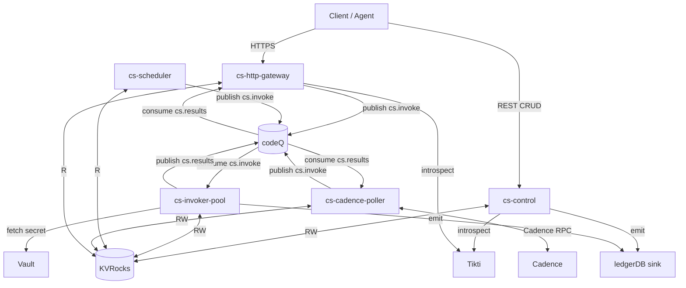
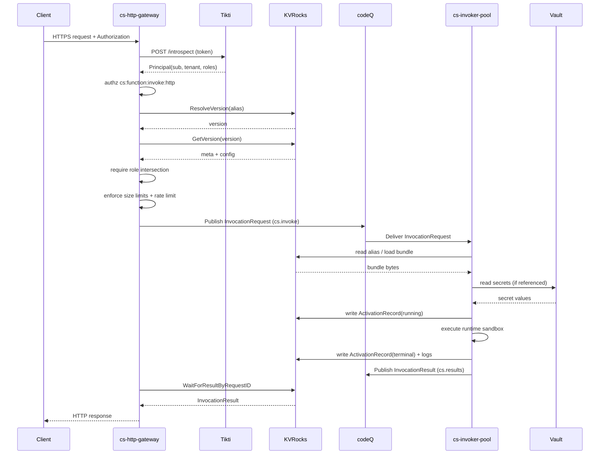
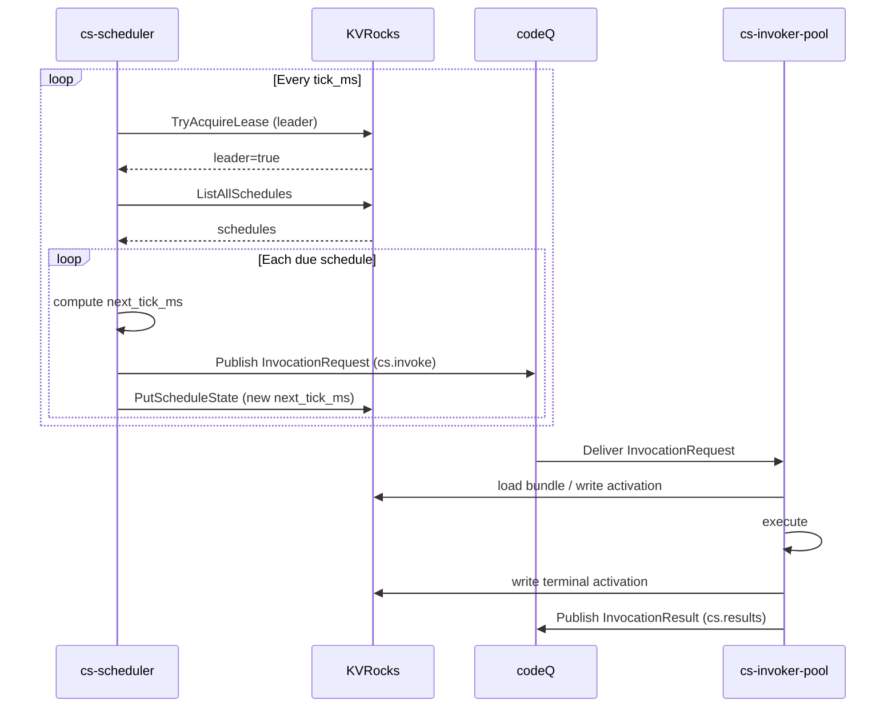
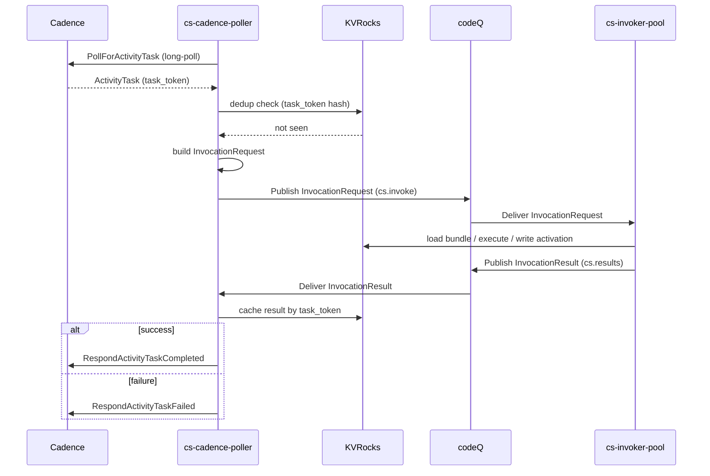
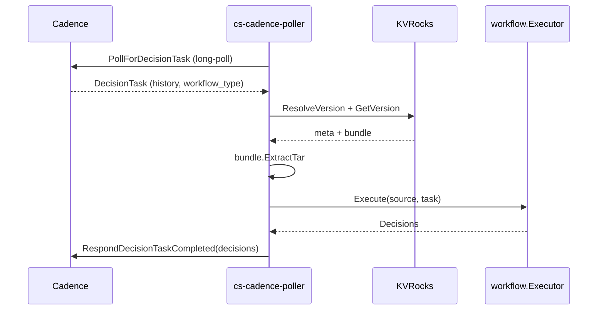
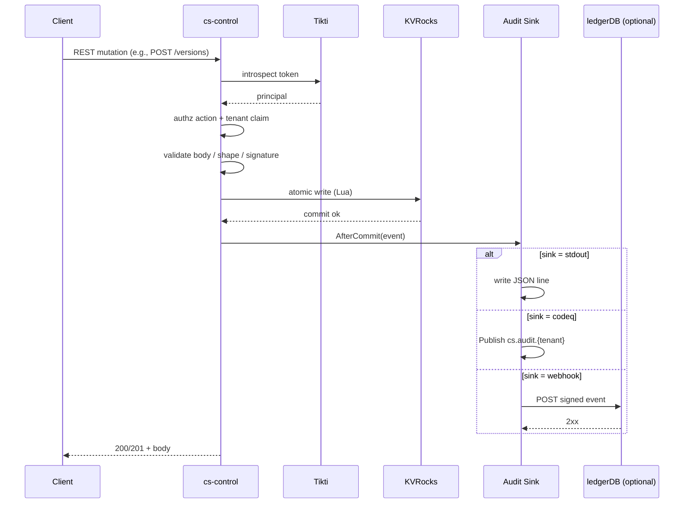

# Operators: Architecture

Sous is a function-execution platform built as a two-plane system. The control plane (cs-control) owns lifecycle state and policy. The data plane is composed of three ingress services (cs-http-gateway, cs-scheduler, cs-cadence-poller) and an execution fabric (cs-invoker-pool). A Kafka-compatible queue named codeQ sits between ingress and execution, decoupling the two so they can scale, fail, and be operated independently.

The two planes have different reliability budgets. The control plane must be strongly validated and consistent — every mutation goes through a single authoritative service that writes to KVRocks, optionally signs an audit event, and only then returns success. The control plane is small, low-throughput, and survives by being correct. The data plane, by contrast, must scale horizontally and tolerate user-code failures without compromising the platform. It runs untrusted code inside a sandbox, persists activations as side effects, and uses the queue as the primary backpressure surface.

The queue exists precisely because the two loops the data plane runs have nothing in common. Ingress services hold long-lived network I/O — HTTP requests that wait for a response, scheduler ticks that fire on wall-clock cadence, and Cadence long-polls that block for tens of seconds at a time. The execution loop, by contrast, is sandboxed user-code execution, bounded by memory and CPU and timeout. Putting these two loops in the same process — as some early-stage serverless prototypes do — couples their failure modes: a crashing function tears down the long-poll, and a slow long-poll starves the executor. codeQ decouples them. The result is backpressure expressed as queue depth, independent horizontal scaling of pollers and invokers, and failure isolation between user code and the I/O loops.

Multi-tenancy threads through every layer. URLs encode the tenant, principals carry the tenant claim from Tikti, KVRocks keys are tenant-prefixed, codeQ message envelopes carry the tenant alongside the payload, secret paths are scoped to the tenant, and audit events are emitted with a tenant tag. No single component owns tenancy; each enforces it locally at its boundary. This is by design — a single missed check is recoverable, but a single point of trust is not.

## Component overview

The platform runs five Sous services plus three external dependencies. The Sous services are written in Go and share a single binary lineage from this repository's `cmd/` tree, cited individually below. The external dependencies are KVRocks (the source of truth for all persistent state), codeQ (the Kafka-compatible queue used for asynchronous decoupling), and Tikti (the identity provider that issues bearer tokens). Optional integrations include Cadence (for workflow trigger), Vault (for secret material), and a ledgerDB-compatible sink (for tamper-evident audit). A production deployment runs every Sous service plus KVRocks, codeQ, and Tikti at minimum; Cadence, Vault, and ledgerDB are added per-tenant when the corresponding capability is required.

Service-to-service traffic flows through three channels. The control plane mutations land in KVRocks directly. The invocation flow uses codeQ as the asynchronous spine. Cross-service identity resolution uses Tikti's introspection endpoint. Sous itself does not run a service mesh; the assumption is that the operator wires NetworkPolicy or equivalent at the cluster boundary. The diagram below shows the major edges; tertiary edges (probes, metrics scrape, Prometheus) are omitted for clarity.

Each service runs as a stateless or near-stateless process that reads its configuration from a file at startup and connects to KVRocks and codeQ. State lives in KVRocks. Routing, identity, and policy live in the configuration. The services themselves are interchangeable replicas, scaled by the operator according to the workload profile. The control plane is sized for correctness (small replica count, leader election); the data plane is sized for capacity (large replica counts, horizontal scaling on observed load).

A useful mental model for the components is that each service owns exactly one I/O loop:

- cs-control owns the REST mutation loop (request in, validation, atomic KV write, audit emit, response out).
- cs-http-gateway owns the HTTP wait-for-result loop (request in, publish, wait, response out).
- cs-scheduler owns the wall-clock tick loop (tick, evaluate, publish).
- cs-cadence-poller owns the Cadence long-poll loop (poll, publish or execute, respond).
- cs-invoker-pool owns the consume-execute-publish loop (consume, execute, persist, publish).

The five loops are independent. A misbehaving function tied to a slow third-party API can saturate one invoker replica but cannot impede a long-poll on another binding. A misbehaving schedule that fans out millions of ticks fills `cs.invoke` and pressures the invoker, but the HTTP gateway keeps serving correlated reads at line rate.

## Control plane: cs-control

`cs-control` is the only service that mutates state on the lifecycle side of the platform. Cited at cmd/cs-control/main.go, it exposes a REST API rooted at `/v1/tenants/{tenant}/...` and serves the following surfaces:

- **Functions**: create, read, soft-delete (cmd/cs-control/main.go: `createFunction`, `readFunction`, `deleteFunction`).
- **Drafts and versions**: upload a draft bundle, publish it to an immutable version. Publishing is the act that allocates a monotonic version number and stamps the canonical sha256. The publish handler optionally verifies an Ed25519 detached signature against the tenant's active signing key. See cmd/cs-control/lifecycle.go and cmd/cs-control/signing_keys.go.
- **Aliases**: bind a human-readable alias (`prod`, `staging`) to a version. Alias updates are single-writer compare-and-set operations.
- **SBOMs**: cited at cmd/cs-control/sbom.go, the SBOM endpoint exposes the bundle's software bill of materials computed at publish time.
- **Signing keys**: rotate a tenant's Ed25519 key pair. The private key is returned exactly once at rotation; subsequent reads expose only the public half. See cmd/cs-control/signing_keys.go.
- **Schedules**: create and delete schedules, which are KVRocks records that cs-scheduler consumes.
- **WorkerBindings**: create and delete Cadence WorkerBindings, which cs-cadence-poller consumes to know which domains and task lists to poll.
- **Activations**: read activation metadata, logs, and decision trees for completed invocations (cmd/cs-control/activation_tree.go).
- **Audit history**: replay tenant-scoped audit events from the in-memory ring buffer maintained by `internal/audit/recorder.go`.

cs-control is the only writer to the function/version/alias namespace in KVRocks. It runs with leader-election affinity (1-2 replicas) because most of its endpoints are low-throughput and benefit from in-process coordination. Authentication uses Tikti token introspection (`internal/plugins/authn/tikti`), and authorization checks both the tenant claim and a per-action capability (`cs:function:create`, `cs:audit:read`, etc.). Every successful mutation emits an audit event via `internal/audit/recorder.go`, which writes the event to KVRocks (for replay) and to a configured sink (stdout, codeq, or webhook).

The mutation handlers share a common shape, cited at cmd/cs-control/main.go: `authorize` extracts the principal and validates the tenant claim against the URL parameter, the request body is decoded and validated against the typed API surface in `internal/api`, the atomic KV operation runs (single set, transaction, or Lua script depending on the surface), and finally `auditAfterCommit` posts to the recorder. The handler returns the new resource state, and the recorder fires asynchronously to the sink. Sink failures do not roll back; they are surfaced through a sink-lag warning recorded into the same per-tenant audit ring buffer.

The publish handler is the most complex of these and deserves a sentence here for the operator. It accepts a draft ID and an optional `X-CS-Signature` header. It loads the draft, recomputes the canonical sha256, verifies the signature against the tenant's active Ed25519 public key (loaded from `cs:tenant:{tenant}:signing-keys`), allocates a monotonic version number via `version_seq`, writes the version metadata and bundle blob atomically through a Lua script, optionally moves an alias, and emits a `function.version.publish` audit event. Cited at cmd/cs-control/lifecycle.go and cmd/cs-control/publish_signature_test.go.

cs-control also hosts the in-process codeQ subscription runner for v0.1 (cmd/cs-control/subscription_runner.go). The runner reconciles a per-tenant subscription map at a fixed refresh interval and tears down per-binding goroutines when subscriptions are deleted. Production deployments may relocate this to a dedicated daemon — the contract is documented in [codeQ Protocol](codeQ-Protocol).

## Data plane ingress

The three ingress services share a common pattern: each owns a particular trigger type, holds the long-lived I/O for that trigger, and publishes a uniform `InvocationRequest` envelope to codeQ topic `cs.invoke`. They differ in their I/O loop and in whether they wait for the result.

### cs-http-gateway

Cited at cmd/cs-http-gateway/main.go, `cs-http-gateway` terminates the public HTTP invoke endpoint. It binds to `/v1/web/{tenant}/{namespace}/{function}/{ref}`, where `ref` is either a numeric version or an alias name. The gateway:

1. Authenticates the bearer token through Tikti introspection.
2. Authorizes the action `cs:function:invoke:http` and verifies the principal's tenant claim matches the URL.
3. Resolves the alias to a concrete version through KVRocks.
4. Enforces request-size limits (body, headers, query string) and per-tenant/per-function rate limits (cmd/cs-http-gateway/ratelimit_mw.go).
5. Optionally honors `Idempotency-Key`, mapping repeated identical requests to the same `activation_id` (cmd/cs-http-gateway/idempotency_mw.go).
6. Maps the HTTP request into an API Gateway v2-shaped event payload, packs it into an `InvocationRequest` envelope, and publishes to codeQ.
7. Waits up to the function's configured timeout (plus a small slack) for a result correlated by `request_id` to land in KVRocks (or directly via codeQ for some drivers).
8. Maps the result back to an HTTP response — status code, headers, body — and writes it to the client.

The gateway is stateless beyond an in-memory idempotency cache and is sized for capacity: N replicas behind a service, fronted by an HPA on CPU and request rate. Each replica holds a long-lived KVRocks connection pool and a codeQ producer/consumer pair. The wait loop is implemented as a polling read of `cs:result:{tenant}:by-req:{request_id}` with a 50 ms ticker, bounded by the function's configured timeout plus 250 ms of slack (cmd/cs-http-gateway/main.go: `waitForResultByRequestID`). When the wait times out, the gateway returns `CS_CODEQ_TIMEOUT` — the activation itself may still complete and land in KVRocks, where it is reachable via the control plane's `GET /activations/{id}` endpoint.

The gateway also serves egress callbacks from user code (cmd/cs-control/egress.go documents the contract). When a function makes an outbound HTTP call through the runtime's egress shim, the shim stamps `X-CS-Parent-Activation` on the outbound request; if the call lands back on the gateway (a function-calling-function pattern), the gateway propagates the parent activation ID into the new `InvocationRequest` so the control plane can later materialize an agent decision tree (cmd/cs-control/activation_tree.go).

### cs-scheduler

Cited at cmd/cs-scheduler/main.go, `cs-scheduler` is the cron loop. It runs a 1-second tick (configurable via `cs_scheduler.tick_ms`), iterates over all enabled schedules, and for any schedule whose `next_tick_ms` has elapsed, publishes an `InvocationRequest` to codeQ. Behavior worth noting:

- **Leader election**: when `cs_scheduler.leader_election.enabled` is true, only the leader publishes ticks (cmd/cs-scheduler/main.go: `leaderLoop`). Followers stay hot and acquire the lease on leader loss.
- **Catch-up cap**: if the scheduler was paused or partitioned, `max_catchup_ticks` (default 60) bounds how many missed ticks fire per schedule per loop. Beyond the cap, the scheduler jumps `next_tick_ms` forward from `now` to resume cleanly.
- **Cron and interval**: schedules are either interval (`every_seconds`) or cron (`cron` expression evaluated in the schedule's timezone). Jitter is deterministic per-schedule to avoid stampedes.
- **Overlap policy**: the scheduler stamps the policy into the trigger envelope; the invoker enforces it.

cs-scheduler is small, 1-2 replicas, and never waits for a result. It is a pure publisher. Its read load on KVRocks is bounded by the total number of schedules across the cluster; on each tick it lists all schedules, evaluates the `next_tick_ms` for each, and publishes for any that are due. Schedule state writes (`PutScheduleState`) are per-schedule and per-tick, so the dominant cost is the list-all-schedules read. For large fleets, the operator can configure a sharded schedule index so each scheduler replica owns a subset; the v0.1 implementation uses a single leader.

The scheduler stamps a `trigger.type=schedule` envelope onto every `InvocationRequest`, with the schedule name, tick sequence number, and overlap policy in the trigger source. The invoker uses the overlap policy to decide whether to launch a new activation when a prior tick for the same schedule is still running. The two supported policies are `skip` (drop the new tick if one is in-flight) and `allow` (start the new activation regardless).

### cs-cadence-poller

Cited at cmd/cs-cadence-poller/main.go, `cs-cadence-poller` is the Cadence integration. For each enabled WorkerBinding it spawns N polling goroutines (per `binding.Pollers.Activity`) that long-poll Cadence's `PollForActivityTask` (or `PollForDecisionTask` for workflow-kind bindings) and convert the returned task into an `InvocationRequest`. Behavior:

- **Two kinds of bindings**: activity bindings (the default) and workflow bindings (E8.01, cmd/cs-cadence-poller/main.go: `pollDecisionLoop`). Activity bindings forward the task to cs-invoker-pool and wait for the result via codeQ; workflow bindings run the workflow executor inline on the delivered history and ship the resulting decisions back via `RespondDecisionTaskCompleted`.
- **Dedup by task token**: every Cadence task carries a unique `task_token`. The poller hashes it and reserves an idempotency record; a redelivery of the same token short-circuits to the cached completion.
- **Heartbeats**: the poller throttles `RecordActivityTaskHeartbeat` to `heartbeat.max_per_second` per binding and forwards heartbeat events emitted by long-running invokers.
- **Concurrency**: each binding has its own in-flight semaphore (`binding.Limits.MaxInflightTasks`), preventing a single tenant or task list from saturating the poller.

cs-cadence-poller scales as N replicas per binding, with the binding's poller count tunable per-tenant. The poller is the only Sous service that holds open long-lived RPC connections to an external workflow engine; this makes its replica-count tuning more nuanced than the other ingress services. Each binding spawns `binding.Pollers.Activity` goroutines per replica, so a binding with 8 pollers and 2 replicas creates 16 concurrent long-polls against Cadence. Cadence's long-poll timeout is typically 60 seconds; under sustained no-work conditions, this is the dominant cost.

The poller also implements a result-consumption loop (`consumeResults` at cmd/cs-cadence-poller/main.go) that subscribes to `cs.results` and looks up the activation ID in its in-process `activation` map. When a result arrives for a known activation, the poller responds to Cadence with `RespondActivityTaskCompleted` or `RespondActivityTaskFailed` and clears the entry. A separate heartbeat-consumption loop (`consumeHeartbeats`) forwards heartbeat events emitted by long-running invokers to Cadence, throttled per binding.

## Data plane execution: cs-invoker-pool

Cited at cmd/cs-invoker-pool/main.go, `cs-invoker-pool` is the only service that runs user code. Its loop is simple: consume from codeQ topic `cs.invoke`, execute the function, persist the activation, publish the result. Inside the loop is a large amount of policy.

1. **Validate the envelope**: missing required fields (activation_id, request_id, tenant, namespace, function) route the envelope straight to the DLQ topic `cs.dlq.invoke`.
2. **Resolve alias to version**: if the request carries only an alias, the invoker reads the alias mapping from KVRocks and stamps the resolved version into the activation metadata.
3. **Load the bundle**: the bundle is a tar archive containing `function.js` (or the language-specific entry) and `manifest.json`. The invoker keeps a per-version LRU cache (`cache.bundles_max`, `cache.bytes_max`) and verifies the canonical sha256 on every load.
4. **Acquire semaphores**: a per-replica `max_inflight` cap, a per-tenant cap (`tenantInflight`), and a per-version cap (`maxConcurrency`) compose to prevent any one tenant or version from saturating a replica.
5. **Resolve secrets**: VersionConfig.Secrets references are resolved at activation start through the configured secrets provider (memory for dev, Vault for production). The resolved values are exposed to user code via `cs.env.get`.
6. **Write running activation**: the invoker writes an `ActivationRecord` with `status=running` before invoking user code. This is the durability anchor — even if the invoker crashes, the activation is reachable via the control plane.
7. **Execute the runtime**: one of cs-js, cs-python, or cs-wasm runs the function inside its sandbox (cmd/cs-invoker-pool/main.go imports `internal/runtime/python` and `internal/runtime/wasm` for adapter registration).
8. **Truncate oversized fields**: `max_result_bytes`, `max_error_bytes`, and `max_log_bytes` are enforced at the boundary. Overflows set `result_truncated=true`.
9. **Write terminal activation**: status, duration, error type if any.
10. **Publish InvocationResult**: to codeQ topic `cs.results`, correlated by `request_id` and `activation_id`. The gateway and the Cadence poller both consume `cs.results`.

The invoker also implements the trigger-level retry policy (cmd/cs-invoker-pool/retry.go), the sampling-aware logger (cmd/cs-invoker-pool/sampling.go), and the egress signature for outbound calls (cmd/cs-invoker-pool/signature.go). It is sized for capacity: N replicas behind an HPA driven by CPU and `cs_invoker_queue_lag_ms`. The HPA's secondary metric is important — CPU alone undercounts pressure when the workload is I/O bound, which much agent-generated code is. Queue lag reflects the actual time-to-execution from the client's perspective and is the correct signal for autoscaling.

Two concurrency layers compose inside the invoker (cmd/cs-invoker-pool/inflight.go and the per-version semaphores in main.go). The per-replica `max_inflight` cap (configured via `cs_invoker_pool.workers.max_inflight`) bounds the total in-flight goroutines on a single replica. The per-version `maxConcurrency` cap (declared in `VersionConfig`) bounds the in-flight count for a single function version on a single replica; this prevents one runaway function from saturating all threads of a replica and starving other tenants. A third layer — per-tenant in-flight (`tenantInflight`) — provides a fairness floor so a single tenant cannot monopolize a replica even when its functions individually have generous version caps.

Idempotency is built into the execution path. Every `InvocationRequest` carries an `activation_id`; if the activation record at `cs:act:{tenant}:{activation_id}:meta` is already terminal, the invoker republishes the stored result rather than re-running user code. This is what makes retries safe — a redelivery of the same request from codeQ (because of broker partition reassignment, gateway timeout, or Cadence redelivery) collapses to a single execution, with the result fanned out to every waiter.

## Queue: codeQ

codeQ is the Kafka-compatible queue that sits between ingress and execution. Sous uses four logical topics:

- `cs.invoke` — the canonical invocation channel. Ingress publishes here; the invoker consumes.
- `cs.results` — the canonical result channel. The invoker publishes here; gateway and poller consume.
- `cs.dlq.invoke` — the dead-letter topic for malformed or unrunnable invocations.
- `cs.dlq.results` — the dead-letter topic for malformed results.

In addition, audit events flow to `cs.audit.{tenant}` when the audit sink is `codeq`, and per-tenant subscriptions can fan messages onto user-defined topics. The topic schema and partitioning strategy are documented in [codeQ Topics](Event-Sources-codeQ-Topics); operational concerns (broker sizing, retention, ACLs) are documented in [codeQ Operations](Enabled-Services-codeQ).

The decoupling pattern is the entire point. Ingress publishes and either waits (gateway, activity-kind poller) or moves on (scheduler, workflow-kind poller after a decision). The invoker consumes at whatever rate it can sustain. Backpressure manifests as queue depth, which feeds the HPA metric `cs_invoker_queue_lag_ms`. A crashing invocation is isolated to the invoker replica that ran it; the ingress loop keeps long-polling.

codeQ also serves as the audit fan-out for deployments that prefer streaming audit events over webhook delivery. The audit sink driver `codeq` publishes each event to `cs.audit.{tenant}`; downstream consumers (compliance pipelines, ledgerDB ingestors, SIEMs) subscribe at their own pace. The same pattern applies to per-tenant subscriptions: a tenant declares a subscription to an external trigger topic, the in-process subscription runner spawns a consumer goroutine, and incoming messages are converted into `InvocationRequest` envelopes and published to `cs.invoke`. This is the path by which Sous functions can react to user-defined events without any change to the ingress services.

The choice of codeQ — specifically its Kafka-compatible API — is what gives Sous its operational flexibility. Any Kafka-compatible broker (Apache Kafka, Redpanda, Confluent Platform) can stand in for codeQ; the local development setup uses Redpanda for its single-binary deployment story. The platform does not depend on any Kafka-specific feature beyond ordered partitioned topics and consumer-group rebalancing; both are universally supported.

## Persistence: KVRocks

KVRocks is the source of truth for everything that survives a process restart. The platform stores function metadata, drafts, versions, aliases, schedules, WorkerBindings, activations, logs, signing keys, audit ring buffers, subscriptions, and idempotency reservations. The key schema is tenant-prefixed throughout — `cs:fn:{tenant}:{namespace}:{function}:meta`, `cs:act:{tenant}:{activation_id}:meta`, and so on — so a single misconfigured client cannot cross tenants.

Each Sous service connects to KVRocks at startup and reuses a single connection pool. cs-control and cs-invoker-pool are the primary writers; cs-scheduler, cs-cadence-poller, and cs-http-gateway are primary readers (the poller writes activation correlations and the gateway writes idempotency reservations). Atomicity for publish (version_seq increment, version meta write, version bundle write, optional alias update) uses Lua scripts.

Operational concerns — backup, restore, snapshot, sizing — are documented in [KVRocks](Enabled-Services-KVRocks).

KVRocks is chosen for two reasons. First, it speaks the Redis wire protocol on the front and uses RocksDB as the storage engine, so it offers Redis-grade operational ergonomics with disk-backed durability and proper crash recovery semantics. Second, it supports Lua scripting for compound atomic writes (publish allocates a version, writes meta, writes bundle, and optionally moves an alias in a single round trip). A pure Redis deployment would lack the durability guarantees Sous needs; a pure RocksDB embedding would lack the multi-process access pattern. KVRocks splits the difference and lets Sous treat persistence as a remote, durable key-value store with rich atomic primitives.

The key schema follows a strict convention: `cs:{kind}:{tenant}:...`. The `kind` discriminator (fn, act, log, schedule, cadence, tenant, audit, idem, sub) lets operators apply per-prefix retention or partitioning policies if needed. The tenant always appears in the second position so a tenant prefix scan reaches every record for a tenant and nothing else. Several keys use TTLs (`draft_ttl_seconds` default 24 hours, `activation_ttl_seconds` default 7 days, `idempotency_ttl` 24 hours); RocksDB's TTL column families drop expired keys at compaction.

## External integrations

Sous integrates with four external systems. None is required for a minimal local deployment, but each is required for production.

**Tikti** is the identity provider. Sous calls Tikti's introspection endpoint (`internal/plugins/authn/tikti`) for every authenticated request, caches the resulting principal for `cache_ttl_seconds`, and trusts Tikti's tenant claim as the canonical tenant ID. Sous itself holds a service-account API key for the introspection call, which is rotated through normal Tikti procedures.

**Vault** is the secrets backend. Sous resolves `VersionConfig.Secrets` references through `internal/plugins/secrets/vault`, which speaks the KV v2 API using a long-lived token or AppRole credential. The resolved values are exposed to user code via `cs.env.get`. Sous holds the Vault token at boot; rotation is documented in [Operators: Administrative Operations](Operators-Administrative-Operations).

**ledgerDB sink** is the tamper-evident audit destination. Sous's audit recorder writes every successful control-plane mutation to a configured `Sink` (stdout, codeq, or webhook); operators wire the webhook or codeq topic to a ledgerDB ingest pipeline for cryptographic chaining. See [ledgerDB Audit](ledgerDB-Audit).

**Cadence** (operated as code-flow) is the workflow engine. cs-cadence-poller speaks Cadence's RPC for ActivityTask and DecisionTask polling and for activity heartbeats and completions. Sous publishes no events back to Cadence beyond completions and decisions; Cadence holds the workflow state. The poller is configured per-binding (a record in KVRocks), not per-cluster, which lets each tenant target a separate Cadence domain and task list. The Cadence address itself (`cs_cadence_poller.cadence.addr`) is cluster-wide; tenants share the Cadence cluster but isolate via domain.

Optional integrations also include OpenTelemetry collectors (Sous emits metrics via the Prometheus registry exposed at `/metrics` on each service and structured logs via the `observability.Logger`), Slack/PagerDuty alert sinks (subscribed to audit topics), and per-tenant idempotency stores (the default is in-memory; Redis-backed stores are pluggable via `internal/idempotency`).

## Data flow: HTTP sync invocation

The HTTP sync flow is the most common path. A client sends an HTTPS request to `cs-http-gateway`, the gateway publishes an `InvocationRequest` to codeQ, an invoker consumes it, executes the function, publishes the result, and the gateway maps the result to the HTTP response.

The contract worth noting is correlation. The gateway stamps a fresh `request_id` on each invocation and uses it as the key to wait on. The invoker stamps the same `request_id` on the result. The gateway and invoker share no other state — they communicate exclusively through codeQ and KVRocks. If the gateway times out before the invoker finishes, the activation completes anyway and lands in KVRocks; the client sees a `CS_CODEQ_TIMEOUT` error but the work was done.

Idempotency adds a second correlation key. When the client sends `Idempotency-Key`, the gateway derives a stable `activation_id` from `(tenant, function, ref, idempotency_key)` and uses it on every retry. Two identical requests from the client produce two `request_id`s but share an `activation_id`; the invoker's terminal-check at step 6 of its pipeline collapses them to a single execution and republishes the cached result. This pattern protects against client-side retries, network failures between client and gateway, and gateway crashes mid-wait.

Rate limiting is enforced at the gateway boundary before publication. The middleware in cmd/cs-http-gateway/ratelimit_mw.go applies a per-tenant RPS limit (`rate_limits.tenant_rps`) and a per-function RPS limit (`rate_limits.function_rps`). Requests that exceed either limit return `CS_RATE_LIMITED` and never reach codeQ. The rate limiter is replica-local; in a multi-replica deployment, the effective cluster-wide rate is `replicas * configured_rps`. Operators tuning these values should account for replica count.

## Data flow: scheduled invocation

Scheduled invocations are fire-and-forget on the ingress side. cs-scheduler ticks, publishes, and forgets; the invoker handles the rest.

The scheduler does not consume `cs.results` — there is no client waiting. The activation is the durable record. The result topic is still populated because consumers of audit/observability pipelines may correlate scheduled invocations to results. Overlap policy is stamped into the trigger envelope and enforced by the invoker, which checks for a still-running activation under the same schedule key before launching a new one.

Scheduled invocations differ from HTTP invocations in two other important ways. First, the principal is synthetic — the scheduler stamps `sp:cs-scheduler` as the actor sub, since no human is in the loop. The invoker treats this principal as a service-account with `role:scheduler` and applies the function's `invoke_schedule_roles` allowlist. Second, the `request_id` is derived deterministically from `(schedule_name, tick_seq)` rather than randomly generated; this lets the scheduler safely retry a publication on broker failure without producing a duplicate activation, because the invoker's `activation_id` (also derived from the same tuple) collides on the second attempt and the idempotency check fires.

## Data flow: Cadence Activity

Activity invocations look like HTTP invocations from the invoker's perspective — same envelope, same execution loop, same result publication. The difference is on the ingress side: the poller is the consumer-of-record for the result.

The poller bridges two protocols: Cadence RPC on one side and codeQ on the other. The bridge is durable because Cadence will redeliver any unacked task; the poller's dedup record makes the redelivery a fast cache hit.

The poller's in-process activation map is the operationally important detail here. When the poller publishes an `InvocationRequest`, it stashes a `taskInfo` entry keyed by `activation_id` containing the `task_token`, binding key, and result codec. When the matching `InvocationResult` lands on `cs.results`, the result consumer goroutine looks up the entry, formats the response per the configured codec (JSON by default; protobuf or thrift if configured), and calls `RespondActivityTaskCompleted` or `RespondActivityTaskFailed`. If the poller restarts between publication and result, the in-process map is lost — but the dedup record in KVRocks survives, and on Cadence redelivery the poller short-circuits to the cached completion. This is the durability seam: in-process state survives normal operation; KVRocks state survives restarts.

## Data flow: Cadence Workflow (DecisionTask)

Workflow bindings are a different animal. Decision-task execution must be deterministic, so the workflow code runs inside the poller process — not behind codeQ — against the embedded history that Cadence delivers with each decision task. The invoker is not in the loop.

The workflow executor at `internal/cadence/workflow` is the seam where deferred features (Timer, Signal, ContinueAsNew) plug in later. The MVP scope (E8.01) handles `ScheduleActivityTask` decisions only — enough to drive the activity-kind flow described above. The contract that workflow code must remain deterministic is what justifies running it inside the poller rather than through codeQ: deterministic replay requires a known process and a known runtime, not a stochastically-scheduled invoker.

Workflow bindings consequently change the scaling shape of cs-cadence-poller. An activity-kind poller is I/O bound — its work is to long-poll, publish, and respond. A workflow-kind poller is CPU bound on the decision loop: every replay runs the full workflow code against the history. Operators should size workflow pollers with more CPU headroom per replica and lower per-binding poll concurrency than activity pollers. The two kinds can coexist on the same replica because each binding owns its own goroutines; the poller process does not distinguish at the top level.

## Data flow: control-plane mutation + audit

Every mutation through cs-control follows a single contract. The request is authenticated, authorized, and validated; the KVRocks mutation commits; only after the commit succeeds does the audit recorder emit an event. This ordering is load-bearing: the audit trail must never include a phantom mutation that was rolled back.

The audit recorder also writes the event to a per-tenant ring buffer in KVRocks for tenant-scoped replay through `GET /v1/tenants/{tenant}/audit`. The recorder is fault-tolerant: a sink failure does not roll back the mutation; instead, the recorder records a sink-lag warning and moves on.

Three sink drivers exist out of the box (`internal/audit/sink.go`): stdout (one JSON line per event), codeq (publish to `cs.audit.{tenant}`), and webhook (POST to a configured URL with optional HMAC signing). Operators choose the sink via `plugins.audit.sink` in the config. The stdout sink is the dev default because it requires no external dependency; production deployments typically use webhook (pointing at a ledgerDB ingestor) or codeq (with a separate ingestor subscribed to the audit topic). Switching sinks safely is documented in [Operators: Administrative Operations](Operators-Administrative-Operations).

The recorder's history limit (`plugins.audit.history_limit`, default 1000) bounds the per-tenant ring buffer. Older events fall off the ring and are reachable only through the external sink. This is by design: the ring buffer is for near-line replay during operator debugging; the durable record lives in the configured sink.

## Multi-tenant isolation

Tenancy is enforced at every boundary, redundantly and on purpose.

- **URL paths**: every authenticated endpoint encodes the tenant as a path parameter. The handler compares the URL tenant against the principal's tenant claim from Tikti and rejects mismatches with `CS_AUTHZ_RESOURCE_MISMATCH`.
- **Principal checks**: actions are checked against the principal's role set via `authz.CheckAction`. The action namespace (`cs:function:create`, `cs:audit:read`, etc.) is the per-action capability surface.
- **KVRocks key namespaces**: all keys are prefixed with `cs:{kind}:{tenant}:...`. A client cannot construct a key in another tenant's namespace because the tenant is interpolated by the service, not by the client.
- **codeQ message envelopes**: every published message carries `tenant` in the envelope. Consumers filter by tenant before acting, and the invoker stamps the tenant onto every activation it writes.
- **Secret paths**: Vault paths are namespaced as `{base}/{tenant}/...`; the secrets provider never crosses the prefix.
- **Audit event tenant tagging**: audit events carry `tenant` as a top-level field. The audit replay endpoint enforces the tenant claim against the URL tenant before returning any event.

The redundancy is intentional. A single missed check at one layer is recoverable by the next layer. The platform never trusts a single source of tenancy; it cross-checks.

## Failure modes

The two-plane decoupling pays off most clearly in failure scenarios. Each component failure has a bounded blast radius.

**cs-control down**: lifecycle mutations are unavailable. The data plane keeps running — existing functions invoke normally, schedules fire, Cadence tasks complete. Operators cannot publish new versions or change aliases until cs-control returns. Audit replay is also unavailable. Recovery: restart cs-control. State lives in KVRocks; no data loss.

**cs-http-gateway down**: HTTP invocations fail at the load balancer. Schedules and Cadence triggers keep working. The invoker keeps consuming. Recovery: scale up replacement replicas. Clients see HTTP 502/503 until capacity returns.

**cs-scheduler down**: scheduled invocations stop firing. Other triggers unaffected. When the scheduler returns, its catch-up cap bounds the burst: per-schedule catch-up is capped at `max_catchup_ticks`, beyond which `next_tick_ms` jumps forward from `now`. Recovery: restart. The leader-election lease in KVRocks ensures only one replica resumes publishing.

**cs-cadence-poller down**: Cadence stops receiving acknowledgments for in-flight tasks. Cadence redelivers; the poller's dedup-by-task-token cache absorbs redeliveries when the poller returns. Schedules and HTTP invocations unaffected. Recovery: restart.

**cs-invoker-pool down (all replicas)**: ingress queues fill in codeQ. The gateway's wait loops time out and return `CS_CODEQ_TIMEOUT` to clients. Schedules keep publishing (and accumulating in `cs.invoke`). When invokers return, they drain the backlog at line rate. Backpressure manifests as growing `cs_invoker_queue_lag_ms`. Recovery: scale up. No invocations lost; some are delayed past their deadline.

**codeQ down**: ingress fail fast. The gateway returns `CS_CODEQ_UNAVAILABLE`; the scheduler logs and retries on the next tick; the poller skips publishing and lets Cadence redeliver. The invoker stops consuming and idles. Recovery: restore codeQ. The platform resumes from where it left off; no state corruption because KVRocks is unaffected.

**KVRocks down**: every service fails readiness probes. New invocations fail (gateway cannot resolve alias, invoker cannot load bundle). Cadence tasks accumulate in Cadence's own queue. Recovery: restore KVRocks from snapshot; the platform resumes. This is the single hardest dependency; the [KVRocks](Enabled-Services-KVRocks) page documents the snapshot/restore procedure.

**Tikti down**: authenticated endpoints fail with `CS_AUTHN_*` errors. The per-service introspection cache (60-second default) absorbs short outages. Recovery: restore Tikti; the cache repopulates.

**Vault down**: invocations that reference secrets fail at activation start with `CS_SECRETS_*`. Invocations that do not reference secrets keep running. Recovery: restore Vault.

**Cadence down**: workflow and activity triggers stop. cs-cadence-poller logs poll failures and backs off; it does not crash. Other triggers unaffected. Recovery: restore Cadence; the poller resumes.

The pattern is consistent: each failure is local, surfaced through a typed error, and recoverable by restoring the failed component. The state of record is always KVRocks plus codeQ; the services themselves are interchangeable replicas.

Two anti-patterns worth calling out. First, do not run cs-invoker-pool and cs-cadence-poller on the same node when CPU is constrained — the activity poller's long-poll cost is small, but a workflow poller's decision-loop execution shares CPU with invoker workloads in unhelpful ways. Second, do not co-locate KVRocks and codeQ on the same hardware: their durability characteristics differ (KVRocks fsyncs on every Lua-script atomic write; codeQ batches), and a disk-subsystem incident takes down both planes of the platform simultaneously.

## Scaling characteristics

Each Sous service has a distinct scaling profile, and matching that profile to the operator's observed workload is the core of capacity planning.

**cs-control** scales with API-call rate, not with tenant count or function count. It is the slowest-changing dimension of the platform — most fleets sustain at most hundreds of mutations per second across all tenants. Two replicas at 250m CPU each handles essentially any production workload. The bottleneck on cs-control is usually KVRocks write latency; if mutation P99 climbs above 100ms, look at the KVRocks side, not at cs-control replica count.

**cs-http-gateway** scales linearly with HTTP request rate. Each in-flight request holds a goroutine and waits for a codeQ result; sizing follows the formula `replicas = (peak_rps * avg_function_duration_seconds) / max_inflight_per_replica`. The gateway's CPU is dominated by JSON marshalling and HMAC verification; memory is dominated by in-flight body buffers. A 500m / 512Mi replica sustains roughly 500 concurrent waits.

**cs-invoker-pool** scales with invocation throughput times function CPU/memory cost. The HPA's CPU target catches CPU-bound workloads; queue lag catches I/O-bound workloads. For a production fleet, both should be wired. The invoker's resource consumption is dominated by the runtime — cs-js is the lightest, cs-wasm next, cs-python the heaviest. Mixed-runtime fleets often benefit from separate node pools or NodeAffinity rules to keep memory-heavy Python invocations off the CPU-heavy JS invokers.

**cs-scheduler** does not scale beyond 2 replicas (one leader, one standby) because leader election makes followers no-ops. The bottleneck is the ListAllSchedules read at every tick; very large schedule fleets (tens of thousands of schedules) may need sharded scheduler instances, which the v0.1 implementation does not provide.

**cs-cadence-poller** scales with the total number of Cadence pollers across all bindings. Per-binding tuning (`pollers.activity`, `max_inflight_tasks`) is more impactful than replica count for most fleets. A common deployment runs 2 replicas with most of the concurrency at the binding level.

The capacity-planning shortcut is to start with the chart defaults, observe steady-state CPU and queue lag for a representative workload, and adjust the dominant constraint. Sous publishes the metrics required for this decision through Prometheus on every service.

## Identity flow

Identity threads through every component but has a single canonical resolution path. Every external request to a public Sous endpoint (cs-control's REST surface, cs-http-gateway's invoke surface) carries a bearer token. The receiving service calls Tikti's introspection endpoint and receives a principal: `sub`, `tenant`, and `roles`. The principal flows into the handler context via the `authz` middleware (cited at internal/authz).

The handler then performs two checks. First, the principal's tenant claim must match the URL's tenant parameter — anything else is a cross-tenant attempt and returns `CS_AUTHZ_RESOURCE_MISMATCH`. Second, the requested action (`cs:function:create`, `cs:function:invoke:http`, etc.) must be in the principal's role-derived capability set; missing capability returns `CS_AUTHZ_DENIED`.

For invocation paths, the principal is propagated into the `InvocationRequest` envelope and carried through codeQ to the invoker. The invoker enforces a third check: the function's per-trigger role allowlist (`config.authz.invoke_http_roles`, `config.authz.invoke_schedule_roles`, `config.authz.invoke_cadence_roles`) must intersect with the principal's roles. The three-level check (tenant claim, action capability, function role allowlist) is intentional defense in depth.

Synthetic principals are stamped by ingress services for triggers where no human is in the loop. cs-scheduler stamps `sp:cs-scheduler` with `role:scheduler`. cs-cadence-poller stamps `sp:cs-cadence-poller` with `role:cadence`. These principals never appear in Tikti; they are pure platform identities that the invoker recognizes by convention. A function that should not be schedulable simply omits `role:scheduler` from its `invoke_schedule_roles` allowlist.

## Backpressure surfaces

The platform exposes backpressure through three distinct surfaces, each operationally meaningful.

**HTTP-side backpressure** is per-tenant and per-function rate limiting in cs-http-gateway. When a client exceeds its rate, the gateway returns `CS_RATE_LIMITED` with a `Retry-After` header. This surface is preemptive — it sheds load before it reaches codeQ.

**Queue-side backpressure** is `cs_invoker_queue_lag_ms`, the time between a request landing on `cs.invoke` and being consumed by an invoker. Sustained lag above the function timeout is the signal that the invoker fleet is under-provisioned. The HPA's queue-lag metric catches this and scales the invoker pool.

**Execution-side backpressure** is the per-tenant, per-version, and per-replica concurrency caps inside cs-invoker-pool. These bound the inflight count and force fairness across tenants and versions sharing a replica. When the caps are hit, the invoker leaves the request on the queue; the request is consumed by another replica with available capacity, or the queue lag rises and the HPA scales up.

The three surfaces compose. A misbehaving tenant first hits the rate limit (preemptive), then queue lag for traffic that escapes the rate limit, then concurrency caps for traffic that gets to an invoker. Each surface has a typed error and a metric, so operators can attribute observed pressure to the right cause.

## Versioning and rollout

Sous functions are versioned by a monotonic per-function counter (`version_seq`). Every publish increments the counter and produces an immutable artifact in KVRocks (meta + bundle blob). Aliases map human-readable names (`prod`, `staging`, `canary`) to specific version numbers. Aliases are the rollout mechanism: an operator promotes a new version by pointing the `prod` alias at it, and rolls back by repointing the alias at the previous version.

This versioning scheme has two important properties. First, no version is ever overwritten — a published version is a content-addressable artifact that cannot change. Second, no version is ever deleted in the live path; the soft-delete on the function record (cs-control: `deleteFunction`) tombstones the function but the version blobs remain in KVRocks until TTL or operator cleanup. This guarantees that an in-flight invocation against version N never sees a missing bundle, even if the function is being soft-deleted concurrently.

Alias rollouts are atomic single-writes (`PUT /v1/tenants/{tenant}/namespaces/{namespace}/functions/{name}/aliases/{alias}`). The invoker's alias resolution reads the alias at activation start and stamps the resolved version into the activation record, so an alias change mid-traffic produces a clean cutover: requests in flight at the moment of cutover land on whichever version they read; subsequent requests land on the new version. There is no version-pinning window.

Operators running blue-green deployments typically use two aliases (`prod-blue`, `prod-green`) plus a third alias (`prod`) pointing at whichever color is live. The cutover is a single alias write; rollback is a single alias write back. The two color aliases stay pinned to their respective versions and serve as a safety net during the rollout window.

## Observability boundaries

Each Sous service emits three observability streams: structured logs, Prometheus metrics, and OpenTelemetry traces when a collector is wired. The streams have different consumers and different latency characteristics.

Logs are emitted to stdout as JSON, one event per line, with a stable schema (`level`, `service`, `request_id`, `tenant`, `msg`, plus arbitrary fields). The `observability.Logger` in `internal/observability` enforces this contract across all services. Logs are intended for human reading and ad-hoc query — operators ship them through a log aggregator (fluent-bit, vector, cloud-provider log collection) to a query engine (Elasticsearch, Loki, BigQuery). Log volume is bounded by sampling at the application layer: cs-invoker-pool's `samplerCache` (cmd/cs-invoker-pool/sampling.go) caps per-tenant log emission to prevent a chatty function from drowning the pipeline.

Metrics are exposed at `/metrics` on every service's HTTP port. The metric prefix `cs_` covers application metrics; standard Go runtime metrics are also exposed. The most operationally important metrics are `cs_invoke_total`, `cs_invoke_duration_ms`, `cs_invoker_queue_lag_ms`, `cs_publish_total`, `cs_publish_failures_total`, and per-error-code counters. Metrics are pulled by Prometheus on a scrape interval; the scrape configuration is operator-side (not in the chart).

Traces are emitted as OpenTelemetry spans when the service is configured with a collector endpoint. Sous propagates the W3C `traceparent` header across every component boundary — HTTP entry to gateway, gateway to codeQ envelope, codeQ envelope to invoker, invoker to runtime, runtime to outbound egress. A single trace spans the entire invocation pipeline, which is the right granularity for debugging cross-component latency.

The three streams complement each other. Logs answer "what happened?", metrics answer "how often / how fast?", traces answer "where did time go?". An operator response to an incident typically queries metrics first (to confirm the symptom), drills into traces (to localize the slow component), and reads logs (to understand the failure mode).
