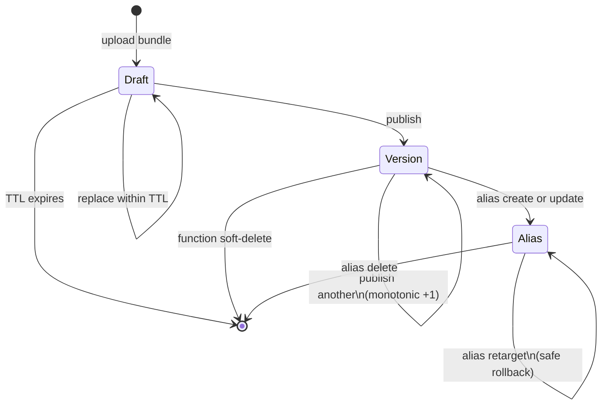

# Programming Model: Functions

A function in Sous is the smallest deployable unit of user code.

The platform addresses every function by the triple `(tenant, namespace, name)` and gives it a versioned identity that participates in a strict immutable-artifact lifecycle.

The triple is enough to identify a function in any API path, audit record, or invocation envelope.

The version, or an alias that resolves to one, is what fixes the exact bytes that run.

Sous deliberately accepts function source as plain UTF-8 text rather than a build artifact.

A function bundle is the JavaScript source file plus a JSON manifest, and the platform stores both together under a content hash.

There is no compile step between source and execution.

The bytes the developer typed locally are the bytes the cluster runs.

The contract is enforced symmetrically across both the local CLI and the cluster invoker pool: a function that ran successfully on a laptop produces the same observable result when invoked through any trigger family in production, modulo the side-effect surface the manifest opens up.

The bundle is small, declarative, and self-describing.

The manifest enumerates everything the platform needs to know about the function before it accepts execution: the runtime that will host it, the entry file and exported handler, the resource limits the invoker must enforce, and the capability allowlists that bound its side effects.

Every privilege a function ever holds at runtime appears as a literal value in this manifest, which means every privilege change is a version change, which means every privilege change is a reviewable diff.

## The function entity

The control plane materializes a function as a record under the tenant's namespace, addressed by name.

The record carries the durable identity attributes — runtime, entry, handler — and the lifecycle pointers to drafts, versions, and aliases.

The record is created idempotently: re-issuing the same create call with the same identity attributes returns the existing record.

Conflicting attributes return `CS_IDEMPOTENCY_CONFLICT`.

The implementation lives in `cmd/cs-control/lifecycle.go` and the contract is anchored in `lifecycle_contract_test.go`.

The function entity is not the running artifact.

It is the long-lived envelope that owns a sequence of versions and a set of aliases.

Deleting a function is a soft-delete on this record; the underlying immutable versions remain reachable for audit replay.

## The bundle: source plus manifest

A bundle is two text files:

- `function.js` exports a single async handler under the name `default`.
- `manifest.json` declares runtime, limits, and capabilities.

The manifest schema is `cs.function.script.v1` (see `spec/cs.function.script.v1.json`).

At publish time, the control plane validates the manifest against the schema, checks that the declared runtime is registered (see `internal/runtime/registry.go`), and stores the canonical bundle bytes under a SHA-256 content address.

Because the schema is strict and `additionalProperties: false`, a manifest cannot smuggle in undeclared fields.

Future capability families require an explicit schema bump.

A minimal manifest looks like this:

```json
{
  "schema": "cs.function.script.v1",
  "runtime": "cs-js",
  "entry": "function.js",
  "handler": "default",
  "limits": {
    "timeoutMs": 5000,
    "memoryMb": 128,
    "maxConcurrency": 10
  },
  "capabilities": {
    "kv": { "prefixes": ["orders/"], "ops": ["get", "set"] },
    "codeq": { "publishTopics": ["orders.events"] },
    "http": { "allowHosts": ["api.example.com"], "timeoutMs": 3000 }
  }
}
```

Every field above is mandatory.

The strictness is deliberate: there is no default `timeoutMs`, no implicit memory allocation, no implicit capability surface.

A function that does not declare a capability simply does not have it.

Any host API call against an undeclared resource fails closed with a typed error at the runtime boundary.

Limits the manifest must declare:

- `timeoutMs` — per-invocation wall budget (1 ms to 900 000 ms).
- `memoryMb` — per-invocation memory budget (16 MiB to 4096 MiB).
- `maxConcurrency` — per-version concurrency cap (1 to 100).

Capability families the manifest must declare:

- `kv` — KVRocks key prefixes and the subset of operations (`get`, `set`, `del`) the function may use.
- `codeq` — codeQ topics on which the function may publish.
- `http` — outbound hosts the function may fetch from, plus a per-call timeout.

The runtime treats user code as untrusted.

There is no implicit filesystem, no implicit process spawn, no implicit network.

Every side effect flows through host APIs surfaced as `cs.*`, and every host API checks the running version's manifest before it acts.

See [Reference: Schemas](Reference-Schemas) for the full manifest specification and field-by-field semantics.

## Lifecycle: draft, version, alias

Sous models the function lifecycle as a sequence of immutable artifacts with a single mutable pointer per alias.

The split makes rollouts safe by construction: a promotion is a pointer update, not a mutation of a published artifact.

Production traffic can be redirected and reverted without rewriting history.



A **draft** is a transient upload.

It is mutable, time-bound, and meant only to support iterative validation before a publish.

The default draft TTL lives in `internal/limits.DefaultDraftTTLSeconds`; expired drafts disappear without a trace.

Multiple drafts may coexist for the same function.

They receive distinct draft IDs and run their TTL windows independently, so concurrent uploads from a CLI and a CI pipeline do not collide.

A **version** is an immutable publish.

Each successful publish allocates the next monotonic integer atomically (meta and bundle bytes are written in a single KV transaction).

The resulting `(tenant, namespace, name, version)` tuple is permanent.

The bundle bytes never change after the publish completes.

Audit replay, signed deployment, and forensic comparisons all depend on this invariant: a version number identifies one and only one bundle, forever.

An **alias** is the only mutable pointer in the lifecycle.

It is a per-function name (for example `prod`, `canary`, `staging`) that resolves to exactly one version at a time.

Production traffic typically targets aliases rather than raw version integers.

Aliases are inexpensive to update and inexpensive to revert: a retarget is a single key write and readers observe either the pre-update or post-update version, never a torn state.

This is why a rollout is a low-risk operation in Sous — there is no migration to undo, only a pointer to flip.

The lifecycle has one more important invariant that is easy to miss: drafts and versions live in distinct namespaces.

A draft is identified by a generated draft ID that has no relationship to the version integer it will eventually become.

A draft never silently turns into a version — publishing is an explicit operation that consumes the draft, performs the validation pass, and emits a new version.

This separation means that an unpublished draft can be inspected, replaced, or abandoned without any risk to running traffic, and a published version is never produced by accident.

For the complete narrative of how a function progresses through these states, including idempotency rules, validation failures, and the contract tests that pin the invariants, see [Versioning and Aliases](Managing-Functions-Versioning-and-Aliases).

## Two privilege layers: roles and capabilities

Every function execution is constrained by two independent allowlists, both pinned to the function version:

**Capabilities** declare what the version may do once it runs.

The host APIs check the manifest before they act.

A function that does not list a KV prefix cannot read or write under it.

A function that does not list a codeQ topic cannot publish to it.

A function that does not list an outbound host cannot fetch from it.

Capability checks run on the invoker, against the version's stored manifest, with no opportunity for user code to influence the decision.

**Roles** declare who may invoke the version, and through which trigger family.

The version's `authz` block names the roles the caller must hold for each trigger type (HTTP, schedule, Cadence).

Role checks run on the trigger boundary — the HTTP gateway, the scheduler, the Cadence poller — against the caller's Tikti principal.

A caller without the required role receives a clean refusal at the boundary; the invocation envelope is never built and the function never runs.

These two layers compose rather than overlap.

Roles answer "is this caller allowed to ask?".

Capabilities answer "is this code allowed to do?".

A version may be safely callable by a wide audience while still being tightly constrained in what it can touch, because the audience question and the side-effect question are answered separately.

Both layers travel with the version.

There is no way to expand a function's privileges except by publishing a new version with a new manifest and, optionally, retargeting an alias to it.

A code review that touches the manifest is a review of every privilege change.

An audit of past behavior can replay against the exact manifest that was in force at the time.

### Enforcement points

The two layers run on different machines, against different inputs, at different moments in the request path:

- **Role enforcement** happens at the trigger boundary, before the invocation envelope is built. For HTTP, that is the gateway; for schedule, that is the scheduler; for Cadence, that is the poller. A caller that fails the role check never reaches the invoker pool.
- **Capability enforcement** happens at the runtime boundary, inside the invoker, immediately before each host API call. A function that issues `cs.http.fetch` against an undeclared host never produces an outbound connection — the runtime rejects the call before any DNS resolution occurs.

This split keeps the trust boundary explicit.

The trigger surface trusts Tikti to authenticate the caller.

The runtime surface trusts the manifest to constrain the code.

Each side enforces what it knows best, and each side's enforcement is a clean refusal rather than a runtime warning.

### Default-deny everything

The platform's default for any privilege is denial.

A manifest with empty capability arrays grants no side effects at all.

The function can compute and return a value, but it cannot read KV, cannot publish to codeQ, and cannot make HTTP requests.

This is the cheapest possible function to operate and the safest possible starting point for new code.

Authors add capabilities as the function's design demands them, and every added capability shows up in the manifest's diff.

## The publish path, step by step

A publish operation is the single moment at which the platform commits to a function's bytes.

It is also the place where the manifest's promises are checked.

The control plane runs the following steps, in order, in a single atomic transaction:

1. **Resolve the draft.** The publish call names a draft ID. The control plane fetches the draft record; an expired or missing draft fails the publish with `CS_DRAFT_EXPIRED` or `CS_DRAFT_NOT_FOUND`.
2. **Validate the manifest.** The control plane parses the manifest against `spec/cs.function.script.v1.json`. Schema violations fail with `CS_VALIDATION_FAILED` and a JSON pointer to the offending field.
3. **Check the runtime.** The manifest's `runtime` field must match a registered handler in `internal/runtime/registry.go`. An unknown runtime fails with `CS_RUNTIME_UNSUPPORTED`.
4. **Run runtime-specific checks.** For `cs-js`, the imports linter rejects bundle code that uses unsupported ES module features; the determinism linter (relevant for workflows) flags forbidden APIs. For `cs-wasm`, the wasm validator verifies the module loads cleanly in `wazero`.
5. **Allocate the version.** The control plane atomically increments the per-function version counter in KV. The increment is monotonic and conflict-free; two concurrent publishes serialize behind a lock and produce distinct versions.
6. **Persist the bundle.** The control plane writes the manifest and source under the new version key. The write is part of the same KV transaction as the version allocation, so a crash mid-publish leaves either the prior state or the complete new state, never a torn intermediate.
7. **Emit the audit record.** The control plane appends a ledgerDB entry naming the tenant, namespace, function, version, principal, and bundle SHA. The audit record is the durable evidence the publish happened.

The order matters.

Validation precedes allocation, so a malformed manifest never claims a version number.

Bundle persistence is bundled with version allocation, so the version space never advances without the bytes that go with it.

The audit record is last, after the version is committed, so audit can never refer to a version that does not exist.

After publish, the new version is invocable by integer (`ref.version = N`).

Aliases do not automatically point at the new version — alias retargets are a separate, explicit operation.

A publish never moves production traffic on its own.

The CLI's "publish and promote" shortcut performs the two operations in sequence with a single user gesture, but they remain two distinct control-plane calls under the hood.

## Identity in the invocation envelope

When any trigger family produces an invocation, the request envelope (schema `cs.invoke.v1`, see `spec/cs.invoke.v1.json`) carries the function's identity as `tenant`, `namespace`, and a `ref` block.

The `ref` always contains the function `name` and one of `alias` or `version`.

The invoker resolves the alias to a concrete version at dispatch time, looks up the stored bundle, applies the version's manifest, and runs the handler.

Activation records preserve both the alias that was requested and the version that actually executed.

A later audit can answer the question "what code did this caller hit?" without ambiguity.

The envelope also carries the caller's `principal` (Tikti `sub` plus roles), a unique `activation_id`, a deduplication `request_id`, the `trigger` block, the `deadline_ms`, and the user-supplied `event` payload.

Triggers differ in how they fill these fields — the HTTP gateway carries the caller's Tikti token, the scheduler carries a system identity, the Cadence poller carries the workflow's identity — but the shape they produce is identical, and the invoker treats them identically.

A simplified invocation envelope on the wire looks like this:

```json
{
  "activation_id": "fbb6b1c8-3e1d-4f2c-8a4d-9b0f0c3a1e02",
  "request_id": "req_01HMZJ8X3...",
  "tenant": "t_abc123",
  "namespace": "orders",
  "ref": { "function": "reconcile", "alias": "prod" },
  "trigger": { "type": "http", "source": { "method": "POST" } },
  "principal": { "sub": "user:alice@example.com", "roles": ["orders.invoke"] },
  "deadline_ms": 1731000005000,
  "event": { "order_id": "o_7421" }
}
```

The envelope is the same shape regardless of trigger family.

The `trigger.source` block carries family-specific context (HTTP method and path, schedule ID and tick, Cadence workflow identifiers), but the rest of the fields are uniform.

This is what makes the invoker pool a single component rather than three: it speaks one protocol against three producers.

## Idempotency

The `request_id` field on the invocation envelope is the platform's idempotency key.

Two invocations that share `(tenant, namespace, function, request_id)` are treated as the same logical request.

The invoker resolves the second one to the first activation's result whenever it is available.

A retried trigger never produces a duplicate side effect.

Triggers that own their request_id derivation get this behavior for free:

- The HTTP gateway derives `activation_id` from the optional `Idempotency-Key` header using UUIDv5 keyed by tenant; identical retries collapse to the same activation.
- The scheduler derives `request_id` from `(schedule_id, tick_seq)`; a re-published tick after a leader restart does not re-execute.
- The Cadence poller derives `request_id` from the `taskToken` hash; a redelivered ActivityTask resolves to the same activation.

User code does not need to be idempotent for retries on a single trigger to be safe — the platform's idempotency key absorbs them.

User code does still need to be idempotent against arbitrary upstream retries (for example, the same task delivered to two different pollers across a network partition).

The manifest's capability surface gives it the primitives to do that explicitly with KV writes under a request-scoped key.

### What request_id is not

The `request_id` is not a security token.

It is not a session identifier.

It is not signed.

Anyone who can publish to the `cs.invoke` topic can choose any `request_id` they want, and the deduplication logic will dutifully collapse retries onto whatever activation got there first.

The platform's idempotency is a delivery-quality feature, not a trust feature.

Authentication lives in `principal`; authorization lives in `authz` allowlists; idempotency lives in `request_id`.

The three are independent and serve distinct purposes.

## Parity across runtimes

The function contract is independent of the runtime that implements it.

The platform ships with `cs-js` as the default in-tree runtime, with `cs-wasm` and `cs-python` adapters following the same registry shape (`internal/runtime/registry.go`).

Every runtime adapter implements the same handler contract: it receives the bundle bytes and an `InvocationRequest`, produces an `ExecutionOutput`, and respects the manifest's limits and capabilities.

The parity guarantee is observable: a function whose handler is pure (no host API calls) produces the same output bytes in `cs-js`, `cs-wasm`, and `cs-python`.

A function that uses host APIs produces the same call sequence on each runtime, in the same order, with the same per-call enforcement.

The CLI runner exercises the same adapter the cluster uses, so a function validated locally is validated against the same bytes that will run in production.

Cross-runtime determinism is not a free property of the runtimes themselves — it is a property of the host API surface.

The handler is allowed to do anything the runtime permits, but only the host APIs (`cs.kv`, `cs.codeq`, `cs.http`, `cs.cadence`) interact with the rest of the system.

Two runtimes that implement the same host API surface produce indistinguishable activations for the same input.

The control plane refuses to publish a function whose runtime is not registered.

The runtime registry (`internal/runtime/registry.go`) is the single source of truth for which runtimes the cluster supports.

The publish-time check returns `CS_RUNTIME_UNSUPPORTED` for any manifest that names an unknown runtime.

A tenant cannot accidentally publish a `cs-python` function against a cluster that has not enabled the Python adapter.

A cluster operator can roll out a new runtime by deploying the adapter binary first and the user code second.

## The activation: the durable record

An activation is the platform's persistent record of one invocation.

The activation log captures the input envelope, the result envelope (schema `cs.results.v1`, see `spec/cs.results.v1.json`), the trigger family, the principal, the resolved version, the wall-clock duration, the byte-level resource usage, and the structured log lines the function emitted.

Activations are immutable once written.

A failed invocation produces an activation whose status is `failed`.

A retried invocation under the same `request_id` returns the same activation.

The activation is the bridge between observability and audit.

Operators query it for debugging; auditors query it to answer "who did what".

The activation log lives in KVRocks under a tenant-scoped prefix and is replicated according to the storage backend's durability policy.

Retention is set per tenant; the platform never deletes an activation that is still inside the retention window.

Because activations preserve both the alias requested and the version resolved, they survive alias retargets cleanly.

A `prod` alias that pointed at version 12 yesterday and version 13 today produces activations with the correct version in each window.

A later audit replay does not need to reconstruct the alias's history because the activation already carries the answer.

## Resource budgets

The manifest's `limits` block names three concrete budgets the invoker enforces per invocation.

Each one is a hard cap, not a recommendation.

Each one has a typed error code that surfaces to the caller and to the activation log when it is exceeded.

**Timeout** caps wall-clock duration.

The handler's deadline is set from `deadline_ms` in the envelope, which the trigger derives from the manifest's `timeoutMs`.

The runtime preempts the handler when the deadline passes; any work in flight at that moment is discarded, and the activation records a timeout failure.

Outbound HTTP calls inside the handler are independently bounded by `capabilities.http.timeoutMs`, so a misbehaving downstream cannot consume the function's entire budget on a single hung request.

**Memory** caps heap allocation.

The runtime allocates the bundle's V8 isolate (for `cs-js`), the Wasm linear memory (for `cs-wasm`), or the Python subprocess heap (for `cs-python`) with `memoryMb` as the hard ceiling.

Allocations above the ceiling fail inside the runtime as out-of-memory errors.

The activation records the peak memory observed for the invocation, so an operator can size limits against real usage.

**Concurrency** caps how many invocations of a version may execute simultaneously in the cluster.

The invoker pool's dispatcher refuses to start an N+1 invocation while N are already running for the same version.

The refusal returns `CS_CONCURRENCY_EXCEEDED` to the trigger, which the trigger handles according to its semantics (HTTP returns a 429, schedule's `queue` policy buffers, Cadence retries).

The three budgets compose: a function may consume up to `memoryMb` for up to `timeoutMs`, and the cluster may run up to `maxConcurrency` of those at once.

The platform's capacity planning uses these as the planning unit; see [Capacity and Limits](Capacity-and-Limits) for how the budgets translate to invoker pool sizing.

## Function patterns

The function contract supports a small set of recurring patterns.

They are not framework features; they are what falls out naturally from the manifest-driven capability surface and the uniform invocation envelope.

**Pure compute.** A function with all-empty capability arrays performs a computation on the `event` payload and returns a result.

The most common shape is the data-transform: parse a payload, derive a value, return it.

Pure-compute functions are the cheapest to operate because they cannot fail in ways that involve external systems.

**KV-backed cache or counter.** A function with a single KV prefix and `get`/`set` ops implements a tenant-scoped cache or counter.

Schedule-triggered KV maintenance jobs follow this pattern: they read a counter, perform a periodic action, and write the new value.

The `del` op is reserved for resets and garbage collection.

**Event publisher.** A function with a non-empty `codeq.publishTopics` array consumes an inbound event (HTTP, schedule, or Cadence), processes it, and publishes downstream events on the platform's codeQ bus.

This is the canonical shape for fan-out: one trigger produces many downstream events for other functions to consume.

**HTTP integration.** A function with `http.allowHosts` calls an external API and returns its result.

The allowHosts list bounds the function's network surface; a function that should never reach the public internet declares no allowHosts and the runtime denies every outbound call.

**Cadence activity.** A function that participates in a Cadence workflow declares `authz.invoke_cadence_roles` to admit the poller and uses any combination of the four capability families to do its work.

The activity sees a normal invocation envelope; the durability lives in the workflow that scheduled it.

**Mixed-trigger function.** A function may declare role allowlists for multiple trigger families (`invoke_http_roles`, `invoke_schedule_roles`, `invoke_cadence_roles`) on the same version.

Because the function code is identical and the manifest's capability surface is identical, a function that handles all three trigger families behaves consistently across them.

The trigger family only controls who can call, not what the function does.

## Anti-patterns

Three patterns make functions harder to reason about and harder to evolve.

The platform does not forbid them, but operators should treat them as warning signs.

**A function that depends on global state.**

The runtime intentionally does not preserve state between invocations of a function.

A handler that caches values in a module-level variable will see those values on warm invocations and not on cold ones, which makes its behavior non-reproducible.

Long-lived state belongs in KV under a declared prefix, where the access pattern is visible in the manifest.

**A function whose manifest grants a wildcard surface.**

A KV prefix of `""` (empty string), an allowHosts entry of `*`, or a publishTopics entry that covers an entire namespace family defeats the purpose of capability declarations.

The platform's schema does not enforce minimum specificity, but a reviewer should reject any manifest whose allowlists are broader than the function's actual usage.

**A function that mutates its own version.**

There is no API for this, but the pattern shows up indirectly: a function that writes its own configuration into KV and re-reads it on the next invocation effectively gives itself a mutable backdoor that the version's manifest does not record.

Configuration that changes the function's behavior belongs in the version itself, or in a tenant-scoped configuration entity that other tooling owns.

## Why immutability matters

The immutable-version rule is the keystone of the entire model.

It is what makes published versions auditable, what makes capability changes reviewable, and what makes rollback a cheap pointer flip.

The same rule is what makes Cadence workflow replay possible (see [Workflows](Programming-Model-Workflows)): a workflow that calls activity version 17 today must call exactly the same bundle when its history is replayed weeks later, or determinism is lost.

Aliases let production move forward without disturbing history.

Immutability lets history stay reliable while production moves forward.

The rule extends to deletion.

A soft-deleted function entity preserves its versions for as long as audit retention requires, because audit records reference versions by ID and downstream replay must still find the bytes.

Hard deletion is an explicit garbage-collection operation gated on the audit horizon; there is no API path that lets a user accidentally erase a referenced version.

## The local development cycle

The function model is designed so that a developer can iterate locally with the same primitives the cluster uses.

The CLI (see [CLI](Developers-CLI)) drives the cycle end to end:

1. **Scaffold.** `cs init <function>` writes a starter `function.js` and `manifest.json` into a fresh directory. The starter manifest declares empty capability arrays — the function has no privileges until the author opts in.
2. **Iterate locally.** `cs run --event payload.json` invokes the local runtime against the working bundle. The local runtime is the same code the invoker pool uses (`internal/runtime/runner.go`) so the local result is the cluster result, modulo the side-effect surface.
3. **Upload as draft.** `cs draft push` packages the bundle into the control plane as a draft. The draft is invocable against the cluster via `cs invoke --draft <id>` for end-to-end testing without consuming a version number.
4. **Publish.** `cs publish` consumes the draft, runs all the publish-path validations, and allocates a version. The CLI prints the version integer that resulted.
5. **Promote.** `cs alias set prod <version>` retargets an alias to the new version. Production traffic flips on the next request.

Each step has a single responsibility and a single failure mode.

A local iteration cannot break production.

A draft cannot accidentally become a version.

A publish cannot accidentally move traffic.

The flow is intentionally explicit because each gate corresponds to a different risk class, and bundling them would hide the gates.

## The function as a contract surface

The function model amounts to a contract with five parts.

Each part is a separate axis of evolution, and each one travels with the version that declared it:

1. **Identity.** `(tenant, namespace, name)` plus version or alias. Stable across the function's lifetime; alias retargets do not change identity, only resolution.
2. **Code.** The bundle's `function.js`. Replaceable only by publishing a new version.
3. **Limits.** Time, memory, concurrency. Replaceable only by publishing a new version.
4. **Capabilities.** KV prefixes, codeQ topics, HTTP hosts. Replaceable only by publishing a new version.
5. **Roles.** Who may invoke through which trigger. Replaceable only by publishing a new version.

A function's behavior at any point in history is fully determined by which version was resolved at that moment.

The activation log records the resolution.

The version's stored bundle records the contract.

Audit, debugging, and forensic replay all start from those two records — no other state is needed to reconstruct what happened.

## Where to read next

- [Versioning and Aliases](Managing-Functions-Versioning-and-Aliases) — full lifecycle semantics, draft TTLs, publish atomicity, alias retarget rules.
- [Creating Functions: JavaScript](Creating-Functions-JavaScript) — concrete bundle layout, manifest examples, handler signatures for `cs-js`.
- [Reference: Schemas](Reference-Schemas) — the canonical manifest and invocation envelope schemas.
- [Programming Model: Triggers and Schedules](Programming-Model-Triggers-and-Schedules) — how the three trigger families produce an invocation against a function ref.
- [Programming Model: Workflows](Programming-Model-Workflows) — how Cadence workflows compose function invocations into durable orchestrations.
