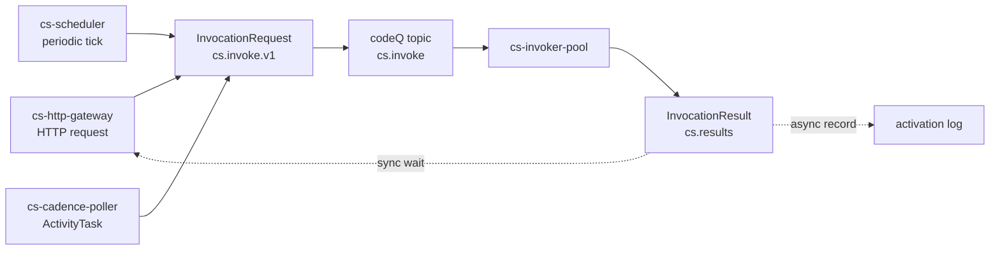

# Programming Model: Triggers and Schedules

Functions in Sous never invoke themselves.

Every execution begins at a trigger — a boundary component that translates an external event into a uniform `InvocationRequest` envelope, publishes that envelope on the `cs.invoke` codeQ topic, and optionally waits for the matching `InvocationResult`.

The trigger families are intentionally narrow in scope and broad in coverage: an HTTP request, a periodic tick, or a Cadence ActivityTask are the only three ways code enters the invoker pool.

Each one is owned by a single dedicated boundary process.

The platform's design treats the trigger surface and the execution surface as separable concerns.

A trigger is responsible for authentication, request shaping, and producing a well-formed `InvocationRequest`.

The invoker is responsible for resolving the function ref, enforcing version-scoped capabilities and roles, dispatching to a runtime, and producing an `InvocationResult`.

Neither side needs to know the other's mechanics — they meet on the codeQ topic and the schema.

New trigger families can be added without changing execution semantics, and runtime improvements roll out to every trigger family at once.

What follows describes when to choose each family and what each one carries on the wire.

The detailed mechanics — error handling, idempotency keys, body encoding, heartbeats — live in the dedicated event-source pages that this document links to.

## The three families

Sous defines three trigger families today. Each one solves a different problem and carries a different authentication identity:

- **HTTP triggers** serve synchronous request/response traffic. They are low-latency and the caller blocks on the result. The boundary process is `cs-http-gateway`. The caller's identity is the Tikti bearer token on the request.
- **Schedule triggers** fire periodically without a caller. They are fire-and-forget: the scheduler publishes the request and does not await the result. The boundary process is `cs-scheduler`. The identity on the envelope is the scheduler's own Tikti service principal.
- **Cadence triggers** drive activities inside durable workflows. They are owned by the Cadence poller and dispatched against an external Cadence cluster. The boundary process is `cs-cadence-poller`. The identity on the envelope is the poller's Tikti service principal, scoped to the workflow's domain.

A fourth shape — `api` — appears in the invocation schema's `trigger.type` enum (see `spec/cs.invoke.v1.json`).

It is reserved for direct invoke calls made against the control plane by privileged operators (for example, a runbook step that retries a failed activation against a specific version).

The `api` shape is not a user-facing trigger family; it does not have a dedicated boundary process.

Production traffic always enters through one of the three families above.

## Choosing a family

The choice between HTTP, schedule, and Cadence is rarely subtle.

The differences are visible at the API edge: who is calling, what they expect back, and how long they are willing to wait.

**Choose HTTP** when an external caller needs an answer.

An HTTP trigger is appropriate for synchronous API endpoints, webhook handlers that must return a status code, and any integration where the response body is the contract.

The caller pays for the wait; the platform binds the work to a function timeout and returns a result or a 504.

Latency budgets are tight (the gateway's wait is the function timeout plus a small slack).

The request and response payloads must fit the gateway limits (6 MiB request body, 64 KiB headers, 16 KiB query).

**Choose Schedule** when the work is periodic and no caller is waiting.

A schedule trigger fits cron-like reconciliations, periodic exports, ledger fold operations, and any maintenance work that should run on a wall-clock cadence.

The scheduler enforces an overlap policy per schedule (`skip`, `queue`, or `parallel`) so it can handle slow predecessors deterministically.

Result delivery is asynchronous — the activation record carries the outcome, but no caller is consuming it.

**Choose Cadence** when the work is one step inside a durable orchestration.

A Cadence trigger fits any activity that a workflow executor needs to schedule, retry, await, and recover from failure on.

The activity sees a single attempt as a normal invocation; the durability and retry policy live in the Cadence workflow that scheduled it.

Cadence activities are the right primitive whenever multiple steps need to compose with at-least-once delivery, retries with backoff, and crash-safe progress across long wall-clock windows.

A common pattern combines two or three families against the same function: an HTTP trigger exposes the function for synchronous testing and manual replay, a schedule trigger drives the periodic happy path, and a Cadence trigger drives the durable orchestration that uses the same function as an activity.

Because all three converge on the same invocation envelope and the same version-pinned manifest, the function's behavior is identical in all three contexts.

## A uniform envelope

Every trigger family ultimately produces the same on-wire shape: an `InvocationRequest` encoded as JSON, conforming to `spec/cs.invoke.v1.json`, published to the `cs.invoke` codeQ topic.

The schema's required fields are:

- `activation_id` — UUID, unique per invocation, generated by the trigger.
- `request_id` — short stable identifier used for idempotency.
- `tenant`, `namespace` — function addressing.
- `ref` — `{function, alias?, version?}`. Exactly one of `alias` or `version` is set.
- `trigger` — `{type, source}`. `type` is one of `http`, `schedule`, `cadence`, `api`; `source` carries family-specific context.
- `principal` — `{sub, roles}` describing the caller's Tikti identity.
- `deadline_ms` — absolute deadline by which the invoker must finish or fail.
- `event` — the user-visible payload the handler receives.

The invoker treats this envelope as the ground truth for the invocation.

It does not consult the trigger that produced the envelope.

It does not differentiate behavior by trigger family except where the manifest's `authz` block names trigger-specific role allowlists.

This is what enables triggers to evolve independently: as long as the envelope is well-formed and the principal is honest, the invoker does not care which boundary process produced it.

The diagram is intentionally narrow on the producer side and shared on the consumer side.

The HTTP gateway is the only path that re-reads the result for synchronous delivery.

The scheduler and the Cadence poller terminate the wire path at the request publish, then independently subscribe to `cs.results` for their own bookkeeping.

The scheduler clears its in-flight marker; the poller responds to Cadence.

## Authentication per family

Authentication is the place where the families differ most.

The invoker enforces the version's `authz` allowlist against the envelope's `principal`, so the trigger family's job is to fill `principal` honestly.

### HTTP triggers carry the caller's token

`cs-http-gateway` requires `Authorization: Bearer <tikti_token>` on every request, validates the token against Tikti, and constructs `principal` from the token's claims:

- `principal.sub` — the user or service identity from the token.
- `principal.roles` — the role set the token presents.

The gateway then enforces the action `cs:function:invoke:http` against Tikti before building the envelope.

The version's `authz.invoke_http_roles` allowlist is enforced downstream by the invoker, against the same principal.

The caller's identity is visible end-to-end: an HTTP function sees the real user that invoked it.

Audit records preserve the same identity across the gateway, the invoker, and any side effects the function produces.

The HTTP trigger family covers webhooks and public APIs equally well.

A webhook is just an HTTP invocation whose caller happens to be a third-party service holding a tenant-issued token.

See [Event Sources: HTTP](Event-Sources-HTTP) for the detailed endpoint shape, request/response mapping, and idempotency-key semantics.

### Schedule triggers carry a system identity

`cs-scheduler` is a tenant-scoped leader process.

It does not have a human caller.

It authenticates as itself, using a Tikti service principal scoped to the tenant whose schedules it owns:

- `principal.sub` — the scheduler's service identity, for example `svc:cs-scheduler:t_abc123`.
- `principal.roles` — a fixed set of scheduler roles, typically just `cs:scheduler:tenant`.

The version's `authz.invoke_schedule_roles` allowlist must include this scheduler role, or the invoke fails closed at the invoker boundary.

A function that should not be schedulable simply omits that role.

The asymmetry is intentional: an HTTP-only function and a schedule-only function are configured differently at the manifest level, and the platform enforces the boundary without any per-function plumbing.

The schedule trigger family is documented in detail at [Event Sources: Schedule](Event-Sources-Schedule), including the overlap policies (`skip`, `queue`, `parallel`), the misfire catch-up cap, and the per-schedule in-flight marker.

### Cadence triggers carry the workflow identity

`cs-cadence-poller` is a Cadence worker.

It receives ActivityTasks from a Cadence cluster, maps them to function refs through a per-tenant `WorkerBinding`, and produces `InvocationRequest` envelopes whose principal is the poller's own Tikti service identity, scoped to the workflow's domain:

- `principal.sub` — the poller's service identity, for example `svc:cs-cadence-poller:payments`.
- `principal.roles` — a fixed set of Cadence-worker roles, typically `cs:cadence:worker:<domain>`.

The version's `authz.invoke_cadence_roles` allowlist must include the appropriate Cadence-worker role.

Multiple domains can drive the same function by listing each domain's worker role on the version.

The `trigger.source` block carries the Cadence identifiers — `domain`, `tasklist`, `workflowId`, `runId`, `activityId`, `activityType`, `attempt` — so the activation record can be correlated back to the workflow execution.

The Cadence path is unique in that it also produces an asynchronous response back to Cadence: the poller subscribes to `cs.results`, matches the `activation_id` to the original `taskToken`, and calls Cadence's respond API with the result bytes.

The function itself sees a normal invocation; the durability happens outside its view.

See [Event Sources: Cadence Activities](Event-Sources-Cadence-Activities) for the binding model, the heartbeat protocol, and the recovery rules for poller crashes.

## Idempotency by family

Each trigger family owns its own idempotency strategy, and each one converges on the platform's `request_id` field:

- HTTP triggers honor an optional `Idempotency-Key` header. The gateway derives `activation_id` as `UUIDv5(namespace=tenant, name=Idempotency-Key + function_ref)`, so identical retries collapse onto the same activation. Without the header, the gateway generates a UUIDv4 and treats the call as a unique request.
- Schedule triggers derive `request_id` from `(schedule_id, tick_seq)`. A leader restart that re-publishes a tick produces the same `request_id`, so the invoker resolves the second publish to the first activation's result and does not re-execute.
- Cadence triggers derive `request_id` from the activity's `taskToken` hash. A redelivered ActivityTask (Cadence retries, network partition, poller crash) lands on the same `request_id` and resolves to the same activation; the poller then responds to Cadence with the existing result.

The platform's `request_id` window is bounded by activation retention; collisions outside that window are not deduplicated.

User code that runs against multiple trigger families should still write idempotency markers under tenant-scoped KV prefixes if the work is destructive.

The trigger-level dedup catches retries within the platform, but user-level invariants (for example, "do not charge the same invoice twice across redeploys") need user-level enforcement.

## Result delivery patterns

Result delivery is the most visible behavioral difference between the families:

**HTTP triggers are synchronous.**

The gateway publishes the request, then blocks on `cs.results` waiting for the matching `activation_id`.

The wait is bounded by the function's `timeoutMs` plus a small slack (250 ms by default).

If the timeout fires before the result arrives, the gateway returns HTTP 504 and the activation may still complete asynchronously and be recorded.

If the function returns within budget, the gateway translates the response envelope into headers, status code, and body, and returns it to the caller.

**Schedule triggers are fire-and-forget.**

The scheduler publishes the request and does not wait for the result.

It does subscribe to `cs.results` separately, but only to maintain the per-schedule in-flight marker that drives the `skip` overlap policy.

The activation record is the only durable record of what happened; there is no caller to receive the response.

**Cadence triggers are asynchronous with a response.**

The poller publishes the request and continues polling for more tasks.

A separate subscription on `cs.results` matches activations back to Cadence `taskToken`s and reports completion or failure to Cadence.

From Cadence's perspective the activity is just an asynchronous worker; from the function's perspective the invocation is just another envelope.

In all three families the activation record is the persistent ground truth.

The result envelope (`cs.results.v1`) carries status, duration, error fields, and log pointers, and the activation store persists it for the configured retention window.

A debugger inspecting an activation does not need to know which trigger family produced it — the record is uniform.

## Trigger boundary as a single seam

The three families together cover the operational surface Sous targets: synchronous integration, periodic maintenance, and durable orchestration.

They share a single envelope, a single dispatch topic, a single invoker pool, and a single result topic.

They differ only in how they authenticate, how they decide when to fire, and how they consume the result.

Every additional trigger family the platform might add later — for example, a queue-trigger that consumes user-defined codeQ topics — would slot into the same shape: produce an `InvocationRequest`, publish it on `cs.invoke`, optionally consume `cs.results` for the boundary's own bookkeeping.

## Trigger configuration belongs to the tenant

Each trigger family carries its own configuration model, and each model lives on the tenant's side of the platform.

HTTP triggers are routes mapped to function refs.

A tenant exposes a function over HTTP by creating an HTTP route that resolves to `(function, ref)`; the gateway looks the route up on every request, then enforces the version's `authz` rules before producing the envelope.

Routes are managed through the control plane and visible in [REST API](Reference-REST-API).

Schedule triggers are durable schedule records.

A tenant creates a schedule by naming a function ref, an interval, and an overlap policy.

The scheduler reads the schedule list every tick, decides which schedules are due, and publishes envelopes accordingly.

The full schedule shape lives in [Event Sources: Schedule](Event-Sources-Schedule), and the storage layout is described in [Storage: KVRocks](Reference-Storage-KVRocks).

Cadence triggers are WorkerBindings.

A WorkerBinding names a Cadence `domain`, `tasklist`, the poller's `worker_id`, polling concurrency, and an `activity_map` that resolves Cadence `ActivityType` names to function refs.

A tenant onboards a Cadence integration by registering a WorkerBinding; the poller refreshes the binding list on a configurable interval and starts or stops poll loops as bindings appear and disappear.

All three configuration shapes are persisted in the same control plane that owns functions, versions, and aliases.

A trigger that points at a function ref pins itself to that ref's resolution at invoke time — if the ref names an alias, the trigger gets whatever version the alias currently resolves to.

This is what lets a single alias retarget redirect both HTTP traffic and scheduled invocations in lockstep, without changing the trigger's own configuration.

## Why one envelope and not three

A platform that exposed three separate execution paths — one for HTTP, one for schedule, one for Cadence — would have to specialize the runtime, the activation log, the capability checks, and the role checks three times.

Each specialization would be a place where the families could diverge subtly, and each divergence would be a place where a function's behavior depends on the trigger that called it.

That is exactly the property the platform's design avoids.

By producing one envelope shape and dispatching through one invoker pool, the platform guarantees that the function's contract is the same in every invocation context.

The trigger families differ in how they authenticate and how they handle the result, but the function never sees any of that — it sees an `event` and produces a return value or an error.

The narrowness of this seam is what makes the platform's behavior predictable.

A function whose HTTP invocation works correctly will work correctly in a schedule or a Cadence context, provided its `authz` block admits the new trigger.

A function whose Cadence retries surface a subtle bug will surface that same bug under repeated HTTP retries with the same `Idempotency-Key`.

The trigger choice is operational, not behavioral.

## Adding a fourth family

The platform's trigger surface is deliberately extensible.

The envelope is versioned (`cs.invoke.v1`), the dispatch topic is well-known (`cs.invoke`), and the principal shape is independent of the producing trigger.

A future fourth family — for example, a queue-trigger that consumes user-defined codeQ topics, or a stream-trigger that consumes change-data-capture events — would slot in by following the same five rules every existing family follows:

1. Authenticate the caller against a Tikti identity (real user, service principal, or external integration) and build `principal` honestly.
2. Authorize the call against the version's `authz` allowlist before publishing.
3. Construct an `InvocationRequest` that conforms to the schema, with a stable `request_id` for idempotency.
4. Publish on `cs.invoke` and let the invoker dispatch.
5. Subscribe to `cs.results` only as far as the family's own bookkeeping requires.

Any boundary process that obeys these rules is indistinguishable to the invoker from the existing three.

This is the platform's primary extension point and the place where future product surfaces would land.

## Tenant isolation across families

Every trigger family operates per tenant.

The HTTP gateway dispatches against a route mounted in the tenant's namespace; a route in tenant A cannot resolve to a function in tenant B.

The scheduler is leader-elected per tenant; a tenant's schedules are managed by a leader process scoped to that tenant alone.

The Cadence poller binds to a tenant's WorkerBindings; activity invocations carry the tenant identifier in the envelope, and any cross-tenant resolution is a control-plane bug rather than a possible runtime path.

The platform enforces this at the storage layer.

KV keys are prefixed by tenant, codeQ topics are partitioned by tenant, ledgerDB entries carry the tenant as the partition key.

A misbehaving tenant cannot starve another tenant of resources because the budgets that apply to one tenant's traffic do not aggregate against another tenant's.

The model means an operator can reason about a tenant's behavior in isolation, and a tenant can reason about its own behavior without modeling what other tenants are doing.

Cross-tenant communication is possible only through explicit interfaces — an HTTP trigger that a tenant exposes deliberately, a codeQ topic published deliberately on a public namespace — and every such interface goes through Tikti for authentication and authorization.

## Where to read next

For the operational depth of each family, see:

- [Event Sources: HTTP](Event-Sources-HTTP) — endpoint shape, request mapping, response mapping, idempotency, gateway limits.
- [Event Sources: Schedule](Event-Sources-Schedule) — schedule model, overlap policies, misfire policy, tenant isolation.
- [Event Sources: Cadence Activities](Event-Sources-Cadence-Activities) — WorkerBinding shape, polling loop, heartbeat protocol, crash recovery.
