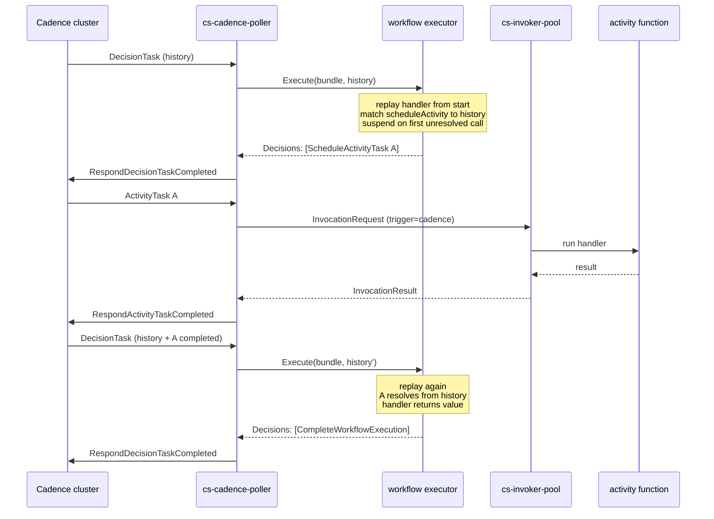

# Programming Model: Workflows

A workflow in Sous is a piece of orchestration code that decides which functions to invoke, in what order, and what to do with their results.

It runs on top of an external Cadence cluster and inherits Cadence's durability guarantees: a workflow can pause for hours or days, survive process crashes and cluster failovers, and resume exactly where it left off without losing intermediate state.

The platform's role is to host the workflow handler, dispatch activity invocations through the same envelope every other trigger family uses, and bridge results back to Cadence so the workflow can advance.

The model rests on a clean separation between two roles.

An **activity** is a single function invocation: a unit of work that may succeed, fail, or time out, and that Cadence will retry according to a policy declared on the workflow side.

A **workflow** is the coordination logic above the activities: it schedules them, awaits their results, branches on outcomes, and ultimately returns a final value.

Activities run in the invoker pool just like any other Sous function.

Workflows run in a separate executor that produces Cadence decisions rather than side effects.

The distinction is enforced at every layer — activities have arbitrary capabilities, workflows do not — and the platform treats the two execution paths as distinct dispatch surfaces with distinct contracts.

This page introduces the workflow execution model conceptually and frames what the MVP supports today.

The detailed API surface, decision encoding, and history walking lives in the executor code at `internal/cadence/workflow/executor.go`.

The operational mechanics of polling, dispatching, and responding to Cadence live in [Event Sources: Cadence Activities](Event-Sources-Cadence-Activities).

## Activities versus workflows

The model's most important rule is that activities and workflows are not interchangeable.

Activities have side effects; workflows do not.

Activities can fail; workflows cannot fail in the same sense.

Activities run once per attempt; workflow handlers re-run from the start every time a decision is needed.

These differences are not stylistic — they are baked into the durability mechanism.

An **activity** is a published Sous function invoked through a Cadence ActivityTask.

From the function's perspective an activity invocation is indistinguishable from an HTTP or schedule invocation: the same `InvocationRequest` envelope arrives, the same manifest is enforced, the same runtime executes the handler.

The only differences are the `trigger.source` block, which carries Cadence identifiers, and the principal, which is the poller's service identity.

Activities are where work actually happens: external HTTP calls, KV writes, codeQ publishes, anything that interacts with the world.

Activities are allowed to be slow, allowed to fail, and allowed to be retried.

The function's manifest enforces its capabilities the same way it does for any other trigger.

A **workflow** is a piece of orchestration code that decides which activities to schedule.

Its only output is a list of Cadence decisions: schedule this activity, complete the workflow with this value, fail the workflow with this reason.

A workflow does not perform side effects directly.

It does not open HTTP connections, it does not write to KVRocks, it does not publish to codeQ.

It reads the workflow's history and produces decisions that will affect the world only after Cadence persists them.

Everything observable about a workflow's progress is a side effect of the activities it scheduled, not a side effect of the workflow handler itself.

The cleanest mental model is that an activity is a function call and a workflow is the program that strings function calls together.

The difference from an ordinary program is that the program is restartable: Cadence may replay it from the beginning at any time, and the program is required to produce the same sequence of decisions when it does.

## MVP scope: scheduleActivity only

The v0.1 MVP intentionally exposes a single workflow API: `cs.cadence.scheduleActivity`.

A workflow handler in the MVP can do exactly two things — schedule an activity and await its result, or return a final value.

There is no support yet for the broader Cadence surface:

- No **child workflows**. A workflow cannot start another workflow as a sub-execution.
- No **signals**. A workflow cannot receive external messages mid-flight.
- No **versioned patches**. A workflow's code cannot branch on a `GetVersion`-style marker; deterministic edits require redeploying as a new workflow type.
- No **timers** beyond what `scheduleActivity` provides. A workflow cannot `sleep` independent of an activity's progress.
- No **queries**. A workflow cannot expose synchronous read-only endpoints to external callers.

These are scheduled as follow-up work and tracked in the roadmap.

The MVP scope is narrow on purpose: it covers the activity-orchestration pattern — fan out N activities, await results, decide next step — which is the dominant use case for the platform's first Cadence-integrated tenants.

The executor itself is implemented at `internal/cadence/workflow/executor.go`; the package doc lists the deferred features that the E8.01 follow-up will land.

The MVP's narrow API surface has a real upside: it minimizes the determinism footprint.

With only one source of non-determinism (the activity result the workflow awaits), the rules a workflow author must follow are short and easy to lint mechanically.

## Replay: why determinism is non-negotiable

Cadence does not persist a workflow's in-memory state.

It persists a **history** — an ordered log of events such as `WorkflowExecutionStarted`, `ActivityTaskScheduled`, `ActivityTaskCompleted`, and so on — and rebuilds the workflow's in-memory state by re-running the workflow function from the start every time a new decision is needed.

This is called replay, and it is the keystone of Cadence's durability model.

Every time Cadence needs a workflow to make progress, it dispatches a **DecisionTask** to a worker.

The worker pulls the workflow's complete history, calls the workflow handler with the same input the workflow originally received, and lets the handler run again.

As the handler executes, each call to `scheduleActivity` is matched against the history:

- If the history already contains a completion event for that activity (the handler has run before and the activity has since finished), `scheduleActivity` returns the stored result immediately. The handler keeps going as if the activity had completed synchronously.
- If the history does not yet contain a completion, the call suspends: the executor records a `ScheduleActivityTask` decision (or notes that one is already in flight) and short-circuits the handler. The DecisionTask completes with the decision list, Cadence persists it, and the workflow waits for the activity result.

When the activity eventually completes, Cadence dispatches a new DecisionTask.

The worker runs the workflow handler from the beginning again.

This time the history contains the activity's completion, so the same `scheduleActivity` call resolves immediately, the handler advances past that point, and execution continues until it either schedules another activity or returns a final value.

The diagram shows the core loop.

Two DecisionTasks, two replays of the same handler, two distinct decision lists.

The handler's source code did not change between the two replays — only the history grew, and the handler's path through it advanced.

This mechanism is what gives Cadence its durability: there is no in-memory state to lose, because in-memory state is rebuilt from the history every time.

A worker can crash mid-decision and the next DecisionTask runs cleanly on a different worker.

A workflow can wait three days for an activity and resume without any worker holding state in the meantime.

The mechanism is also why **determinism is a hard requirement**.

If the handler takes a different path through its code on the second replay than it did on the first, the matched decisions will not line up, and the workflow's state will diverge from the history.

Cadence detects this as a non-determinism error and fails the workflow.

There is no graceful recovery: a non-deterministic workflow is a broken workflow.

## Deterministic style

A deterministic workflow function obeys a short list of rules.

Each rule maps to a class of non-determinism the linter can catch ahead of publish; see [Determinism Linter](Development-Tools-Determinism-Linter) for the mechanical check.

- **Do not read the wall clock.** A workflow that calls `Date.now()` returns a different value on every replay. Anything that depends on time must come from an activity that returns the time, or from a future timer API.
- **Do not generate random values inline.** `Math.random()` returns a different value on every replay. Randomness must come from an activity that returns the value the workflow then uses.
- **Do not iterate over unordered collections.** `for (const k of Object.keys(map))` is allowed by the JavaScript spec to visit keys in different orders. Always sort before iterating.
- **Do not call non-deterministic host APIs.** A workflow handler does not have access to `cs.kv`, `cs.codeq`, `cs.http`, or any other side-effect API. The only platform API available inside a workflow is `cs.cadence.scheduleActivity`.
- **Do not depend on hardware or process state.** Hostname, PID, environment variables, and free memory all vary between workers. None of them belong in a workflow.
- **Do not perform I/O.** A workflow cannot open a socket, write to disk, or block on an external resource. Side effects belong in activities.

The platform pre-empts most of these by simply not binding the dangerous APIs into the workflow runtime.

`console.log` is allowed (the executor captures the lines for diagnostics) but the platform does not surface them to user-visible logs in v0.1 — they exist for the test harness and for a future log-shipping hook.

The determinism linter scans workflow source ahead of publish for the patterns above.

It is a coarse gate, not a proof, and a workflow can still be non-deterministic in ways the linter cannot see (for example, depending on the iteration order of a `Map` whose insertion order varies between replays).

Treat lint as the first line of defense and write replay tests as the second.

## What the executor actually runs

The workflow executor (see `internal/cadence/workflow/executor.go`) is stateless across calls.

Each DecisionTask produces a fresh `Executor.Execute` invocation: a new JavaScript runtime, a fresh `activation` state object that mirrors the history's resolved activities, and a single pass through the workflow handler.

The executor binds `cs.cadence.scheduleActivity` as the only platform API and provides a minimal `console` shim so the handler can emit diagnostic lines.

The handler is called with `(input, ctx)`:

- `input` is the payload from `WorkflowExecutionStarted` in the history.
- `ctx` is `{workflow_id, run_id, workflow_type}` — the durable identifiers for the run.

Two outcomes are possible.

If the handler returns a value, the executor encodes it as JSON and emits a `CompleteWorkflowExecution` decision.

If the handler suspends on an unresolved `scheduleActivity` (the executor signals suspension internally with an opaque marker), the executor emits one or more `ScheduleActivityTask` decisions and returns.

The opaque marker is intentionally invisible to user code — workflow authors should not catch it.

The MVP guards against truly pending async patterns (timers, network promises): if the handler returns a pending promise that did not arise from `scheduleActivity`, the executor surfaces a clear "use cs.cadence.scheduleActivity" error to the operator.

The executor caps replay work with `MaxRunSteps` (default 10 000) so a malformed workflow cannot spin forever on a single DecisionTask.

In practice the DecisionTaskTimeout from Cadence catches runaways well below this cap; the executor's own limit exists for the corner cases.

## Failures and retries

A workflow handles failure at two layers: the activity layer and the workflow layer.

At the activity layer, an individual activity can fail.

The workflow author chooses the retry policy when scheduling the activity (in the MVP, the policy is carried on the `scheduleActivity` options block; richer retry-policy support follows in the E8.01 follow-up).

Cadence retries failed activities according to the policy without re-running the workflow handler between attempts.

The workflow only sees the final outcome (success or terminal failure).

When an activity terminally fails, the workflow handler observes the failure as an exception thrown at the `scheduleActivity` call site.

The author can catch it, log it, schedule a compensating activity, or rethrow to fail the workflow.

At the workflow layer, the workflow itself can fail.

A workflow that throws an uncaught exception in the handler produces a `RespondDecisionTaskFailed` reply.

Cadence will replay the handler on the next DecisionTask, and if the exception is deterministic (as it should be), the workflow will fail consistently and Cadence will mark the workflow execution as failed.

The MVP's executor surfaces these as Go-level errors; production wiring routes them to Cadence as `DecisionTaskFailed` responses.

The model's overall failure handling is straightforward: activities own retry, workflows own composition.

The executor itself is intentionally thin, because every additional behavior at the workflow layer is a behavior that has to survive replay.

## Composition patterns

The MVP's `scheduleActivity`-only surface still supports a useful set of composition patterns.

**Sequential pipeline.**

A workflow schedules activity A, awaits its result, then schedules activity B with A's output as input.

The pattern fits ETL-shaped work where each step depends on the previous step's output.

Cadence persists the intermediate result, so a worker crash between A and B does not lose A's work.

**Parallel fan-out.**

A workflow schedules N activities concurrently and awaits all of them.

In JavaScript this is `Promise.all([scheduleActivity(...), scheduleActivity(...), ...])`.

The executor records all N `ScheduleActivityTask` decisions in a single DecisionTask, Cadence dispatches them in parallel, and the workflow advances only after all N have either completed or failed.

The pattern fits batch processing where independent items can run side by side.

**Conditional branch.**

A workflow inspects the result of one activity and decides which activity to schedule next.

The branch is deterministic on replay because both branches always see the same prior result.

This is the most common pattern in business orchestrations: "if payment succeeded, ship the order; if it failed, send a notification."

**Saga.**

A workflow schedules a sequence of activities, each of which may have a compensating activity that undoes its effect.

If a downstream activity fails, the workflow catches the failure and schedules the compensating activities in reverse order.

The saga pattern is how workflows model multi-step transactions that span systems with no global commit.

These patterns compose freely.

A real workflow might fan out across a list of items, conditionally branch on the aggregate result, then run a saga to clean up partial state on failure.

The executor does not see any of these patterns — it sees a list of `scheduleActivity` calls produced by the handler — but the workflow author can reason about them as familiar control-flow shapes.

## The workflow contract

A workflow, like an activity, is a published Sous function with a manifest.

The manifest declares the runtime, the entry, the handler, and the limits — the same fields a regular function declares.

The workflow's manifest differs from an activity's in three ways:

1. The capability arrays are empty.

A workflow cannot read KV, publish to codeQ, or call HTTP — those side-effect APIs are not bound into the workflow runtime.

A non-empty capability array on a workflow manifest is rejected at publish time by the same schema validation that every function goes through.

2. The handler is the workflow function, not an activity handler.

The control plane distinguishes workflow versions from activity versions by an explicit field on the publish request; the same source bundle is never both.

3. Determinism lint runs.

The determinism linter is gated on the workflow flag and applies the rules described above.

A bundle that lints clean as an activity can still fail to lint as a workflow.

These constraints make the workflow's contract tight by construction.

A workflow that publishes successfully is a workflow that the platform believes is deterministic and side-effect-free.

The runtime then enforces both properties at execution time by simply not exposing the APIs a non-deterministic or side-effecting workflow would need.

## Workflow versions and replay

Workflow versions are immutable, like activity versions.

A workflow that was published at version 3 yesterday is exactly the same bytes today, regardless of what version 4 and 5 contain.

This is essential for replay: a workflow that started against version 3 must continue replaying against version 3 for the rest of its life.

Cadence stores the workflow's `workflow_type` in the history.

The poller resolves that type back to a Sous function ref using the WorkerBinding's `workflow_map`, and the resolution pins the version that the executor loads.

A WorkerBinding update that retargets the workflow alias only affects new workflow starts; running workflows continue against the bundle they were originally bound to.

This is the asymmetric counterpart to alias retargets for activities: activities run their version at scheduling time, workflows pin their version at the start of the execution.

The asymmetry exists because activities are single attempts (their version-at-time-of-execution is what runs), while workflows are long-running deterministic programs (their version must remain stable across replays).

## Where to read next

- [Determinism Linter](Development-Tools-Determinism-Linter) — the publish-time check that catches the common non-deterministic patterns before a workflow ships.
- [Event Sources: Cadence Activities](Event-Sources-Cadence-Activities) — the operational counterpart: WorkerBinding shape, polling, heartbeats, and crash recovery.
- [Programming Model: Triggers and Schedules](Programming-Model-Triggers-and-Schedules) — how the Cadence trigger family fits alongside HTTP and schedule triggers.
- [Programming Model: Functions](Programming-Model-Functions) — the activity contract: what an activity function is, what its manifest enforces, how its versions and aliases work.
