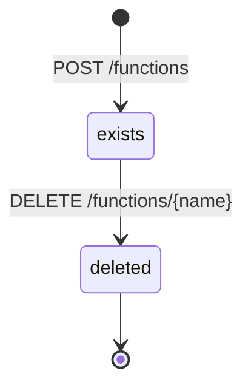
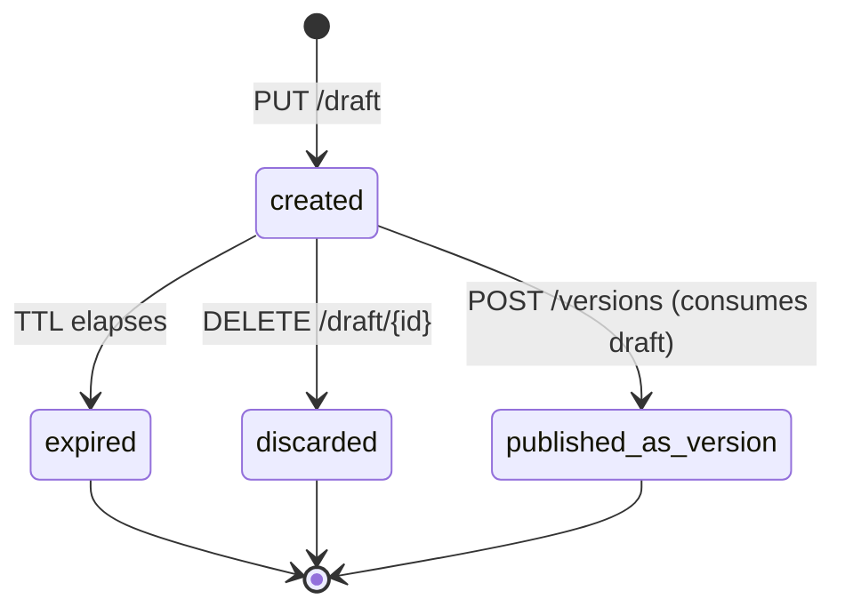
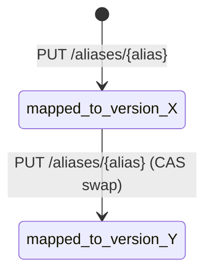
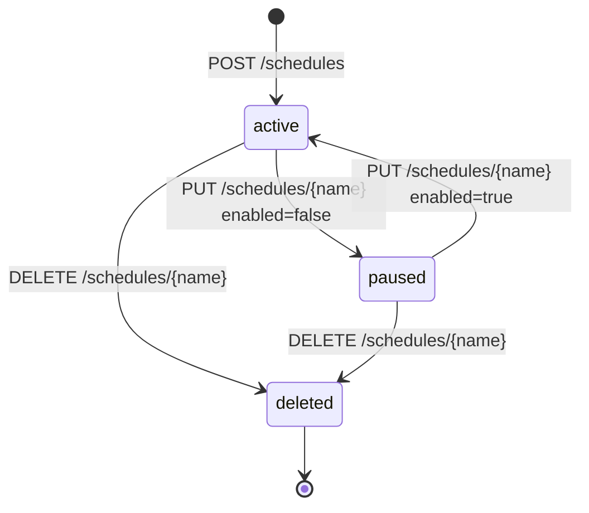
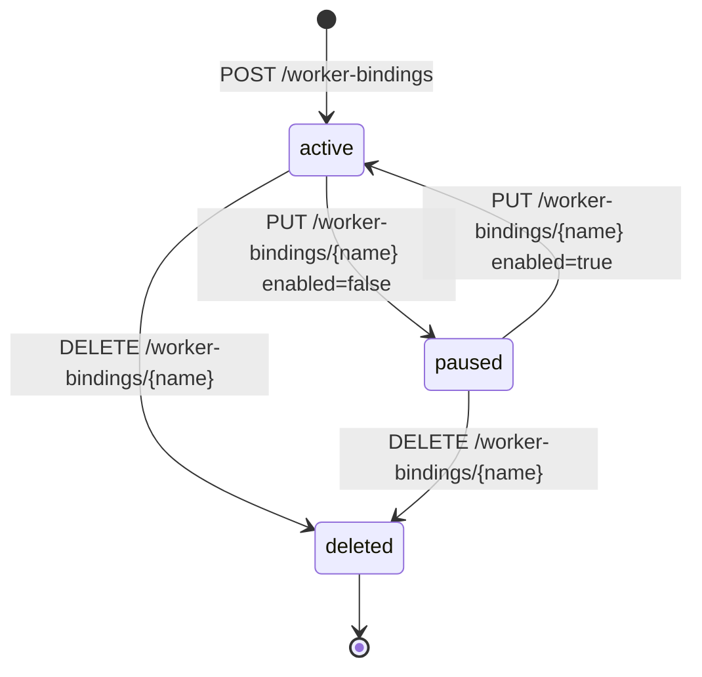
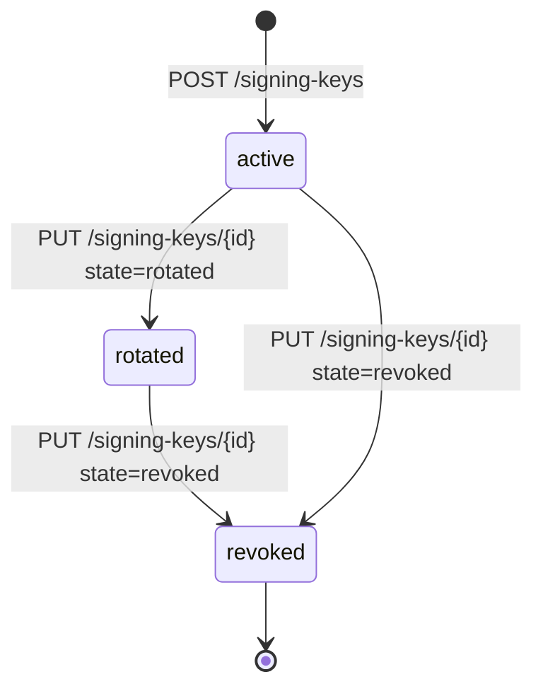

# Reference: Entity State Machines

This page is the canonical FSM reference for the entities Sous persists. The transitions and invariants below are pinned by the contract test suite at `cmd/cs-control/lifecycle_contract_test.go` (the E1.01 deliverable) and `cmd/cs-control/signing_keys_test.go`. The contract suite is the executable form of this page — any code that changes a transition must update the suite in the same commit, and any documentation drift is a bug. Each section gives a mermaid state diagram and a prose walkthrough; the walkthrough is authoritative and the diagram exists to make the prose easier to scan.

## 1. Function

A function exists in one of two states. The interesting invariant is that delete is one-way — a soft-deleted function cannot be revived through `POST .../functions`. The record stays for audit (`?include_deleted=true` reads it) and its versions and aliases remain on disk so historical traffic can still be reasoned about.

Contract invariants for Function: a repeated `POST .../functions` with the same `(name, runtime, entry, handler)` returns the same record (idempotent create, 201 then 200); a `POST` that changes `runtime`, `entry`, or `handler` returns `409 CS_IDEMPOTENCY_CONFLICT`; a `POST` against a soft-deleted record also returns `409 CS_IDEMPOTENCY_CONFLICT`. Reads without `include_deleted=true` return `400 CS_VALIDATION_FAILED` after delete; with `include_deleted=true` they return the tombstoned record with a non-nil `deleted_at_ms`. See `TestLifecycleCreateReadDelete` and `TestLifecycleCreateIsIdempotent`.

## 2. Draft

A draft is a temporary upload bound to a function. It lives in KVRocks under a draft key with a TTL (default 24h, configurable via `internal/limits.DefaultDraftTTLSeconds`). Three things can happen to a draft: it expires, it is consumed by a publish, or the caller discards it. The terminal states (`expired`, `discarded`, `published-as-version`) are all one-way.

Contract invariants for Draft: each `PUT .../draft` returns a fresh `draft_id` and `expires_at_ms`; concurrent uploads never collide on `draft_id`, and a later upload never shortens an earlier draft's TTL window. Identical bundle bytes yield identical `sha256` values. A `POST .../versions` against an expired draft returns `400 CS_VALIDATION_FAILED` with `message: "draft expired"`. Atomicity matters here too — the publish path consumes the draft and writes the version meta + bundle + (optional) alias in a single KV transaction so a failed publish never leaves a half-state. See `TestLifecycleDraftUploadIsolation`, `TestLifecycleConcurrentDraftsAllPersist`, and `TestLifecyclePublishRejectsExpiredDraft`.

## 3. Version

A function version has exactly one state — `published`. Versions are immutable forever. There is no way out: no delete, no edit, no re-key. Re-publishing the same draft does not mutate the existing version; it allocates a new one.

```mermaid
stateDiagram-v2
    [*] --> published: POST /versions
    published --> published: (no transitions; immutable)
```

Contract invariants for Version: version numbers are strictly monotonic and gap-free per `(tenant, namespace, function)`; concurrent publishes return distinct integers and never produce duplicates or zeros. The `(version, sha256, config)` triple is immutable after the first read-after-write — the contract suite re-reads version 1 after publishing version 2 and asserts its `sha256` has not drifted. Future explicit version-delete will need a 409 guard so callers cannot break a live alias through DELETE. See `TestLifecyclePublishAssignsMonotonicVersions`, `TestLifecycleConcurrentPublishesAreAtomic`, and `TestLifecyclePublishedVersionsAreImmutable`.

## 4. Alias

An alias is a mutable pointer from a short name (`dev`, `staging`, `prod`) to a `version` integer. The interesting property is the atomic swap — the alias key is a single KV write, so a reader resolving the alias always observes either the pre-swap version or the post-swap version, never a torn value or a missing key (once the alias has been set at least once).

Contract invariants for Alias: `PUT .../aliases/{alias}` with a `version` that has not been published returns `400 CS_VALIDATION_FAILED` — the control plane never persists a dangling pointer. Repeated swaps under load never produce torn reads — the alias-swap test runs 50 swaps concurrent with 4 readers and asserts the readers see only the two known versions (no error, no "other"). Reads after the first set always succeed; the alias is durable. See `TestLifecycleAliasSetAndList`, `TestLifecycleAliasSwapIsAtomic`, and `TestLifecycleAliasRejectsUnknownVersion`.

## 5. Schedule

A schedule has three observable states: `active` (the scheduler ticks it), `paused` (the record exists but no ticks fire), and `deleted` (the record is gone). The interesting wrinkle is the inflight marker — when `overlap_policy` is `skip`, the scheduler holds a per-schedule "inflight" flag while the previous tick's activation is still running, and refuses to enqueue a second tick until the flag clears. With `queue` it buffers; with `parallel` it fires regardless.

Inflight semantics: the scheduler persists `ScheduleState` (`next_tick_ms`, `tick_seq`) per schedule. On each evaluation tick the scheduler computes `next_tick_ms` from `every_seconds` (interval mode) or the cron expression in `tz` (cron mode), applies `jitter_ms`, and decides whether to publish an `InvocationRequest`. If `overlap_policy` is `skip` and the prior activation has not yet emitted an `InvocationResult`, the tick is logged and dropped. A `deleted` schedule cannot be revived — re-create with the same name produces a new record. See [Scheduler](Scheduler) for the wire-level behaviour.

## 6. WorkerBinding

A worker binding has the same three states as a schedule (`active`, `paused`, `deleted`) but the polling consequence is different. While `active`, the poller in `cs-cadence-poller` long-polls the configured task list and dispatches every received task through `activity_map` (for `kind: "activity"`) or to the workflow executor (for `kind: "workflow"`). While `paused`, the poller backs off — the long-poll loop is suspended and no `InvocationRequest` is emitted from this binding. While `deleted`, the binding record is gone and the poller stops polling that task list.

Polling consequence: a paused binding does not "lose" tasks from Cadence's perspective — Cadence retains the task on the task list and a different worker (or this worker, once re-enabled) will pick it up. A deleted binding orphans its `worker_id` from Cadence's heartbeat view; operators should ensure the Cadence task list has at least one other worker before deleting.

## 7. Signing key

A tenant signing key has three states: `active` (the keystore will use it for new signatures and accept it for verification), `rotated` (the keystore no longer uses it for new signatures but still accepts it for verification of older bundles), and `revoked` (the keystore rejects it for verification, which fails the activation of any bundle still signed with that key).

Verification consequence: when a bundle's recorded `signature.key_id` resolves to an `active` or `rotated` key, the invoker verifies and loads the bundle as usual. When it resolves to a `revoked` key, the invoker fails the activation with `CS_SIGNATURE_INVALID` — the bundle is treated as untrusted. When it resolves to no key at all, the activation fails with `CS_SIGNATURE_KEY_NOT_FOUND`. Operators rotate keys by moving the old key to `rotated`, importing a new `active` key, re-publishing critical functions, and only then promoting the old key to `revoked`. See [Security](Security) for the operational playbook.
