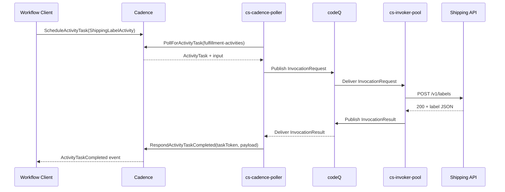

# Sample App: Cadence Activity

This sample builds an Activity worker for a Cadence workflow defined
elsewhere. A Go workflow client (running outside SOUS, registered with the
same Cadence domain) schedules a `ShippingLabelActivity` task on a known
tasklist; SOUS picks the task up through `cs-cadence-poller`, runs a `cs-js`
handler that calls an outbound HTTP endpoint to a shipping API, and returns
the generated label to Cadence. The workflow author never knows that the
activity is implemented by SOUS — to Cadence, SOUS is just another activity
worker that registered for the tasklist.

The scaffold for this template lives under
`internal/cli/templates/files/cadence-activity/`. The poller-side contract
is described in `wiki/Cadence-Integration.md` and the WorkerBinding shape is
in `internal/api/cadence_config.go`.

## Handler

The handler receives the activity payload as `event` and runs with
`ctx.trigger.type === "cadence"`. It calls the shipping API through
`cs.http.fetch`, parses the response, returns the label URL plus tracking
number, and emits a heartbeat so Cadence does not time out the activity
while the upstream call is in flight. Heartbeats are only legal under the
cadence trigger; the guard around `cs.cadence.heartbeat` keeps the same code
usable under `cs fn test` where the trigger is `api`.

```javascript
// function.js
export default async function handle(event, ctx) {
  if (ctx.trigger && ctx.trigger.type === "cadence") {
    cs.cadence.heartbeat({ phase: "starting" })
  }

  const order = event.input || {}
  cs.log.info({
    activation_id: ctx.activation_id,
    activity_type: event.activityType,
    order_id:      order.order_id,
  })

  const res = await cs.http.fetch("https://api.shipping.example.com/v1/labels", {
    method: "POST",
    headers: {
      "content-type": "application/json",
      "x-cs-activation-id": ctx.activation_id,
    },
    body: JSON.stringify({
      order_id:    order.order_id,
      from:        order.from,
      to:          order.to,
      weight_oz:   order.weight_oz,
    }),
  })

  if (res.status !== 200) {
    return {
      statusCode: 502,
      headers: { "content-type": "application/json" },
      body: JSON.stringify({
        error:        "shipping_api_failed",
        upstream:     res.status,
        upstream_body: res.body,
      }),
      isBase64Encoded: false,
    }
  }

  const label = JSON.parse(res.body)
  return {
    statusCode: 200,
    headers: { "content-type": "application/json" },
    body: JSON.stringify({
      order_id:        order.order_id,
      label_url:       label.url,
      tracking_number: label.tracking_number,
    }),
    isBase64Encoded: false,
  }
}
```

Two things are worth highlighting. First, the handler returns a
FunctionResponse envelope rather than a bare value. The poller treats a
`statusCode` in the 2xx range as a successful activity completion and any
other status (or a thrown exception) as a failure; the
`RespondActivityTaskCompleted` / `RespondActivityTaskFailed` mapping lives
under `cmd/cs-cadence-poller/`. Second, the `x-cs-activation-id` header makes
the SOUS activation visible inside the shipping API's logs, which is the
single highest-value piece of correlation glue when an end-to-end trace
spans three systems (Cadence workflow → SOUS activation → external API).

## Manifest

The manifest declares `cadence.kind: "activity"` so the publish-time
determinism linter (E8.03) does not check this bundle as a workflow. The
`http.allowHosts` array is the only outbound the activity needs; the
`kv.prefixes` is empty because the handler is fully stateless between
invocations. Cadence itself owns the durable state.

```json
{
  "name": "shipping-label",
  "schema": "cs.function.script.v1",
  "runtime": "cs-js",
  "entry": "function.js",
  "handler": "default",
  "limits": { "timeoutMs": 30000, "memoryMb": 128, "maxConcurrency": 4 },
  "capabilities": {
    "kv":    { "prefixes": [], "ops": [] },
    "codeq": { "publishTopics": [] },
    "http":  { "allowHosts": ["api.shipping.example.com"], "timeoutMs": 10000 }
  },
  "cadence": { "kind": "activity" }
}
```

The `maxConcurrency: 4` value is the per-pod cap; horizontal scale is added
by the poller's `pollers.activity` knob in the WorkerBinding. The two are
independent: the binding decides how aggressively to long-poll Cadence, the
manifest decides how many simultaneous executions any single invoker pod
will run.

## WorkerBinding

The WorkerBinding is the tenant-owned record that tells `cs-cadence-poller`
which tasklist to poll, how many goroutines to dedicate to it, and which
function each `ActivityType` maps to. The binding does not live inside the
manifest; it is registered against the control plane after the function is
published so the same function can serve multiple bindings if needed.

```json
{
  "name":     "shipping-activities",
  "kind":     "activity",
  "domain":   "fulfillment",
  "tasklist": "fulfillment-activities",
  "worker_id": "cs-shipping-01",
  "codec":    "json",
  "pollers":  { "activity": 8 },
  "limits":   { "max_inflight_tasks": 256 },
  "activity_map": {
    "ShippingLabelActivity": { "function": "shipping-label", "alias": "prod" }
  }
}
```

The `codec: json` setting tells the poller to JSON-decode the Cadence
payload before handing it to the handler as `event.input`. Workflows that
ship raw bytes (for example, protobuf-encoded payloads) use `codec: raw`
instead, which preserves the bytes as a base64 string.

## Register the binding

The binding is registered through the CLI or directly through the REST
endpoint. The CLI form below uses `./bin/cs cadence worker create` (see
`cmd/cs-cli/main.go`); the REST form posts the same body to
`/v1/tenants/{tenant}/namespaces/{namespace}/cadence/workers`.

```bash
./bin/cs fn draft upload shipping-label --path .
./bin/cs fn publish shipping-label \
  --draft <draft_id> \
  --timeout-ms 30000 \
  --memory-mb 128 \
  --invoke-cadence-roles role:cadence
./bin/cs fn alias set shipping-label prod --version 1

./bin/cs cadence worker create shipping-activities \
  --domain fulfillment \
  --tasklist fulfillment-activities \
  --worker-id cs-shipping-01 \
  --activity ShippingLabelActivity=shipping-label@prod
```

The REST equivalent:

```bash
curl -sS -X POST \
  -H "Authorization: Bearer $TIKTI_TOKEN" \
  -H "Content-Type: application/json" \
  -d @binding.json \
  https://control.example.com/v1/tenants/t_abc123/namespaces/default/cadence/workers
```

where `binding.json` is the WorkerBinding document above. Once the binding
lands in the control plane, the poller picks it up on its next refresh,
starts the configured number of long-poll goroutines, and begins delivering
tasks to the invoker.

## End-to-end flow

The sequence diagram below traces one activity execution. The workflow
client (anywhere in the Cadence cluster) schedules
`ShippingLabelActivity`; Cadence routes the task to the
`fulfillment-activities` tasklist; the SOUS poller, which has been
long-polling that tasklist, picks the task up, maps it to a function
reference through the WorkerBinding, and publishes an `InvocationRequest`
on codeQ. The invoker runs the handler, the handler calls the shipping API,
the result is returned through codeQ, and the poller responds to Cadence
with `RespondActivityTaskCompleted`.



The activity model is the right fit when the work is a single, side-effecting
step that the workflow author wants to be retried under a Cadence retry
policy. When the orchestration itself lives inside SOUS — multiple activities,
conditional branches, durable timers — use a Cadence workflow instead (see
[Sample App: Cadence Workflow](Sample-Apps-Cadence-Workflow)). For the full
WorkerBinding contract and the heartbeat / completion mapping, see
[Cadence Integration](Cadence-Integration) and
[Event Sources: Cadence Activities](Event-Sources-Cadence-Activities).
