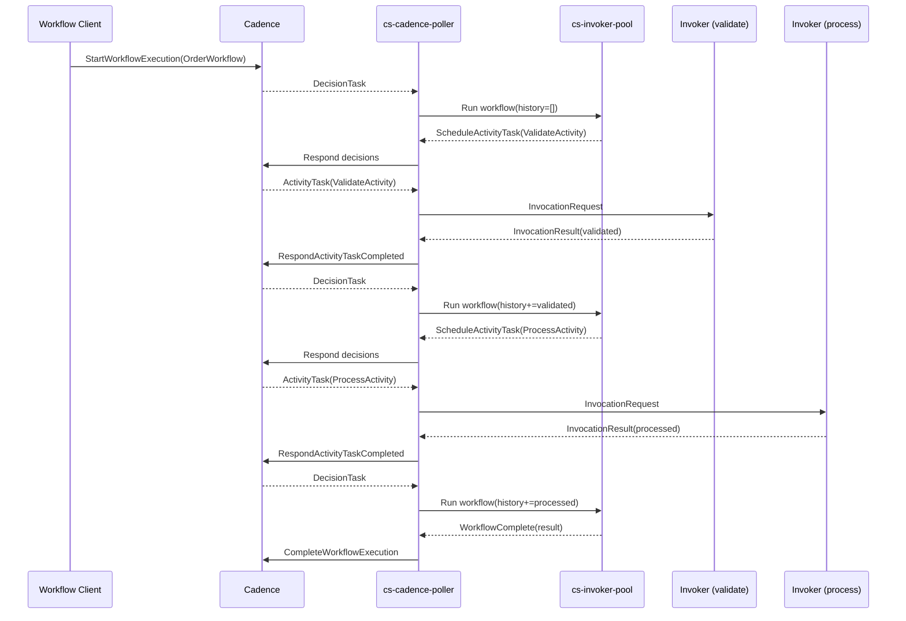

# Sample App: Cadence Workflow

This sample builds a Cadence workflow that orchestrates two activities and
returns a combined result. The workflow is invoked through a DecisionTask
(in SOUS terms: the workflow handler runs against its history every time the
workflow needs to make progress), schedules a `validate` activity, waits for
the result, schedules a `process` activity based on the validated input,
waits again, then returns a single response that combines both outputs. The
example demonstrates the workflow runtime's deterministic replay model and
the publish-time guard that catches nondeterministic code before it can
corrupt history.

The workflow executor lives under `internal/cadence/workflow/executor.go`
and the publish-time determinism linter lives under
`internal/cadence/determinism/`. The workflow API surface exposed to user
code is `cs.cadence.scheduleActivity`; everything else inherits from the
standard `cs-js` capability set, minus the deterministic-write guards.

## Workflow handler

The workflow handler is an ESM module that schedules activities through
`cs.cadence.scheduleActivity` and uses their return values. The executor
implements a "single-await" model: each call to `scheduleActivity` records
a `ScheduleActivityTask` decision, then suspends the workflow until the
next DecisionTask delivers the activity's outcome. On replay, the executor
walks the same call sequence and consumes the already-recorded outcomes
from history; the workflow's own logic is run again from the top, so it
must produce the same call sequence for the same inputs.

```javascript
// function.js — the workflow
export default function workflow(input, ctx) {
  cs.log.info({
    activation_id:  ctx.activation_id,
    workflow_id:    ctx.trigger.source.workflowId,
    phase:          "start",
  })

  // First step: validate the input. The executor records this call as
  // a ScheduleActivityTask decision and suspends. On the next
  // DecisionTask the activity's return value is supplied here.
  const validated = cs.cadence.scheduleActivity("ValidateActivity", {
    order_id: input.order_id,
    payload:  input.payload,
  })

  if (!validated.ok) {
    return {
      statusCode: 422,
      headers: { "content-type": "application/json" },
      body: JSON.stringify({
        error:  "validation_failed",
        reason: validated.reason,
      }),
      isBase64Encoded: false,
    }
  }

  // Second step: process the validated input. Same shape, different
  // activity type. The executor records a second decision and suspends
  // again.
  const processed = cs.cadence.scheduleActivity("ProcessActivity", {
    order_id: input.order_id,
    fields:   validated.fields,
  })

  return {
    statusCode: 200,
    headers: { "content-type": "application/json" },
    body: JSON.stringify({
      order_id: input.order_id,
      validated_at: validated.validated_at_history_ms,
      processed_at: processed.processed_at_history_ms,
      result:       processed.result,
    }),
    isBase64Encoded: false,
  }
}
```

The two timestamps the workflow returns deserve a closer look. The handler
does not call `Date.now()`; both `validated_at_history_ms` and
`processed_at_history_ms` come from the activity's return value, which was
recorded in Cadence history at the time the activity actually ran. That
distinction is what makes the workflow deterministic: a replay running an
hour after the original run reads the same numbers from history, even
though wall-clock time has moved on. A handler that called `Date.now()`
directly would get a fresh value on every replay and silently corrupt
state — which is exactly what the determinism linter is built to catch
(see [Determinism Linter](Development-Tools-Determinism-Linter)).

## Activity handlers

The two activities are ordinary `cs-js` functions, identical in shape to
the activity in [Sample App: Cadence Activity](Sample-Apps-Cadence-Activity).
Each lives in its own bundle and is published independently. The `validate`
activity is allowed to call `Date.now()` because activities are not
replayed; only the activity's return value lands in history.

```javascript
// validate/function.js
export default async function handle(event, ctx) {
  const order_id = event.input.order_id
  const fields = event.input.payload || {}

  if (!order_id || !fields.amount) {
    return {
      statusCode: 200,
      headers: { "content-type": "application/json" },
      body: JSON.stringify({
        ok: false,
        reason: "missing_required_fields",
      }),
      isBase64Encoded: false,
    }
  }

  return {
    statusCode: 200,
    headers: { "content-type": "application/json" },
    body: JSON.stringify({
      ok: true,
      fields,
      validated_at_history_ms: Date.now(),
    }),
    isBase64Encoded: false,
  }
}
```

```javascript
// process/function.js
export default async function handle(event, ctx) {
  const { order_id, fields } = event.input

  // Real work would happen here; for the sample, the result is a
  // canonical receipt with a deterministic shape.
  const receipt = {
    order_id,
    amount: fields.amount,
    state:  "processed",
  }

  return {
    statusCode: 200,
    headers: { "content-type": "application/json" },
    body: JSON.stringify({
      result:                   receipt,
      processed_at_history_ms:  Date.now(),
    }),
    isBase64Encoded: false,
  }
}
```

## Manifests

The three bundles share most of the manifest. The workflow bundle declares
`cadence.kind: "workflow"`, which is the publish-time signal that the
determinism linter must run; the two activity bundles declare
`cadence.kind: "activity"` (or omit the field, which defaults to activity)
so they skip the linter.

```json
// workflow manifest
{
  "name": "order-workflow",
  "schema": "cs.function.script.v1",
  "runtime": "cs-js",
  "entry": "function.js",
  "handler": "default",
  "limits": { "timeoutMs": 60000, "memoryMb": 64, "maxConcurrency": 1 },
  "capabilities": {
    "kv":    { "prefixes": [], "ops": [] },
    "codeq": { "publishTopics": [] },
    "http":  { "allowHosts": [], "timeoutMs": 1000 }
  },
  "cadence": { "kind": "workflow" }
}
```

```json
// validate manifest (process manifest is identical except for the name)
{
  "name": "validate",
  "schema": "cs.function.script.v1",
  "runtime": "cs-js",
  "entry": "function.js",
  "handler": "default",
  "limits": { "timeoutMs": 10000, "memoryMb": 64, "maxConcurrency": 4 },
  "capabilities": {
    "kv":    { "prefixes": [], "ops": [] },
    "codeq": { "publishTopics": [] },
    "http":  { "allowHosts": [], "timeoutMs": 5000 }
  },
  "cadence": { "kind": "activity" }
}
```

The workflow's `http.allowHosts` array is empty for a reason: the workflow
handler must not call out to the network. Network IO is non-deterministic
by nature, so the workflow delegates every external call to an activity.
The linter does not check `allowHosts` directly, but a workflow that
attempts `cs.http.fetch` at runtime is rejected with
`CS_RUNTIME_CAPABILITY_DENIED` because the manifest never granted the host.

## WorkerBindings

The workflow runtime needs two kinds of bindings: one for the workflow
itself (`kind: workflow`), and one for the activities the workflow
schedules (`kind: activity`). They can live in a single binding document
or in separate documents per tasklist.

```json
[
  {
    "name":     "order-workflow",
    "kind":     "workflow",
    "domain":   "orders",
    "tasklist": "orders-workflows",
    "worker_id": "cs-orders-wf-01",
    "codec":    "json",
    "pollers":  { "decision": 4 },
    "workflow_map": {
      "OrderWorkflow": { "function": "order-workflow", "alias": "prod" }
    }
  },
  {
    "name":     "order-activities",
    "kind":     "activity",
    "domain":   "orders",
    "tasklist": "orders-activities",
    "worker_id": "cs-orders-act-01",
    "codec":    "json",
    "pollers":  { "activity": 8 },
    "activity_map": {
      "ValidateActivity": { "function": "validate", "alias": "prod" },
      "ProcessActivity":  { "function": "process",  "alias": "prod" }
    }
  }
]
```

The two bindings use different tasklists by convention; nothing prevents
sharing a tasklist, but separating them makes the poller's concurrency
knobs (`pollers.decision` vs `pollers.activity`) independently tunable.

## Publish

The publish path looks the same for all three bundles. The workflow bundle
goes through the additional determinism check; if the handler reaches for
a banned API the publish endpoint returns `422` with
`CS_WORKFLOW_NON_DETERMINISTIC` and a populated `violations[]` array
naming the offending file, line, column, and pattern.

```bash
# Three independent publishes.
./bin/cs fn draft upload order-workflow --path ./workflow
./bin/cs fn publish order-workflow --draft <id> --timeout-ms 60000 --memory-mb 64 \
  --invoke-cadence-roles role:cadence
./bin/cs fn alias set order-workflow prod --version 1

./bin/cs fn draft upload validate --path ./validate
./bin/cs fn publish validate --draft <id> --timeout-ms 10000 --memory-mb 64 \
  --invoke-cadence-roles role:cadence
./bin/cs fn alias set validate prod --version 1

./bin/cs fn draft upload process --path ./process
./bin/cs fn publish process --draft <id> --timeout-ms 10000 --memory-mb 64 \
  --invoke-cadence-roles role:cadence
./bin/cs fn alias set process prod --version 1
```

## Determinism in action

The linter runs at publish time against the workflow bundle only. The two
patterns that matter for this sample are `Date.now` and unhanded
randomness. If the workflow handler is rewritten to read wall-clock time
directly:

```javascript
// BAD — workflow handler that reads wall-clock time.
export default function workflow(input, ctx) {
  const start = Date.now()  // determinism violation
  const validated = cs.cadence.scheduleActivity("ValidateActivity", input)
  return { statusCode: 200, body: String(Date.now() - start) }
}
```

the publish call returns `422` with:

```json
{
  "error": {
    "code": "CS_WORKFLOW_NON_DETERMINISTIC",
    "message": "workflow contains nondeterministic API calls",
    "violations": [
      { "file": "function.js", "line": 2, "column": 17, "pattern": "Date.now" },
      { "file": "function.js", "line": 4, "column": 36, "pattern": "Date.now" }
    ]
  }
}
```

and the bundle never reaches storage. The same guard catches `Math.random`,
direct `setTimeout`, `crypto.getRandomValues`, and any other host call the
linter has explicitly tagged. See [Determinism Linter](Development-Tools-Determinism-Linter)
for the full pattern list and how to add new ones.

## End-to-end flow

The sequence diagram below shows the full life cycle of one workflow
execution. The workflow client schedules the workflow on the `orders-workflows`
tasklist; Cadence creates a DecisionTask; the SOUS poller picks the
DecisionTask up and runs the workflow handler against its history (which
is empty on the first DecisionTask). The handler reaches the first
`scheduleActivity` call, records a decision, and suspends. The poller
returns the decision to Cadence, Cadence schedules the activity on the
`orders-activities` tasklist, an activity poller picks it up, the
invoker runs `validate`, the result lands back in Cadence as an
`ActivityTaskCompleted` event, Cadence creates a second DecisionTask, and
the cycle repeats for `process`. The third DecisionTask runs the workflow
to completion and returns the combined response.



A workflow handler can schedule any number of activities, branch on their
results, and run for hours or days; the only constraint is determinism
across replays. For the activity-only case (a single side-effecting step
that does not coordinate further work), use the simpler shape in
[Sample App: Cadence Activity](Sample-Apps-Cadence-Activity). For the
workflow runtime contract and the full banned-API list, see
[Event Sources: Cadence Workflows](Event-Sources-Cadence-Workflows) and
[Determinism Linter](Development-Tools-Determinism-Linter).
