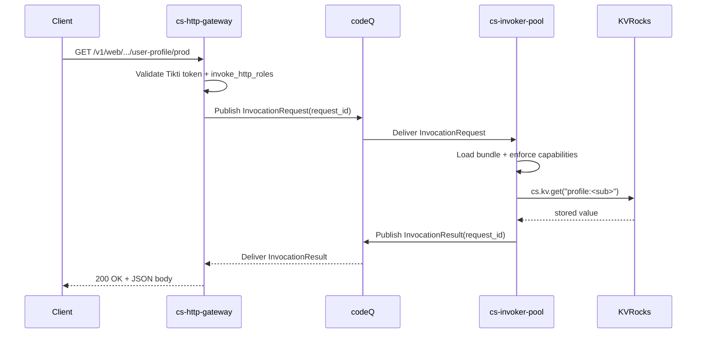

# Sample App: HTTP Handler

This sample builds the smallest interesting SOUS function: a self-contained HTTP
handler that responds to incoming requests with JSON. The function is a "user
profile" endpoint. A `GET` returns a JSON object stored in KV under the
caller's tenant prefix; a `POST` writes the body back to the same key and
returns the stored representation. The whole example fits in one `function.js`
and one `manifest.json`, runs unchanged under the `cs fn test` runner, and
keeps every dependency inside the `cs-js` host so there is no external service
to provision before invoking it.

The scaffold for this template lives under
`internal/cli/templates/files/http-handler/` and is produced on disk by `cs fn
init <name> --template http-handler` (see `cmd/cs-cli/main.go` for the
command). The walk-through below assumes the resulting directory contains
`function.js` and `manifest.json` and that the local stack from
[Get Started](Get-Started) is already running.

## Handler

The handler is a single ESM module exporting `default`. The runtime resolves
the export, runs the request through it, and treats the returned object as a
FunctionResponse envelope. The handler branches on `event.requestContext.http.method`,
keys KV under `profile:<sub>` (declared in the manifest's `kv.prefixes`), and
returns a JSON body with the canonical `content-type` header. No external
libraries are imported; every primitive used here is provided by `cs-js`.

```javascript
// function.js
export default async function handle(event, ctx) {
  const method = event.requestContext.http.method
  const key = "profile:" + ctx.principal.sub

  cs.log.info({
    activation_id: ctx.activation_id,
    method,
    key,
  })

  if (method === "GET") {
    const stored = cs.kv.get(key)
    if (!stored) {
      return {
        statusCode: 404,
        headers: { "content-type": "application/json" },
        body: JSON.stringify({ error: "not_found", key }),
        isBase64Encoded: false,
      }
    }
    return {
      statusCode: 200,
      headers: { "content-type": "application/json" },
      body: JSON.stringify(stored),
      isBase64Encoded: false,
    }
  }

  if (method === "POST") {
    const raw = event.isBase64Encoded
      ? atob(event.body || "")
      : event.body || "{}"
    let profile
    try {
      profile = JSON.parse(raw)
    } catch (e) {
      return {
        statusCode: 400,
        headers: { "content-type": "application/json" },
        body: JSON.stringify({ error: "invalid_json" }),
        isBase64Encoded: false,
      }
    }
    cs.kv.set(key, profile, { ttlSeconds: 3600 })
    return {
      statusCode: 200,
      headers: { "content-type": "application/json" },
      body: JSON.stringify(profile),
      isBase64Encoded: false,
    }
  }

  return {
    statusCode: 405,
    headers: { "content-type": "application/json", "allow": "GET, POST" },
    body: JSON.stringify({ error: "method_not_allowed" }),
    isBase64Encoded: false,
  }
}
```

Three properties of the handler are worth calling out before moving on. First,
the handler is synchronous in its KV access: `cs.kv.get` and `cs.kv.set` are
direct host calls, not promises, because the in-process KV provider already
runs on the invoker goroutine. Second, the response is never base64-encoded
because the body is already a UTF-8 JSON string; setting `isBase64Encoded:
false` lets the HTTP gateway pass the body through without re-decoding (see
[HTTP Invoke Path](HTTP-Invoke-Path) for the round-trip rules). Third, the
handler never invents a request ID, never reads `Date.now()`, and never
depends on activation state surviving between calls; those properties make
the same code reusable from a scheduled trigger without modification.

## Manifest

The manifest is the only piece of policy that travels with the bundle. It
declares the runtime, the entry point, the limits, and the capability surface
the function is allowed to touch at runtime. The capability fields are
checked against the request at invocation time by the invoker; the publish
endpoint additionally checks them against the JSON Schema in
`spec/cs.function.script.v1.json` before the bundle is stored.

```json
{
  "name": "user-profile",
  "schema": "cs.function.script.v1",
  "runtime": "cs-js",
  "entry": "function.js",
  "handler": "default",
  "limits": { "timeoutMs": 3000, "memoryMb": 64, "maxConcurrency": 1 },
  "capabilities": {
    "kv":    { "prefixes": ["profile:"], "ops": ["get", "set"] },
    "codeq": { "publishTopics": [] },
    "http":  { "allowHosts": [], "timeoutMs": 1500 }
  }
}
```

A few details are load-bearing. The `kv.prefixes` array restricts the keys
the function may touch; an attempt to call `cs.kv.set("other:foo", ...)` from
this bundle is rejected by the host with `CS_RUNTIME_CAPABILITY_DENIED`. The
`http.allowHosts` array is empty because the handler does not need outbound
HTTP; an attempt to call `cs.http.fetch("https://example.com")` is denied
even when the host appears in tenant configuration, because the manifest
itself never asked for it. Roles are not part of the manifest; they are
attached at publish time and govern who is allowed to invoke, not what the
code is allowed to do.

## Publish

The publish step uploads the bundle as a draft, then promotes the draft to an
immutable version with the role allowlist that gates HTTP invocations. The
`role:app` allowlist below corresponds to the action `cs:function:invoke:http`
described in [IAM with Tikti](IAM-with-Tikti); the gateway will refuse to
invoke the function if the caller's Tikti token does not include that role.

```bash
./bin/cs fn draft upload user-profile --path .
./bin/cs fn publish user-profile \
  --draft <draft_id> \
  --timeout-ms 3000 \
  --memory-mb 64 \
  --invoke-http-roles role:app
./bin/cs fn alias set user-profile prod --version 1
```

After this completes, the gateway resolves `prod` to version `1` for every
request, and a `cs fn alias set user-profile prod --version 2` later swaps
traffic with no client change.

## Invoke

The HTTP gateway exposes the function at the canonical URL. With a Tikti
bearer token for a principal that holds `role:app`, the round trip looks
like:

```bash
# Write a profile.
curl -sS -X POST \
  -H "Authorization: Bearer $TIKTI_TOKEN" \
  -H "Content-Type: application/json" \
  -d '{"name":"Ada Lovelace","email":"ada@example.com"}' \
  https://gw.example.com/v1/web/t_abc123/default/user-profile/prod

# Read it back.
curl -sS \
  -H "Authorization: Bearer $TIKTI_TOKEN" \
  https://gw.example.com/v1/web/t_abc123/default/user-profile/prod
```

The expected response for the read is:

```json
{
  "name": "Ada Lovelace",
  "email": "ada@example.com"
}
```

with `200 OK` and `content-type: application/json`. If the caller's token is
missing `role:app`, the gateway returns `403`; if the key has not been
written, the handler itself returns `404` with `{"error":"not_found"}`.

## End-to-end flow

The sequence diagram below shows the full path on a `GET`: the client speaks
to the HTTP gateway, the gateway resolves the alias and publishes an
`InvocationRequest` on codeQ, the invoker loads the bundle and runs the
handler, the handler reads KV through the host-bound `cs.kv` capability, and
the result is returned to the gateway which writes it back as an HTTP
response.



A `POST` follows the same shape with a `cs.kv.set` instead of a `cs.kv.get`;
both branches share the gateway path and the result correlation rules. For
the full endpoint contract, idempotency rules, and response mapping, see
[HTTP Invoke Path](HTTP-Invoke-Path). For the broader cs-js authoring guide,
see [Creating Functions: JavaScript](Creating-Functions-JavaScript). For how
the gateway maps HTTP into the canonical event envelope, see
[Event Sources: HTTP](Event-Sources-HTTP).
