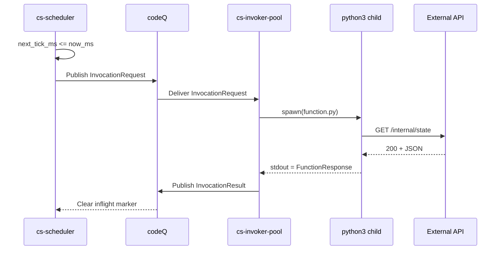

# Sample App: Scheduled Job

This sample builds a reconciliation job that runs every five minutes,
compares an external state retrieved over HTTPS against a desired state
stored in KV, and emits a structured log entry that downstream observability
can scrape. The example is intentionally minimal: a single Python module, a
single manifest, a single schedule registration, and a single CLI command to
observe the resulting activations. It runs under `cs-python` so the host's
`ctx.http.fetch` capability is the only piece of network surface the bundle
needs.

The scaffold for this template lives under
`internal/cli/templates/files/scheduled-job/`. The default template is
`cs-js`; this walk-through replaces the handler with the Python equivalent
and tightens the manifest so the only capability granted is HTTP egress to
the upstream API. See `docs/08c-runtime-cs-python.md` for the full Python
runtime contract and `internal/runtime/python/host.go` for the host-side
adapter.

## Handler

The handler is a single `function.py` whose top-level code reads the
request from `sys.stdin`, performs the reconciliation, and prints a
FunctionResponse envelope on the last non-empty line of `sys.stdout`. The
runtime treats every line written to `sys.stderr` as a log line and surfaces
them on the activation record. The handler keeps its side-effects narrow:
one outbound `GET` to the upstream API, one `cs.kv.get` for the desired
state, and one log line that names every field a dashboard would want to
group on.

```python
# function.py
import json
import sys

req = json.load(sys.stdin)
event = req["event"]
ctx   = req["ctx"]

desired_key = "reconcile:desired:" + ctx["tenant"]
desired = ctx["http"]["fetch"]({
    "method": "GET",
    "url":    "https://api.example.com/internal/state",
    "headers": {"accept": "application/json"},
})

# desired is a dict shaped like { status, headers, body, isBase64Encoded }.
external = json.loads(desired["body"])

stored = ctx["kv"]["get"](desired_key) or {}
drift = {
    k: {"desired": stored.get(k), "external": external.get(k)}
    for k in set(stored) | set(external)
    if stored.get(k) != external.get(k)
}

cs_log("info", json.dumps({
    "event":          "reconcile.tick",
    "activation_id":  ctx["activation_id"],
    "tenant":         ctx["tenant"],
    "trigger":        ctx["trigger"]["type"],
    "drift_count":    len(drift),
}))

print(json.dumps({
    "statusCode": 200,
    "headers":    {"content-type": "application/json"},
    "body":       json.dumps({"drift_count": len(drift), "drift": drift}),
    "isBase64Encoded": False,
}))
```

Three details deserve a closer look. First, `ctx["http"]["fetch"]` is the
Python-side projection of the same `cs.http.fetch` capability that `cs-js`
exposes; in the v0.1 subprocess adapter this is wired through the request
envelope rather than a direct host call, but the manifest gate is the same.
Second, `cs_log` is installed into Python's `builtins` by the runtime, so
the handler never imports it; this makes structured logging the path of
least resistance. Third, the handler does no retries of its own: if the
upstream API returns a non-200, the reconciliation loop simply records the
drift on the next tick. Retrying inside the handler would defeat the
scheduler's overlap policy.

## Manifest

The manifest binds the runtime, the entry file, and the capability surface.
The `http.allowHosts` array is the only entry that is not boilerplate: it
must contain the exact host the handler will reach, with no wildcards or
schemes. The `kv.prefixes` allowlist is tight so a typo in the handler
cannot reach into another tenant's keyspace.

```json
{
  "name": "reconcile",
  "schema": "cs.function.script.v1",
  "runtime": "cs-python",
  "entry": "function.py",
  "handler": "default",
  "limits": { "timeoutMs": 60000, "memoryMb": 128, "maxConcurrency": 1 },
  "capabilities": {
    "kv":    { "prefixes": ["reconcile:"], "ops": ["get", "set"] },
    "codeq": { "publishTopics": [] },
    "http":  { "allowHosts": ["api.example.com"], "timeoutMs": 5000 }
  }
}
```

The `maxConcurrency: 1` value is the bridge to the scheduler's overlap
policy. With `overlap_policy: skip` (the default), the scheduler will refuse
to publish a new tick while the previous one is still in flight, and the
invoker will additionally refuse to start a second activation in parallel.
The two guards together make the reconciliation idempotent under the
common failure modes: a slow upstream API blocks at most one tick, never
two.

## Publish and register the schedule

The publish step is the same shape as any other function: upload a draft,
publish a version, point an alias at it. The schedule itself is a
separate control-plane object, created either through the CLI or directly
through the REST endpoint. The CLI form below uses
`./bin/cs schedule create` (see `cmd/cs-cli/main.go` for the wiring); the
REST form posts the same body to
`/v1/tenants/{tenant}/namespaces/{namespace}/schedules`.

```bash
./bin/cs fn draft upload reconcile --path .
./bin/cs fn publish reconcile \
  --draft <draft_id> \
  --timeout-ms 60000 \
  --memory-mb 128 \
  --invoke-schedule-roles role:worker
./bin/cs fn alias set reconcile prod --version 1

./bin/cs schedule create reconcile_5m \
  --every 300 \
  --fn reconcile@prod
```

The equivalent REST call:

```bash
curl -sS -X POST \
  -H "Authorization: Bearer $TIKTI_TOKEN" \
  -H "Content-Type: application/json" \
  -d '{
        "name": "reconcile_5m",
        "every_seconds": 300,
        "overlap_policy": "skip",
        "ref": { "function": "reconcile", "alias": "prod" }
      }' \
  https://control.example.com/v1/tenants/t_abc123/namespaces/default/schedules
```

Once the schedule is created, the scheduler leader picks it up on its next
refresh and starts publishing `InvocationRequest` messages at the cadence
declared in `every_seconds`. The `--invoke-schedule-roles role:worker`
allowlist is what binds the schedule's service principal to the function;
without it the invoker would reject the request with `403` even though the
control plane accepted the schedule.

## Observe activations

Every tick produces an activation. The CLI exposes the activation log
through `cs logs activations`, which streams from the same KV space the
invoker writes to:

```bash
./bin/cs logs activations \
  --function reconcile \
  --since 15m
```

Each line is a structured log emitted by the handler (the `cs_log` call
above), interleaved with the runtime's own activation envelope. A
reconciliation that finds no drift surfaces as a single
`"event":"reconcile.tick","drift_count":0` line; a reconciliation with
drift adds a `drift` block keyed by field name. See
[Observability](Observability) for how these lines map onto Prometheus
counters and ledgerDB audit events.

## End-to-end flow

The sequence diagram below shows one tick: the scheduler decides a tick is
due, publishes the `InvocationRequest`, the invoker spawns a `python3`
child, the child performs the outbound HTTP call through the host's fetch
shim, the result lands back on codeQ, and the scheduler clears the in-flight
marker so the next tick can be considered. The schedule itself is the only
trigger; nothing outside the cluster needs to call the function for a tick
to fire.



The reconciliation pattern shown here is the canonical case for the
scheduler: a short, idempotent function that converges external state
against an internal anchor. For longer-running orchestration that must
survive worker restarts and remember decisions across activations, use a
Cadence workflow instead (see [Sample App: Cadence Workflow](Sample-Apps-Cadence-Workflow)).
For the full scheduler model, see [Creating Functions: Python](Creating-Functions-Python)
and [Event Sources: Schedule](Event-Sources-Schedule).
