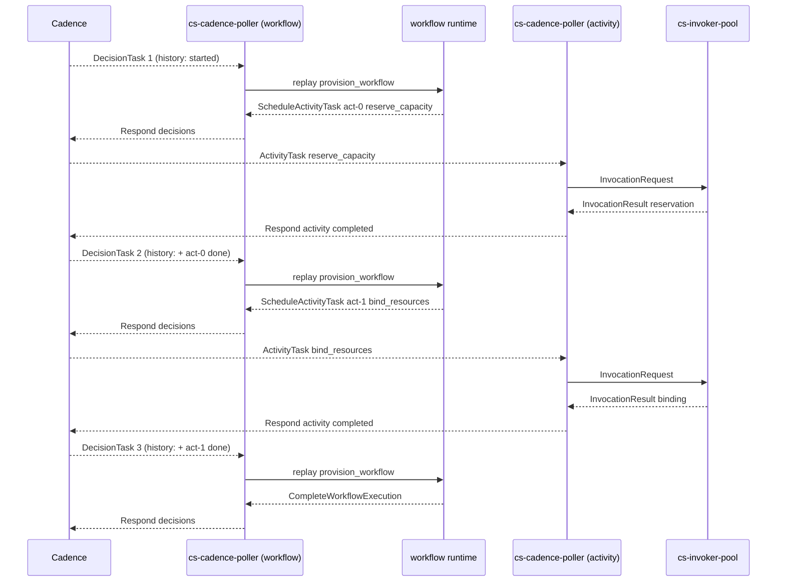

# Tutorial: Building a Workflow

This tutorial walks a reader through building, publishing, and running a SOUS-hosted Cadence workflow that orchestrates two activities. The reader is assumed to have completed [Tutorial: From Local Dev to Publish](Tutorial-Local-Dev-to-Publish) and to have a Cadence-compatible workflow service reachable from the local stack — either an upstream Cadence cluster, the codeFlow service, or a stub fixture the tenant uses for development. The exact identity of the workflow service does not matter to the tutorial because SOUS interacts with it through a stable polling protocol.

The goal is to internalise three things: how SOUS partitions a workflow into an activity tier and a deterministic decision tier, how `cs.cadence.scheduleActivity` translates into Cadence decisions across replays, and how the determinism linter protects the reader from the most common nondeterminism mistakes at publish time rather than at 3 am.

The page extends the surface introduced by [Event Sources: Cadence Workflows](Event-Sources-Cadence-Workflows) and [Event Sources: Cadence Activities](Event-Sources-Cadence-Activities). The [Determinism Linter](Development-Tools-Determinism-Linter) reference covers the publish-time guardrail this tutorial demonstrates.

## What the reader will build

A two-activity workflow named `provision`. Activity one (`reserve_capacity`) is a stub that pretends to reserve capacity for a tenant and returns a reservation ID. Activity two (`bind_resources`) is a stub that pretends to bind compute and returns a binding handle. The workflow calls activity one, takes its result, threads it into activity two, and returns a combined record. All three functions are separate SOUS functions, each with its own bundle, manifest, and publish lifecycle.

The shape is intentionally small. Real workflows have many more activities, error handling, retries, and possibly child workflows. The point of this tutorial is the orchestration primitive itself; once the reader can chain two activities through a workflow function and read the trace, scaling to ten is mechanical.

## How SOUS hosts a Cadence workflow

Before any code, the reader should hold a clear picture of what SOUS is doing on each side of the Cadence boundary. The cluster's `cs-cadence-poller` long-polls a Cadence task list for two kinds of work: activity tasks and decision tasks. Activity tasks land on the activity tier — each one becomes a single invocation of an activity function in `cs-invoker-pool`, producing one activation, with full capability mediation. Decision tasks land on the decision tier — each one becomes one re-execution of the workflow function from the start, against the history Cadence delivered, with the deterministic `cs.cadence.scheduleActivity` host call substituted for real activity scheduling.

That distinction is the model. An activity function runs once per attempt, can perform IO, and is free to use the platform's full capability surface. A workflow function runs once per decision task — many times across the lifetime of a single workflow execution — and must produce identical output on every replay against the same history. The platform enforces the second half of that contract two ways. At publish time, the determinism linter scans the workflow source and rejects bundles that use banned APIs (`Date.now`, `Math.random`, `setTimeout`, and friends). At runtime, the `scheduleActivity` host call detects an activity-type mismatch between history and current code and fails the decision task with a typed nondeterminism error.

A workflow function never makes outbound network calls of its own. Everything it wants to do flows through `cs.cadence.scheduleActivity`, which schedules an activity in Cadence and returns the activity's result on the next decision task. The reader who tries to issue an HTTP request from a workflow function will be blocked at publish time by the determinism linter; the platform's design assumption is that the IO lives in activities.

## 1. Scaffold the two activities

Both activities are independent functions. The reader creates a working directory for each. The platform does not require sibling layout but it is the convention this tutorial follows because it keeps the publish commands and the local tests obvious.

```bash
mkdir reserve_capacity bind_resources
cd reserve_capacity
../bin/cs fn init reserve_capacity --template cadence-activity
cd ../bind_resources
../bin/cs fn init bind_resources --template cadence-activity
```

The `cadence-activity` template differs from the `http-handler` template in two ways. Its `manifest.json` declares a longer timeout (30 seconds vs. 3) and a larger memory budget (128 MB vs. 64), because activities typically do more work than synchronous handlers. Its `function.js` includes a guarded `cs.cadence.heartbeat` call so that long-running activities can extend their Cadence heartbeat timeout without the reader having to remember the binding shape.

The reader edits each activity to do its job. For `reserve_capacity`:

```javascript
export default async function handle(event, ctx) {
  cs.log.info({ name: "reserve_capacity", input: event && event.input })
  if (ctx.trigger && ctx.trigger.type === "cadence") {
    cs.cadence.heartbeat({ phase: "reserve" })
  }
  const tenant = (event && event.input && event.input.tenant) || "unknown"
  const reservationId = `res-${tenant}-${ctx.activation_id.slice(0, 8)}`
  return { reservationId, tenant }
}
```

For `bind_resources`:

```javascript
export default async function handle(event, ctx) {
  cs.log.info({ name: "bind_resources", input: event && event.input })
  if (ctx.trigger && ctx.trigger.type === "cadence") {
    cs.cadence.heartbeat({ phase: "bind" })
  }
  const reservation = (event && event.input && event.input.reservationId) || null
  if (!reservation) {
    return { ok: false, reason: "missing_reservation" }
  }
  return { ok: true, bindingId: `bind-${reservation}` }
}
```

Both handlers conform to the activity contract: they accept the event the poller delivered, take their actual input from `event.input` (the field Cadence populates with the activity's input bytes), and return a JSON-serialisable value. The activation ID derivation in the reservation ID is a debugging affordance — every activity attempt has a unique ID, so a duplicated reservation ID in production is immediately recognisable as the same attempt having run twice.

The reader runs `cs fn test` on each to confirm the local loop works:

```bash
cd ../reserve_capacity
../bin/cs fn test reserve_capacity --event ./event.json
cd ../bind_resources
../bin/cs fn test bind_resources --event ./event.json
```

## 2. Publish the activities

Each activity is published independently with the activity-flavoured role set:

```bash
cd ../reserve_capacity
../bin/cs fn draft upload reserve_capacity --path .
../bin/cs fn publish reserve_capacity --draft drf_... \
  --timeout-ms 30000 --memory-mb 128 \
  --invoke-cadence-roles role:cadence

../bin/cs fn alias set reserve_capacity prod --version 1
```

The same pattern for `bind_resources`. The role allowlist names `role:cadence` because the only invocation path the activity is reachable through is the Cadence poller's service identity. An activity that should also be reachable through the gateway for manual testing would additionally name `role:app` under `--invoke-http-roles`, but a strict production activity is locked to the Cadence path.

After both publishes the platform has two callable activities, each pinned to its `prod` alias.

## 3. Register WorkerBindings for the activities

A WorkerBinding tells the poller which task list to long-poll and which SOUS functions to map activity types to. Two activities and one task list is the simplest deployable shape:

```bash
../bin/cs cadence worker create provision-activities \
  --domain provision \
  --tasklist provision-activities \
  --worker-id cs-provision-01 \
  --activity reserve_capacity=reserve_capacity@prod \
  --activity bind_resources=bind_resources@prod
```

The `--activity` flag carries the mapping from Cadence's `ActivityType` string to a SOUS function reference. The poller will now long-poll `(provision, provision-activities)` for activity tasks, and on receiving one will route it to either `reserve_capacity@prod` or `bind_resources@prod` based on the activity type. See [Cadence Integration](Cadence-Integration) for the full binding shape.

The reader can list bindings to confirm:

```bash
../bin/cs cadence worker list
```

## 4. Scaffold the workflow function

The workflow is a separate SOUS function with `cadence.kind = "workflow"` in its manifest. There is no platform-shipped template for this yet, so the reader creates the directory and files manually:

```bash
mkdir provision_workflow
cd provision_workflow
```

`function.js`:

```javascript
export default async function workflow(input, ctx) {
  const reservation = await cs.cadence.scheduleActivity("reserve_capacity", {
    tenant: input.tenant,
  })

  const binding = await cs.cadence.scheduleActivity("bind_resources", {
    reservationId: reservation.reservationId,
  })

  return {
    tenant: input.tenant,
    reservationId: reservation.reservationId,
    bindingId: binding.bindingId,
  }
}
```

`manifest.json`:

```json
{
  "name": "provision_workflow",
  "schema": "cs.function.script.v1",
  "runtime": "cs-js",
  "entry": "function.js",
  "handler": "default",
  "limits": { "timeoutMs": 30000, "memoryMb": 128, "maxConcurrency": 1 },
  "cadence": { "kind": "workflow" },
  "capabilities": {}
}
```

The `cadence.kind` field is the field the platform reads to know that this bundle is a workflow rather than an activity. It changes three things at publish time. First, the determinism linter runs against `function.js` and refuses the publish if any banned API appears. Second, the platform stores the bundle with the workflow indicator so the poller knows to route decision tasks to it. Third, the runtime adapter binds `cs.cadence.scheduleActivity` as a real workflow primitive rather than as the activity-side error stub. See [Determinism Linter](Development-Tools-Determinism-Linter) for the full ban list.

The `capabilities` block is intentionally empty. A workflow function performs no IO of its own; everything reachable from it flows through `scheduleActivity`. The platform will refuse a workflow publish that declares HTTP egress or KV access, which is the explicit version of the soft rule that workflows must be deterministic.

## 5. Publish and register the workflow

```bash
../bin/cs fn draft upload provision_workflow --path .
../bin/cs fn publish provision_workflow --draft drf_... \
  --timeout-ms 30000 --memory-mb 128 \
  --invoke-cadence-roles role:cadence

../bin/cs fn alias set provision_workflow prod --version 1
```

If the workflow source includes a banned API the `cs fn publish` call fails with `CS_WORKFLOW_NON_DETERMINISTIC` and a list of violations. Each violation names the file, line, column, and the remediation suggestion. The reader edits the source to remove the banned call and republishes. This catch-at-publish design is deliberate: a workflow that ships with `Date.now()` in its source will eventually fail in production with a nondeterminism error, and the failure will be hours or days after the publish that caused it. Catching it before the bundle becomes a version is dramatically cheaper than catching it after.

Register a second WorkerBinding for the workflow task list. By convention a workflow's decision-task list is separate from its activity task list:

```bash
../bin/cs cadence worker create provision-workflow \
  --domain provision \
  --tasklist provision-workflow \
  --worker-id cs-provision-wf-01 \
  --kind workflow \
  --workflow provision_workflow=provision_workflow@prod
```

The `--kind workflow` flag flips the poller from long-polling for activity tasks to long-polling for decision tasks. The `--workflow` flag binds a Cadence `WorkflowType` to the SOUS workflow function reference.

## 6. Start the workflow

The workflow is started from a Cadence client. SOUS does not ship a Cadence-client surface of its own — by design, since Cadence already has well-supported Go and Java clients and re-implementing them would be costly without benefit. A minimal Go starter looks like:

```go
package main

import (
    "context"
    "log"

    "go.uber.org/cadence/client"
    // omitted: transport wiring for the cluster's Cadence frontend
)

func main() {
    c := newCadenceClient() // tenant-specific wiring
    ctx := context.Background()
    we, err := c.StartWorkflow(ctx, client.StartWorkflowOptions{
        TaskList:                     "provision-workflow",
        ExecutionStartToCloseTimeout: 600_000_000_000, // 10 minutes
        ID:                           "provision-tenant-42",
    }, "provision_workflow", map[string]any{"tenant": "tenant-42"})
    if err != nil {
        log.Fatalf("start: %v", err)
    }
    log.Printf("started: workflow=%s run=%s", we.ID, we.RunID)
}
```

Two fields matter for the SOUS side. `TaskList` must be the workflow task list named in the WorkerBinding from step 5. The first positional argument to `StartWorkflow` is the `WorkflowType` string, which must match the key under `--workflow` in the binding. Anything else is Cadence-native and the reader configures it to the cluster's conventions.

Running this starter writes a `WorkflowExecutionStarted` event into Cadence history and enqueues the first decision task on the `provision-workflow` task list. From here the platform takes over.

## 7. What happens on each decision task

The reader who wants to internalise the deterministic-replay model should walk through what the poller and the workflow function do across the lifetime of this workflow.

The first decision task arrives at `cs-cadence-poller`. The poller maps it to `provision_workflow@prod` from the WorkerBinding, fetches the bundle from KVRocks, and hands history plus input to the workflow runtime. The runtime calls the user's `workflow` function from the start. The function hits `cs.cadence.scheduleActivity("reserve_capacity", ...)`. The runtime walks history looking for an outcome for `act-0` (the deterministic activity ID it assigns). History contains no outcome yet — this is the first decision task — so the runtime records a `ScheduleActivityTask` decision and suspends the workflow. The poller responds to Cadence with that decision. Cadence schedules an activity task on `provision-activities`.

A second `cs-cadence-poller` (or the same one wearing a different hat — they share the binary) picks up the activity task from `provision-activities`. It maps the `reserve_capacity` activity type to `reserve_capacity@prod`, publishes an `InvocationRequest`, the invoker pool runs the activity, the activity returns the reservation record, and the poller responds to Cadence with the success payload. Cadence writes `ActivityTaskCompleted` to history and enqueues a second decision task.

The second decision task arrives. The runtime re-executes the workflow function from the start — this is the replay model — and the user's code hits `cs.cadence.scheduleActivity("reserve_capacity", ...)` again. This time history has an outcome for `act-0`: success, with the reservation payload. The runtime returns that payload synchronously from the host call. The function then hits `cs.cadence.scheduleActivity("bind_resources", ...)`. History has no outcome for `act-1` yet, so the runtime records a second `ScheduleActivityTask` decision and suspends. The poller responds. Cadence schedules the activity.

The bind activity runs. Cadence writes `ActivityTaskCompleted`. A third decision task arrives. The runtime replays the function once more, both `scheduleActivity` calls resolve from history this time, and the function reaches its `return`. The runtime emits a `CompleteWorkflowExecution` decision with the JSON-encoded result. The poller responds. Cadence writes `WorkflowExecutionCompleted` to history and the workflow is done.

The mental model the reader should keep is: every decision task is one re-run of the workflow function against an ever-growing history. The function is supposed to be a pure function of its history, and the platform's job is to make that purity enforceable.

## 8. Read the workflow trace

The reader inspects the workflow's progress through two channels. The first is Cadence history itself, available from the cluster's UI or its client library; that is the ground truth for "what happened in this workflow execution." The second is the SOUS activation stream, which records every activity invocation as a normal activation with `trigger.type == "cadence"`. Cross-referencing the two gives the full picture: history says which activities ran, in what order, with what attempts; activations say what the activity actually did, what it logged, and how long it took.

A typical investigation looks like:

```bash
curl -H "Authorization: Bearer $TOKEN" \
  "http://localhost:8080/v1/tenants/t_local/activations?function=reserve_capacity&since=1h"
```

The returned list contains one activation per attempt of the `reserve_capacity` activity. Each activation carries the workflow ID, run ID, and activity ID under `trigger.source`, which is how the operator joins back to the workflow execution in Cadence's UI.



## 9. Handle failures

The reader who wants to see the failure path edits `bind_resources` to fail under a chosen condition (for example, returning a thrown error when `event.input.reservationId` is null). Republish v2, repoint the alias. Start a fresh workflow execution. The second decision task replays, schedules the bind activity, the activity fails, Cadence writes `ActivityTaskFailed` to history.

On the next decision task the runtime re-executes the workflow function. The first `scheduleActivity` resolves from history with the reservation. The second hits the failure outcome and throws inside the workflow function. The user's code can catch that throw with `try` / `catch` and decide what to do — retry by scheduling again, fall back to a different activity, or rethrow to fail the workflow. Untargeted throws propagate out of the workflow function and the runtime emits a `FailWorkflowExecution` decision with the error reason.

The mental model is: activity failures arrive at the workflow as thrown exceptions on the `scheduleActivity` call that scheduled them. The workflow handles failures with the same control-flow primitives the workflow uses for happy-path logic. There is no separate retry harness the reader has to learn; there is just the language's try/catch.

Cadence's own retry policy is the other layer. A WorkerBinding can declare activity retry policy that re-attempts a failing activity automatically before surfacing the failure to the workflow function. In v0.1 the SOUS surface for retry policy is the binding's defaults; per-call overrides on `scheduleActivity` are tracked in the roadmap.

## 10. What the reader has internalised

Three primitives compose the entire workflow surface in v0.1. The activity function is a normal SOUS function with the activity-flavoured invoke role, bound to an `ActivityType` through a WorkerBinding. The workflow function is a normal SOUS function with `cadence.kind = "workflow"` in its manifest, bound to a `WorkflowType` through a separate WorkerBinding. The `scheduleActivity` host call is the only orchestration primitive — sequencing, branching, looping, and error handling all reduce to it plus JavaScript's normal control flow.

The platform's contribution on top of those primitives is replay determinism. The runtime guarantees that the workflow function produces identical decisions on every replay of the same history. The publish-time linter rejects bundles that would violate that guarantee through banned APIs. The runtime backstop catches the residual cases at decision-task time with a typed error rather than corrupting history.

The reader who understands the loop the workflow function went through across three decision tasks has the conceptual base for the rest of the workflow surface as it lands: timers (`cs.workflow.sleep`), side effects, signals, child workflows. Each new feature adds a new entry to the workflow `cs.*` API, but the replay model and the activity tier are unchanged.

## Next steps

- [Event Sources: Cadence Workflows](Event-Sources-Cadence-Workflows) is the reference companion for the workflow surface.
- [Event Sources: Cadence Activities](Event-Sources-Cadence-Activities) covers the activity tier in depth.
- [Determinism Linter](Development-Tools-Determinism-Linter) lists the banned APIs and the override mechanism.
- [Cadence Integration](Cadence-Integration) describes the poller's wire-level contract.
