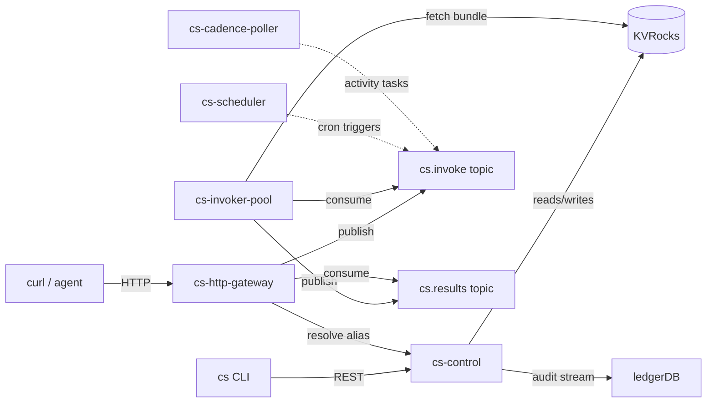

# Tutorial: From Local Dev to First Publish

This tutorial walks a reader from an empty checkout to a running function that responds to HTTP traffic, end to end, in roughly fifteen minutes. The reader is assumed to have Go 1.24+ and Docker available, but no prior SOUS state on disk: no built binaries, no running services, no auth tokens. Each step is annotated with the reasoning that motivates it, because the goal here is not to memorize commands but to internalize the publish loop the platform expects.

The page expands on the abbreviated quickstart at [Get Started](Get-Started) and should be read end to end the first time through. The companion tutorial [Tutorial: Promote Through Aliases](Tutorial-Promote-Through-Aliases) picks up from where this one finishes, with a v1 already published.

## What the reader will build

A single-handler function named `reconcile` that accepts an HTTP POST, logs a structured line, and returns a JSON body. By the end the reader will have invoked that function through the gateway, read its activation record from the control plane, and confirmed the runtime parity guarantee: the bytes that ran locally are the bytes that ran in the invoker pool.

The platform's mental model is worth introducing before any commands run. SOUS treats a function as a small bundle of UTF-8 source plus a manifest, never as a container image. There is no build step the reader controls, no Dockerfile to author, no CI pipeline to wire. The runtime is fixed by the platform, the bundle is uploaded as content-addressed bytes, and the only artifact a function author produces is the source plus the manifest. That choice is what makes agent-driven function authoring tractable: the artifact surface is small enough for a model to generate end to end, and the runtime parity guarantee means there is no "but it worked on my laptop" failure mode between local test and cluster publish.

## 1. Start local dependencies

SOUS persists function metadata in KVRocks and ships invocation messages through a Kafka-compatible bus (Redpanda in local mode). Both run as containers. The repository ships a `docker-compose.yml` that brings them up bound to deterministic ports:

```bash
docker compose up -d
```

KVRocks listens on `localhost:6666` and Redpanda exposes its Kafka API on `localhost:9092`. The control plane connects to both at boot, so they must be healthy before any SOUS binary starts. If `docker compose ps` shows either container as `restarting`, do not continue: a missing port binding here surfaces later as cryptic timeouts in the gateway, and reading `docker compose logs kvrocks` once is cheaper than chasing those.

The compose file does not start any SOUS service. The platform is run as a set of native processes for local development so that the reader can attach a debugger to any one of them, swap a single binary without recycling state, and read logs interleaved with the runtime's own JSON output.

## 2. Build the binaries

```bash
make build
```

The Makefile compiles every command under `cmd/` into `./bin/`. There are six binaries the reader will care about in this tutorial: `cs-control`, `cs-http-gateway`, `cs-invoker-pool`, `cs-scheduler`, `cs-cadence-poller`, and the `cs` CLI itself. The build is hermetic — no network access is needed once `go mod download` has resolved dependencies once — and finishes in roughly thirty seconds on a warm cache.

A common first stumble: forgetting to add `./bin` to `PATH`. The remainder of this tutorial calls each binary by its relative path (`./bin/cs ...`) to remove that variable, but the reader is free to symlink or alias for daily use.

## 3. Bring up a local config

The control plane reads a YAML config that selects backends for the messaging, storage, and authentication plugins. The repository ships `config.example.yaml` with sensible local defaults:

```bash
cp config.example.yaml config.yaml
```

The default config points KVRocks at `localhost:6666` and configures the messaging plugin to use a Kafka driver with `localhost:9092`. The reader should leave the storage and messaging sections alone for this tutorial. The authentication block is the one piece that may need attention: by default the control plane validates bearer tokens against a Tikti introspection URL, and in a fresh local setup that URL is empty. The CLI's `auth login` command will work against a stub Tikti or an offline-development mode, depending on how the local stack is configured; the canonical guidance lives in [IAM with Tikti](IAM-with-Tikti).

## 4. Start the services

Open one terminal per service. The order matters less than it appears — each service tolerates its peers being absent at startup and retries — but starting `cs-control` first means the CLI's first call has somewhere to land:

```bash
./bin/cs-control --config config.yaml
```

`cs-control` is the system's brain. It owns the function catalog, version metadata, alias pointers, schedule definitions, and WorkerBindings. Every CLI mutation flows through it, which is also why it emits the audit stream that [Tutorial: Promote Through Aliases](Tutorial-Promote-Through-Aliases) will read later. Bring it up first and verify the startup line that includes `listening on :8080`.

```bash
./bin/cs-http-gateway --config config.yaml
```

The gateway is the only public ingress in the system. It terminates HTTP, authenticates the caller against Tikti, looks up the function/alias pair in the control plane, and either invokes synchronously by publishing onto the `cs.invoke` topic and awaiting a result on `cs.results`, or returns `202` with an activation ID for async-style triggers. See [HTTP Invoke Path](HTTP-Invoke-Path) for the wire-level contract.

```bash
./bin/cs-invoker-pool --config config.yaml
```

The invoker pool is the execution plane. It consumes `cs.invoke`, runs the function inside an isolated runtime adapter (cs-js, cs-python, or cs-wasm), and publishes results onto `cs.results`. Each invoker process can host many concurrent activations, bounded per tenant by the rate limit and inflight semaphore. The reader's local pool will only run one at a time, but the boundaries that protect a real cluster are still active.

```bash
./bin/cs-scheduler --config config.yaml
```

The scheduler exists for cron-style triggers. This tutorial does not register a schedule, but starting the scheduler now means a later `cs schedule create` call will work without restarting the stack.

```bash
./bin/cs-cadence-poller --config config.yaml
```

The Cadence poller is similarly preemptive: it idles unless a WorkerBinding has been registered. [Tutorial: Building a Workflow](Tutorial-Building-a-Workflow) will exercise it; here it simply exists.

At this point all five services are running, the control plane has confirmed connectivity to KVRocks, and the gateway is accepting traffic on `localhost:8081`. The reader can sanity-check by hitting `GET /healthz` on each port.

## 5. Authenticate the CLI

The CLI keeps an auth token on disk under `$HOME/.config/code-sous/auth.json`. A fresh checkout has no such file, so the first command is:

```bash
./bin/cs auth login --tikti-url https://tikti.example.com --tenant t_local
```

The Tikti URL above is illustrative; in a real local setup the reader points it at whichever introspection endpoint the local Tikti instance exposes, or at the dev-mode stub. The `--tenant` argument is the logical owner of every artifact this tutorial will create. Function names, namespaces, schedules, and aliases all hang off a tenant ID, which means the same function name can exist independently across tenants without colliding.

A successful login writes the auth file and prints the subject the token resolved to. The reader can confirm with:

```bash
./bin/cs auth whoami
```

If `whoami` returns the expected subject and tenant, the CLI is ready to talk to `cs-control`.

## 6. Scaffold a function

```bash
./bin/cs fn init reconcile --template http-handler
```

The `init` subcommand renders a template from `internal/cli/templates/files/` into the current directory. The `http-handler` template is the right starting point for this tutorial because the goal is a function that responds to HTTP traffic. Other templates ship for `cadence-activity`, `scheduled-job`, and `codeq-consumer` shapes; `cs fn init --list` prints the full set with one-line descriptions.

A scaffold completes silently with a single line confirming the directory and template used. The reader now has, in the current directory, two files:

- `function.js`, the handler source. The default export is an `async` function with the signature `(event, ctx) => result`. The template's body logs a structured line through `cs.log.info` and returns `{ statusCode: 200, headers, body, isBase64Encoded }`. This shape is the contract every cs-js function honours; the gateway translates the return value into an HTTP response when the trigger is HTTP, and the activation record captures it verbatim otherwise.
- `manifest.json`, the function's declared resource budget and capability surface. The fields the reader should read carefully are `limits` (timeout, memory ceiling, concurrency) and `capabilities`. Capabilities are the platform's narrow-waist for side effects: the function cannot touch KV outside the declared prefixes, cannot publish to topics outside the declared globs, and cannot reach hosts outside the `allowHosts` list. A function that omits a capability simply cannot perform that side effect; the runtime returns a typed `CS_RUNTIME_CAP_DENIED` error, which is recorded in the activation.

The reader should open both files and skim them. The platform makes no other assumption about the on-disk layout — there is no `package.json`, no build step, no transpiler. The runtime expects ES module source, and that is the level the function lives at.

### Reading the manifest carefully

The reader who came to SOUS from a serverless background may be tempted to skim the manifest, since the field names are familiar. That instinct is wrong here. The manifest is the security contract: it is what makes a function safe to publish on a multi-tenant platform without sandboxing every side effect at the kernel level. Three fields deserve close reading.

`limits.timeoutMs` and `limits.memoryMb` are hard ceilings the runtime enforces. A function that exceeds either is killed and the activation reports `CS_RUNTIME_TIMEOUT` or `CS_RUNTIME_MEMORY`. These are not advisory budgets; the invoker measures wall clock and resident set and terminates without giving the function a chance to clean up.

`capabilities.http.allowHosts` is an exact-match list of outbound hostnames the function may reach. There is no wildcard form for `*.example.com`; the reader names every host the function will call. The cs-js HTTP binding refuses to dial anything else, including localhost or private IP ranges. For tenants that need broader egress, [Security](Security) covers the per-tenant egress allowlist that overlays this.

`capabilities.kv.prefixes` and `capabilities.kv.ops` together gate KVRocks access. Prefixes are byte-prefix matched (no globbing); ops are an explicit subset of `get`, `set`, `del`, `scan`. A function with `prefixes: ["ctr:"]` and `ops: ["get"]` can read keys starting with `ctr:` and only read them — a `set` call on the same key still fails.

The reader should treat manifest edits as a deliberate act, not a copy-paste. A capability list that is too narrow surfaces as a clean denial error during local test, which is cheap. A capability list that is too wide is a silent risk the platform cannot detect.

## 7. Run an offline test

```bash
./bin/cs fn test reconcile --event ./event.json
```

`cs fn test` is the most important command in the local loop. It executes the function inside the same cs-js runtime that the cluster invoker uses — the exact same goja-based adapter, the exact same capability gates, the exact same JSON event encoding. The contract is identical because the runtime is the same code path: `cs fn test` calls into `internal/runtime` directly.

The reader will need to create a small `event.json` first:

```bash
cat > event.json <<'JSON'
{ "message": "hello" }
JSON
```

The CLI loads `function.js` and `manifest.json` from the working directory, constructs a synthetic `ctx` with `trigger.type === "api"`, and calls the default export. Stdout shows the function's return value and any structured log lines.

This step deserves the slow read. Running the function locally before publish catches the entire class of bugs that would otherwise show up as a failed activation in the cluster: missing imports, syntax errors that pass `node` but not goja, capability requests the manifest forgot to declare. Each round trip through publish-and-invoke costs seconds; each round trip through `cs fn test` costs milliseconds. The discipline that produces reliable functions is the one that fails locally first.

### What `cs fn test` does not do

The parity guarantee is precise: `cs fn test` runs the same handler with the same runtime and the same capability gates. It does not, however, simulate the full cluster environment. Two differences are worth naming so the reader is not surprised later.

The first is authentication. `cs fn test` runs the function with a `ctx.principal` derived from the CLI's auth file, but it does not consult the per-version role allowlists that the gateway enforces. A function that will reject the reader's role at the gateway can still pass `cs fn test`. The reader should therefore include a smoke-test invocation through the gateway (step 9) as part of the publish loop, not skip it.

The second is concurrency. The local runner runs the handler once per `cs fn test` call. The cluster invoker can run many concurrent activations of the same function, bounded by the manifest's `limits.maxConcurrency` and the tenant's rate limit. A function that mutates shared state (a counter in KV, for example) must be tested for concurrent-update correctness in some other harness; local single-shot testing will not surface a race condition. [Testing](Testing) describes the integration harness that exercises concurrency.

## 8. Upload and publish

A function exists in two phases: a draft is an opaque bundle of bytes on the control plane, identified by SHA-256, with no public route. A version is a published, immutable record built from a draft, with declared limits and per-trigger-type role allowlists. Aliases name versions for traffic-routing. To get the function on the public path the reader must walk through both.

```bash
./bin/cs fn draft upload reconcile --path .
```

The CLI reads `function.js` and `manifest.json`, computes their SHA-256, and posts the bundle to the control plane. The server writes the bytes into KVRocks under a content-addressed key and returns a draft ID. Draft IDs are stable and idempotent: uploading the same bytes twice returns the same ID, which keeps the audit stream clean on retries.

```bash
./bin/cs fn publish reconcile \
  --draft drf_01H... \
  --timeout-ms 3000 \
  --memory-mb 64 \
  --invoke-http-roles role:app \
  --invoke-schedule-roles role:worker \
  --invoke-cadence-roles role:cadence
```

The publish call materializes a version from a draft. The `--timeout-ms` and `--memory-mb` flags pin the runtime budget at version-create time; once published they cannot be edited (a stronger guarantee than the manifest itself, which is part of the bundle and could in principle change between drafts). The three `--invoke-*-roles` flags name the Tikti roles allowed to invoke this version through each trigger surface. In this tutorial the reader is the only caller, but on a real tenant the role allowlist is the platform's authorization gate: a function with `--invoke-http-roles role:app` cannot be reached by a caller carrying only `role:scheduled`, even if the gateway can otherwise resolve the alias.

The server stores the version record, emits a `FunctionPublished` audit event to the ledgerDB stream ([ledgerDB Audit](ledgerDB-Audit) describes the envelope), and returns the version number. Versions are monotonic per `(tenant, namespace, function)` and are immutable forever; that immutability is what makes alias-based promotion safe, as the next tutorial explores.

## 9. Wire an alias and invoke

```bash
./bin/cs fn alias set reconcile prod --version 1
```

An alias is a named pointer from a string label (`prod`, `staging`, `canary`, whatever the tenant chooses) to a version number, scoped to a single function. Setting an alias is the only way to reach a version through HTTP — there is no "invoke by version" path on the gateway, by design. Routing the public surface through aliases is what enables atomic promotion and one-step rollback.

With `prod` pointing at version 1, the function is reachable:

```bash
curl -X POST \
  -H "Authorization: Bearer $TOKEN" \
  -H "content-type: application/json" \
  -d '{"message":"hello from curl"}' \
  http://localhost:8081/v1/web/t_local/default/reconcile/prod
```

The gateway authenticates the bearer token against Tikti, resolves `reconcile@prod` to version 1, publishes an `InvocationRequest` envelope onto `cs.invoke`, blocks waiting for the matching `InvocationResult` on `cs.results`, and returns the function's body to the caller. The response carries an `activation_id` header the reader will use in the next step.

### What happens between curl and response

It is worth pausing on the trip the request just made, because the same sequence underpins every other trigger surface. The gateway received the HTTP request, ran it through the Tikti introspection cache, and resolved the tenant from the URL path. It then asked the control plane for the (version, manifest) pair that `reconcile@prod` currently points at. The control plane answered from KVRocks. The gateway then wrote an `InvocationRequest` envelope onto the `cs.invoke` Kafka topic, keyed by tenant so a single tenant's traffic lands on a stable partition, and waited on the matching `cs.results` topic for an `InvocationResult` carrying the same `activation_id`.

On the execution side, one of the invoker-pool consumers pulled the request off `cs.invoke`, fetched the function bundle from KVRocks by SHA, instantiated a cs-js runtime instance, and called the default export with the event the gateway forwarded plus a freshly constructed `ctx`. Every side effect the function attempted — log emission, KV access, outbound HTTP — went through the runtime's mediation layer, which checked the manifest's capability declarations before allowing the call. The function returned a value, the invoker published an `InvocationResult` onto `cs.results`, and the gateway unblocked and returned the response.

The reader has not been asked to think about any of that, which is the design intent: the developer surface ends at "I wrote a handler and pointed an alias at it." The internal mechanics live in [Architecture](Architecture) for the times when they matter.

## 10. Read the activation

Every invocation, regardless of trigger, produces an activation record. The activation is the platform's source of truth for "did this run, what did it return, what did it log, how long did it take":

```bash
curl -H "Authorization: Bearer $TOKEN" \
  http://localhost:8080/v1/tenants/t_local/activations/$ACTIVATION_ID
```

The response includes the status (`success`, `failed`, or one of the typed runtime errors), the duration in milliseconds, structured log pointers, and either the function's return value or the error envelope. The `cs fn logs --activation <id>` command does the same thing with the convenience of `--follow` and a tail-friendly format; see the CLI reference for the full surface.

Activations are bounded by the platform's TTL (default 24 hours for terminal records, configurable per tenant), and their bodies are size-capped to keep KVRocks healthy. For long-lived audit needs the reader subscribes to the ledgerDB stream rather than relying on activation retention.

### Common first-time stumbles

A handful of failure modes catch most readers on their first walk-through.

The most common is a tenant mismatch between the auth login and the URL path. The CLI persists the tenant the reader logged in as, and the gateway resolves the tenant from the URL segment immediately after `/v1/web/`. If the two disagree the gateway returns `404` with `CS_FN_NOT_FOUND`, not `403`, because the function genuinely does not exist on the tenant the URL named. The fix is to either re-login against the correct tenant or to update the URL.

The second is a stale `bin/`. After editing source the reader must rebuild and restart the affected service: `make build` recompiles, but a running `cs-control` keeps the old binary in memory. The local loop tolerates this — restart the one process that changed and the rest will reconnect — but new readers occasionally chase a "fix that did not take effect" through several layers before realizing the binary on disk is not the one running.

The third is forgetting that capabilities are deny-by-default. A function that calls `cs.kv.get("foo")` without declaring a matching prefix under `capabilities.kv.prefixes` returns `CS_RUNTIME_CAP_DENIED` from the runtime layer, surfaces in the activation as a `failed` status, and never even reaches the data path. Reading the error message in the activation rather than the function's stdout is the quickest way to diagnose this class of failure.

## What the reader has just done

The publish-and-invoke loop the reader just walked through is the same loop every workload follows, from the simplest reconciliation function to a Cadence workflow that orchestrates dozens of activities. The shape is always: scaffold, test offline against the same runtime, upload a draft, publish a version, point an alias, invoke through the alias, read the activation.

The two pieces of that loop that deserve to become muscle memory are `cs fn test` (because it makes failures cheap) and the alias indirection (because it makes promotion and rollback atomic, and the next tutorial will exploit it). The rest of the platform — schedules, Cadence, codeQ subscriptions — slots onto this same loop without changing it.

### A visual map of the local stack



The dashed edges are not exercised by this tutorial but exist in the running stack, idle. The reader will see the scheduler edge wired up in any cron-style use case, and the Cadence-poller edge wired up in [Tutorial: Building a Workflow](Tutorial-Building-a-Workflow).

## Next steps

- [Tutorial: Promote Through Aliases](Tutorial-Promote-Through-Aliases) ships v2 of this function safely.
- [Tutorial: Building a Workflow](Tutorial-Building-a-Workflow) wires two activities into a durable Cadence workflow.
- [Concepts: Function Lifecycle](Concepts-Function-Lifecycle) covers the draft-to-version-to-alias state machine in detail.
- [CLI](CLI) lists every subcommand and flag the tutorial referenced.
