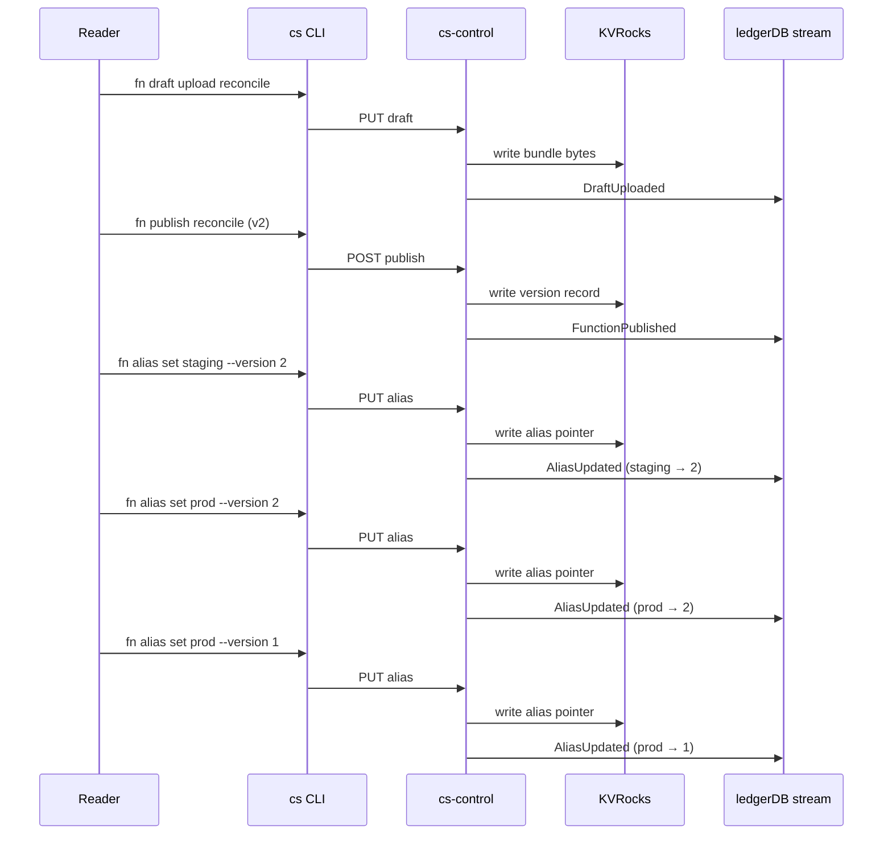

# Tutorial: Promote Through Aliases

This tutorial assumes the reader has already worked through [Tutorial: From Local Dev to Publish](Tutorial-Local-Dev-to-Publish) and has v1 of a `reconcile` function published, with the `prod` alias pointing at it. The reader has been asked to ship a v2 of that function safely, with a manual canary period and a clear rollback path. The goal is to build the muscle memory for a promotion loop that is atomic at the routing layer, audit-trailed in ledgerDB, and reversible in a single command.

The page expands on the abbreviated reference at [Managing Functions: Versioning and Aliases](Managing-Functions-Versioning-and-Aliases) and should be read end to end the first time through. By the end the reader will have shipped a v2, exercised it on a `staging` alias, promoted it to `prod`, and rolled it back to v1 while reading the audit stream that records each step.

## What "promotion" means in SOUS

In a SOUS tenant, every version is immutable. Once `cs fn publish` records version 1, the bytes that produced it, the manifest that gated it, and the role allowlist that authorised it can never change. Publishing v2 produces a second, equally immutable record at version 2. Neither record contains a notion of "current" or "live"; the platform does not have a concept of an active version.

What the platform does have is the alias. An alias is a `(tenant, namespace, function, label) → version` pointer, where the label is any string the tenant chooses (`prod`, `staging`, `canary`, `eu-rollout`) and the version is one of the published numbers. Aliases are mutable: a single `cs fn alias set` call rewrites the pointer atomically, and that one write is what "promotion" actually is.

Two consequences follow from this model and they shape everything else in this tutorial. First, promotion and rollback are symmetric operations: pointing `prod` at v2 is the same kind of write as pointing it back at v1, with the same atomicity and the same audit envelope. Second, the version itself is never "promoted" — there is no record on v1 that says "was prod from T0 to T1, then prod from T2 onwards." The promotion history lives in the ledgerDB stream, not on the version, which keeps version metadata small and the audit stream the canonical source of truth.

## What the reader will do

Walk through a complete promotion loop:

1. Edit the function locally and rebuild a v2 candidate.
2. Publish v2 and point a fresh `staging` alias at it.
3. Exercise `staging` manually with curl while leaving `prod` on v1.
4. Read the activations from both aliases to confirm the shape of the change.
5. Promote `staging` to `prod` by repointing the alias.
6. Read the ledgerDB stream to see the two `AliasUpdated` events.
7. Roll back by repointing `prod` back at v1.

The reader can complete the entire sequence in about ten minutes against the local stack from the first tutorial.

## 1. Make a v2 candidate

The reader edits `function.js` in the same working directory used in the first tutorial. The example change below adds a second field to the response body so that v1 and v2 are observably different at the wire:

```javascript
export default async function handle(event, ctx) {
  cs.log.info({ name: "reconcile", version: 2, activation_id: ctx.activation_id })
  return {
    statusCode: 200,
    headers: { "content-type": "application/json" },
    body: JSON.stringify({ ok: true, version: "v2", echo: event }),
    isBase64Encoded: false
  }
}
```

In a real workload v2 would be a behavioural change rather than a cosmetic one, but the wire-distinguishable response is what makes the canary phase verifiable below. The reader should run `cs fn test` against the edited bundle before continuing, for the reasons described in the first tutorial:

```bash
./bin/cs fn test reconcile --event ./event.json
```

A green local test does not authorise a publish on its own — runtime parity does not imply behavioural correctness — but it does guarantee that the bytes about to be uploaded will at least load in the cluster's runtime.

## 2. Upload and publish v2

The publish loop is identical to the one used for v1; the platform does not distinguish between "first publish" and "subsequent publish" semantically. Upload a fresh draft from the edited working directory:

```bash
./bin/cs fn draft upload reconcile --path .
```

The control plane responds with a new draft ID. Because the function bytes changed, the SHA-256 differs from v1, and the draft is recorded under a new content-addressed key in KVRocks. The audit stream records a `DraftUploaded` event with the SHA and size, which becomes useful when reconstructing what was published when.

Publish the draft as v2:

```bash
./bin/cs fn publish reconcile \
  --draft drf_01H... \
  --timeout-ms 3000 \
  --memory-mb 64 \
  --invoke-http-roles role:app \
  --invoke-schedule-roles role:worker \
  --invoke-cadence-roles role:cadence
```

The server assigns the next monotonic version number for `(t_local, default, reconcile)`, which is 2. It emits a `FunctionPublished` audit event carrying the version number, the SHA, and a `config_hash` that summarises the immutable limits and role allowlist. After this call the platform has two viable versions of `reconcile` in storage, and exactly one alias (`prod`, pointing at v1) on the routing surface.

A critical observation: nothing about publishing v2 changed the behaviour of any caller. The `prod` alias still points at v1, the gateway still resolves traffic to v1, and the activation stream is still filling with v1 records. Publish is decoupled from rollout by design. The reader can publish freely without worrying about a half-applied change, because there is no concept of "applying" a version until an alias points at it.

## 3. Wire a staging alias

The convention this tutorial follows is to canary new versions on a separate alias before touching production traffic. The platform makes no rule about this — an alias is whatever the tenant decides — but the pattern is the simplest way to exercise v2 with real auth, real routing, and real activations, without the blast radius of touching `prod`.

```bash
./bin/cs fn alias set reconcile staging --version 2
```

The control plane writes the alias pointer to KVRocks and emits an `AliasUpdated` audit event. The data block carries `namespace`, `function`, `alias`, and `version` — the same envelope shape that will record the eventual promotion to `prod`, which means a single audit query against the stream returns the full alias history without joining tables.

After this call the routing table for `reconcile` looks like:

| alias     | version |
|-----------|---------|
| `prod`    | 1       |
| `staging` | 2       |

Both aliases are real, both are routable through the gateway, and both produce activations against their respective versions.

## 4. Exercise staging with curl

Issue a request against the `staging` label:

```bash
curl -X POST \
  -H "Authorization: Bearer $TOKEN" \
  -H "content-type: application/json" \
  -d '{"trace":"staging-canary"}' \
  http://localhost:8081/v1/web/t_local/default/reconcile/staging
```

The response body should contain `"version":"v2"`, the field the edited handler added. If the reader sees `"ok":true` without the `version` key, the URL hit the `prod` alias by mistake — alias label is a positional segment in the gateway URL, and a typo silently routes to the other label.

For confidence, send a request against `prod` in the same shell:

```bash
curl -X POST \
  -H "Authorization: Bearer $TOKEN" \
  -H "content-type: application/json" \
  -d '{"trace":"prod-baseline"}' \
  http://localhost:8081/v1/web/t_local/default/reconcile/prod
```

The response body should lack the `version` field. The two-step comparison is the simplest verification that the canary alias is genuinely independent of production traffic.

In a real rollout the reader would replace these two curl calls with whatever the tenant's smoke test is: a synthetic transaction, a small fraction of real-user traffic routed at the load balancer above SOUS, an integration test suite run against `staging`. The shape is the same; the volume and confidence threshold are tenant policy.

## 5. Read activations to compare the two versions

Each curl above returned an `activation_id`. Fetch both records:

```bash
curl -H "Authorization: Bearer $TOKEN" \
  http://localhost:8080/v1/tenants/t_local/activations/$STAGING_ACT
curl -H "Authorization: Bearer $TOKEN" \
  http://localhost:8080/v1/tenants/t_local/activations/$PROD_ACT
```

The activation record includes the version number that handled the request, the duration, the structured log lines the function emitted, and the result body. The reader should see `version: 2` and `version: 1` on the two records respectively, confirming end-to-end that the alias indirection is doing what the documentation claims.

This step is the one that catches the most subtle promotion bugs in practice. A function whose response body looks identical on `staging` and `prod` is almost always a sign that the alias write did not land — most commonly because the version flag was wrong on the `alias set` call, occasionally because the reader was looking at a stale activation. Reading the activation before promoting is cheap; reading it after promoting is too late.

## 6. Promote staging to prod

With v2 validated on `staging`, the promotion is a single command:

```bash
./bin/cs fn alias set reconcile prod --version 2
```

The control plane rewrites the `prod` alias pointer to version 2, atomically with respect to in-flight resolves. Any request that arrives at the gateway after this write resolves to v2; any request that the gateway started resolving before this write completes against v1. There is no inconsistent middle state where some callers see v1 and others see v2 within the resolution of a single request — the alias pointer is a single KVRocks key, written transactionally.

A second `AliasUpdated` event lands in the ledgerDB stream. The data block is identical in shape to the one from step 3, but with `alias: "prod"` and `version: 2`. The two records together — step 3's `staging → 2` and step 6's `prod → 2` — are the full audit trail of this promotion. If the tenant's compliance regime later asks "when did v2 reach production traffic," the answer is the timestamp on the step-6 event.

The routing table is now:

| alias     | version |
|-----------|---------|
| `prod`    | 2       |
| `staging` | 2       |

Production traffic is on v2. The `staging` alias is still pinned to v2 as well, which is harmless — many tenants leave the previous canary pointer in place until the next promotion cycle.

## 7. Read the audit trail

The audit stream is a Kafka topic the control plane writes to on every successful mutation. The exact consumer interface depends on whether the tenant has ledgerDB enabled, but for local development the reader can dump recent records with whichever Kafka client is at hand. The envelope shape is documented in [ledgerDB Audit](ledgerDB-Audit):

```json
{
  "schema": "cs.audit.v1",
  "ts_ms": 1730000000000,
  "tenant": "t_local",
  "actor": { "sub": "user:reader", "roles": ["role:admin"] },
  "type": "AliasUpdated",
  "data": {
    "namespace": "default",
    "function": "reconcile",
    "alias": "prod",
    "version": 2
  }
}
```

Filtering on `type == "AliasUpdated" && data.function == "reconcile"` returns the full history of every promotion and rollback for the function, in order, with the actor and timestamp on each. There is no separate "promotion log" the operator must consult — the alias write is the promotion, and the audit event for the alias write is the promotion record.

The reader who wants to see the promotion plus the publish in context can broaden the filter to `data.function == "reconcile"` without a `type` constraint, which returns interleaved `DraftUploaded`, `FunctionPublished`, and `AliasUpdated` events in the order they were emitted. That timeline is the canonical "what happened to this function" view for incident analysis.

## 8. Roll back

If v2 turns out to be wrong — a regression caught in production, a metric that drifted, an alert that fired — the rollback is a single command:

```bash
./bin/cs fn alias set reconcile prod --version 1
```

The control plane rewrites the `prod` alias pointer back to version 1. The traffic shape returns to the pre-promotion state, atomically, in the same way that the forward promotion was atomic. A third `AliasUpdated` audit event records the rollback.

Two properties of the platform make this safe in ways that matter under pressure.

The first is that v1's bundle, manifest, and role allowlist are still in KVRocks, byte-identical to what was running before the promotion. The reader is not reverting to an approximation of v1 — they are reverting to the exact bytes, with the exact runtime budget, the exact capability surface, and the exact role allowlist. There is no "what state was v1 in?" question to answer during an incident.

The second is that rollback is the same operation as promotion. The reader does not need to recall a separate command, a separate flag, or a separate confirmation step. Pointing `prod` at the older version is mechanically identical to pointing it at the newer version, which means the muscle memory built during routine promotion is exactly the muscle memory needed during a rollback. Operators tend to drift away from infrequently used commands; building the platform's rollback on the same primitive as the routine path keeps the rollback path warm.

After the rollback the routing table is:

| alias     | version |
|-----------|---------|
| `prod`    | 1       |
| `staging` | 2       |

The `staging` alias still points at v2, which the reader can use as a staging environment to investigate the regression without disturbing production traffic. v2 itself remains in storage forever, available for a future re-promotion once the underlying issue is fixed.

## Audit-trail diagram



## Common variants of this loop

A few variations on the basic loop are worth naming. None of them require new platform primitives; they all compose on the same alias-set primitive used above.

Some tenants use three labels rather than two: a `next` alias that always points at the latest version regardless of validation state, a `staging` alias that points at the candidate currently under canary, and a `prod` alias that points at the active production version. The promotion path is then `next → staging → prod`, with each transition recorded as a separate `AliasUpdated` event. The audit trail this produces is richer, at the cost of one extra alias write per promotion cycle.

Some tenants set both `prod` and a `prod-prev` alias on every promotion, where `prod-prev` becomes the previous version's pointer. Rollback then becomes "swap the two pointers" rather than "remember what version was previously live." The pattern reduces operator cognitive load during an incident, since the rollback target is named rather than discovered. The trade-off is that `prod-prev` consumes a routable label and may be a temptation for callers who should be using `prod`.

Some tenants never use `staging` and instead canary by routing a fraction of `prod` traffic at the load balancer above SOUS. The platform does not have first-class traffic-fraction routing yet, so this pattern relies on the surrounding infrastructure rather than SOUS itself. The audit trail is consequently thinner — there is no platform-level record of "5% of traffic moved to v2" because the platform never made that decision — and the reader who chooses this pattern should arrange for fraction-routing events to land in the same audit stream from the surrounding layer.

## What the reader has just internalised

The promotion loop reduces to one primitive (`cs fn alias set`) used three times: once to canary, once to promote, optionally once to roll back. The atomicity comes from a single KVRocks write per alias change. The audit comes from a single `AliasUpdated` event per write. The safety comes from versions being immutable, so rollback is bit-exact rather than approximate.

This shape is the one the rest of the platform builds on. Scheduled invocations target an alias; Cadence WorkerBindings target an alias; codeQ subscriptions target an alias. Promoting any one of those workloads is the same sequence the reader just walked. Once the alias loop is muscle memory the rest of the platform's release surface is essentially the same loop in a different costume.

## Next steps

- [Tutorial: Building a Workflow](Tutorial-Building-a-Workflow) extends the model to durable, multi-activity orchestration.
- [Managing Functions: Versioning and Aliases](Managing-Functions-Versioning-and-Aliases) is the reference companion to this tutorial.
- [Enabled Services: ledgerDB Audit](Enabled-Services-ledgerDB-Audit) covers consumer patterns for the audit stream.
- [Concepts: Function Lifecycle](Concepts-Function-Lifecycle) details the draft-version-alias state machine.
