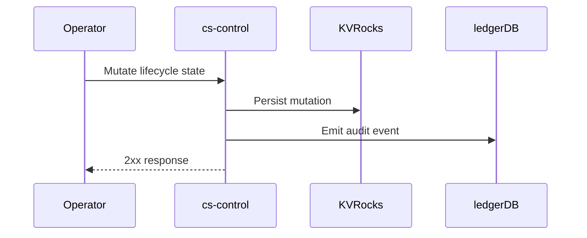

# Use Case: Audit a Control-Plane Mutation

When ledgerDB audit is enabled, SOUS emits an audit event for each control-plane mutation.

## Main flow

1. Operator calls a lifecycle mutation endpoint (create function, publish version, update alias, create schedule, etc.).
2. `cs-control` validates and persists the mutation.
3. `cs-control` emits an audit event to ledgerDB.

### Sequence diagram

