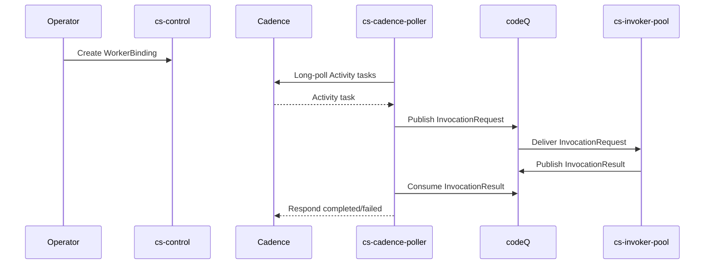

# Cadence Activity Invoke

This flow allows Cadence Activities to be executed by SOUS functions.

## Main flow

1. Operator registers a WorkerBinding mapping ActivityType -> FunctionRef.
2. Poller long-polls Cadence for Activity tasks.
3. Poller maps a task to an `InvocationRequest` and publishes it.
4. Invoker executes the function and publishes `InvocationResult`.
5. Poller responds to Cadence with completed/failed.

### Sequence diagram

