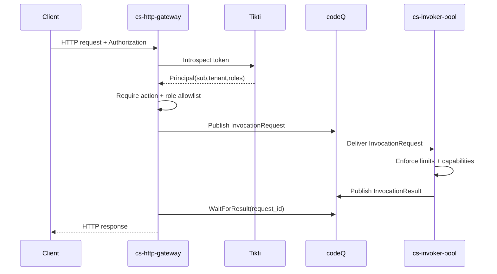

# HTTP Invoke (Sync)

This flow invokes a published function through the generic HTTP endpoint and waits for an execution result.

## Main flow

1. Client sends HTTP request to the generic endpoint with a Tikti bearer token.
2. Gateway validates token, authorizes invoke, maps request to `InvocationRequest`, and publishes it.
3. Invoker executes `cs-js` and persists activation metadata/logs.
4. Invoker publishes `InvocationResult`.
5. Gateway waits for the correlated result and returns an HTTP response.

### Sequence diagram

