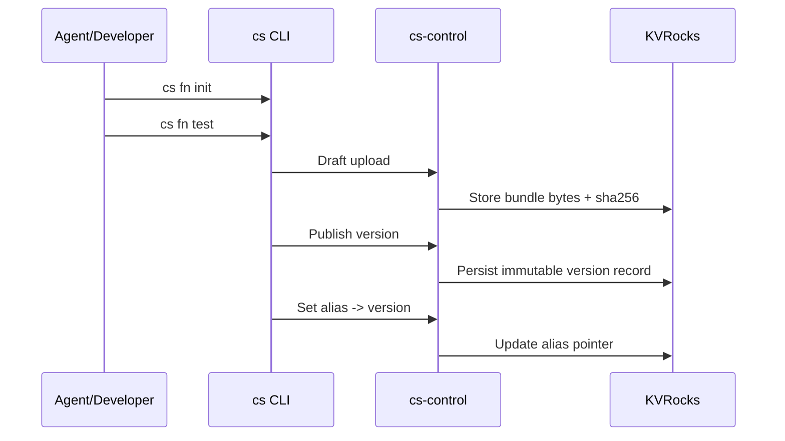

# Local Dev, Publish, Promote

This flow is the core SOUS workflow for agent-generated functions: create locally, validate semantics with the same runtime, publish an immutable version, then promote traffic using an alias.

## Main flow

1. Create a scaffold (`function.js`, `manifest.json`).
2. Test locally with the CLI runtime.
3. Upload a draft and publish a version.
4. Set an alias (for example, `prod`) to the new version.

### Sequence diagram

