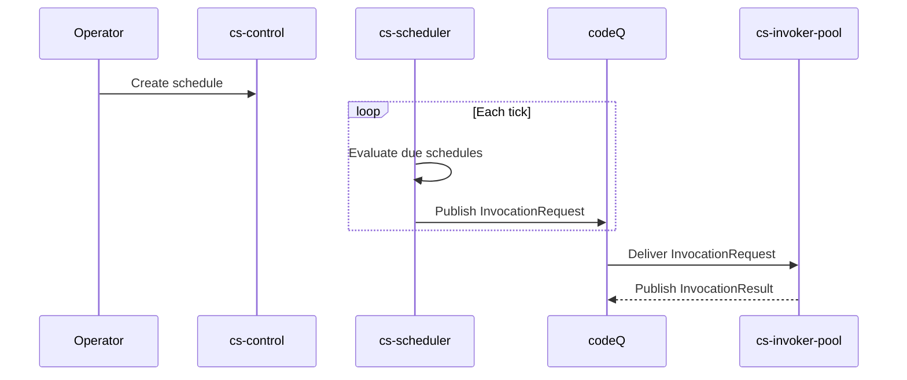

# Use Case: Schedule Invoke

This flow executes a function on a fixed interval.

## Main flow

1. Operator creates a schedule targeting a function reference.
2. Scheduler ticks and emits an invocation when due.
3. Overlap policy is enforced through an inflight marker.
4. Invoker executes the function and persists activation state.

### Sequence diagram

